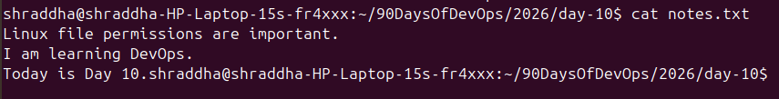
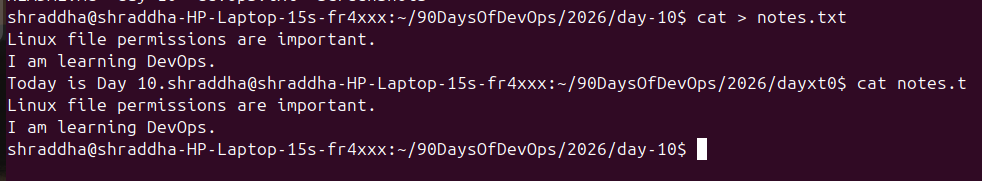
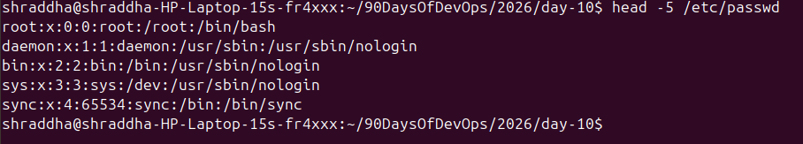
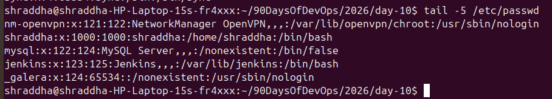
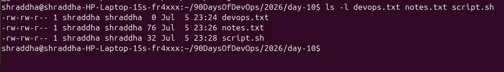
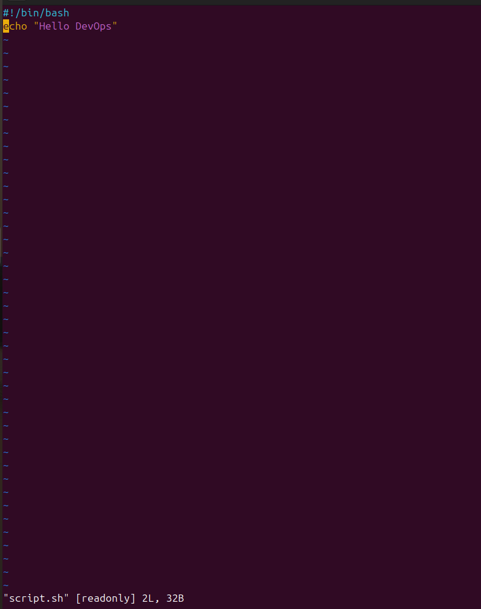
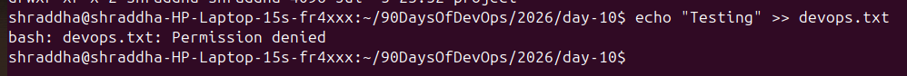

# Day 10 – File Permissions & File Operations Challenge

## Objective

Today's goal was to understand Linux file permissions and perform common file operations such as creating, reading, modifying, and testing permissions.

---

# Files Created

| File | Description |
|------|-------------|
| devops.txt | Empty file created using `touch` |
| notes.txt | File created with sample text using `echo` |
| script.sh | Shell script containing `echo "Hello DevOps"` |
| project/ | Directory created with permission `755` |

---

# Screenshots

## 1. Creating Files

Created the required files and verified them.



---

## 2. Reading notes.txt using cat

Displayed the contents of `notes.txt`.



---

## 3. Viewing script.sh in Read-Only Mode

Opened the shell script using Vim in read-only mode.

```bash
vim -R script.sh
```



---

## 4. First 5 Lines of /etc/passwd

```bash
head -5 /etc/passwd
```



---

## 5. Last 5 Lines of /etc/passwd

```bash
tail -5 /etc/passwd
```



---

# Understanding Permissions

Checked the default permissions.

```bash
ls -l
```



### Current Permissions

Example:

```
-rw-rw-r--
```

Meaning:

- `-` → Regular file
- `rw-` → Owner can Read & Write
- `rw-` → Group can Read & Write
- `r--` → Others can only Read

---

# Permission Changes

## Make script executable

```bash
chmod +x script.sh
./script.sh
```


---

## Make devops.txt Read Only

```bash
chmod a-w devops.txt
```


---

## Change notes.txt Permission to 640

```bash
chmod 640 notes.txt
```


---

## Create Project Directory with Permission 755

```bash
mkdir project
chmod 755 project
```


---

# Testing Permissions

## Writing to Read-Only File

Attempting to write to a read-only file results in **Permission denied**.



---

## Executing Without Execute Permission

Trying to execute a file without execute permission results in **Permission denied**.


---

# Commands Used

```bash
touch devops.txt

echo "Linux File Permissions Practice" > notes.txt

vim script.sh

cat notes.txt

vim -R script.sh

head -5 /etc/passwd

tail -5 /etc/passwd

ls -l

chmod +x script.sh

./script.sh

chmod a-w devops.txt

chmod 640 notes.txt

mkdir project

chmod 755 project
```

---

# What I Learned

- How Linux file permissions work (`r`, `w`, `x`).
- Difference between Owner, Group, and Others.
- How to modify permissions using `chmod`.
- How execute permission affects running shell scripts.
- How to verify permissions using `ls -l`.
- Why Linux file permissions are important for system security.

---

# Conclusion

This challenge helped me understand how Linux controls access to files and directories using permissions. Learning to manage file permissions is a fundamental skill for every Linux Administrator and DevOps Engineer because it improves system security and ensures controlled access to resources.i
