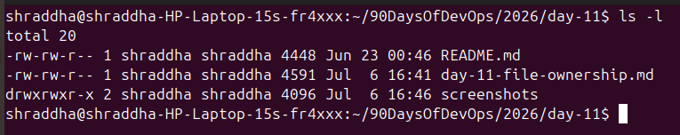
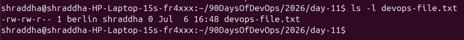
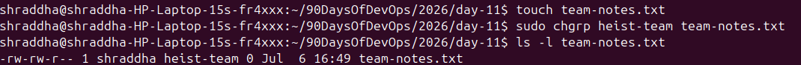
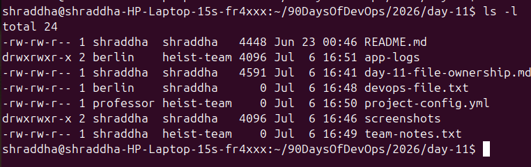
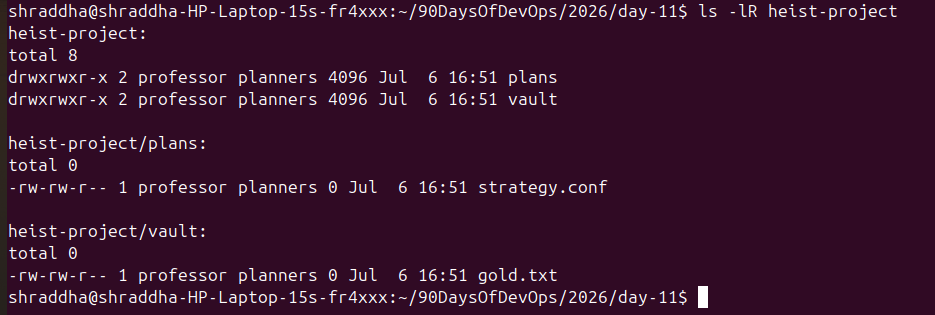
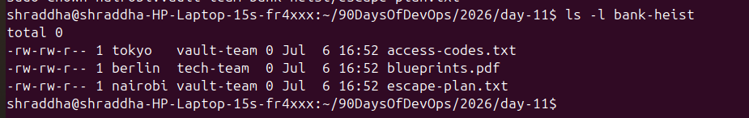

# Day 11 – File Ownership Challenge (`chown` & `chgrp`)

## Objective

Learn how Linux file ownership works and practice changing file and directory ownership using the `chown` and `chgrp` commands.

---

# Users Created

* tokyo
* berlin
* nairobi
* professor

# Groups Created

* heist-team
* planners
* vault-team
* tech-team

---

# Files & Directories Created

## Files

* `devops-file.txt`
* `team-notes.txt`
* `project-config.yml`
* `bank-heist/access-codes.txt`
* `bank-heist/blueprints.pdf`
* `bank-heist/escape-plan.txt`
* `heist-project/plans/strategy.conf`
* `heist-project/vault/gold.txt`

## Directories

* `app-logs/`
* `heist-project/`
* `heist-project/plans/`
* `heist-project/vault/`
* `bank-heist/`

---

# Understanding File Ownership

Linux assigns every file and directory an **Owner** and a **Group**.

**Owner:**
The user who owns the file. The owner has primary control over the file and can modify permissions or ownership (with appropriate privileges).

**Group:**
A collection of users who share access to the file. Group permissions make collaboration easier by allowing multiple users to access the same resources.

I verified ownership using:

```bash
ls -l
```

Output format:

```text
-rw-r--r-- 1 owner group size date filename
```

---

# Ownership Changes

| File/Directory     | Before            | After                            |
| ------------------ | ----------------- | -------------------------------- |
| devops-file.txt    | shraddha:shraddha | berlin:shraddha                  |
| team-notes.txt     | shraddha:shraddha | shraddha:heist-team              |
| project-config.yml | shraddha:shraddha | professor:heist-team             |
| app-logs/          | shraddha:shraddha | berlin:heist-team                |
| heist-project/     | shraddha:shraddha | professor:planners *(recursive)* |
| access-codes.txt   | shraddha:shraddha | tokyo:vault-team                 |
| blueprints.pdf     | shraddha:shraddha | berlin:tech-team                 |
| escape-plan.txt    | shraddha:shraddha | nairobi:vault-team               |

> **Note:** Replace `shraddha` with your actual username if it is different on your Linux system.

---

# Commands Used

## View ownership

```bash
ls -l
```

```bash
ls -l filename
```

## Create users

```bash
sudo useradd tokyo
sudo useradd berlin
sudo useradd nairobi
sudo useradd professor
```

## Create groups

```bash
sudo groupadd heist-team
sudo groupadd planners
sudo groupadd vault-team
sudo groupadd tech-team
```

## Change file owner

```bash
sudo chown tokyo devops-file.txt
```

```bash
sudo chown berlin devops-file.txt
```

## Change file group

```bash
sudo chgrp heist-team team-notes.txt
```

## Change owner and group together

```bash
sudo chown professor:heist-team project-config.yml
```

```bash
sudo chown berlin:heist-team app-logs
```

## Recursive ownership change

```bash
sudo chown -R professor:planners heist-project/
```

## Verify recursively

```bash
ls -lR heist-project/
```

## Practice Challenge

```bash
sudo chown tokyo:vault-team bank-heist/access-codes.txt
```

```bash
sudo chown berlin:tech-team bank-heist/blueprints.pdf
```

```bash
sudo chown nairobi:vault-team bank-heist/escape-plan.txt
```

```bash
ls -l bank-heist/
```

---

# Screenshots

Add screenshots for the following:

* Home directory ownership using `ls -l`
* `devops-file.txt` owner change
* `team-notes.txt` group change
* Combined owner and group change
* Recursive ownership using `ls -lR`
* Practice challenge (`bank-heist/`)
* Final directory structure

---

# What I Learned

* Learned that every Linux file and directory has an **Owner** and a **Group**, which control access and permissions.
* Practiced changing file ownership using the **`chown`** command.
* Learned to change a file's group using the **`chgrp`** command.
* Used **`chown owner:group`** to update both owner and group in a single command.
* Applied recursive ownership changes with the **`-R`** option to update an entire directory structure.
* Verified ownership changes using **`ls -l`** and **`ls -lR`**.
* Understood that users and groups must exist before assigning ownership.
* Learned how proper ownership improves security, collaboration, application deployments, CI/CD pipelines, log management, and shared project directories.

---

# Conclusion

This challenge provided hands-on experience with Linux file ownership and group management. By using `chown`, `chgrp`, and recursive ownership changes, I gained practical knowledge of how Linux manages access control—an essential skill for every DevOps Engineer.
## Screenshots

### Understanding Ownership


### Changing File Owner (chown)


### Changing File Group (chgrp)


### Changing Owner and Group Together


### Recursive Ownership Change


### Practice Challenge

