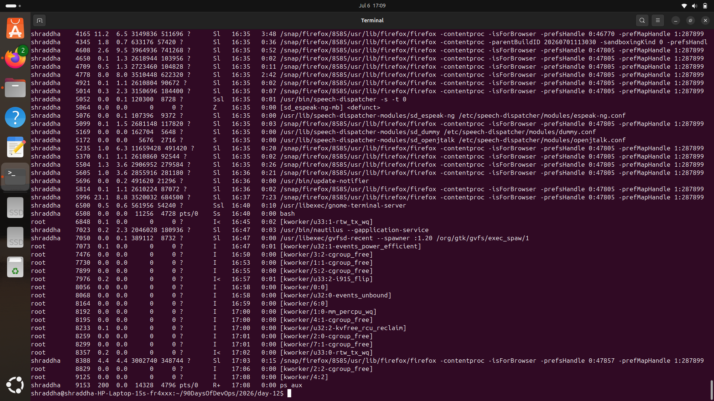
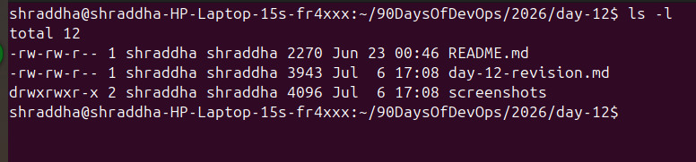

# Day 12 – Revision (Days 01–11)

## Goal

Today was a revision day focused on reinforcing the Linux and DevOps fundamentals learned during Days 01–11. Instead of learning new concepts, I reviewed my notes, reran important commands, and strengthened my understanding through hands-on practice.

---

## Revision (Days 01–11)

My goal for 2026 is to become a **DevOps Engineer**, and I am confidently progressing in the right direction. Through consistent learning, hands-on practice, and a strong focus on Linux, automation, cloud technologies, and DevOps tools, I am building a solid foundation for my career.

---

## Processes & Services

When my system becomes slow or a service behaves unexpectedly, I use the following commands to troubleshoot and check its health:

### List all running processes

```bash
ps aux
```

Displays all running processes along with CPU and memory usage.

### Monitor processes in real time

```bash
top
```

Displays real-time information about running processes and system resource usage.

### Check service status

```bash
systemctl status <service-name>
```

Shows whether a service is active, inactive, or failed.

### View service logs

```bash
journalctl -u <service-name>
```

Displays logs for a specific service, making it easier to troubleshoot failures.

---

## File Skills

I practiced creating files and directories, modifying permissions, and changing ownership.

### Check current ownership and permissions

```bash
ls -l /path/to/file
```

### Change file ownership

```bash
sudo chown user:group /path/to/file
```

### Change file permissions (Least Privilege Principle)

```bash
chmod 751 /path/to/file
```

### Example

> *(Add your screenshot here.)*

---

## Cheat Sheet Refresh

### Commands I would use first during an incident

| Command | Purpose |
|----------|---------|
| `ps aux` | Lists all running processes with CPU and memory usage. |
| `mpstat` | Monitors CPU utilization across all CPU cores. |
| `systemctl status <service>` | Checks whether a service is running correctly. |
| `cat /var/log/nginx/error.log` | Reads application or web server error logs. |
| `journalctl -u <service>` | Displays detailed logs for a specific service. |
| `free -m` | Shows memory usage in megabytes. |

---

## Mini Self-Check

### Which three commands save you the most time right now, and why?

- **ls -l** – Quickly checks permissions, ownership, and file details.
- **ps aux** – Helps identify running processes and resource usage.
- **systemctl status** – Instantly verifies whether a service is healthy.

---

### How do you check if a service is healthy?

The first commands I run are:

```bash
systemctl status <service-name>
```

```bash
ps aux | grep <service-name>
```

```bash
journalctl -u <service-name>
```

---

### How do you safely change ownership and permissions?

```bash
sudo chown user:group filename
chmod 751 filename
```

Always verify the changes using:

```bash
ls -l filename
```

---

## What Will I Focus on Improving in the Next 3 Days?

- Learn Linux Networking fundamentals.
- Complete Linux Volume Management.
- Practice User and Group Management.
- Continue improving my Linux command-line skills.
- Watch AWS videos and strengthen my cloud fundamentals.

---

## Key Takeaways

- Revision is just as important as learning new topics.
- Regular hands-on practice improves confidence and command recall.
- Understanding Linux permissions and ownership is essential for secure system administration.
- Service monitoring and log analysis are fundamental troubleshooting skills for every DevOps Engineer.
- Consistency is the key to becoming job-ready.

---

## Conclusion

Day 12 was a valuable revision day that helped reinforce the Linux concepts learned during the first eleven days of the challenge.  Revisiting commands and practicing them again strengthened my confidence and prepared me for the upcoming networking and storage topics.
## Screenshots

### Process Check (`ps aux`)



### Running Services


