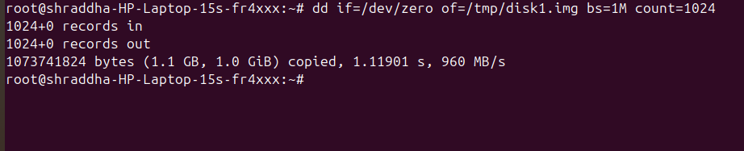
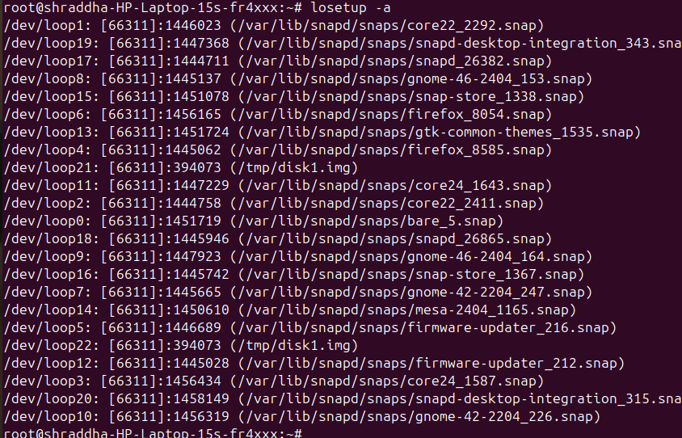
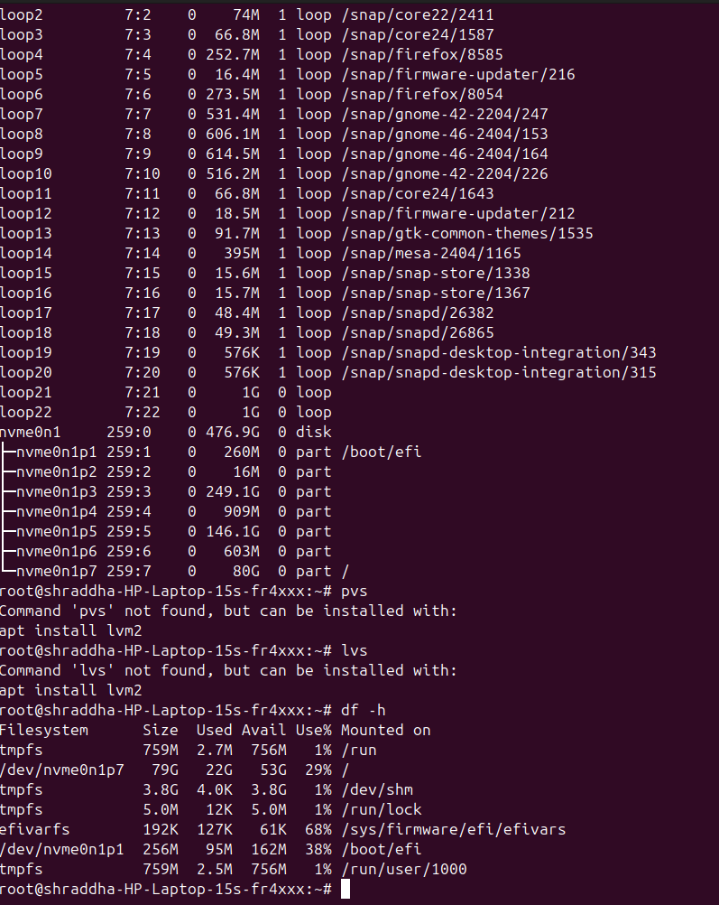
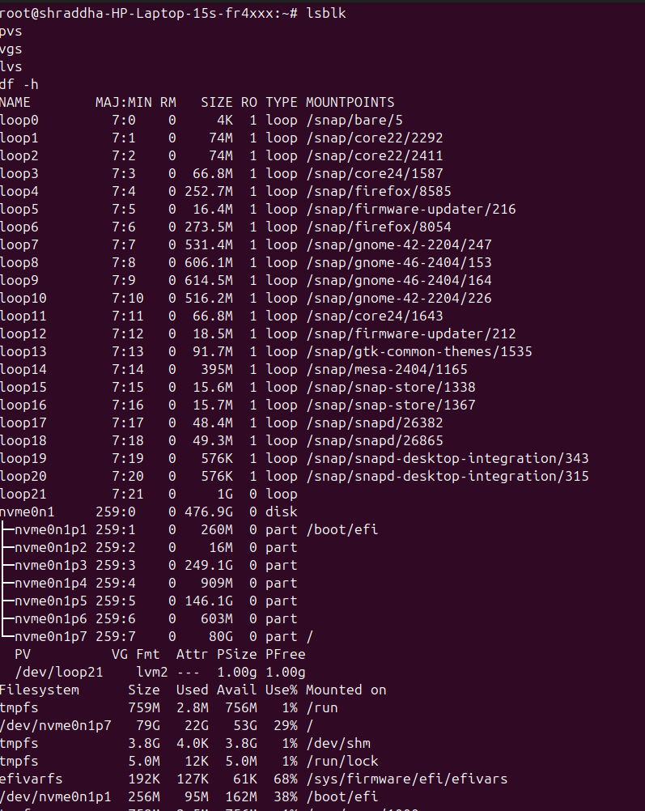
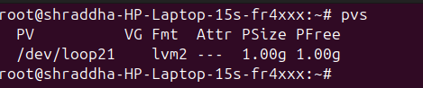
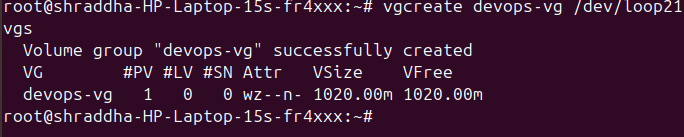

# Day 13 – Linux Volume Management (LVM)

## Task

Learn LVM to manage storage flexibly – create, extend, and mount volumes.

---

## Task 1: Check Current Storage

Run:

```bash
lsblk
pvs
vgs
lvs
df -h
```



---

## Task 2: Create Physical Volume

```bash
pvcreate /dev/loop21
pvs
```



---

## Task 3: Create Volume Group

```bash
vgcreate devops-vg /dev/loop21
vgs
```



---

## Task 4: Create Logical Volume

```bash
lvcreate -L 500M -n app-data devops-vg
lvs
```



---

## Task 5: Format and Mount

```bash
mkfs.ext4 /dev/devops-vg/app-data
mkdir -p /mnt/app-data
mount /dev/devops-vg/app-data /mnt/app-data
df -h /mnt/app-data
```



---

## Task 6: Extend the Volume

```bash
lvextend -L +200M /dev/devops-vg/app-data
resize2fs /dev/devops-vg/app-data
df -h /mnt/app-data
```



---

## Task 7: Mounting PV Directly

> This task demonstrates direct mounting for learning purposes. In practice, Logical Volumes (LVs) are typically mounted instead of Physical Volumes (PVs).


---

# Commands Used

- `lsblk` - List block devices and their mount points.
- `df -h` - Show mounted filesystem usage.
- `pvcreate /dev/loop21` - Initialize the loop device as a Physical Volume.
- `pvs` - List all Physical Volumes.
- `vgcreate devops-vg /dev/loop21` - Create a Volume Group.
- `vgs` - Display Volume Groups.
- `lvcreate -L 500M -n app-data devops-vg` - Create a Logical Volume.
- `lvs` - Display Logical Volumes.
- `mkfs.ext4 /dev/devops-vg/app-data` - Format the Logical Volume with ext4.
- `mount /dev/devops-vg/app-data /mnt/app-data` - Mount the Logical Volume.
- `lvextend -L +200M /dev/devops-vg/app-data` - Extend the Logical Volume.
- `resize2fs /dev/devops-vg/app-data` - Resize the ext4 filesystem after extending the volume.

---

# What I Learned

- Understood the LVM storage hierarchy:
  **Physical Volume (PV) → Volume Group (VG) → Logical Volume (LV).**

- Learned that LVM provides flexible storage management compared to traditional partitions.

- Learned how to initialize a disk or loop device as a Physical Volume using `pvcreate`.

- Created a Volume Group by combining one or more Physical Volumes.

- Created a Logical Volume from the Volume Group and allocated storage dynamically.

- Formatted the Logical Volume using the ext4 filesystem and mounted it successfully.

- Extended the Logical Volume using `lvextend` and resized the filesystem using `resize2fs`.

- Learned that directly mounting a Physical Volume is generally not recommended because LVM's flexibility comes from using Logical Volumes. 
## Screenshots

### Task 1 – Current Storage


### Task 2 – Create Physical Volume


### Task 3 – Create Volume Group


### Task 4 – Create Logical Volume


### Task 5 – Format and Mount


### Task 6 – Extend the Volume


