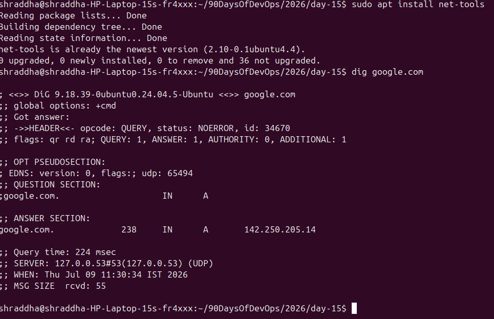
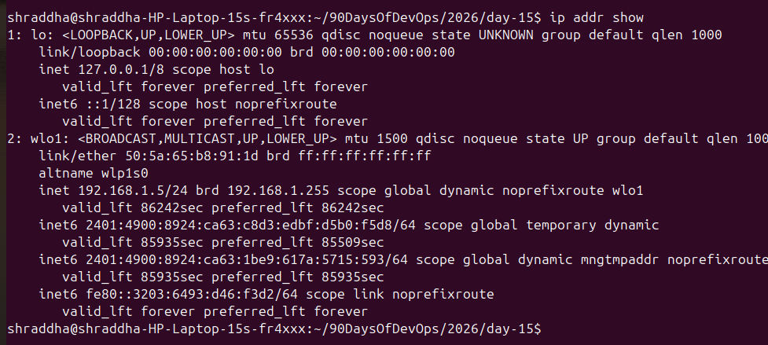
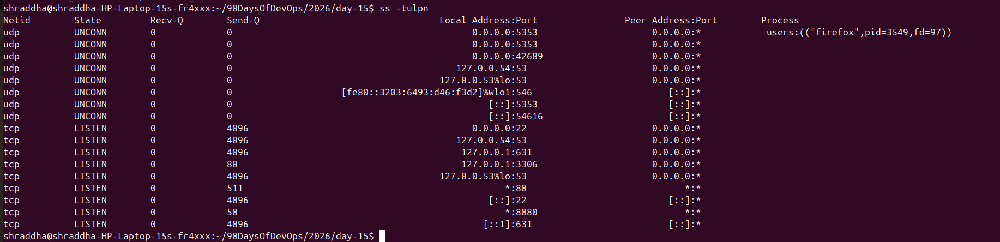

# Day 15 – Networking Concepts: DNS, IP, Subnets & Ports

---

# Task 1: DNS – How Names Become IPs

## What happens when you type google.com in a browser?

### Answer

1. The browser first checks its local DNS cache for the IP address of **google.com**.
2. If the IP is not cached, it sends a DNS query to a DNS server to resolve the domain name.
3. The DNS server returns Google's IP address, and the browser establishes a TCP connection (HTTPS) to that IP.
4. Google's web server processes the request and sends the webpage back to the browser.

---

## DNS Record Types

**A Record**
- Maps a domain name to an IPv4 address.

**AAAA Record**
- Maps a domain name to an IPv6 address.

**CNAME**
- Creates an alias from one domain name to another.

**MX**
- Specifies the mail server responsible for receiving emails.

**NS**
- Specifies the authoritative name servers for a domain.

---

## Run:

```bash
dig google.com
```

### Screenshot

```
screenshots/dig-google.png
```

### Observation

- **A Record:** (Write your IP here)
- **TTL:** (Write your TTL here)

---

# Task 2: IP Addressing

## What is an IPv4 Address?

### Answer

An IPv4 address is a unique 32-bit numerical address assigned to every device connected to a network.

Example:

```
192.168.1.10
```

It consists of two parts:

- Network Portion
- Host Portion

Example:

```
Network : 192.168.1.0
Host    : 10
```

---

## Public IP vs Private IP

| Public IP | Private IP |
|------------|------------|
| Accessible over the Internet | Used inside private networks |
| Assigned by ISP | Assigned locally |
| Globally unique | Not routable on the Internet |
| Example: 8.8.8.8 | Example: 192.168.1.10 |

---

## Private IP Ranges

- 10.0.0.0 – 10.255.255.255
- 172.16.0.0 – 172.31.255.255
- 192.168.0.0 – 192.168.255.255

---

## Run

```bash
ip addr show
```

### Screenshot

```
screenshots/ip-address.png
```

### Observation

- Loopback IP : 127.0.0.1
- Private IP : (Write your private IP)

---

# Task 3: CIDR & Subnetting

## What does /24 mean?

### Answer

CIDR (/24) means the first 24 bits are used for the network portion.

Remaining 8 bits are used for host addresses.

Example:

```
192.168.1.0/24
```

IP Range

```
192.168.1.0
↓

192.168.1.255
```

Total IPs

```
256
```

---

## Usable Hosts

/24 → 254

/16 → 65534

/28 → 14

---

## Why do we subnet?

Subnetting divides one large network into smaller networks.

Benefits

- Better Performance
- Improved Security
- Easier Management
- Efficient IP Address Usage

---

## CIDR Table

| CIDR | Subnet Mask | Total IPs | Usable Hosts |
|------|-------------|-----------|--------------|
| /24 | 255.255.255.0 | 256 | 254 |
| /16 | 255.255.0.0 | 65536 | 65534 |
| /28 | 255.255.255.240 | 16 | 14 |

---

# Task 4: Ports – The Doors to Services

## What is a Port?

A port is a logical communication endpoint.

An IP address identifies the computer.

A port identifies the application or service running on that computer.

---

## Common Ports

| Port | Service |
|------|----------|
|22|SSH|
|80|HTTP|
|443|HTTPS|
|53|DNS|
|3306|MySQL|
|6379|Redis|
|27017|MongoDB|

---

## Run

```bash
ss -tulpn
```

### Screenshot

```
screenshots/ss-ports.png
```

### Observation

Example

- Port 22 → SSH
- Port 631 → CUPS

(Write whatever appears on your system.)

---

# Task 5: Putting It Together

## curl http://myapp.com:8080

### Answer

When running

```
curl http://myapp.com:8080
```

The following networking concepts are involved:

- DNS resolves **myapp.com** into an IP address.
- TCP establishes the connection.
- Port **8080** identifies the application.
- HTTP sends the request to the server.

---

## App cannot connect to database

Database

```
10.0.1.50:3306
```

Checks

```bash
ss -tulpn | grep 3306
```

Check if MySQL is listening.

```bash
systemctl status mysql
```

Check whether MySQL service is running.

```bash
nc -zv 10.0.1.50 3306
```

Test connectivity.

```bash
journalctl -u mysql
```

Check MySQL logs.

---

# What I Learned

- Learned how DNS converts domain names into IP addresses.
- Understood CIDR notation and subnetting basics.
- Learned why ports are essential for network communication and how to inspect listening services.
# Day 15 – Networking Concepts: DNS, IP, Subnets & Ports

## Task 1: DNS – How Names Become IPs

### Run

```bash
dig google.com
```

### Screenshot



### Observation

- A Record: 142.xxx.xxx.xxx
- TTL: 300

---

## Task 2: IP Addressing

### Run

```bash
ip addr show
```

### Screenshot



### Observation

- Loopback IP: 127.0.0.1
- Private IP: 192.168.x.x

---

## Task 4: Ports – The Doors to Services

### Run

```bash
ss -tulpn
```

### Screenshot



### Observation

- Port 22 → SSH
- Port 631 → CUPS (or whatever appears on your system)
