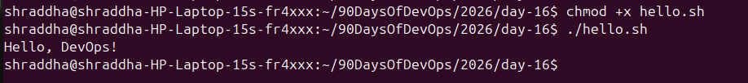
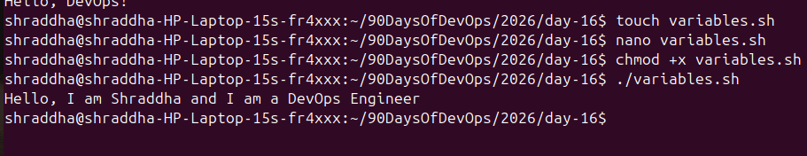
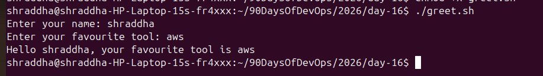
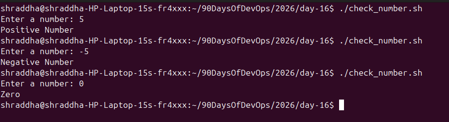
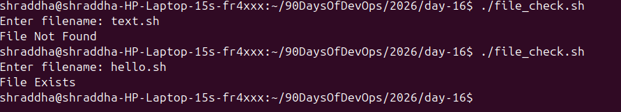
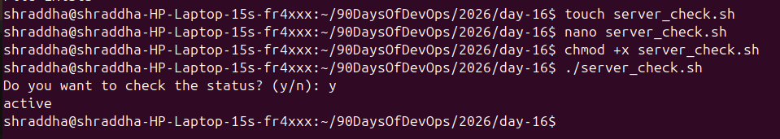

# Day 16 – Shell Scripting Basics

## Task 1: Your First Script

### Script

```bash
#!/bin/bash
echo "Hello, DevOps!"
```

### Output



### What happens if the shebang is removed?

If the shebang (`#!/bin/bash`) is removed and the script is executed with `./hello.sh`, the system may not know which interpreter to use. Running it with `bash hello.sh` will still work because Bash is explicitly invoked.

---

## Task 2: Variables

### Script

```bash
#!/bin/bash

NAME="Shraddha"
ROLE="DevOps Engineer"

echo "Hello, I am $NAME and I am a $ROLE"
```

### Output



### Single Quotes vs Double Quotes

- Single quotes (`' '`) print text exactly as written.
- Double quotes (`" "`) expand variables like `$NAME`.

---

## Task 3: User Input with read

### Script

```bash
#!/bin/bash

read -p "Enter your name: " NAME
read -p "Enter your favourite tool: " TOOL

echo "Hello $NAME, your favourite tool is $TOOL"
```

### Output



---

## Task 4: If-Else Conditions

### check_number.sh

```bash
#!/bin/bash

read -p "Enter a number: " NUM

if [ $NUM -gt 0 ]; then
    echo "Positive Number"
elif [ $NUM -lt 0 ]; then
    echo "Negative Number"
else
    echo "Zero"
fi
```

### Output



---

### file_check.sh

```bash
#!/bin/bash

read -p "Enter filename: " FILE

if [ -f "$FILE" ]; then
    echo "File Exists"
else
    echo "File Not Found"
fi
```

### Output



---

## Task 5: Server Check

### Script

```bash
#!/bin/bash

SERVICE="ssh"

read -p "Do you want to check the status? (y/n): " CHOICE

if [ "$CHOICE" = "y" ]; then
    systemctl status $SERVICE
else
    echo "Skipped."
fi
```

### Output



---

# What I Learned

- How to create and execute shell scripts using Bash.
- How to use variables, user input, and conditional statements.
- How shell scripts help automate repetitive Linux administration tasks.

