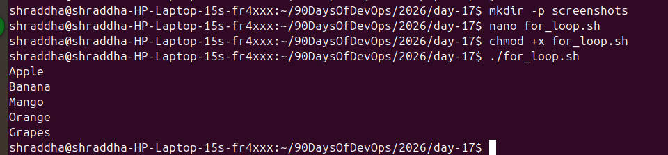
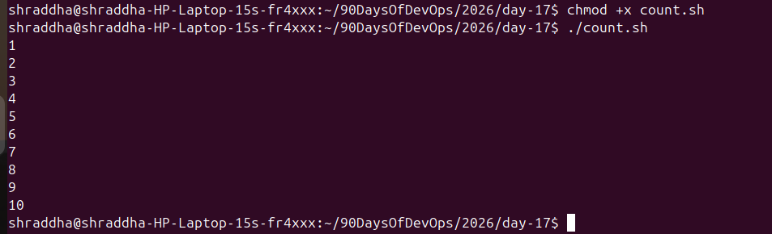
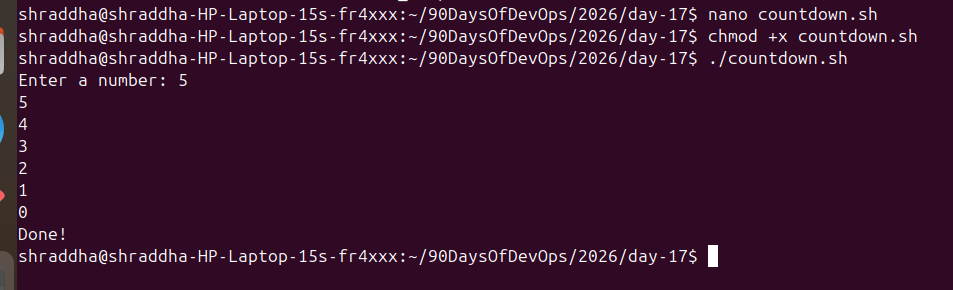
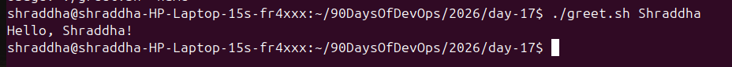
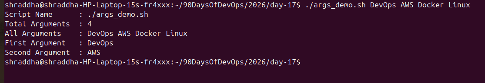
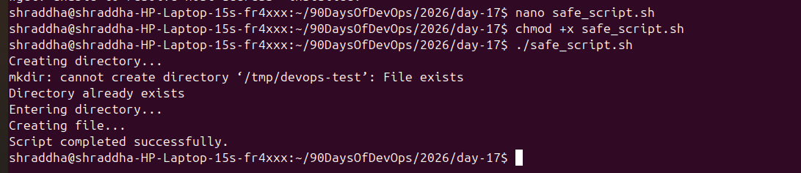

# Day 17 – Shell Scripting: Loops, Arguments & Error Handling

## Task 1: For Loop

### for_loop.sh

```bash
./for_loop.sh
```

### Screenshot



### Output

```
Apple
Banana
Mango
Orange
Grapes
```

---

### count.sh

```bash
./count.sh
```

### Screenshot



### Output

```
1
2
3
4
5
6
7
8
9
10
```

---

## Task 2: While Loop

### countdown.sh

```bash
./countdown.sh
```

### Screenshot



### Output

```
Enter a number: 5
5
4
3
2
1
0
Done!
```

---

## Task 3: Command-Line Arguments

### greet.sh

```bash
./greet.sh Shraddha
```

### Screenshot



---

### args_demo.sh

```bash
./args_demo.sh one two three
```

### Screenshot



---

## Task 4: Package Installation

### install_packages.sh

```bash
sudo ./install_packages.sh
```

### Screenshot


---

## Task 5: Error Handling

### safe_script.sh

```bash
./safe_script.sh
```

### Screenshot


---

### Root Check



---

### Final Output


---

## What I Learned

- Learned to use **for** and **while** loops.
- Learned command-line arguments (`$1`, `$#`, `$@`, `$0`).
- Learned package installation and basic error handling using `set -e` and `||`.## Task 1: For Loop


