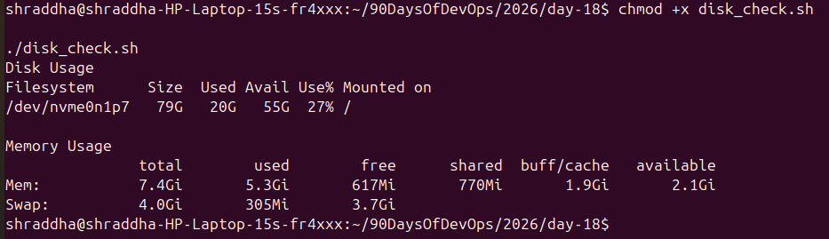
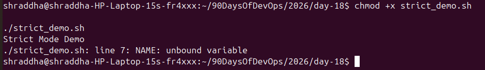
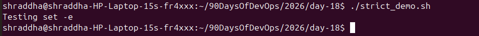
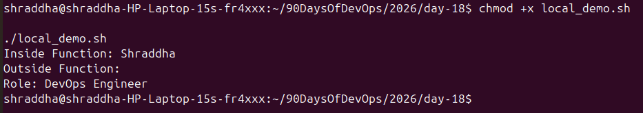
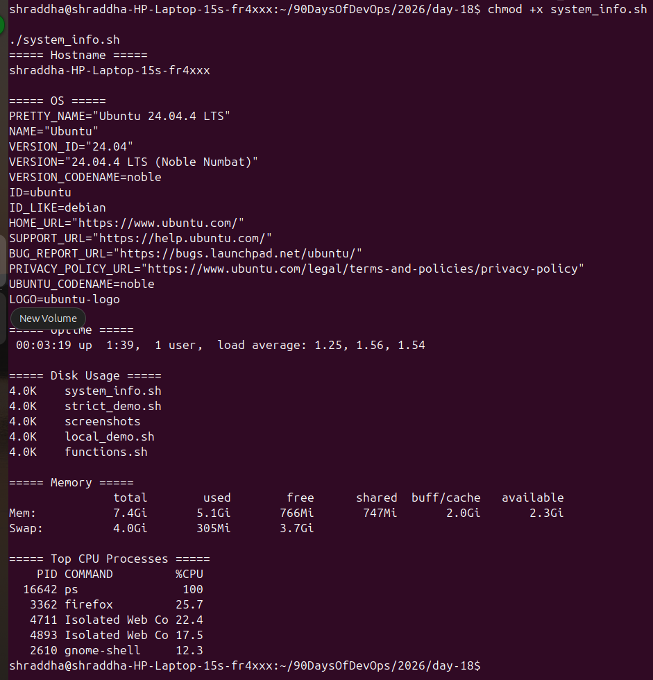

## Task 1: Basic Functions

### Screenshot

---

## Task 2: Disk & Memory Check

### Screenshot

---

## Task 3: Strict Mode

### Screenshot

---

## Task 4: Local Variables

### Screenshot

---

## Task 5: System Information Reporter

### Screenshot

