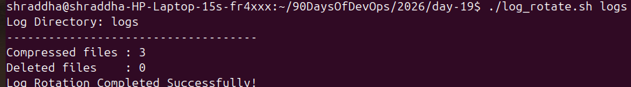
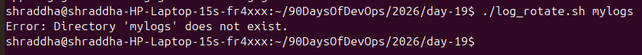
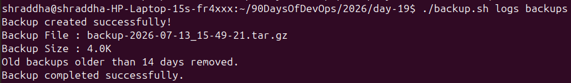
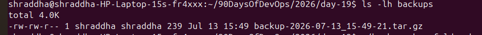
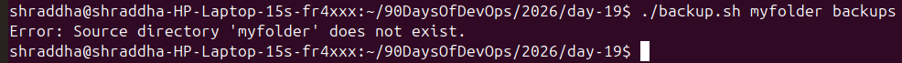
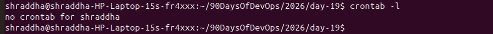
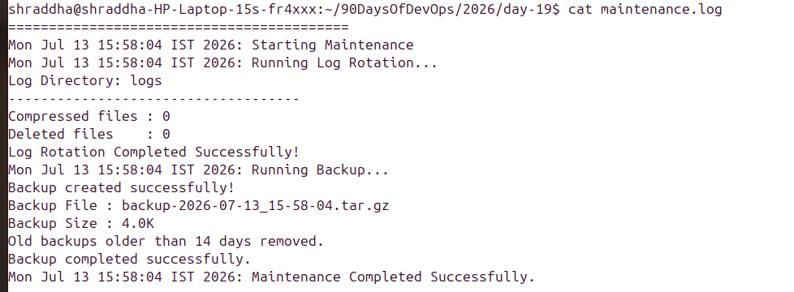

## Task 3: Crontab

### Check Current Cron Jobs

```bash
crontab -l
```

### Output

```text
no crontab for shraddha
```

**Observation:**
- There are currently no scheduled cron jobs for my user.

---

## Cron Syntax

```text
* * * * * command
│ │ │ │ │
│ │ │ │ └── Day of Week (0-7)
│ │ │ └──── Month (1-12)
│ │ └────── Day of Month (1-31)
│ └──────── Hour (0-23)
└────────── Minute (0-59)
```

### Cron Entries

**Run log_rotate.sh every day at 2:00 AM**

```cron
0 2 * * * /home/shraddha/90DaysOfDevOps/2026/day-19/log_rotate.sh /home/shraddha/myapp/logs
```

**Run backup.sh every Sunday at 3:00 AM**

```cron
0 3 * * 0 /home/shraddha/90DaysOfDevOps/2026/day-19/backup.sh /home/shraddha/Documents /home/shraddha/backups
```

**Run health_check.sh every 5 minutes**

```cron
*/5 * * * * /home/shraddha/90DaysOfDevOps/2026/day-19/health_check.sh
```


# Day 19 – Shell Scripting Project: Log Rotation, Backup & Crontab

## Task 1: Log Rotation Script

### Script



### Output


---

## Task 2: Server Backup Script

### Script



### Output



---

## Task 3: Crontab

### Current Crontab


### Cron Entries



---

## Task 4: Scheduled Maintenance Script

### Script



### Output



---

## Project Structure


