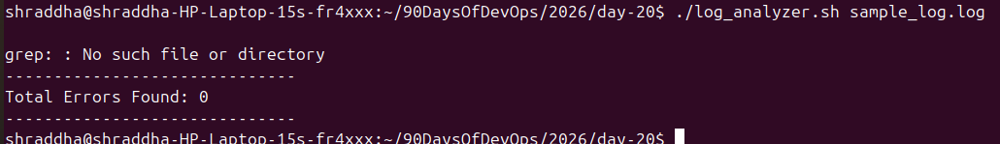
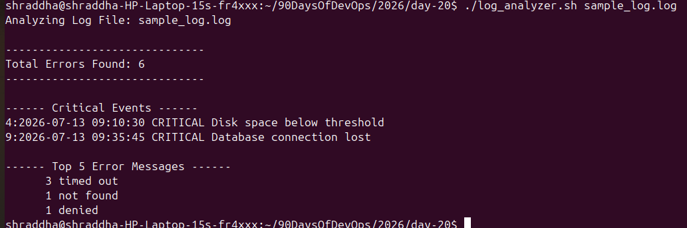

# Day 20 - Bash Scripting Challenge: Log Analyzer and Report Generator

## Project Overview

This project implements a Bash script to automate server log analysis.

The script analyzes a log file, finds errors, detects critical events, generates a summary report, and archives processed logs.

---

# Project Structure

```
day-20/
│
├── log_analyzer.sh
├── day-20-solution.md
├── log_report_2026-07-13.txt
├── sample_logs_generator.sh
├── archive/
│   └── sample_log.log
└── screenshots/
    ├── day20-script.png
    ├── day20-output.png
    ├── day20-report.png
    ├── day20-terminal.png
    ├── day20-github.png
    └── day20-final.png
```

---

# Bash Script: log_analyzer.sh

```bash
#!/bin/bash

# Day 20 - Log Analyzer Script


LOG_FILE=$1


# Task 1: Input Validation

if [ -z "$LOG_FILE" ]; then
    echo "Error: Please provide log file path"
    echo "Usage: ./log_analyzer.sh <log_file>"
    exit 1
fi


if [ ! -f "$LOG_FILE" ]; then
    echo "Error: File does not exist: $LOG_FILE"
    exit 1
fi


DATE=$(date +%Y-%m-%d)

REPORT="log_report_$DATE.txt"


echo "Analyzing Log File: $LOG_FILE"


# Task 2: Total Lines

TOTAL_LINES=$(wc -l < "$LOG_FILE")


# Task 3: Error Count

ERROR_COUNT=$(grep -Ei "ERROR|Failed" "$LOG_FILE" | wc -l)


echo ""
echo "------------------------------"
echo "Total Errors Found: $ERROR_COUNT"
echo "------------------------------"


# Task 4: Critical Events

echo ""
echo "------ Critical Events ------"

grep -n "CRITICAL" "$LOG_FILE"


# Task 5: Top Error Messages

echo ""
echo "------ Top 5 Error Messages ------"


grep "ERROR" "$LOG_FILE" | \
awk '{$1=$2=$3=""; print}' | \
sort | \
uniq -c | \
sort -rn | \
head -5


# Task 6: Generate Report


{

echo "================================"
echo "Log Analysis Report"
echo "================================"

echo ""

echo "Date of Analysis: $DATE"

echo "Log File: $LOG_FILE"

echo "Total Lines Processed: $TOTAL_LINES"

echo "Total Error Count: $ERROR_COUNT"


echo ""

echo "------ Top 5 Error Messages ------"


grep "ERROR" "$LOG_FILE" | \
awk '{$1=$2=$3=""; print}' | \
sort | \
uniq -c | \
sort -rn | \
head -5


echo ""

echo "------ Critical Events ------"


grep -n "CRITICAL" "$LOG_FILE"


} > "$REPORT"


echo ""

echo "Report Generated: $REPORT"


# Optional Archive Feature


mkdir -p archive


mv "$LOG_FILE" archive/


echo "Log file moved to archive directory"

```

---

# Execution

Give executable permission:

```bash
chmod +x log_analyzer.sh
```

Run script:

```bash
./log_analyzer.sh sample_log.log
```

---

# Sample Output

```
Analyzing Log File: sample_log.log

------------------------------
Total Errors Found: 6
------------------------------

------ Critical Events ------

4:2026-07-13 10:13:45 CRITICAL Disk space below threshold

8:2026-07-13 10:17:30 CRITICAL Database connection lost


------ Top 5 Error Messages ------

2 Connection timeout
2 File not found
1 Permission denied
```

---

# Generated Report

The script creates:

```
log_report_2026-07-13.txt
```

The report contains:

- Date of analysis
- Log file name
- Total lines processed
- Total error count
- Top 5 error messages
- Critical events with line numbers

---

# Screenshots

## Bash Script


## Script Output


## Generated Report


## Terminal


## GitHub Repository




## Final Output



---

# Commands and Tools Used

## grep

Used for searching ERROR, Failed, and CRITICAL events.

Example:

```bash
grep -n "CRITICAL" logfile
```


## awk

Used for extracting error messages.

Example:

```bash
awk '{$1=$2=$3=""; print}'
```


## sort

Used for sorting error messages.


## uniq

Used for counting repeated errors.


## wc

Used for counting total lines.


## date

Used for generating report filenames.

---

# What I Learned

1. Learned how to automate log analysis using Bash scripting.

2. Learned how to combine Linux commands like grep, awk, sort, and uniq.

3. Learned how system administrators automate daily monitoring tasks.

---

# Conclusion

This project demonstrates how Bash scripting can help system administrators analyze logs and generate automated reports efficiently.
