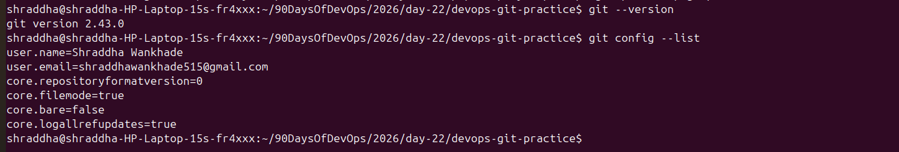
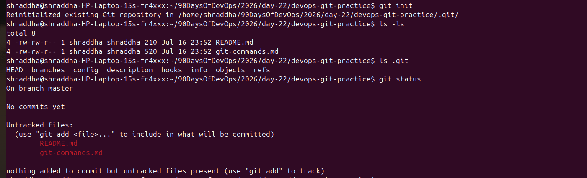
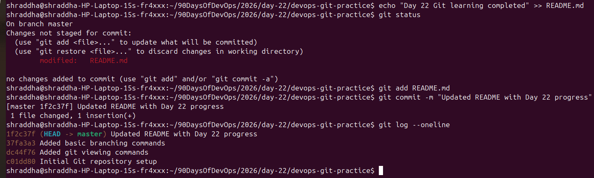
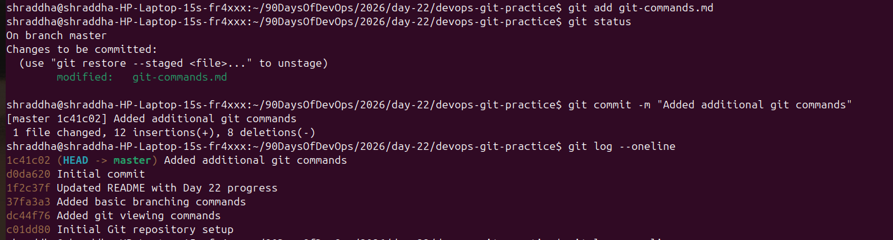
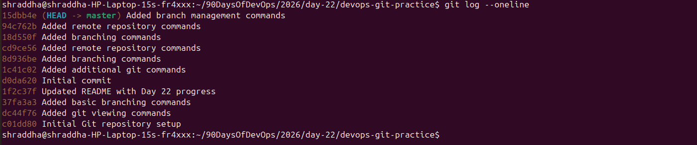

#!/bin/bash

echo "🚀 Starting Day 22 Completion Setup..."

# Day 22 directory
DAY22_DIR="$HOME/90DaysOfDevOps/2026/day-22"

cd "$DAY22_DIR" || exit

echo "📁 Creating screenshots folder..."

mkdir -p screenshots

echo "📸 Copying screenshots from Pictures folder..."

cp "$HOME/Pictures/Screenshots/Screenshot from 2026-07-16 23-51-46.png" screenshots/
cp "$HOME/Pictures/Screenshots/Screenshot from 2026-07-16 23-57-43.png" screenshots/
cp "$HOME/Pictures/Screenshots/Screenshot from 2026-07-17 00-00-26.png" screenshots/
cp "$HOME/Pictures/Screenshots/Screenshot from 2026-07-17 00-08-57.png" screenshots/
cp "$HOME/Pictures/Screenshots/Screenshot from 2026-07-17 00-16-10.png" screenshots/

echo "✏️ Renaming screenshots..."

cd screenshots || exit

mv "Screenshot from 2026-07-16 23-51-46.png" 01-git-version-config.png
mv "Screenshot from 2026-07-16 23-57-43.png" 02-git-init-status.png
mv "Screenshot from 2026-07-17 00-00-26.png" 03-git-stage-commit.png
mv "Screenshot from 2026-07-17 00-08-57.png" 04-git-log-history.png
mv "Screenshot from 2026-07-17 00-16-10.png" 05-git-workflow.png

cd ..

echo "📝 Updating Day 22 notes screenshots section..."

cat >> day-22-notes.md <<EOF

---

# Screenshots

## Task 1: Git Version and Configuration

---

## Task 2: Git Repository Initialization

---

## Task 4: Git Stage and Commit

---

## Task 5: Git Commit History

---

## Task 6: Git Workflow

EOF

echo "🔍 Checking Git status..."

git status

echo "➕ Adding Day 22 files..."

cd "$HOME/90DaysOfDevOps"

git add 2026/day-22

echo "💾 Creating commit..."

git commit -m "Completed Day 22 - Introduction to Git"

echo "✅ Day 22 completed successfully!"

echo "📤 Push command:"
echo "git push fork master"
