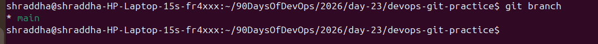
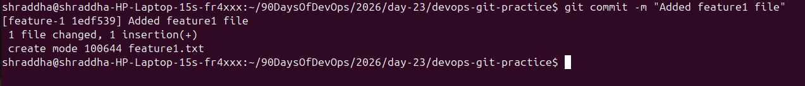
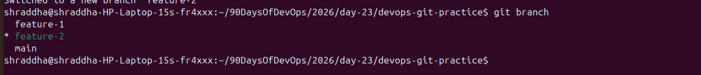
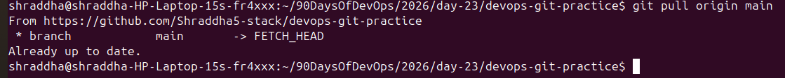
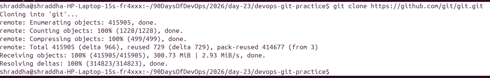
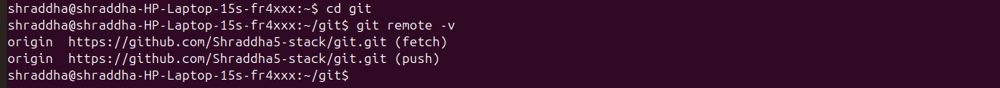

# Day 23 – Git Branching & Working with GitHub

## Task 1: Understanding Branches

### 1. What is a branch in Git?

A branch in Git is an independent line of development. It allows developers to work on new features, bug fixes, or experiments without affecting the main codebase. Every branch points to a specific commit in Git history.

---

### 2. Why do we use branches instead of committing everything to `main`?

We use branches to keep the `main` branch stable and production-ready. Developers can safely work on new features or bug fixes without affecting the main project. Once the changes are tested and verified, they can be merged into the `main` branch.

---

### 3. What is `HEAD` in Git?

`HEAD` is a pointer that refers to the current branch and its latest commit. It tells Git which branch and commit you are currently working on.

---

### 4. What happens to your files when you switch branches?

When you switch branches, Git updates your working directory to match the selected branch.

- Tracked files are changed to the version stored in that branch.
- Files that exist only in another branch disappear.
- Untracked files usually remain unless they conflict.
- Git may prevent switching if there are uncommitted changes that could be overwritten.

---

# Task 2: Branching Commands — Hands-On

## 1. List all branches

```bash
git branch
```

### Screenshot



---

## 2. Create a new branch called `feature-1`

```bash
git branch feature-1
```

```bash
git switch feature-1
```

### Screenshot


---

## 3. Create and switch to `feature-2`

```bash
git switch -c feature-2
```

### Screenshot


---

## 4. Difference between `git switch` and `git checkout`

### `git switch`

- Used only for switching or creating branches.
- Simpler and safer.

### `git checkout`

- Can switch branches.
- Can also restore files.
- Older command with multiple purposes.

---

## 5. Commit on `feature-1`

```bash
echo "Feature 1 work" > feature1.txt
git add .
git commit -m "Added feature1 file"
```

### Screenshot



---

## 6. Verify commit is not available on `main`

```bash
git switch main
ls
```

The `feature1.txt` file is not present on the `main` branch because it exists only in the `feature-1` branch.

### Screenshot


---

## 7. Delete an unused branch

```bash
git branch -d feature-2
```

or

```bash
git branch -D feature-2
```

---

# Task 3: Push to GitHub

### Steps Performed

- Created a GitHub repository.
- Connected the local repository to GitHub.
- Pushed the `main` branch.
- Pushed the `feature-1` branch.
- Verified both branches on GitHub.

### Screenshot



---

## Difference between `origin` and `upstream`

### Origin

`origin` is the default remote repository that points to your own GitHub repository.

### Upstream

`upstream` points to the original repository from which you forked your repository. It is used to keep your fork updated.

If the repository is not forked, there is usually no upstream remote.

---

# Task 4: Pull from GitHub

### Steps Performed

- Edited the `README.md` file directly on GitHub.
- Committed the changes.
- Pulled the latest changes to the local repository.

```bash
git pull origin main
```

### Screenshot



---

## Difference between `git fetch` and `git pull`

### `git fetch`

- Downloads the latest changes from the remote repository.
- Does not merge them into the current branch.
- Allows you to review changes before merging.

### `git pull`

- Downloads the latest changes.
- Automatically merges them into the current branch.
- Equivalent to:

```bash
git fetch
git merge
```

---

# Task 5: Clone vs Fork

## Clone a Public Repository

```bash
git clone https://github.com/git/git.git
```

### Screenshot



---

## Fork the Repository and Clone Your Fork

After creating a fork on GitHub:

```bash
git clone https://github.com/Shraddha5-stack/git.git
```

### Screenshot



---

## What is the difference between Clone and Fork?

### Clone

- Creates a local copy of a Git repository on your computer.
- Used when you already have access to the repository.

### Fork

- Creates a copy of someone else's repository under your own GitHub account.
- Used when you want to contribute to a project without direct write access.

---

## When would you clone vs fork?

### Clone

- When working on your own repository.
- When you already have permission to contribute.

### Fork

- When contributing to an open-source project.
- When you don't have write access to the original repository.

---

## How do you keep your fork in sync with the original repository?

### Method 1: GitHub Sync Fork

GitHub provides a **Sync fork** button that updates your fork with the latest changes from the original repository.

### Method 2: Using Git

```bash
git remote add upstream <original-repository-url>
git fetch upstream
git merge upstream/main
```

or

```bash
git pull upstream main
```

This keeps your fork updated with the latest changes from the original repository.

---

# Conclusion

In this task, I learned how to:

- Create and switch between Git branches.
- Make isolated changes using feature branches.
- Push local branches to GitHub.
- Understand the difference between `origin` and `upstream`.
- Pull changes from GitHub.
- Understand the difference between `git fetch` and `git pull`.
- Learn the concepts of `clone` and `fork`.
- Keep a forked repository synchronized with the original repository.

This hands-on practice improved my understanding of Git branching workflows and GitHub collaboration.
