# Day 24 – Advanced Git: Merge, Rebase, Stash & Cherry Pick

## Task 1: Git Merge

### What is a Fast-Forward Merge?

A fast-forward merge happens when the target branch has not changed after the feature branch was created. Git simply moves the branch pointer forward without creating a new merge commit.

**Screenshot – Feature Login Branch**

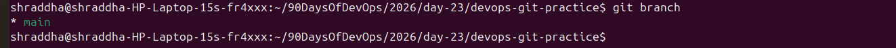

---

**Screenshot – Login Commits**

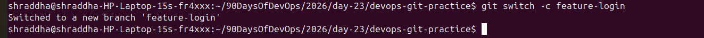

---

**Screenshot – Fast Forward Merge**

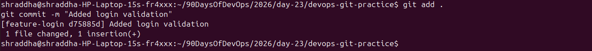

---

**Screenshot – Git History After Fast Forward Merge**

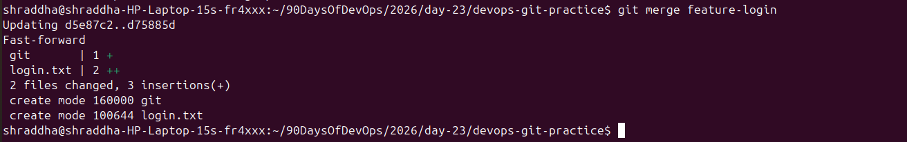

---

### Merge Commit Example

A merge commit is created when both the main branch and the feature branch have new commits. Git combines both histories by creating a new merge commit.

**Screenshot – Feature Signup Branch**

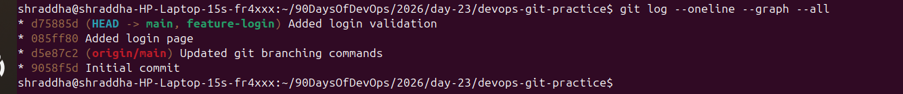

---

**Screenshot – Merge Commit**

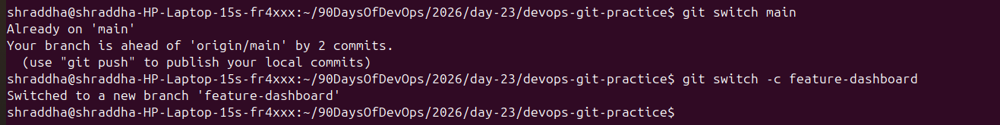

---

### What is a Merge Conflict?

A merge conflict occurs when Git cannot automatically merge changes because the same line of the same file was modified in different branches.

**Screenshot – Merge Conflict**

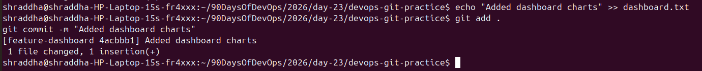

---

## Answers

### What is a Fast-Forward Merge?

A fast-forward merge occurs when the target branch has not changed since the feature branch was created. Git simply moves the branch pointer to the latest commit.

### When does Git create a Merge Commit?

Git creates a merge commit when both branches have different commits and their histories have diverged.

### What is a Merge Conflict?

A merge conflict happens when Git cannot automatically decide which changes to keep because the same lines were modified in different branches.

---

# Task 2 – Git Rebase

### Rebase Practice

**Screenshot – Feature Dashboard Branch**

---

**Screenshot – Rebase Successful**

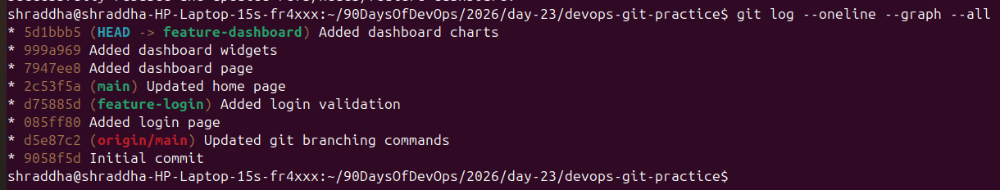

---

**Screenshot – Git Log After Rebase**

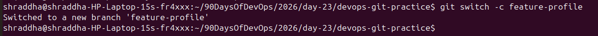

---

## Answers

### What does Rebase actually do?

Git Rebase moves the commits from one branch and reapplies them on top of another branch, creating a clean and linear history.

### How is the history different from Merge?

Merge keeps branch history and creates a merge commit. Rebase rewrites commit history into a straight line.

### Why should you never rebase shared commits?

Rebasing changes commit hashes. If other developers already have those commits, rebasing can create conflicts and duplicate history.

### When would you use Rebase vs Merge?

Use Rebase for a clean local history before merging. Use Merge when working with shared branches where preserving history is important.

---

# Task 3 – Squash Merge vs Merge Commit

### Squash Merge

**Screenshot – Squash Merge**

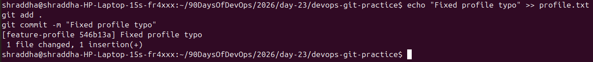

---

**Screenshot – Git History After Squash Merge**

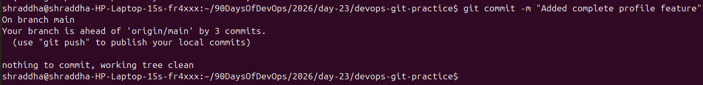

---

### Regular Merge

**Screenshot – Regular Merge**

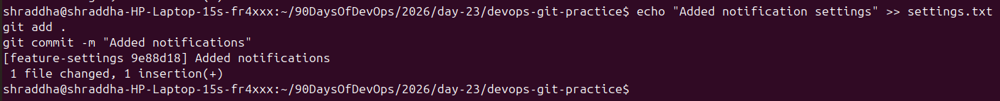

---

**Screenshot – Git History After Regular Merge**

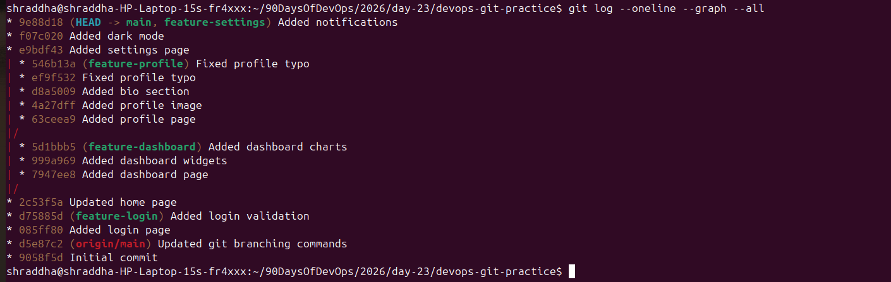

---

## Answers

### What does Squash Merge do?

Squash Merge combines multiple commits into a single commit before merging into the target branch.

### When would you use Squash Merge?

Squash Merge is useful when a feature contains many small commits that are not useful individually.

### What is the trade-off?

The commit history becomes cleaner, but the detailed history of individual commits is lost.

---

# Task 4 – Git Stash

### Git Stash Practice

**Screenshot – Git Status Before Stash**

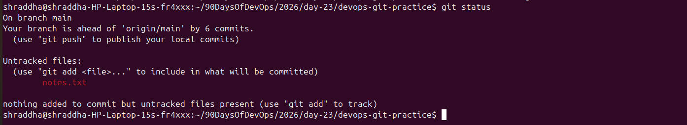

---

**Screenshot – Git Stash List**

---

**Screenshot – Git Stash Pop**

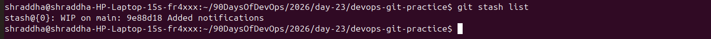

---

**Screenshot – Multiple Stashes**

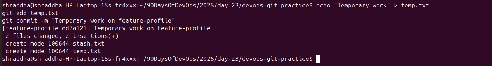

---

**Screenshot – Apply Specific Stash**

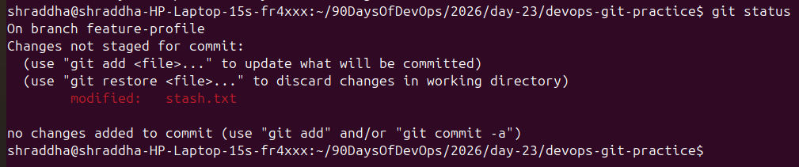

---

## Answers

### Difference between git stash pop and git stash apply

- **git stash pop** restores the stash and removes it from the stash list.
- **git stash apply** restores the stash but keeps it in the stash list.

### When would you use Git Stash?

Git Stash is useful when you have unfinished work and need to quickly switch branches without committing incomplete changes.

---

# Task 5 – Git Cherry-pick

### Cherry-pick Practice

**Screenshot – Feature Hotfix Branch**

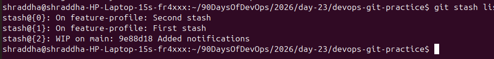

---

**Screenshot – Hotfix Commits**

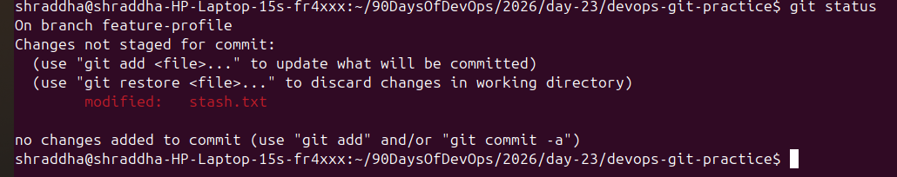

---

**Screenshot – Cherry Pick**

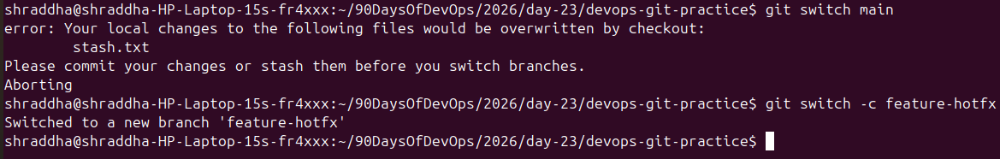

---

**Screenshot – Git History After Cherry Pick**

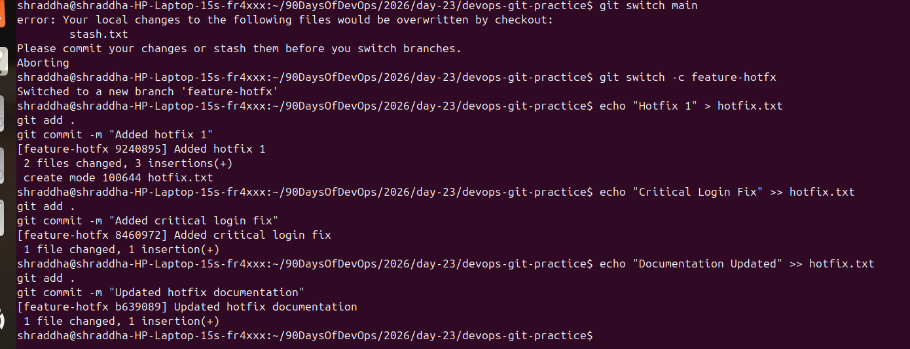

---

**Screenshot – Final Git Log**

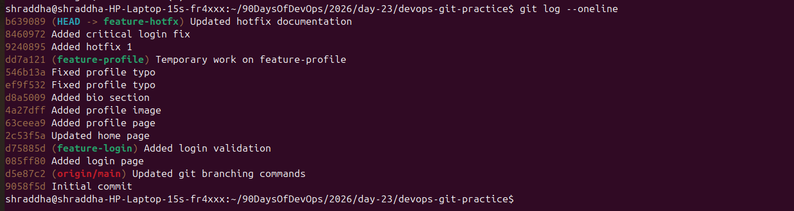

---

## Answers

### What does Cherry-pick do?

Git Cherry-pick copies a specific commit from one branch and applies it to another branch without merging the entire branch.

### When would you use Cherry-pick?

Cherry-pick is useful when only one specific commit (such as a bug fix) needs to be applied to another branch.

### What can go wrong?

- Merge conflicts
- Duplicate commits
- Confusing project history if overused

---

# Conclusion

Today I learned advanced Git concepts including Merge, Rebase, Squash Merge, Git Stash, and Cherry-pick. I also learned how different Git workflows affect project history and when each technique should be used in real-world software development.
