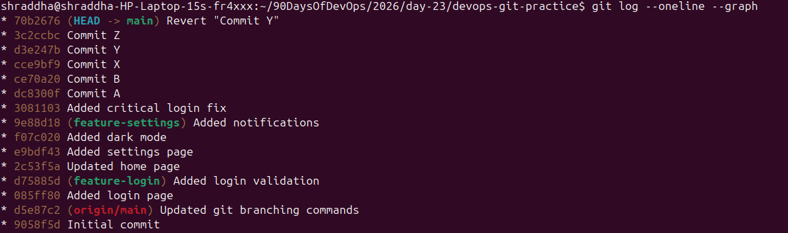
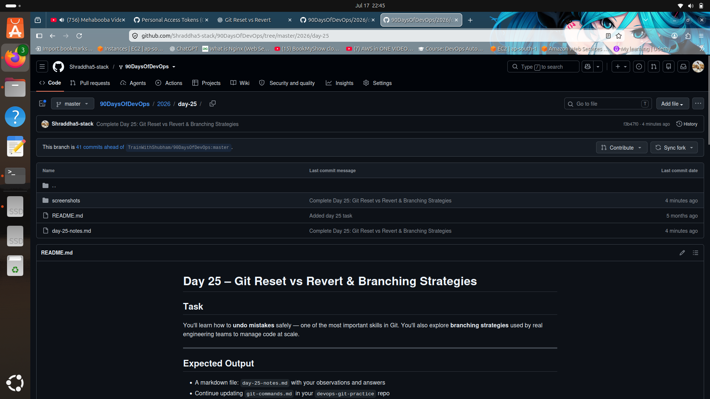

# Day 25 – Git Reset vs Revert & Branching Strategies

## 🎯 Objective

Learn how to safely undo changes using **git reset** and **git revert**, understand the differences between them, and explore common Git branching strategies used in software development.

---

# Task 1: Git Reset

## Created Three Commits

- Commit A
- Commit B
- Commit C

---

## 1. git reset --soft

### Command

```bash
git reset --soft HEAD~1
```

### Observation

- HEAD moves back by one commit.
- The latest commit is removed from history.
- Changes remain in the **staging area**.
- Files are unchanged and ready to commit again.

---

## 2. git reset --mixed

### Command

```bash
git reset --mixed HEAD~1
```

### Observation

- HEAD moves back by one commit.
- The latest commit is removed from history.
- Changes remain in the working directory.
- Changes become **unstaged**.
- You need to run `git add` before committing again.

---

## 3. git reset --hard

### Command

```bash
git reset --hard HEAD~1
```

### Observation

- HEAD moves back by one commit.
- The latest commit is removed from history.
- Staging area is cleared.
- Working directory changes are deleted permanently.
- Repository returns to the selected commit.

---

# Difference Between --soft, --mixed, and --hard

| Option | Commit History | Staging Area | Working Directory |
|---------|---------------|--------------|-------------------|
| `--soft` | Removed | Preserved | Preserved |
| `--mixed` | Removed | Cleared | Preserved |
| `--hard` | Removed | Cleared | Deleted |

---

## Which one is destructive and why?

`git reset --hard` is destructive because it permanently removes commits and deletes uncommitted changes from the working directory.

---

## When would you use each?

### git reset --soft

- Change the last commit message.
- Combine multiple commits.
- Recommit without losing staged changes.

### git reset --mixed

- Unstage files.
- Modify changes before committing again.
- Reorganize commits.

### git reset --hard

- Discard unwanted local changes.
- Restore the repository to a clean state.
- Remove experimental work.

---

## Should you use git reset on already pushed commits?

Generally **No**.

Reset rewrites Git history. If the commits have already been pushed and shared with others, it can cause conflicts and confusion for collaborators.

---

# Task 2: Git Revert

## Created Three Commits

- Commit X
- Commit Y
- Commit Z

---

## Reverting Commit Y

### Command

```bash
git revert <commit-hash>
```

### Observation

- Git created a new commit that reversed the changes made by Commit Y.
- Commit Y still exists in Git history.
- History remains intact.

---

## How is git revert different from git reset?

### git reset

- Rewrites Git history.
- Removes commits from the current branch.
- Best for local commits.

### git revert

- Preserves Git history.
- Creates a new commit that reverses an existing commit.
- Best for shared repositories.

---

## Why is git revert safer?

It preserves the existing commit history.

Other developers can continue working without history conflicts because no commits are deleted.

---

## When would you use revert vs reset?

### Use git reset

- Local commits
- Before pushing changes
- Cleaning up commit history

### Use git revert

- Shared branches
- Already pushed commits
- Production environments

---

# Task 3: Reset vs Revert Comparison

| Feature | git reset | git revert |
|----------|-----------|------------|
| What it does | Moves HEAD backward and optionally removes changes | Creates a new commit that reverses an existing commit |
| Removes commit from history? | Yes | No |
| Creates a new commit? | No | Yes |
| Safe for shared branches? | No | Yes |
| Best used for | Local commits before pushing | Shared or pushed commits |

---

# Task 4: Branching Strategies

## 1. GitFlow

### Description

GitFlow uses multiple long-lived branches to manage development and releases.

### Branches

- `main` – Production-ready code
- `develop` – Integration branch for ongoing development
- `feature/*` – New feature development
- `release/*` – Release preparation
- `hotfix/*` – Emergency production fixes

### Workflow

```text
main
 │
 ├── hotfix
 │
develop
 ├── feature/login
 ├── feature/payment
 └── release/v1.0
```

### Used For

- Large development teams
- Projects with scheduled releases

### Pros

- Organized workflow
- Stable releases
- Easy maintenance

### Cons

- More complex
- Many long-lived branches

---

## 2. GitHub Flow

### Description

GitHub Flow uses a single main branch and short-lived feature branches.

### Workflow

```text
main
 ├── feature/login
 ├── feature/dashboard
 └── Pull Request → Merge
```

### Used For

- Continuous Deployment
- Web applications
- Small and medium-sized teams

### Pros

- Simple
- Lightweight
- Easy to learn

### Cons

- Requires strong automated testing
- Less suitable for scheduled releases

---

## 3. Trunk-Based Development

### Description

Developers work directly on the main branch or use very short-lived feature branches.

### Workflow

```text
main
 ├── short-feature-1
 ├── short-feature-2
 └── Merge quickly
```

### Used For

- Startups
- Continuous Integration (CI)
- Continuous Deployment (CD)

### Pros

- Fast development
- Frequent integration
- Fewer merge conflicts

### Cons

- Requires excellent testing
- Risk of unstable code if changes are merged without validation

---

# Answers

## Which strategy would you use for a startup shipping fast?

**Trunk-Based Development**

Reason: It supports rapid development, frequent integration, and continuous deployment.

---

## Which strategy would you use for a large team with scheduled releases?

**GitFlow**

Reason: It provides structured release management and supports multiple parallel development streams.

---

## Which strategy does your favorite open-source project use?

**Kubernetes**

Kubernetes primarily follows a **GitHub Flow–style workflow** with pull requests, code reviews, and dedicated release branches for stable versions.

---

# Key Learnings

- `git reset` rewrites history and is best for local commits.
- `git revert` preserves history and is safer for shared branches.
- `git reset --hard` permanently deletes local changes.
- `git reflog` can help recover commits after a reset.
- Choosing the right branching strategy depends on the project's size, release process, and team workflow.


---

# Screenshots

## 1. Git History

This screenshot shows the commit history after performing Git Reset and Git Revert operations.



---

## 2. Git Status

This screenshot shows the repository status after updating the Git commands and completing the tasks.


---

## 3. GitHub Repository

This screenshot shows the completed Day 25 folder uploaded to GitHub.


