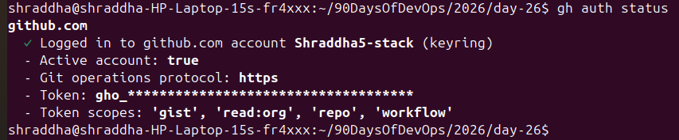
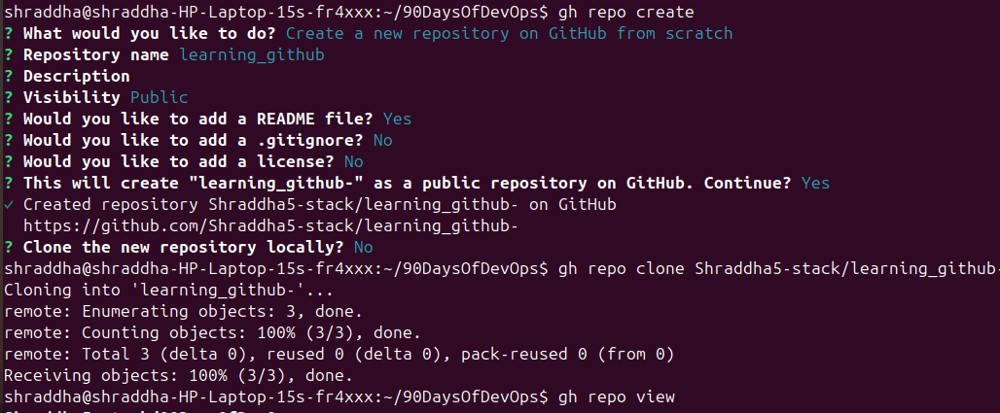
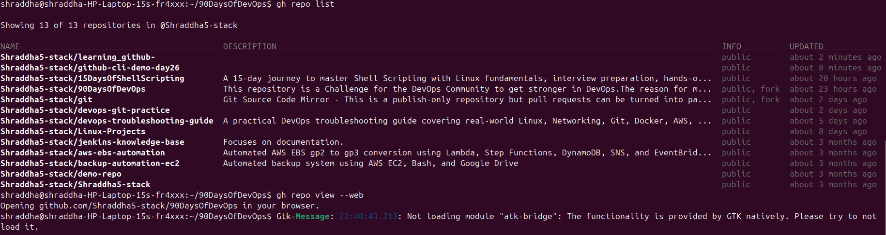
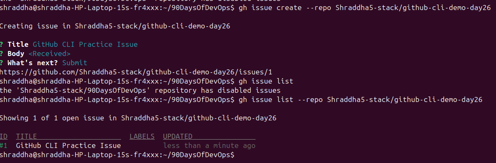
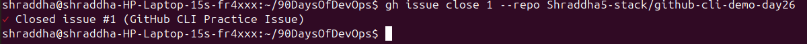
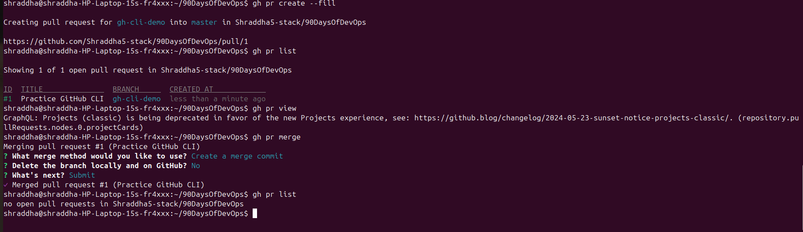
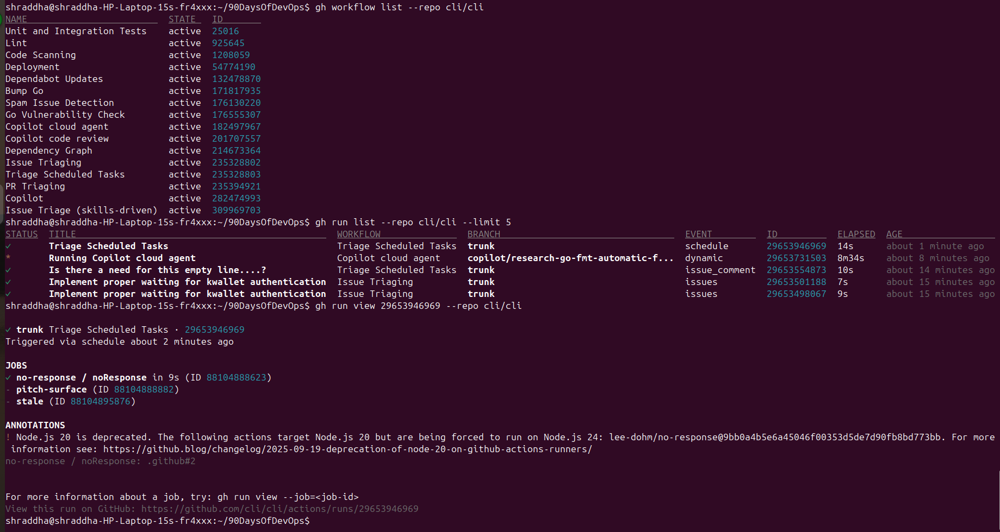
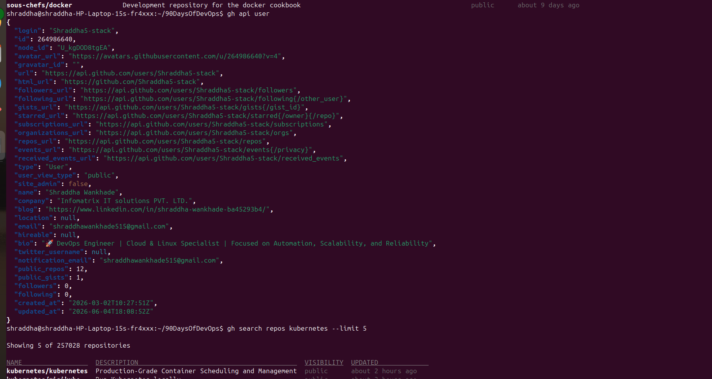
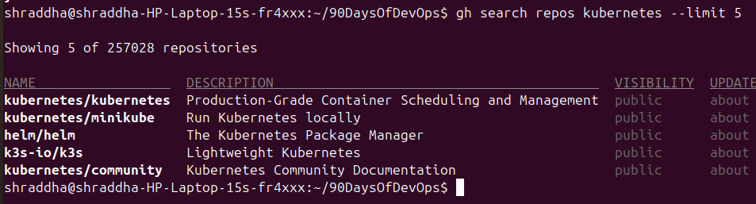

# Day 26 – GitHub CLI: Manage GitHub from Your Terminal

## Objective

Learn how to use GitHub CLI (`gh`) to manage GitHub repositories, issues, pull requests, GitHub Actions, and other GitHub operations directly from the terminal.

---

# Task 1 – Install and Authenticate GitHub CLI

## Commands Used

```bash
gh --version
gh auth login
gh auth status
```

## Screenshot



## Observations

- Successfully installed GitHub CLI.
- Authenticated GitHub account using browser authentication.
- Verified the active GitHub account.

## Question

### What authentication methods does `gh` support?

## Answer

GitHub CLI supports:

1. Web Browser Authentication
2. Personal Access Token (PAT)

---

# Task 2 – Working with Repositories

## Commands Used

```bash
gh repo create
gh repo clone Shraddha5-stack/learning_github-
gh repo view
gh repo list
gh repo view --web
gh repo delete
```

## Screenshots

### Repository Operations



### Repository List



### Repository Delete


## Observations

- Created a repository using GitHub CLI.
- Cloned repositories directly from the terminal.
- Viewed repository information.
- Listed GitHub repositories.
- Opened repositories in the browser.
- Deleted a demo repository.

---

# Task 3 – Managing GitHub Issues

## Commands Used

```bash
gh issue create
gh issue list
gh issue view
gh issue close
```

## Screenshots

### Issue Create and List



### Issue Close



## Question

### How could you use `gh issue` in automation?

## Answer

The `gh issue` command can automate issue management tasks:

- Creating new issues automatically.
- Listing existing issues.
- Viewing issue details.
- Adding comments.
- Closing resolved issues.

---

# Task 4 – Pull Requests Management

## Commands Used

```bash
gh pr create
gh pr list
gh pr view
gh pr merge
```

## Screenshot



## Questions

### What merge methods does `gh pr merge` support?

## Answer

`gh pr merge` supports:

- Merge Commit
- Squash Merge
- Rebase Merge


### How would you review someone else's PR?

Command:

```bash
gh pr review <pr-number> --approve
```

---

# Task 5 – GitHub Actions and Workflows

## Commands Used

```bash
gh workflow list
gh run list
gh run view
```

## Screenshot



## Question

### How could `gh run` and `gh workflow` be useful in CI/CD?

## Answer

They help DevOps engineers to:

- Monitor workflow executions.
- Check build status.
- View workflow logs.
- Track failed pipelines.
- Re-run failed workflows.
- Manage CI/CD operations from the terminal.

---

# Task 6 – Useful GitHub CLI Commands

## GitHub API

Command:

```bash
gh api user
```

## Screenshot




---

## GitHub Gist

Commands:

```bash
gh gist create demo.txt --public

gh gist list

gh gist view <gist-id>
```

---

## GitHub Release

Command:

```bash
gh release list
```

---

## GitHub Alias

Create custom command:

```bash
gh alias set myrepos "repo list"
```

Run:

```bash
gh myrepos
```

---

## Search GitHub Repositories

Command:

```bash
gh search repos kubernetes --limit 5
```

## Screenshot



---

# Key Learnings

- Installed and configured GitHub CLI.
- Authenticated GitHub from terminal.
- Managed repositories using `gh repo`.
- Created and managed issues.
- Worked with pull requests.
- Explored GitHub Actions workflows.
- Used GitHub API commands.
- Learned GitHub CLI commands useful for DevOps automation.

---

# Conclusion

GitHub CLI (`gh`) provides a powerful way to manage GitHub resources directly from the terminal.

It helps developers and DevOps engineers automate daily GitHub workflows including repository management, issue tracking, pull requests, and CI/CD operations without opening the GitHub web interface.
