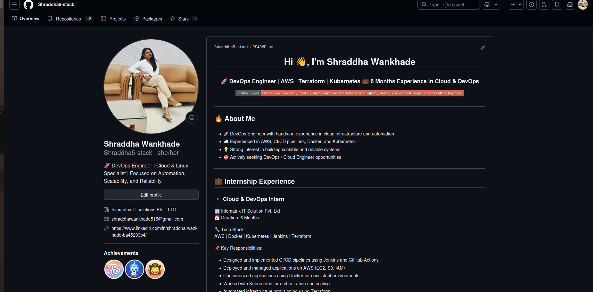
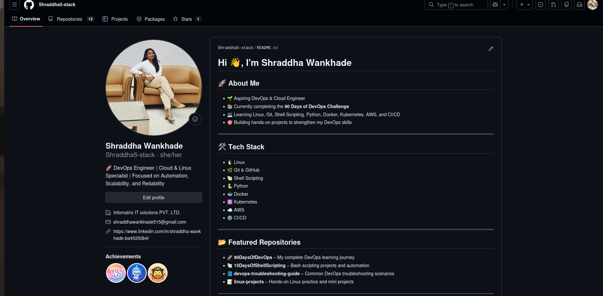
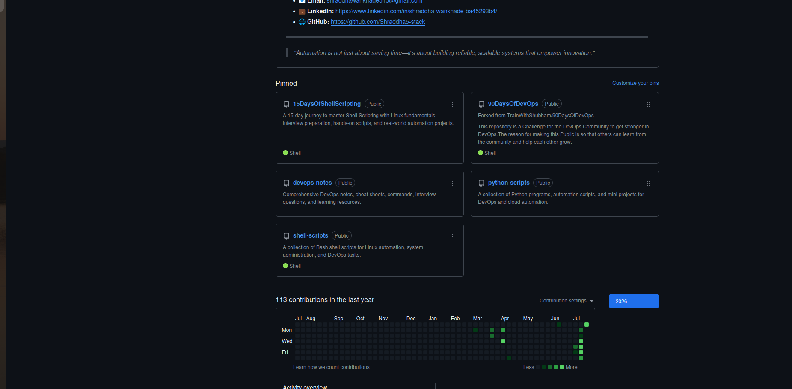

# Day 27 – GitHub Profile Makeover

## Objective

The goal of Day 27 was to improve my GitHub profile, organize my repositories, and build a professional developer portfolio that effectively showcases my DevOps learning journey, projects, and technical skills.

---

# Tasks Completed

## ✅ Task 1 – GitHub Profile Audit

### Improvements Identified

- Updated my GitHub profile with a professional profile README.
- Improved my profile bio to better reflect my DevOps career goals.
- Organized repositories with meaningful names and descriptions.
- Selected relevant pinned repositories to showcase my best work.
- Enhanced the overall appearance of my GitHub profile.

---

## ✅ Task 2 – Created a Professional GitHub Profile README

Built a professional profile README that includes:

- Professional introduction
- Internship experience
- Technical skills
- Tech stack
- Featured repositories
- Certifications
- Career objective
- Contact information
- Current learning roadmap

---

## ✅ Task 3 – Organized Repositories

Created dedicated repositories for different technologies and learning resources.

### New Repositories

- 📂 shell-scripts
- 📂 python-scripts
- 📂 devops-notes

Each repository includes:

- Professional README.md
- Appropriate .gitignore
- Well-organized folder structure
- Documentation and notes
- Sample files and examples

---

## ✅ Task 4 – Pinned Repositories

Pinned the repositories that best represent my work:

1. 90DaysOfDevOps
2. shell-scripts
3. python-scripts
4. devops-notes
5. devops-troubleshooting-guide
6. linux-projects

---

## ✅ Task 5 – Repository Cleanup

Completed the following improvements:

- Added meaningful repository descriptions.
- Improved README files across repositories.
- Organized projects into dedicated repositories.
- Verified that no sensitive files or secrets were committed.
- Structured repositories for better readability and maintainability.

---

# Before

The initial GitHub profile had a basic profile README and was less organized. Repository descriptions and portfolio presentation needed improvement.

---

# After

## Updated Profile & README

The profile now includes a professional GitHub README with my experience, technical skills, featured projects, certifications, and career objectives.

---

## Pinned Repositories & Projects

The repositories are now well organized with professional descriptions, dedicated project repositories, and carefully selected pinned projects representing my DevOps journey.

---

# Three Key Improvements

## 1. Professional Branding

Created a professional GitHub Profile README highlighting:

- Internship experience
- Technical skills
- Featured projects
- Certifications
- Career goals

---

## 2. Better Repository Organization

Created dedicated repositories for:

- Shell Scripts
- Python Scripts
- DevOps Notes

This makes my GitHub profile easier to navigate and demonstrates structured project organization.

---

## 3. Improved Developer Portfolio

Enhanced my GitHub profile by:

- Adding repository descriptions
- Pinning relevant repositories
- Improving documentation
- Organizing learning resources
- Presenting a more professional developer portfolio

---

# GitHub Profile

🔗 **Profile:**  
**https://github.com/Shraddha5-stack**

---

# Skills Highlighted

- Linux Administration
- Bash Shell Scripting
- Git & GitHub
- GitHub Actions
- Docker
- Kubernetes
- AWS
- Terraform
- Jenkins
- Python (Learning)
- Microsoft Azure (Learning)
- GitLab (Learning)
- Agentic AI (Learning)

---

# Outcome

By completing Day 27, I transformed my GitHub profile into a well-structured developer portfolio that reflects my DevOps journey, technical skills, and commitment to continuous learning.

This makeover improves the overall presentation of my work and helps recruiters, hiring managers, and fellow developers better understand my experience and projects.
