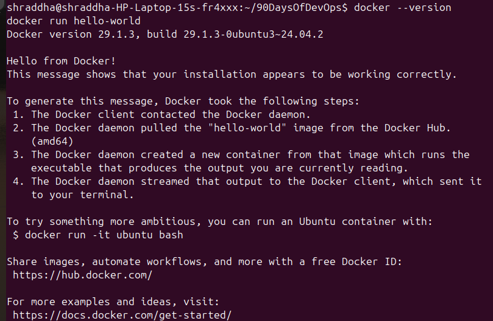
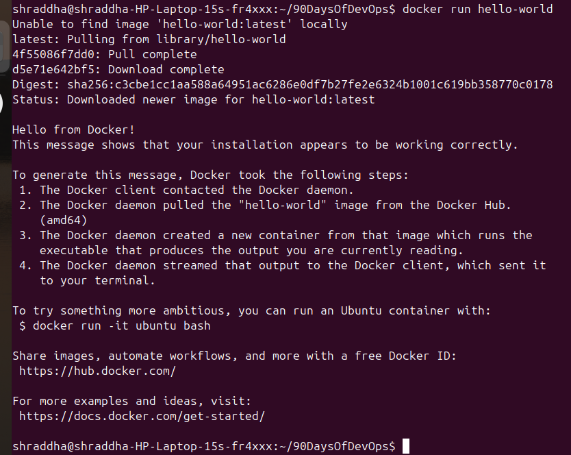
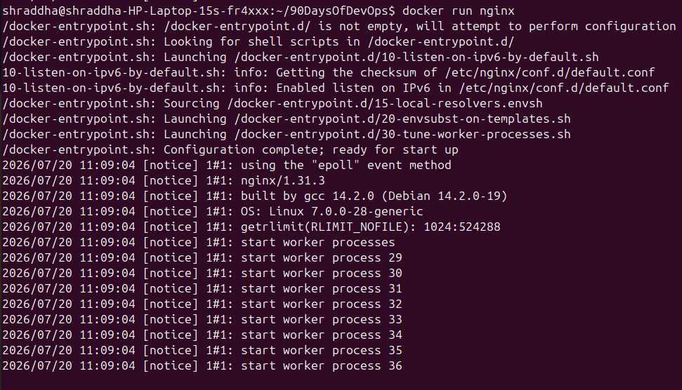
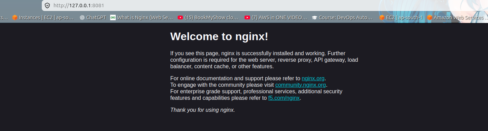
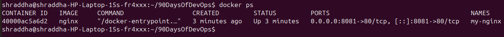
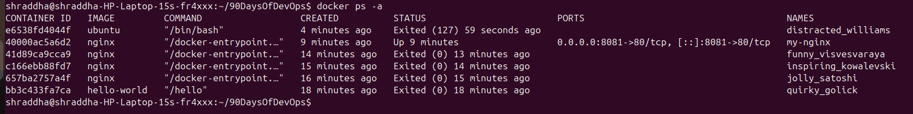
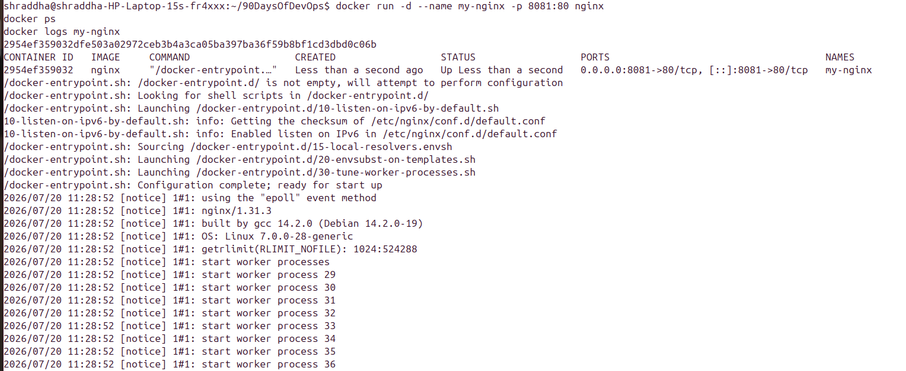

# Day 29 – Introduction to Docker

## Objective

The objective of Day 29 was to understand the fundamentals of Docker, learn the concept of containerization, install Docker, run containers from Docker Hub, and explore essential Docker commands used in real-world DevOps environments.

---

# Tasks Completed

## ✅ Task 1 – What is Docker?

### What is Docker?

Docker is an open-source containerization platform that allows developers to package an application along with its dependencies into lightweight, portable containers. Containers ensure that applications run consistently across different environments.

---

## What is a Container?

A container is a lightweight, isolated environment that packages an application together with all the libraries, dependencies, and configuration files required to run it.

### Why Do We Need Containers?

* Consistent environments across development, testing, and production
* Faster application deployment
* Better resource utilization
* Simplified dependency management
* Easy scalability
* Improved portability

---

# Containers vs Virtual Machines

| Containers             | Virtual Machines                |
| ---------------------- | ------------------------------- |
| Lightweight            | Heavyweight                     |
| Share Host OS Kernel   | Run a Complete Guest OS         |
| Fast Startup           | Slow Startup                    |
| Less Memory Usage      | Higher Memory Usage             |
| High Portability       | Less Portable                   |
| Best for Microservices | Best for Full OS Virtualization |

---

# Docker Architecture

Docker follows a Client-Server architecture.

### Docker Client

The Docker Client is the command-line interface (CLI) that users interact with to execute Docker commands.

### Docker Daemon

The Docker Daemon (`dockerd`) manages Docker images, containers, networks, and volumes.

### Docker Images

Docker Images are read-only templates used to create Docker containers.

### Docker Containers

Containers are running instances of Docker Images.

### Docker Registry

Docker Registry stores Docker Images. Docker Hub is the default public registry.

---

## Docker Architecture Diagram

```text
                    +----------------------+
                    |    Docker Client     |
                    | docker run, ps, exec |
                    +----------+-----------+
                               |
                               |
                               v
                    +----------------------+
                    |   Docker Daemon      |
                    |      (dockerd)       |
                    +----------+-----------+
                               |
          --------------------------------------------
          |                   |                      |
          v                   v                      v
     Docker Images     Docker Containers     Docker Networks
                               |
                               |
                               v
                        Docker Hub Registry
```

---

# ✅ Task 2 – Docker Installation

Verified Docker installation successfully.

## Check Docker Version

```bash
docker --version
```

## Run Hello World Container

```bash
docker run hello-world
```

The `hello-world` image was automatically downloaded from Docker Hub and executed successfully, confirming that Docker was installed correctly.

---

# ✅ Task 3 – Running Containers

## Run Nginx Container

```bash
docker run nginx
```

Docker downloaded the Nginx image from Docker Hub and started a web server inside a container.

---

## Run Ubuntu Container

```bash
docker run -it ubuntu
```

Inside the Ubuntu container, I explored the Linux environment using the following commands:

```bash
pwd
ls
whoami
hostname
cat /etc/os-release
uname -a

echo "Hello Docker" > test.txt
cat test.txt
```

Exited the container using:

```bash
exit
```

---

## List Running Containers

```bash
docker ps
```

---

## List All Containers

```bash
docker ps -a
```

---

## Stop a Container

```bash
docker stop my-nginx
```

---

## Remove a Container

```bash
docker rm my-nginx
```

---

# ✅ Task 4 – Exploring Docker Commands

## Run Container in Detached Mode

```bash
docker run -d --name my-nginx -p 8081:80 nginx
```

### Explanation

* `-d` → Runs the container in the background (Detached Mode)
* `--name my-nginx` → Assigns a custom container name
* `-p 8081:80` → Maps host port **8081** to container port **80**

---

## View Running Containers

```bash
docker ps
```

---

## Access Nginx in Browser

Opened the browser and visited:

```
http://localhost:8081
```

The default **Welcome to nginx!** page was displayed successfully.

---

## View Container Logs

```bash
docker logs my-nginx
```

---

## Execute Commands Inside a Running Container

```bash
docker exec -it my-nginx bash
```

Verify Nginx version:

```bash
nginx -v
```

Exit:

```bash
exit
```

---

# Important Docker Commands

| Command                  | Description                                 |
| ------------------------ | ------------------------------------------- |
| `docker --version`       | Check Docker version                        |
| `docker images`          | List available images                       |
| `docker pull nginx`      | Download Docker image                       |
| `docker run hello-world` | Verify Docker installation                  |
| `docker run nginx`       | Run an Nginx container                      |
| `docker run -it ubuntu`  | Start Ubuntu interactively                  |
| `docker run -d nginx`    | Run container in detached mode              |
| `docker run --name`      | Assign a custom container name              |
| `docker run -p`          | Map container ports                         |
| `docker ps`              | Show running containers                     |
| `docker ps -a`           | Show all containers                         |
| `docker stop`            | Stop a running container                    |
| `docker rm`              | Remove a container                          |
| `docker logs`            | View container logs                         |
| `docker exec -it`        | Execute commands inside a running container |

---

# Screenshots

## 1. Docker Version Verification

Verified Docker installation.



---

## 2. Running Hello World Container

Successfully executed the first Docker container.



---

## 3. Running Nginx Container

Pulled the Nginx image from Docker Hub and started the container.



---

## 4. Accessing Nginx in Browser

Verified that the Nginx web server was accessible from the browser.



---

## 5. Listing Running Containers

Displayed all currently running containers.



---

## 6. Ubuntu Interactive Container

Launched an interactive Ubuntu container and executed Linux commands inside it.

Commands executed:

* `pwd`
* `ls`
* `whoami`
* `hostname`
* `cat /etc/os-release`
* `cat test.txt`


---

## 7. Listing All Containers

Displayed both running and stopped containers.



---

## 8. Stopping a Running Container

Stopped the running Nginx container.


---

## 9. Running Nginx in Detached Mode

Started an Nginx container in detached mode with a custom name and port mapping.

Command used:

```bash
docker run -d --name my-nginx -p 8081:80 nginx
```



---

# Interview Questions

## 1. What is Docker?

Docker is a containerization platform that packages applications and their dependencies into portable containers, ensuring consistent execution across different environments.

---

## 2. What is the difference between an Image and a Container?

**Docker Image**

* Read-only template
* Used to create containers
* Cannot run by itself

**Docker Container**

* Running instance of an image
* Can be started, stopped, and removed
* Executes the application

---

## 3. What is Docker Hub?

Docker Hub is a cloud-based registry that stores Docker images and allows users to pull and push images.

---

## 4. What is Detached Mode?

Detached mode (`-d`) runs a container in the background without occupying the terminal.

---

## 5. What does Port Mapping do?

Port mapping (`-p`) connects a host machine port to a container port, allowing applications inside the container to be accessed externally.

Example:

```bash
docker run -p 8081:80 nginx
```

---

## 6. What does `docker exec` do?

`docker exec` executes commands inside an already running container.

Example:

```bash
docker exec -it my-nginx bash
```

---

## 7. Why are Containers Faster than Virtual Machines?

Containers share the host operating system kernel instead of running a separate operating system, making them lightweight, efficient, and faster to start.

---

# Key Learnings

* Learned the fundamentals of Docker and containerization.
* Understood the difference between containers and virtual machines.
* Installed and verified Docker successfully.
* Pulled Docker images from Docker Hub.
* Executed the Hello World container.
* Ran Nginx and Ubuntu containers.
* Explored Docker CLI commands.
* Learned detached mode, interactive mode, port mapping, and custom container naming.
* Viewed Docker logs and executed commands inside running containers.
* Practiced container lifecycle management using `docker ps`, `docker stop`, and `docker rm`.

---

# Conclusion

Day 29 introduced the core concepts of Docker and containerization through hands-on practice. I successfully installed Docker, explored Docker Hub, ran multiple containers, deployed an Nginx web server, interacted with an Ubuntu container, and learned the essential Docker commands that form the foundation of modern DevOps, CI/CD pipelines, Kubernetes, and cloud-native application deployment.
