# Day 30 – Docker Images & Container Lifecycle

## 📌 Objective

The goal of Day 30 is to understand how Docker Images and Containers work internally. This includes learning about image layers, Docker image caching, the complete container lifecycle, container inspection, and Docker cleanup commands.

---

# Task 1 – Docker Images

## Pull Docker Images

Downloaded the following images from Docker Hub:

```bash
docker pull nginx
docker pull ubuntu
docker pull alpine
```

## List All Docker Images

```bash
docker image ls
```

### Screenshot

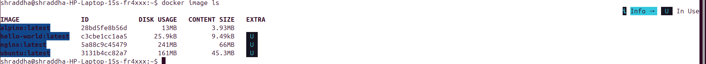

---

## Ubuntu vs Alpine

| Ubuntu | Alpine |
|---------|---------|
| Around 45 MB+ | Around 4 MB |
| Uses GNU utilities | Uses BusyBox |
| More packages installed | Minimal packages |
| Good for development | Best for production containers |
| Larger image size | Lightweight image |

### Why is Alpine Smaller?

- Minimal Linux distribution
- Uses BusyBox instead of GNU Core Utilities
- Very few pre-installed packages
- Smaller attack surface
- Faster image download

---

## Inspect Docker Image

Command:

```bash
docker image inspect nginx
```

Information available:

- Image ID
- Repository
- Tag
- Architecture
- Operating System
- Environment Variables
- Entrypoint
- Layers
- Creation Date

---

## Remove an Image

```bash
docker image rm alpine
```

---

# Task 2 – Docker Image Layers

Docker images consist of multiple read-only layers.

Each instruction inside a Dockerfile creates a new image layer.

View image history:

```bash
docker image history nginx
```

### Screenshot

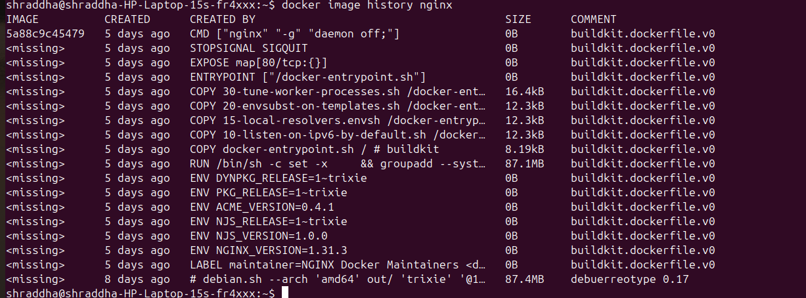

---

## Why Docker Uses Layers

Advantages:

- Faster downloads
- Layer caching
- Less storage usage
- Image reuse
- Faster builds
- Easy updates

Example:

```
Base Ubuntu Layer
       │
Install Packages
       │
Copy Files
       │
Expose Port
       │
Run Command
```

Each layer is reused whenever possible.

---

# Task 3 – Container Lifecycle

Docker Container States

```
Created
   │
Start
   │
Running
   │
Pause
   │
Unpause
   │
Stop
   │
Restart
   │
Kill
   │
Remove
```

---

## Create Container

```bash
docker create --name demo-container nginx
```

Check status:

```bash
docker ps -a
```

### Screenshot

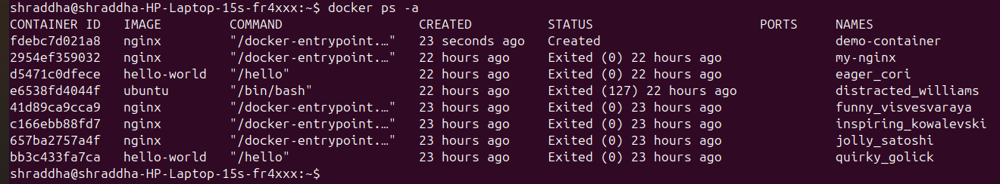

---

## Start Container

```bash
docker start demo-container
```

---

## Pause Container

```bash
docker pause demo-container
```

---

## Unpause Container

```bash
docker unpause demo-container
```

---

## Stop Container

```bash
docker stop demo-container
```

---

## Restart Container

```bash
docker restart demo-container
```

---

## Kill Container

```bash
docker kill demo-container
```

---

## Remove Container

```bash
docker rm demo-container
```

Check container state:

```bash
docker ps -a
```

### Screenshot

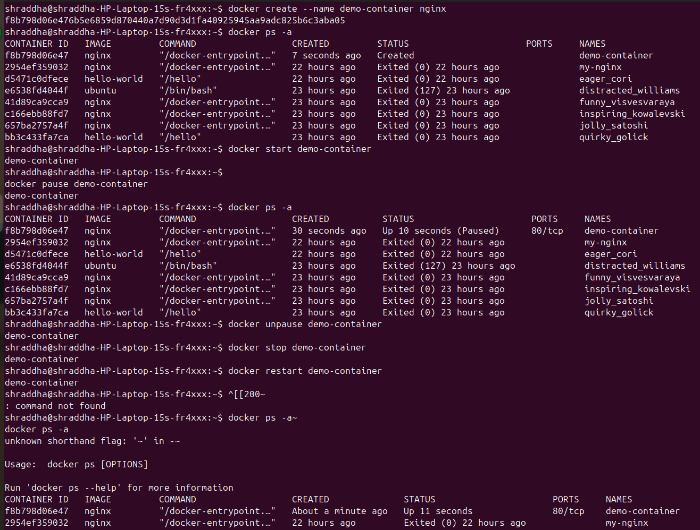

---

# Task 4 – Working with Running Containers

## Run Nginx Container

```bash
docker run -d --name webserver2 -p 8081:80 nginx
```

### Screenshot

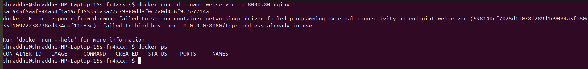

---

## List Running Containers

```bash
docker ps
```

### Screenshot

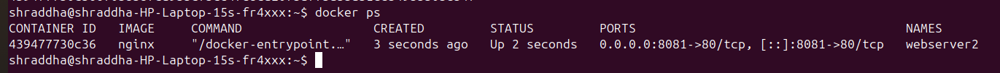

---

## View Logs

```bash
docker logs -f webserver2
```

### Screenshot

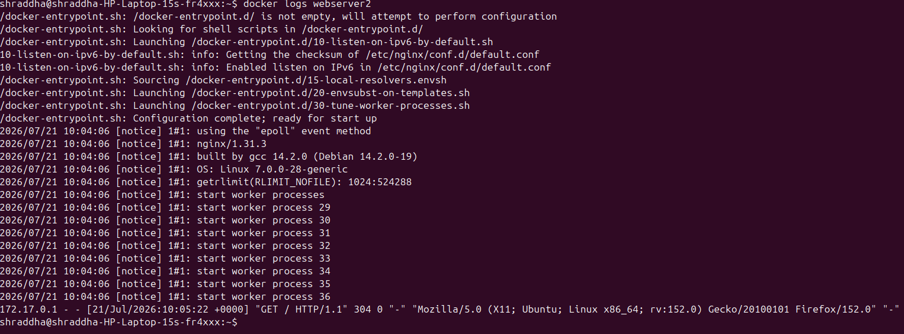

---

## Enter Container

```bash
docker exec -it webserver2 sh
```

### Screenshot

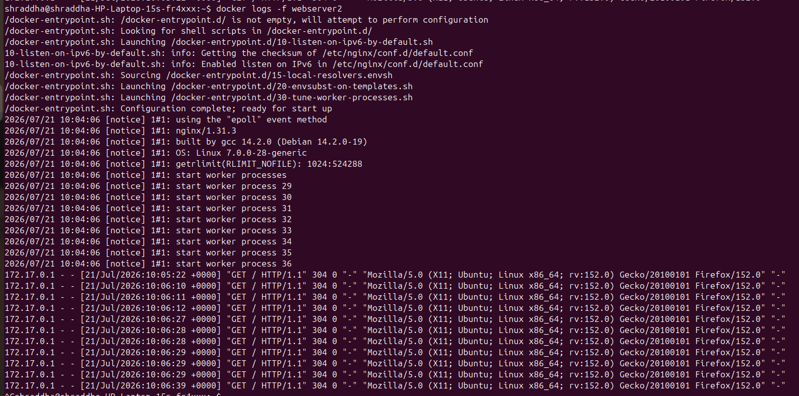

---

## Explore Filesystem

Commands:

```bash
pwd
ls
cd /usr/share/nginx/html
ls
cat index.html
```

### Screenshot

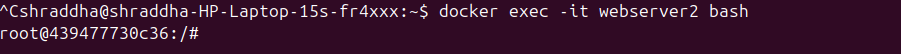

---

## Find Container IP

```bash
docker inspect -f '{{ .NetworkSettings.IPAddress }}' webserver2
```

### Screenshot

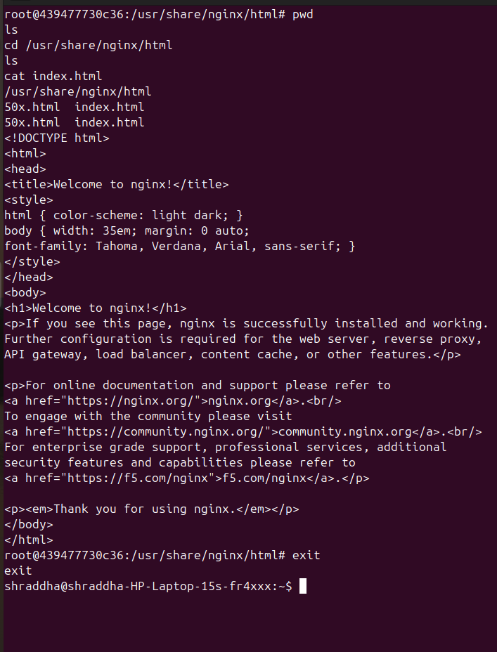

---

## View Port Mapping

```bash
docker port webserver2
```

### Screenshot

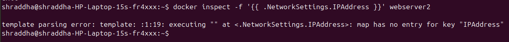

---

## View Mount Information

```bash
docker inspect webserver2
```

Locate:

```
"Mounts": [
```

### Screenshot

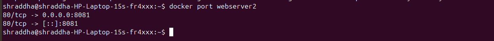

---

# Task 5 – Docker Cleanup

## Stop All Running Containers

```bash
docker stop $(docker ps -q)
```

### Screenshot

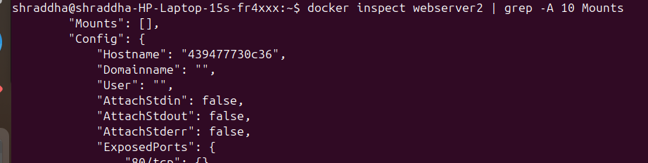

---

## Remove All Containers

```bash
docker rm $(docker ps -aq)
```

### Screenshot

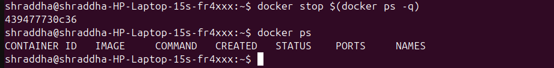

---

## Remove Unused Images

```bash
docker image prune -a
```

### Screenshot

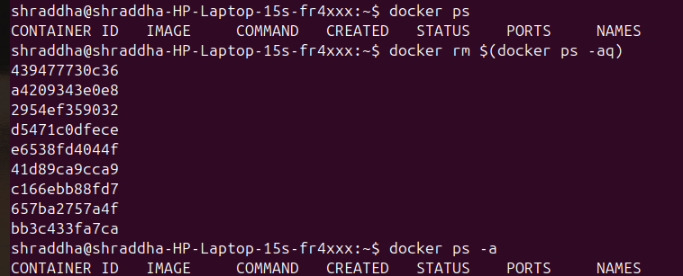

---

## Docker Disk Usage

```bash
docker system df
```

### Screenshot

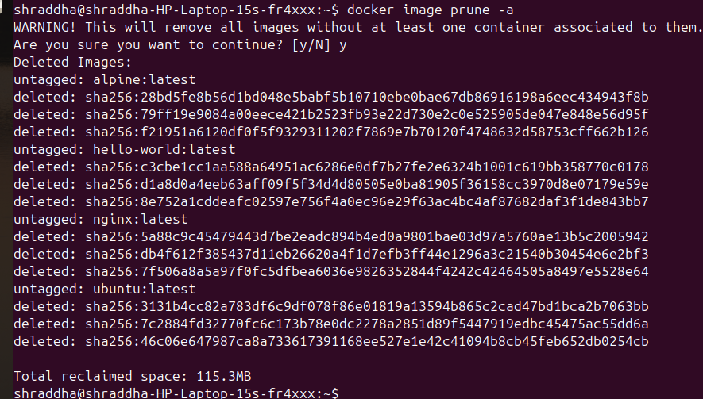

---

## Remove Unused Docker Resources

```bash
docker system prune -a
```

### Screenshot

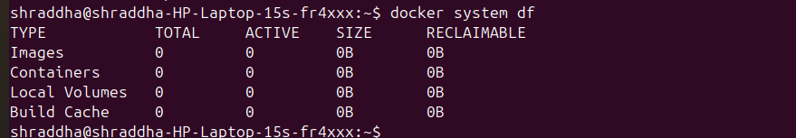

---

# Docker Image vs Docker Container

| Docker Image | Docker Container |
|--------------|------------------|
| Read-only template | Running instance |
| Cannot execute | Executes applications |
| Immutable | Mutable |
| Used to create containers | Created from images |
| Stored in Docker Registry | Runs on Docker Engine |

---

# Important Docker Commands Used

```bash
docker pull
docker image ls
docker image history
docker image inspect
docker create
docker start
docker pause
docker unpause
docker stop
docker restart
docker kill
docker rm
docker ps
docker logs
docker exec
docker inspect
docker port
docker image prune
docker system df
docker system prune
```

---

# Key Learnings

- Learned the difference between Docker Images and Containers.
- Understood Docker image layers and caching.
- Explored the complete container lifecycle.
- Executed commands inside a running container.
- Retrieved container IP address and port mappings.
- Inspected Docker container details.
- Practiced Docker cleanup commands.
- Learned how Docker optimizes storage using layers.

---

# Interview Questions

### 1. What is a Docker Image?

A Docker Image is a read-only template used to create Docker Containers.

---

### 2. What is a Docker Container?

A Docker Container is a running instance of a Docker Image.

---

### 3. What are Docker Layers?

Layers are read-only filesystem changes created during image build. Docker reuses these layers to improve performance.

---

### 4. Why is Alpine Linux preferred?

Because it is lightweight, secure, downloads quickly, and has a smaller attack surface.

---

### 5. Difference between `docker create` and `docker run`?

- `docker create` creates a container but does not start it.
- `docker run` creates and starts the container in one command.

---

### 6. Difference between `docker stop` and `docker kill`?

- `docker stop` sends a graceful termination signal (SIGTERM) before stopping.
- `docker kill` immediately terminates the container (SIGKILL).

---

### 7. What does `docker inspect` do?

It displays detailed JSON information about Docker images or containers.

---

### 8. How do you check Docker disk usage?

```bash
docker system df
```

---

### 9. Which command removes unused Docker resources?

```bash
docker system prune -a
```

---

### 10. How do you view container logs?

```bash
docker logs <container-name>
```

---

# Conclusion

In this lab, I explored Docker Images, Image Layers, and the complete Container Lifecycle. I learned how Docker optimizes storage using image layers, how containers transition through different states, how to inspect running containers, and how to clean up unused Docker resources. This hands-on practice strengthened my understanding of Docker fundamentals and prepared me for real-world DevOps workflows.

---
**#90DaysOfDevOps #TrainWithShubham #Docker #DevOps #AWS #Linux #CloudComputing**

