# Day 32 – Docker Volumes & Networking

## Objective

The objective of this lab is to understand how Docker handles **data persistence** and **container communication**. By default, containers are ephemeral, which means any data stored inside them is lost when the container is removed. Docker Volumes solve this problem by storing data outside the container. Docker Networking allows containers to communicate with each other securely using bridge networks and DNS-based name resolution.

---

# Task 1 – The Problem (Container Data Loss)

## Goal

* Run a PostgreSQL container.
* Create a database and table.
* Insert sample data.
* Remove the container.
* Create a new container.
* Verify whether the data still exists.

---

## Step 1 – Pull PostgreSQL Image

```bash
docker pull postgres
```

Verify the image:

```bash
docker images
```

### Screenshot

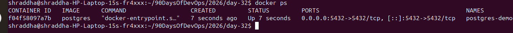

---

## Step 2 – Run PostgreSQL Container

```bash
docker run -d \
--name postgres-demo \
-e POSTGRES_PASSWORD=admin123 \
-p 5432:5432 \
postgres
```

Verify:

```bash
docker ps
```

---

## Step 3 – Access PostgreSQL

```bash
docker exec -it postgres-demo bash
```

Connect to PostgreSQL:

```bash
psql -U postgres
```

---

## Step 4 – Create Database

```sql
CREATE DATABASE devops;
```

Switch database:

```sql
\c devops
```

---

## Step 5 – Create Table

```sql
CREATE TABLE students(
    id SERIAL PRIMARY KEY,
    name VARCHAR(50)
);
```

Insert data:

```sql
INSERT INTO students(name)
VALUES('Shraddha');
```

Display data:

```sql
SELECT * FROM students;
```

### Screenshot

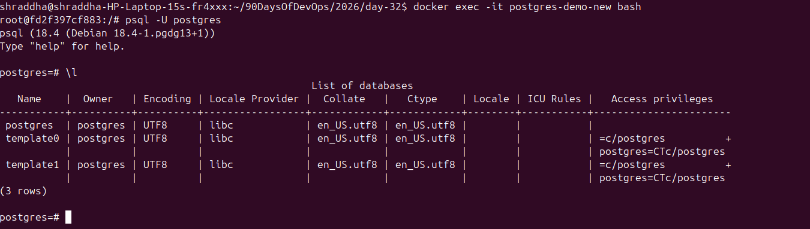

---

## Step 6 – Stop and Remove Container

Exit PostgreSQL:

```sql
\q
```

Exit container:

```bash
exit
```

Stop container:

```bash
docker stop postgres-demo
```

Remove container:

```bash
docker rm postgres-demo
```

---

## Step 7 – Create a New Container

```bash
docker run -d \
--name postgres-demo-new \
-e POSTGRES_PASSWORD=admin123 \
-p 5432:5432 \
postgres
```

Enter the container:

```bash
docker exec -it postgres-demo-new bash
```

Login:

```bash
psql -U postgres
```

List databases:

```sql
\l
```

The **devops** database was missing.

### Screenshot


---

## Observation

The database and table disappeared after removing the container because PostgreSQL stored all data inside the container's writable layer. When the container was deleted, the writable layer was also deleted.

---

## Conclusion

Without a Docker Volume, container data is **not persistent**.

---

# Task 2 – Docker Named Volumes

## Goal

Store PostgreSQL data in a Docker Named Volume so it survives container removal.

---

## Step 1 – Create Named Volume

```bash
docker volume create postgres-data
```

Verify:

```bash
docker volume ls
```

### Screenshot

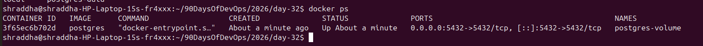

---

## Step 2 – Run PostgreSQL with Named Volume

```bash
docker run -d \
--name postgres-volume \
-e POSTGRES_PASSWORD=admin123 \
-v postgres-data:/var/lib/postgresql \
-p 5432:5432 \
postgres
```

Verify:

```bash
docker ps
```

---

## Step 3 – Create Sample Data

Enter container:

```bash
docker exec -it postgres-volume bash
```

Connect:

```bash
psql -U postgres
```

Create database:

```sql
CREATE DATABASE company;
```

Switch database:

```sql
\c company
```

Create table:

```sql
CREATE TABLE employee(
    id SERIAL PRIMARY KEY,
    name VARCHAR(50)
);
```

Insert data:

```sql
INSERT INTO employee(name)
VALUES('Shraddha');
```

Display table:

```sql
SELECT * FROM employee;
```

### Screenshot

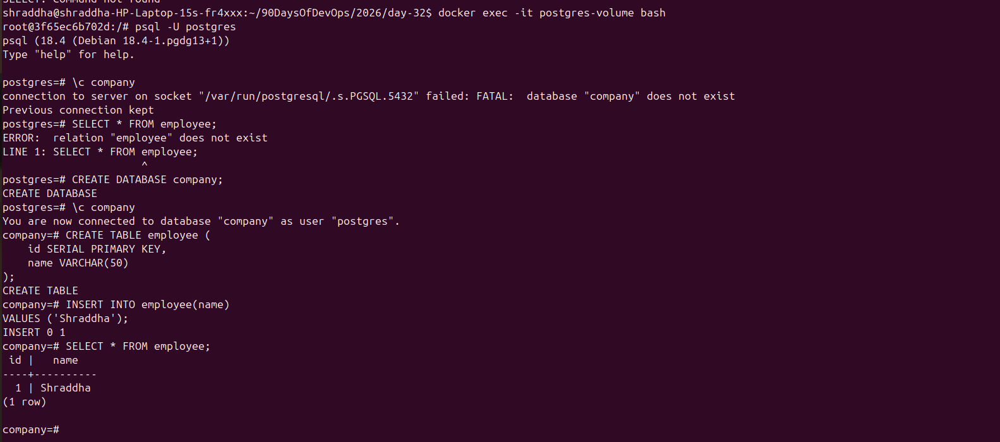

---

## Step 4 – Verify Volume

Exit PostgreSQL:

```sql
\q
```

Exit container:

```bash
exit
```

Inspect the volume:

```bash
docker volume inspect postgres-data
```

### Screenshot

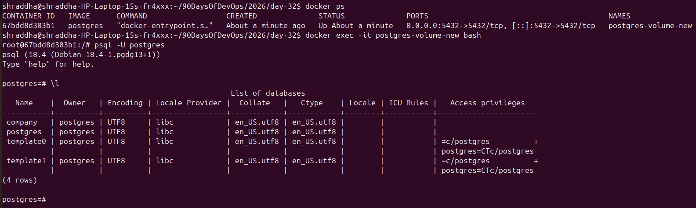

---

## Step 5 – Remove the Container

```bash
docker stop postgres-volume
docker rm postgres-volume
```

---

## Step 6 – Create a New Container Using the Same Volume

```bash
docker run -d \
--name postgres-volume-new \
-e POSTGRES_PASSWORD=admin123 \
-v postgres-data:/var/lib/postgresql \
-p 5432:5432 \
postgres
```

Access PostgreSQL:

```bash
docker exec -it postgres-volume-new bash
```

Login:

```bash
psql -U postgres
```

Switch database:

```sql
\c company
```

Display data:

```sql
SELECT * FROM employee;
```

The data was still available because Docker stored it inside the named volume instead of the container.

### Screenshot


---

## Observation

The PostgreSQL container was removed, but the database remained because the named volume stored the data independently of the container lifecycle.

---

## Conclusion

Docker Named Volumes provide persistent storage and are the recommended approach for databases such as PostgreSQL and MySQL.

---

**Next:** Continue with **Part 2**, which covers **Task 3 (Bind Mounts)** and **Task 4 (Docker Networking Basics)**.


# Task 3 – Bind Mounts

## Goal

Learn how to share files between the host machine and a Docker container using a **Bind Mount**.

A Bind Mount maps a directory from the host machine directly into a container. Any changes made on the host are immediately reflected inside the container.

---

## Step 1 – Create a Website Directory

```bash
mkdir website
cd website
```

Create an HTML file:

```bash
nano index.html
```

Add the following content:

```html
<!DOCTYPE html>
<html>
<head>
    <title>Day 32 Bind Mount</title>
</head>
<body>
    <h1>Hello from Docker Bind Mount!</h1>
    <h2>Created by Shraddha</h2>
</body>
</html>
```

Save and exit Nano.

Return to the Day-32 directory:

```bash
cd ..
```

Verify:

```bash
ls website
```

Output:

```text
index.html
```

---

## Step 2 – Run Nginx with a Bind Mount

```bash
docker run -d \
  --name nginx-bind \
  -p 8081:80 \
  -v $(pwd)/website:/usr/share/nginx/html \
  nginx:alpine
```

Verify:

```bash
docker ps
```

### Screenshot

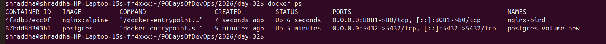

---

## Step 3 – Access the Website

Open the browser:

```text
http://localhost:8081
```

The webpage displays:

```
Hello from Docker Bind Mount!
Created by Shraddha
```

### Screenshot

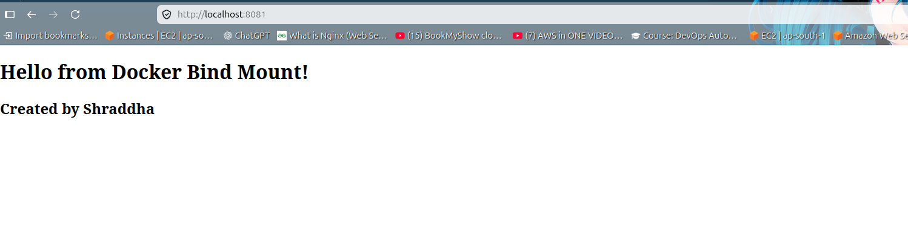

---

## Step 4 – Update the Website

Edit the file on the host:

```bash
nano website/index.html
```

Update it:

```html
<!DOCTYPE html>
<html>
<head>
    <title>Updated Website</title>
</head>
<body>
    <h1>Docker Bind Mount Works!</h1>
    <h2>Updated by Shraddha</h2>
    <p>This page was updated without restarting the container.</p>
</body>
</html>
```

Save the file and refresh the browser.

The updated page appeared immediately without restarting the container.

### Screenshot

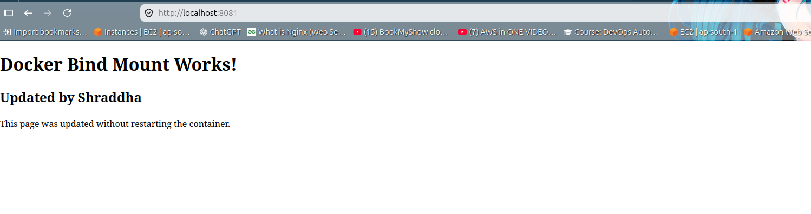

---

## Observation

The Nginx container immediately reflected the changes made to the host machine because both were using the same directory through a Bind Mount.

---

## Difference Between Named Volume and Bind Mount

| Named Volume                            | Bind Mount                               |
| --------------------------------------- | ---------------------------------------- |
| Managed by Docker                       | Managed by the host machine              |
| Stored inside Docker's volume directory | Uses an existing directory from the host |
| Best for databases                      | Best for development and source code     |
| Docker controls the location            | User controls the location               |
| Portable                                | Depends on the host path                 |

---

## Conclusion

Bind Mounts are commonly used during development because changes made to files on the host machine are instantly available inside the running container.

---

# Task 4 – Docker Networking Basics

## Goal

Understand how Docker containers communicate using the default bridge network.

---

## Step 1 – List Docker Networks

```bash
docker network ls
```

Example Output:

```text
NETWORK ID     NAME      DRIVER    SCOPE
bridge         bridge    local
host           host      local
none           null      local
```

### Screenshot


---

## Step 2 – Inspect the Default Bridge Network

```bash
docker network inspect bridge
```

The output shows:

* Network ID
* Driver
* Gateway
* Subnet
* Connected Containers

### Screenshot

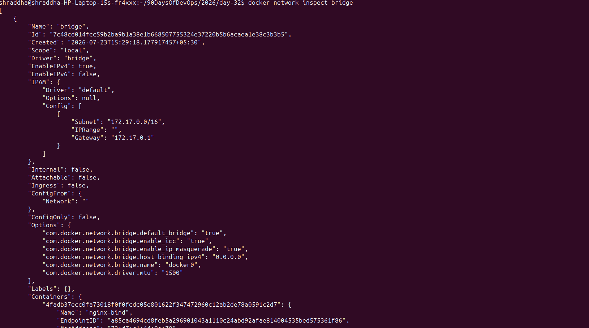

---

## Step 3 – Run Two Ubuntu Containers

Container 1:

```bash
docker run -dit --name ubuntu1 ubuntu sleep infinity
```

Container 2:

```bash
docker run -dit --name ubuntu2 ubuntu sleep infinity
```

Verify:

```bash
docker ps
```

### Screenshot

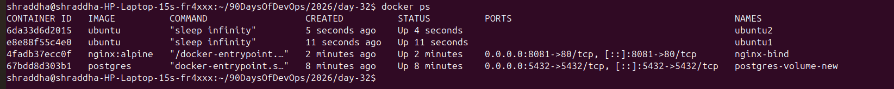

---

## Step 4 – Find Ubuntu2 IP Address

```bash
docker inspect -f '{{range.NetworkSettings.Networks}}{{.IPAddress}}{{end}}' ubuntu2
```

Example:

```text
172.17.0.5
```

---

## Step 5 – Enter Ubuntu1

```bash
docker exec -it ubuntu1 bash
```

Install Ping:

```bash
apt update
apt install -y iputils-ping
```

---

## Step 6 – Ping by Container Name

```bash
ping ubuntu2
```

Result:

```text
ping: ubuntu2: Name or service not known
```

The ping failed because Docker's default bridge network does not provide automatic DNS-based name resolution.

### Screenshot


---

## Step 7 – Ping by IP Address

```bash
ping 172.17.0.5
```

Output:

```text
64 bytes from 172.17.0.5...
64 bytes from 172.17.0.5...
```

Stop the ping:

```text
Ctrl + C
```

### Screenshot

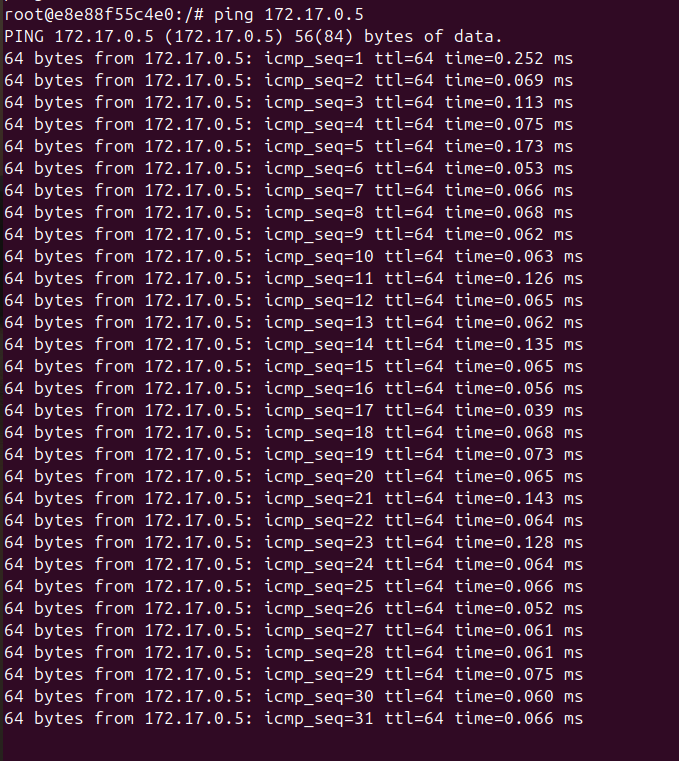

---

## Observation

Containers connected to the default bridge network can communicate using IP addresses but cannot automatically resolve each other's container names.

---

## Conclusion

The default bridge network supports IP-based communication only. For automatic name-based communication, Docker recommends using a custom bridge network.

---

## Interview Questions

### Q1. What is a Bind Mount?

**Answer:**

A Bind Mount maps a directory or file from the host machine directly into a Docker container. Changes made on the host are immediately reflected inside the running container.

---

### Q2. Why did `ping ubuntu2` fail?

**Answer:**

The default bridge network does not provide automatic DNS-based name resolution. Containers can communicate using IP addresses but not by container names.


# Task 5 – Docker Custom Bridge Network

## Goal

Learn how Docker containers communicate using a **Custom Bridge Network** and understand why name-based communication works.

---

## Step 1 – Create a Custom Network

Create a new bridge network named **my-app-net**.

```bash
docker network create my-app-net
```

Verify the network:

```bash
docker network ls
```

### Screenshot

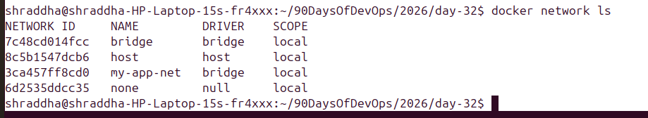

---

## Step 2 – Run Two Ubuntu Containers on the Custom Network

Run the first container:

```bash
docker run -dit \
--name app1 \
--network my-app-net \
ubuntu sleep infinity
```

Run the second container:

```bash
docker run -dit \
--name app2 \
--network my-app-net \
ubuntu sleep infinity
```

Verify:

```bash
docker ps
```

### Screenshot

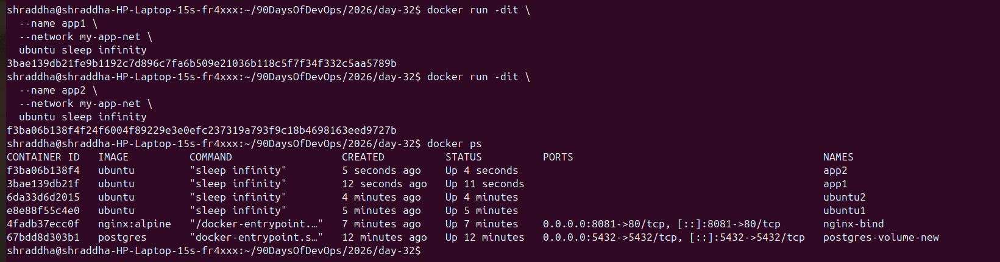

---

## Step 3 – Enter app1 Container

```bash
docker exec -it app1 bash
```

Install the ping utility:

```bash
apt update
apt install -y iputils-ping
```

---

## Step 4 – Ping by Container Name

```bash
ping app2
```

Output:

```text
64 bytes from app2.my-app-net ...
64 bytes from app2.my-app-net ...
```

Press **Ctrl + C** to stop.

### Screenshot


---

## Observation

Unlike the default bridge network, the custom bridge network automatically provides **DNS-based name resolution**. Containers can communicate using container names without needing to know IP addresses.

---

## Why does Custom Networking allow name-based communication?

Docker creates an internal DNS server for every custom bridge network. This DNS server automatically maps container names to their IP addresses.

Therefore:

* `ping app2` ✅ Works
* No need to remember IP addresses
* Easier communication between application services

---

## Conclusion

Custom bridge networks are recommended for multi-container applications because they provide secure communication and automatic container name resolution.

---

# Task 6 – Put It Together

## Goal

Run a PostgreSQL database with a Docker Volume on a custom network and verify that another container can communicate with it using the container name.

---

## Step 1 – Create a Volume

```bash
docker volume create app-db-data
```

Verify:

```bash
docker volume ls
```

### Screenshot


---

## Step 2 – Run PostgreSQL on the Custom Network

```bash
docker run -d \
--name postgres-db \
--network my-app-net \
-e POSTGRES_PASSWORD=admin123 \
-v app-db-data:/var/lib/postgresql \
postgres
```

Verify:

```bash
docker ps
```

### Screenshot

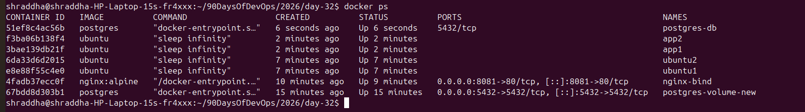

---

## Step 3 – Run an Application Container

```bash
docker run -dit \
--name app-container \
--network my-app-net \
ubuntu sleep infinity
```

---

## Step 4 – Enter the Application Container

```bash
docker exec -it app-container bash
```

Install ping:

```bash
apt update
apt install -y iputils-ping
```

---

## Step 5 – Ping the Database Container

```bash
ping postgres-db
```

Output:

```text
64 bytes from postgres-db.my-app-net ...
64 bytes from postgres-db.my-app-net ...
```

Stop ping using:

```text
Ctrl + C
```

Exit the container:

```bash
exit
```

### Screenshot


---

## Observation

The application container successfully communicated with the PostgreSQL container using the container name. Docker's internal DNS automatically resolved **postgres-db** to its IP address.

---

## Conclusion

Using a **Docker Volume** with a **Custom Bridge Network** provides:

* Persistent database storage
* Reliable container communication
* Automatic DNS resolution
* A production-like environment for multi-container applications

---

# Key Learnings

* Containers are **ephemeral** by default.
* Removing a container also removes its writable layer and data.
* Docker **Named Volumes** provide persistent storage.
* **Bind Mounts** are useful during development because changes on the host are immediately visible inside the container.
* The **default bridge network** allows communication using IP addresses but not container names.
* **Custom bridge networks** provide built-in DNS-based name resolution.
* Docker Volumes and Custom Networks are essential building blocks for real-world containerized applications.

---

# Interview Questions

### 1. What is a Docker Volume?

A Docker Volume is a Docker-managed storage mechanism that stores data outside the container's writable layer, allowing data to persist even after the container is removed.

---

### 2. Why do containers lose data?

Containers store data in a writable layer that exists only for the lifetime of the container. When the container is deleted, this writable layer and its data are removed.

---

### 3. What is the difference between a Named Volume and a Bind Mount?

| Named Volume                     | Bind Mount                       |
| -------------------------------- | -------------------------------- |
| Managed by Docker                | Managed by the host OS           |
| Best for databases               | Best for application source code |
| Portable                         | Depends on the host file path    |
| Docker controls storage location | User controls storage location   |

---

### 4. Why should databases use Docker Volumes?

Databases require persistent storage. Docker Volumes ensure that database files remain available even if the container is stopped, removed, or recreated.

---

### 5. What is Docker Networking?

Docker Networking allows containers to communicate with each other or with external systems using different network drivers such as bridge, host, none, and overlay.

---

### 6. Why does the default bridge network not support name resolution?

The default bridge network does not automatically provide Docker's embedded DNS for container names. Containers typically communicate using IP addresses unless a custom bridge network is used.

---

### 7. Why is a Custom Bridge Network recommended?

A custom bridge network provides:

* Automatic DNS resolution
* Better isolation
* Easier service discovery
* Simpler communication between containers

---

# Summary

In this lab, I learned how Docker manages persistent storage using **Named Volumes**, how **Bind Mounts** synchronize files between the host and containers, and how Docker Networking enables communication between containers. I also learned why **Custom Bridge Networks** are preferred for multi-container applications due to built-in DNS-based name resolution. These concepts are fundamental for deploying reliable and production-ready containerized applications.

---

# Git Commands

```bash
git add .

git commit -m "Completed Day 32 - Docker Volumes & Networking"

git push origin master
```

> If your repository uses the **main** branch, replace `master` with `main`.
