# Day 33 – Docker Compose: Multi-Container Basics

## 🎯 Objective

The goal of this lab was to learn Docker Compose and understand how to deploy and manage multi-container applications using a single `docker-compose.yml` file.

---

# Task 1 – Install & Verify Docker Compose

## Commands Used

```bash
docker --version
docker compose version
```

## Output

- Docker Engine Version: **29.1.3**
- Docker Compose Version: **2.40.3**

## Screenshot

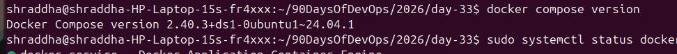

---

# Task 2 – First Docker Compose Project (Nginx)

## Folder Structure

```text
compose-basics/
└── docker-compose.yml
```

## docker-compose.yml

```yaml
services:
  nginx:
    image: nginx:latest
    container_name: nginx-compose
    ports:
      - "8085:80"
```

## Commands Used

```bash
docker compose up -d
docker ps
docker compose down
```

## Browser

```
http://localhost:8085
```

The Nginx Welcome page was displayed successfully.

## Screenshots

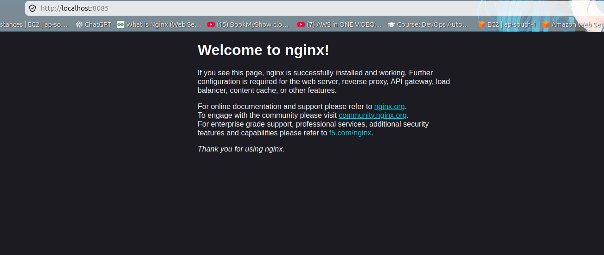


---

# Challenge Faced

While starting the Nginx container, I received the following error:

```text
failed to bind host port 8080: address already in use
```

## Root Cause

Port **8080** was already being used by the Jenkins service.

## Solution

Changed the port mapping from:

```yaml
8080:80
```

to

```yaml
8085:80
```

The container started successfully after changing the host port.

---

# Task 3 – WordPress + MySQL

## Folder Structure

```text
wordpress-mysql/
├── docker-compose.yml
└── .env
```

## .env

```env
MYSQL_ROOT_PASSWORD=root123
MYSQL_DATABASE=wordpress
MYSQL_USER=wpuser
MYSQL_PASSWORD=wp123
```

## Services

- WordPress
- MySQL
- Named Volume
- Docker Network
- Environment Variables

## Commands Used

```bash
docker compose up -d
docker ps
```

## Browser

```
http://localhost:8081
```

Successfully installed WordPress and created a sample website.

## Screenshots

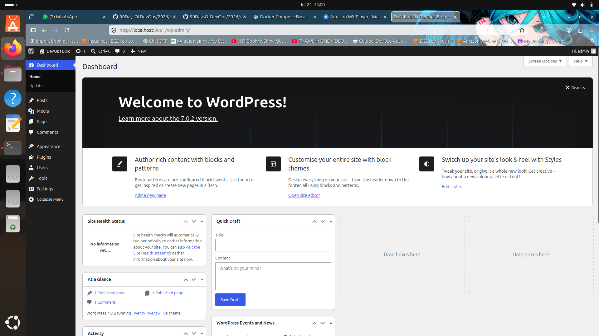

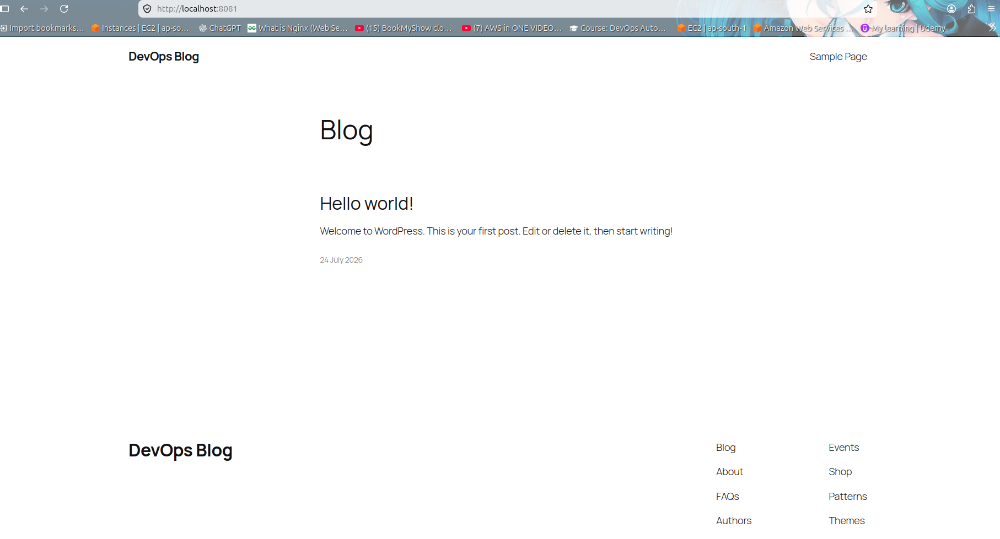

---

# Data Persistence Test

## Commands

```bash
docker compose down

docker compose up -d

docker ps
```

## Result

After stopping and recreating the containers, WordPress loaded normally without asking for installation again.

This confirmed that the MySQL named volume preserved the database data.

## Screenshots

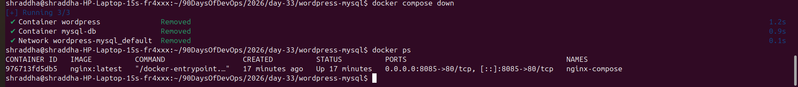

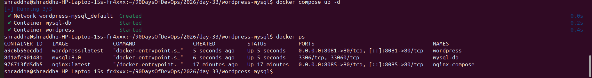

---

# Task 4 – Docker Compose Commands

## View Running Containers

```bash
docker compose ps
```

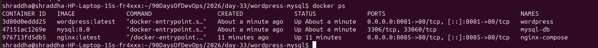

---

## View Logs

```bash
docker compose logs
```


---

## WordPress Logs

```bash
docker compose logs wordpress
```

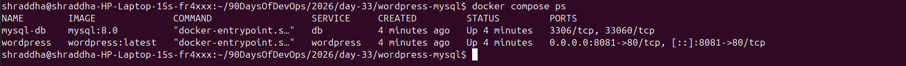

---

## MySQL Logs

```bash
docker compose logs db
```

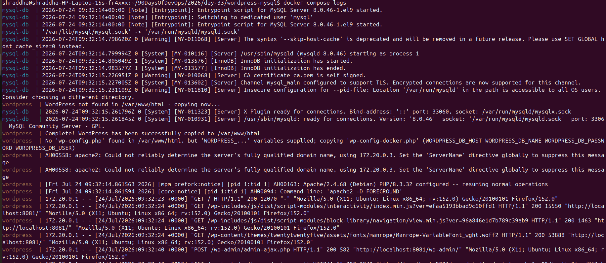

---

## Stop Services

```bash
docker compose stop
```

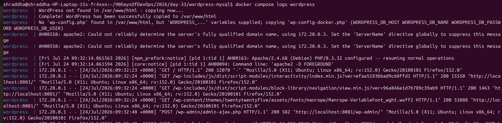

---

## Start Services

```bash
docker compose start
```

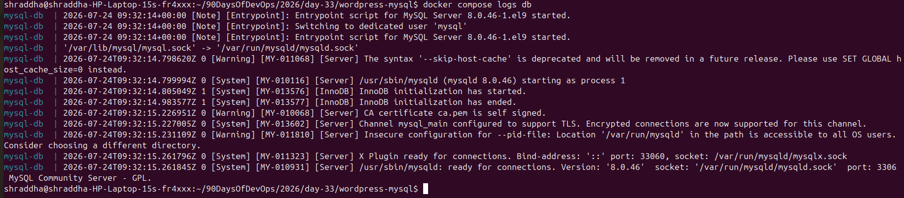

---

## Restart Services

```bash
docker compose restart
```

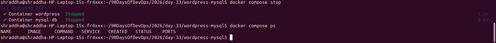

---

## Remove Containers

```bash
docker compose down
```

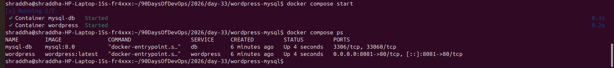

---

## Start Again

```bash
docker compose up -d
```

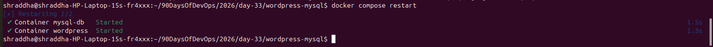

---

# Task 5 – Environment Variables

## Verify Configuration

```bash
docker compose config
```

Docker Compose successfully loaded all variables from the `.env` file.

## Screenshot

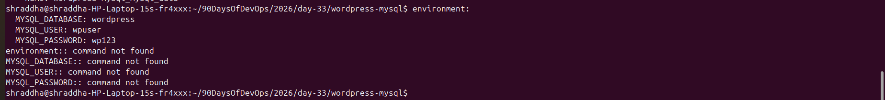

---

# What I Learned

- Docker Compose simplifies multi-container deployments.
- A single YAML file can define multiple services.
- Docker Compose automatically creates networks.
- Containers communicate using service names.
- Named volumes provide persistent storage.
- Environment variables can be managed using a `.env` file.
- Docker Compose commands make container management easier.

---

# Conclusion

Today I learned how to use Docker Compose to deploy both single-container and multi-container applications. I successfully configured Nginx, WordPress, and MySQL, verified persistent storage using Docker volumes, practiced essential Docker Compose commands, and gained hands-on experience with a real-world multi-container setup.
