# Day 34 – Docker Compose: Real-World Multi-Container Apps

## Objective

The goal of this lab was to build a production-like multi-container application using Docker Compose. This project demonstrates how to deploy and manage a Flask application with PostgreSQL and Redis using Docker Compose while implementing health checks, restart policies, custom Dockerfiles, named networks, named volumes, service labels, and scaling.

---

# Project Structure

```text
day-34/
├── app/
│   ├── app.py
│   ├── Dockerfile
│   └── requirements.txt
├── compose-advanced/
│   ├── docker-compose.yml
│   └── .env
├── screenshots/
│   ├── 01-compose-build.png
│   ├── 02-docker-ps.png
│   ├── 03-flask-browser.png
│   ├── 04-docker-ps-before-kill.png
│   ├── 05-postgres-restarted.png
│   ├── 06-compose-rebuild.png
│   ├── 07-updated-flask-browser.png
│   ├── 08-network-inspect.png
│   ├── 09-volume-inspect.png
│   ├── 10-service-labels.png
│   └── 11-web-scaling-error.png
└── day-34-compose-advanced.md
```

---

# Task 1 – Build Your Own App Stack

## Objective

Create a three-service Docker Compose application consisting of:

- Flask Web Application
- PostgreSQL Database
- Redis Cache

---

## Files Created

### Flask Application

```
app/app.py
```

### Dockerfile

```
app/Dockerfile
```

### Requirements

```
app/requirements.txt
```

### Docker Compose

```
compose-advanced/docker-compose.yml
```

---

## Commands Used

```bash
docker compose up --build
```

```bash
docker compose up -d
```

```bash
docker ps
```

---

## Result

- Flask application built successfully.
- PostgreSQL container started successfully.
- Redis container started successfully.
- Flask application accessible at:

```
http://localhost:5000
```

---

## Screenshots

### Build Output

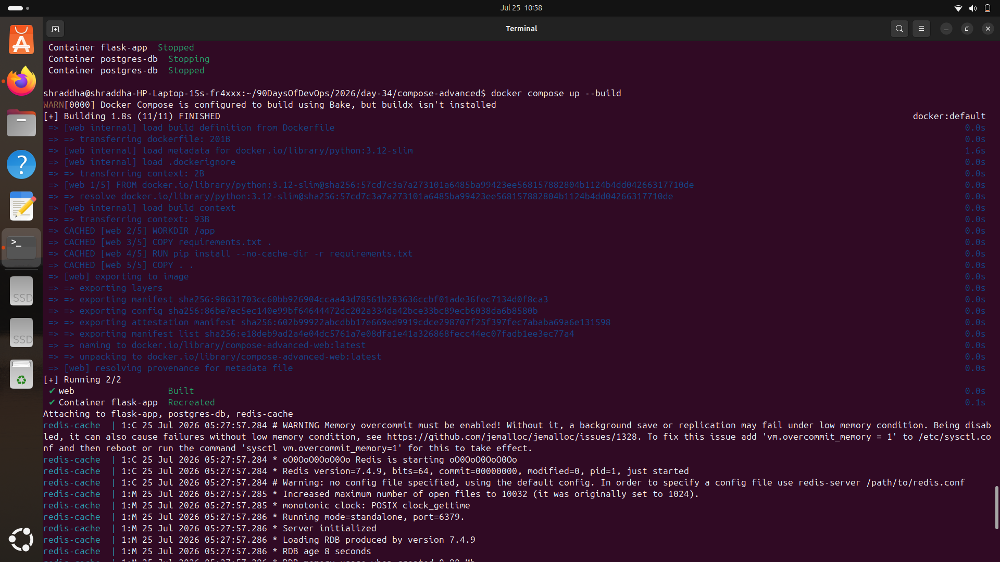

---

### Running Containers

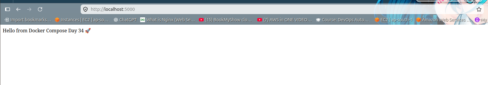

---

### Flask Browser

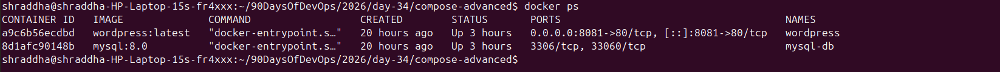

---

# Task 2 – depends_on & Healthchecks

## Objective

Configure Docker Compose so that:

- Flask waits for PostgreSQL.
- PostgreSQL becomes healthy before Flask starts.

---

## Configuration Used

```yaml
depends_on:
  db:
    condition: service_healthy
```

Health Check

```yaml
healthcheck:
  test: ["CMD-SHELL","pg_isready -U admin -d mydb"]
  interval: 10s
  timeout: 5s
  retries: 5
```

---

## Commands Used

```bash
docker compose down
```

```bash
docker compose up
```

---

## Result

Docker waited until PostgreSQL became **Healthy** before starting the Flask application.

---

# Task 3 – Restart Policies

## Objective

Understand Docker restart policies.

---

## Restart Policies Used

### PostgreSQL

```yaml
restart: always
```

### Flask

```yaml
restart: on-failure
```

---

## Commands Used

```bash
docker ps
```

```bash
docker kill postgres-db
```

```bash
docker ps
```

---

## Result

The PostgreSQL container restarted automatically because it was configured with:

```
restart: always
```

---

## Difference Between Restart Policies

### restart: always

- Restarts after crashes
- Restarts after Docker daemon restart
- Suitable for databases and critical services

---

### restart: on-failure

- Restarts only when the application exits with an error
- Does not restart after a normal exit
- Suitable for application containers

---

## Screenshots

### Before Killing Database

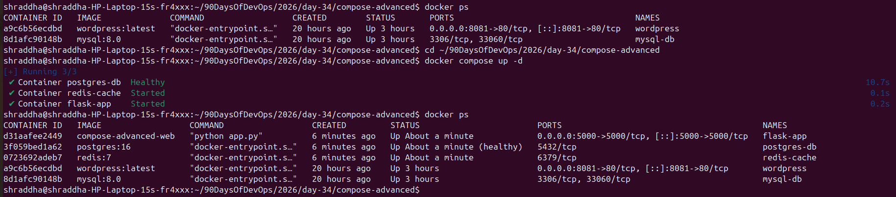

---

### Database Restarted

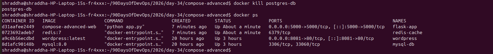

---

# Task 4 – Custom Dockerfiles

## Objective

Build the application using a custom Dockerfile instead of a pre-built image.

---

## Changes Made

Modified the Flask application response.

Rebuilt the application.

---

## Commands Used

```bash
docker compose up --build -d
```

---

## Result

Docker rebuilt the application image and deployed the updated application successfully.

---

## Screenshots

### Rebuild Output

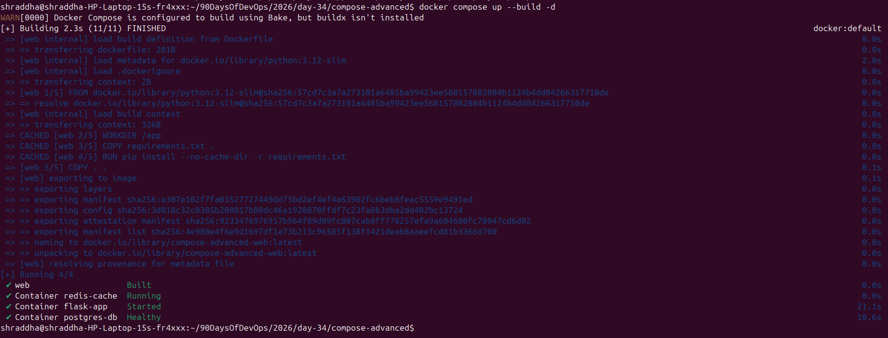

---

### Updated Application

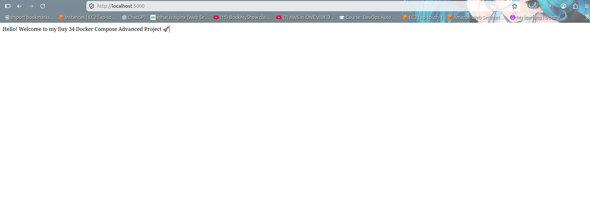

---

# Task 5 – Named Networks, Volumes & Labels

## Objective

Create production-style networking and storage.

---

## Named Network

```yaml
networks:
  app-network:
```

Verified with

```bash
docker network inspect compose-advanced_app-network
```

---

## Named Volume

```yaml
volumes:
  postgres-data:
```

Verified with

```bash
docker volume inspect compose-advanced_postgres-data
```

---

## Service Labels

Added labels for service organization.

```yaml
labels:
  project: day34
  service: web
```

Verified using

```bash
docker inspect flask-app | grep project
docker inspect flask-app | grep service
```

---

## Screenshots

### Network

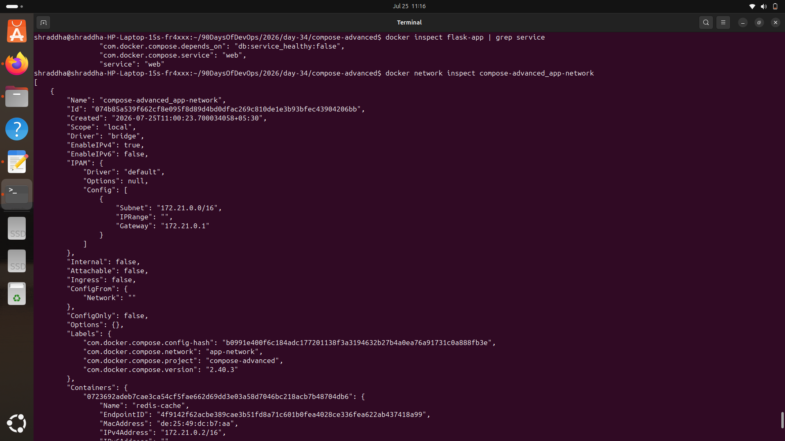

---

### Volume

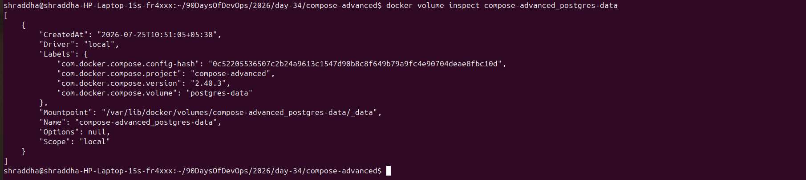

---

### Labels

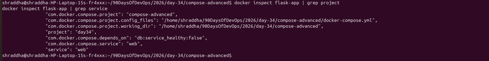

---

# Task 6 – Scaling (Bonus)

## Objective

Scale the Flask application using Docker Compose.

---

## Command Used

```bash
docker compose up -d --build --scale web=3
```

---

## Observation

Docker successfully attempted to create multiple Flask containers.

However, scaling failed because all replicas attempted to bind to the same host port.

---

## Error

```
Bind for 0.0.0.0:5000 failed:
port is already allocated
```

---

## Why did this happen?

Each Flask replica attempted to expose:

```
5000:5000
```

Only one container can bind to a host port.

---

## Real-World Solution

In production:

- Containers are not exposed individually.
- A Load Balancer (Nginx, HAProxy, Traefik, etc.) receives requests.
- Traffic is distributed among multiple application containers.

---

## Screenshot

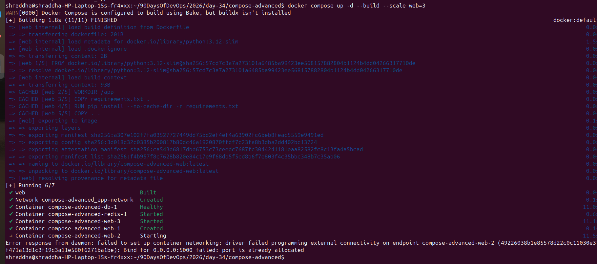

---

# Key Docker Compose Concepts Learned

- Multi-container applications
- Custom Dockerfiles
- Build context
- depends_on
- Healthchecks
- Restart Policies
- Named Volumes
- Named Networks
- Labels
- Docker Compose Build
- Docker Compose Scaling
- Production Architecture

---

# Commands Summary

```bash
docker compose up

docker compose up -d

docker compose up --build

docker compose up --build -d

docker compose up --scale web=3

docker compose down

docker compose ps

docker compose logs

docker compose restart

docker network inspect compose-advanced_app-network

docker volume inspect compose-advanced_postgres-data

docker inspect flask-app

docker kill postgres-db

docker ps
```

---

# Outcome

Successfully built and managed a production-style Docker Compose application consisting of:

- Flask Web Application
- PostgreSQL Database
- Redis Cache

Implemented production-ready Docker Compose features including:

- Multi-container deployment
- Custom Dockerfiles
- Health checks
- Service dependencies
- Restart policies
- Named networks
- Named volumes
- Labels
- Scaling concepts

This project provides a strong foundation for deploying real-world containerized applications using Docker Compose.
