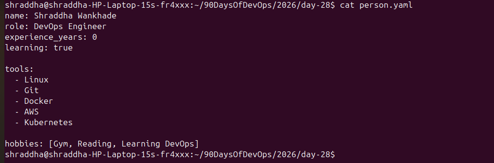
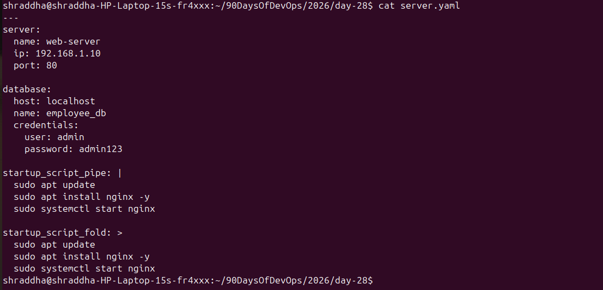
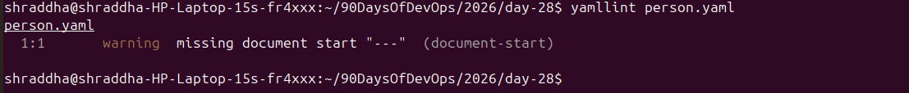
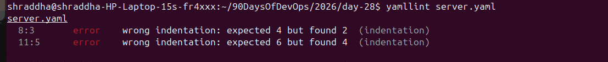

# Day 38 – YAML Basics

## 📌 Objective

Before writing CI/CD pipelines, it is important to understand YAML because it is used by many DevOps tools such as GitHub Actions, Kubernetes, Docker Compose, Ansible, and GitLab CI/CD.

### Goals

- Learn YAML syntax and rules
- Create YAML files manually
- Understand lists and nested objects
- Learn multi-line strings
- Validate YAML files using `yamllint`

---

# What is YAML?

**YAML** stands for **YAML Ain't Markup Language**.

It is a human-readable data serialization language used for configuration files.

## Where is YAML Used?

- GitHub Actions
- Kubernetes
- Docker Compose
- Ansible
- GitLab CI/CD
- Azure Pipelines

---

# Task 1 – Key-Value Pairs

## Created `person.yaml`

```yaml
---
name: Shraddha Wankhade
role: DevOps Engineer
experience_years: 0
learning: true
```

## Command

```bash
cat person.yaml
```

## Screenshot



---

# Task 2 – Lists

Added two different types of YAML lists.

## Block Style List

```yaml
tools:
  - Linux
  - Git
  - Docker
  - AWS
  - Kubernetes
```

## Inline Style List

```yaml
hobbies: [Gym, Reading, Learning DevOps]
```

### Two Ways to Write Lists in YAML

1. Block Style
2. Inline Style

---

# Task 3 – Nested Objects

Created `server.yaml`.

```yaml
---
server:
  name: web-server
  ip: 192.168.1.10
  port: 80

database:
  host: localhost
  name: employee_db
  credentials:
    user: admin
    password: admin123
```

## Command

```bash
cat server.yaml
```

## Screenshot



---

# Task 4 – Multi-line Strings

## Literal Block (`|`)

```yaml
startup_script_pipe: |
  sudo apt update
  sudo apt install nginx -y
  sudo systemctl start nginx
```

Preserves line breaks exactly as written.

## Folded Block (`>`)

```yaml
startup_script_fold: >
  sudo apt update
  sudo apt install nginx -y
  sudo systemctl start nginx
```

Converts multiple lines into a single line.

### When to Use

| Symbol | Purpose |
|---------|---------|
| `|` | Preserve line breaks (shell scripts, certificates, configs) |
| `>` | Fold long text into one line (descriptions, messages) |

---

# Task 5 – Validate YAML

## Install yamllint

```bash
sudo apt update
sudo apt install yamllint -y
```

## Check Version

```bash
yamllint --version
```

### Screenshot


---

## Validate Files

```bash
yamllint person.yaml
yamllint server.yaml
```

### Screenshots

**Person YAML Validation**



**Server YAML Validation**



---

## Intentional Indentation Error

I intentionally changed the indentation in `server.yaml` to understand how YAML validation works.

Example of incorrect indentation:

```yaml
server:
    name: web-server
  ip: 192.168.1.10
```

`yamllint` reported indentation errors.

### Error Screenshot


After correcting the indentation, I validated the file again successfully.

### Success Screenshot


---

# Task 6 – Spot the Difference

## Correct YAML

```yaml
name: devops
tools:
  - docker
  - kubernetes
```

## Incorrect YAML

```yaml
name: devops
tools:
- docker
  - kubernetes
```

### What is Wrong?

The second example has inconsistent indentation.

Although some YAML parsers may accept it, it does not follow standard YAML formatting and may generate linting warnings.

Always keep list items consistently indented under their parent key.

---

# Key Learnings

- YAML uses **spaces**, never tabs.
- Indentation defines the structure of the data.
- YAML supports block lists, inline lists, nested objects, and multi-line strings.
- `|` preserves line breaks, while `>` folds lines into a single paragraph.
- `yamllint` helps detect formatting and indentation issues before using YAML in production.

---

# Interview Questions

### 1. What is YAML?

YAML is a human-readable data serialization language commonly used for configuration files and automation.

---

### 2. Why is YAML important in DevOps?

It is used to define infrastructure, CI/CD pipelines, container configurations, and Kubernetes resources.

---

### 3. Difference between `|` and `>` in YAML?

- `|` preserves line breaks.
- `>` folds multiple lines into a single line.

---

### 4. Can YAML use tabs?

No. YAML requires spaces for indentation. Tabs can cause parsing or linting errors.

---

### 5. Which tool did you use to validate YAML?

`yamllint`

---

# Files Created

- person.yaml
- server.yaml
- day-38-yaml.md

---

# Conclusion

Today I learned the fundamentals of YAML, including key-value pairs, lists, nested objects, multi-line strings, and validation using `yamllint`. These concepts are essential for working with GitHub Actions, Docker Compose, Kubernetes, Ansible, and other DevOps tools.
