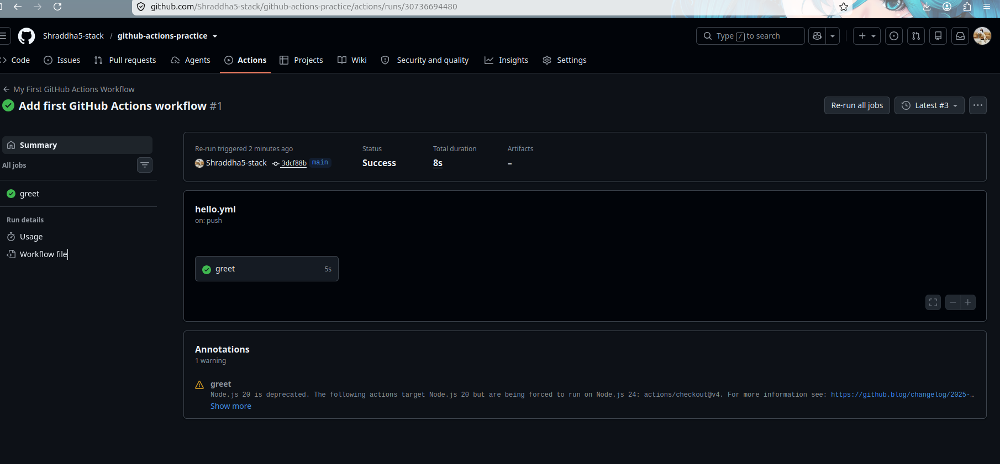
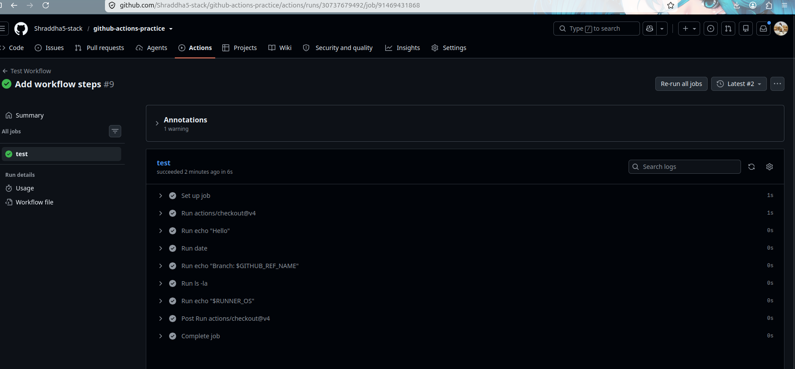
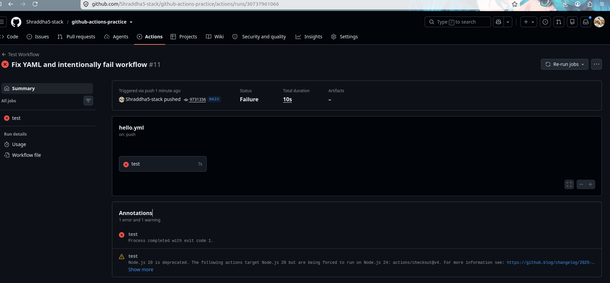
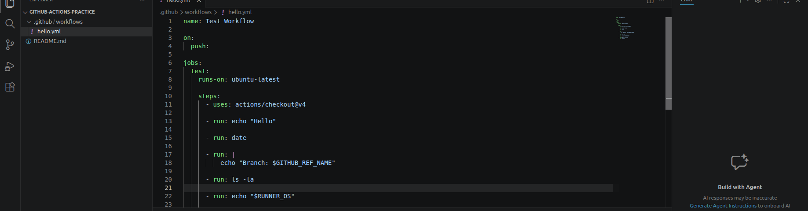

# Day 40 – Your First GitHub Actions Workflow

## Objective

Today I created my first GitHub Actions workflow and learned how Continuous Integration (CI) works in practice.

I created a workflow that automatically runs whenever code is pushed to the repository. I also learned how to intentionally fail a pipeline, analyze the error, and fix it.

---

# Repository

Repository Name: **github-actions-practice**

---

# Project Structure

```text
github-actions-practice/
├── .github/
│   └── workflows/
│       └── hello.yml
└── README.md
```

---

# GitHub Actions Workflow

```yaml
name: Test Workflow

on:
  push:

jobs:
  test:
    runs-on: ubuntu-latest

    steps:
      - uses: actions/checkout@v4

      - run: echo "Hello"

      - run: date

      - run: |
          echo "Branch: $GITHUB_REF_NAME"

      - run: ls -la

      - run: echo "$RUNNER_OS"
```

---

# Workflow Output

The workflow performs the following tasks:

- Checks out the repository.
- Prints a Hello message.
- Displays the current date and time.
- Displays the branch name.
- Lists all repository files.
- Prints the runner operating system.

---

# Understanding GitHub Actions Keywords

## `on:`

Defines when the workflow should run.

Example:

```yaml
on:
  push:
```

This workflow starts automatically whenever code is pushed to the repository.

---

## `jobs:`

A workflow contains one or more jobs.

Each job runs independently on a GitHub-hosted runner.

---

## `runs-on:`

Specifies the operating system used by the GitHub runner.

```yaml
runs-on: ubuntu-latest
```

This workflow runs on the latest Ubuntu virtual machine.

---

## `steps:`

A job consists of multiple steps.

Each step executes one task in sequence.

---

## `uses:`

Uses an existing GitHub Action.

Example:

```yaml
uses: actions/checkout@v4
```

This downloads the repository code onto the GitHub runner.

---

## `run:`

Executes shell commands on the runner.

Example:

```yaml
run: date
```

---

## `name:`

Provides a readable name for the workflow or an individual step.

This makes the Actions page easier to understand.

---

# Intentional Pipeline Failure

To understand how pipeline failures work, I intentionally added:

```yaml
- name: Fail Pipeline
  run: exit 1
```

This caused the workflow to fail with the following error:

```
Process completed with exit code 1.
```

After observing the error logs, I removed the failing step and pushed the changes again.

The workflow completed successfully.

---

# What I Learned

- Created my first GitHub Actions workflow.
- Understood the workflow file structure.
- Learned how GitHub-hosted runners work.
- Used built-in GitHub environment variables.
- Executed Linux commands inside GitHub Actions.
- Learned how to debug failed workflows.
- Fixed a failed pipeline successfully.

---

# Screenshots

## 1. Successful Workflow



---

## 2. Successful Job Details



---

## 3. Failed Pipeline



---

## 4. Workflow File



---

# Conclusion

This was my first hands-on experience with GitHub Actions.

I learned how to automate tasks using workflows, understand workflow execution, read logs, troubleshoot pipeline failures, and successfully fix them.

This marks my first practical step into the world of CI/CD
