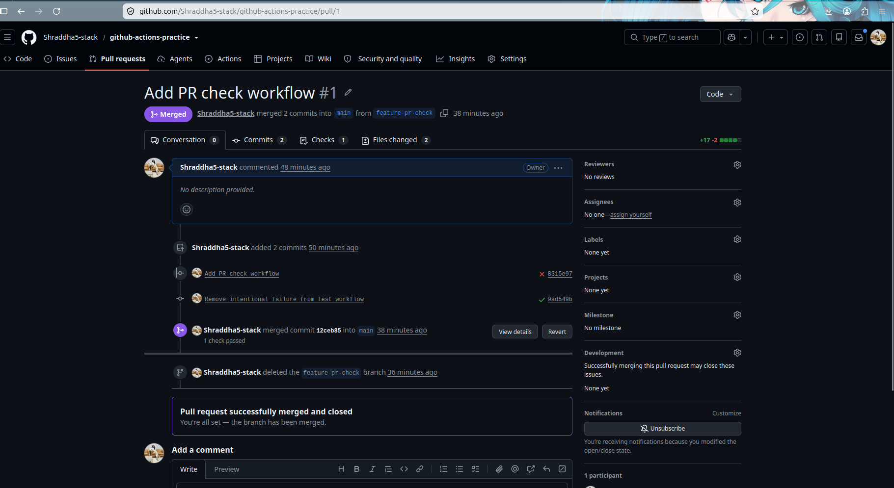
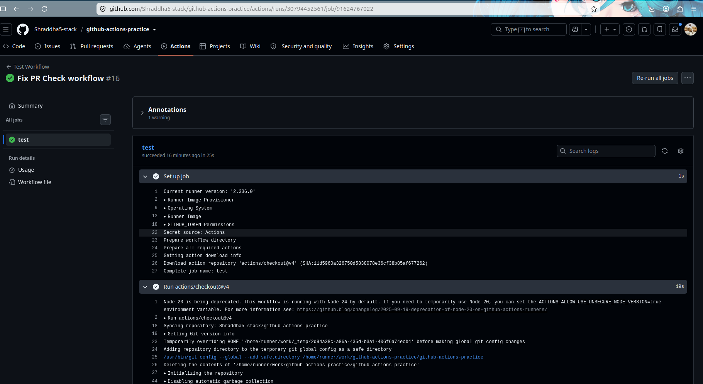
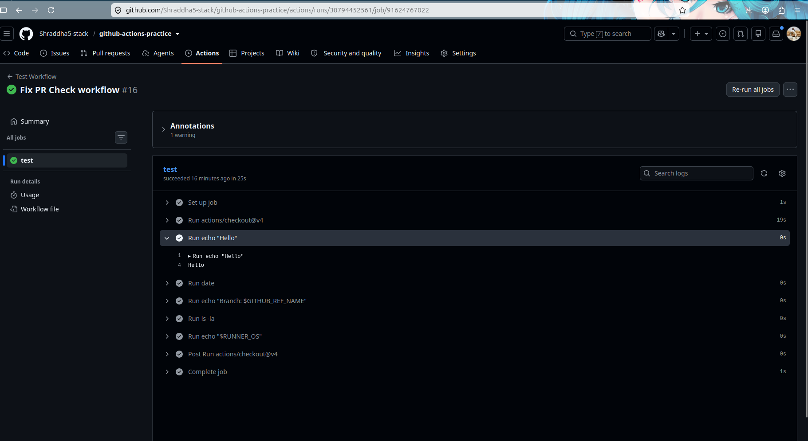
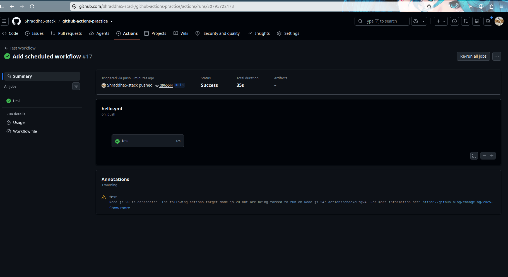
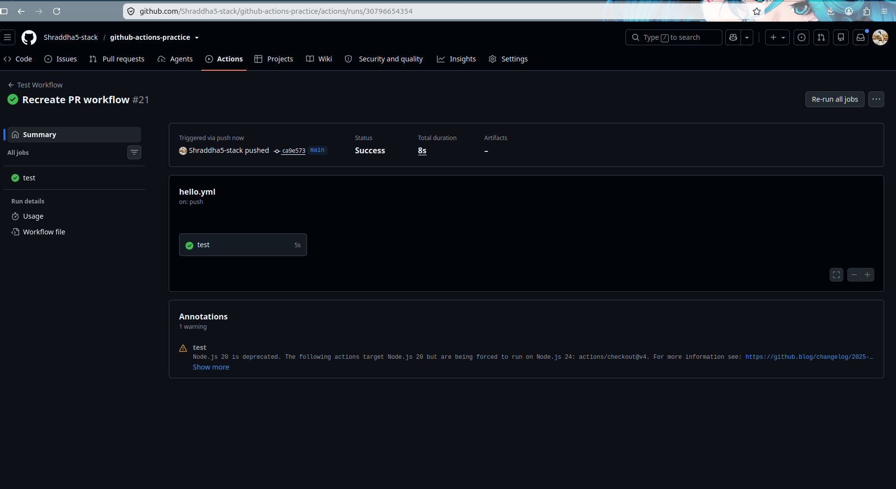
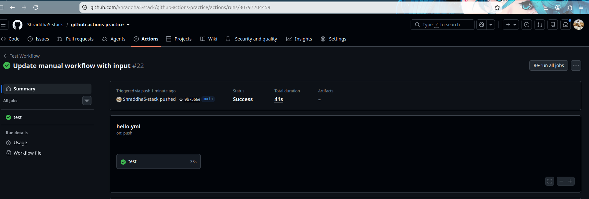
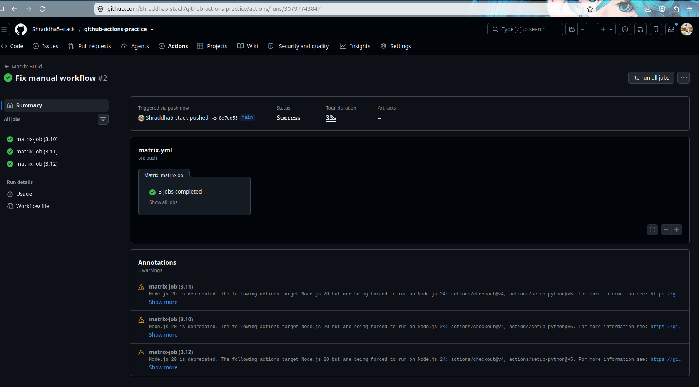
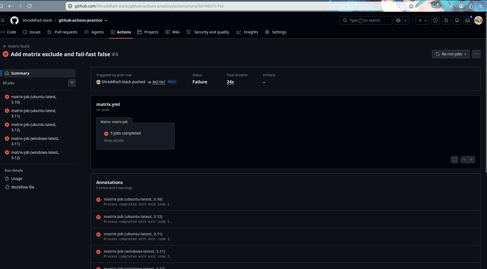
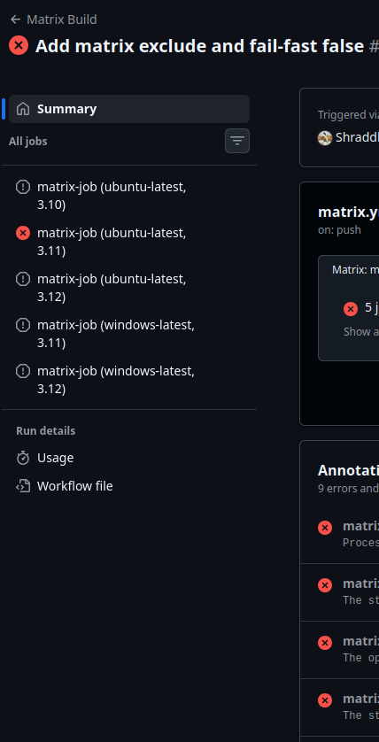

# Day 41 – Triggers & Matrix Builds

## Objectives

- Pull Request Trigger
- Scheduled Trigger
- Manual Trigger
- Matrix Builds
- Exclude Matrix Combination
- Fail-Fast Behavior

# Task 1 – Pull Request Trigger

## Workflow

Created `pr-check.yml`

The workflow runs when a Pull Request is opened or updated against the main branch.

Screenshot:

Additional PR workflow fixes:

---

# Task 2 – Scheduled Trigger

## Workflow

Created `schedule.yml`

Cron Expression:

0 0 * * *

Meaning:

- Minute = 0
- Hour = 0
- Day = Every day
- Month = Every month
- Weekday = Every day

Runs every day at midnight UTC.

Every Monday at 9 AM UTC:

0 9 * * 1

Screenshot:

---

# Task 3 – Manual Trigger

## Workflow

Created `manual.yml`

Used `workflow_dispatch` to manually trigger the workflow.

Inputs:

- staging
- production

Screenshots:

---

# Task 4 – Matrix Builds

## Initial Matrix

Python versions:

- 3.10
- 3.11
- 3.12

Total jobs:

3 jobs

## Extended Matrix

Operating Systems:

- ubuntu-latest
- windows-latest

Python versions:

- 3.10
- 3.11
- 3.12

Calculation:

2 OS × 3 Python versions = 6 jobs

Screenshot:

---

# Task 5 – Exclude & Fail-Fast

## Excluded Combination

Excluded:

windows-latest + Python 3.10

Before exclusion:

2 OS × 3 Python versions = 6 jobs

After exclusion:

6 - 1 = 5 jobs

---

# Fail-Fast Comparison

| Setting | Behavior |
|---|---|
| fail-fast: true | Default behavior. If one matrix job fails, remaining matrix jobs are cancelled. |
| fail-fast: false | Failed job does not stop other matrix jobs. Remaining jobs continue running. |

Screenshots:

## fail-fast: false

## fail-fast: true

---

# What I Learned

- Different GitHub Actions triggers.
- Pull request automation.
- Scheduled workflows using cron expressions.
- Manual workflow execution using workflow_dispatch.
- Matrix builds for multiple environments.
- Excluding specific matrix combinations.
- Difference between fail-fast true and fail-fast false.

