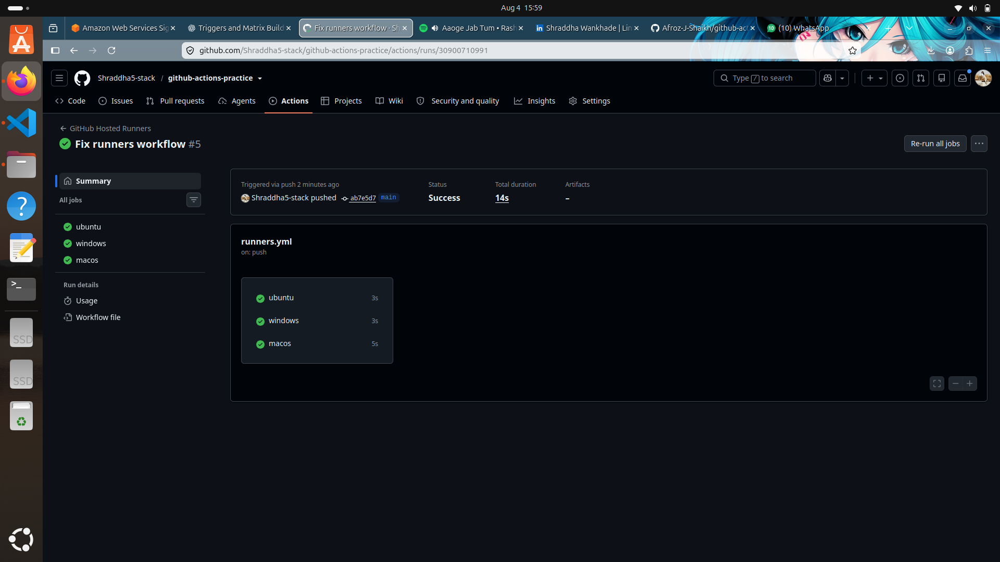
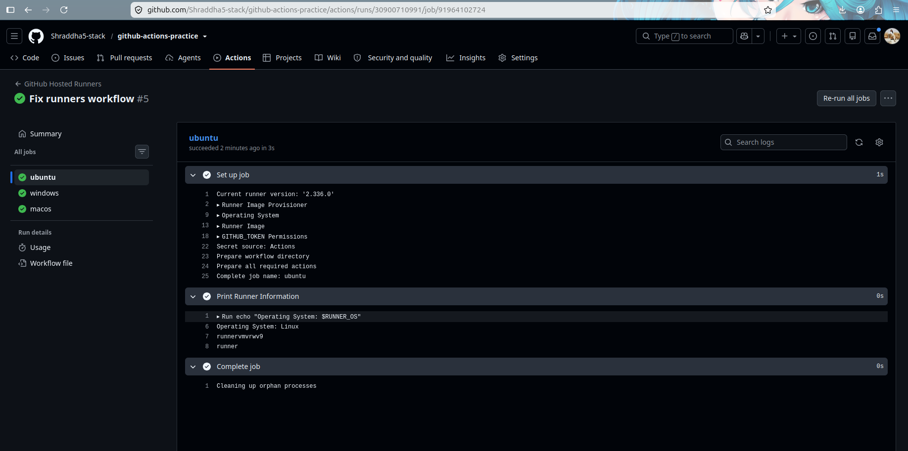
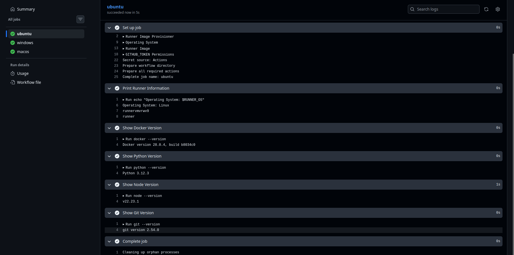
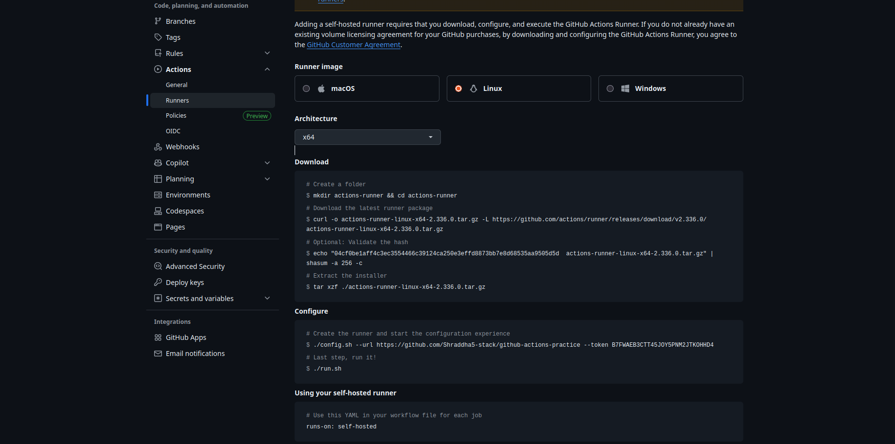
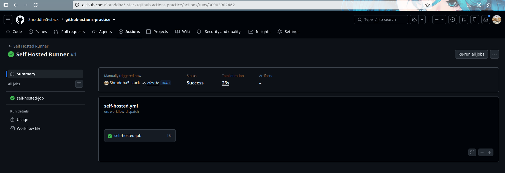
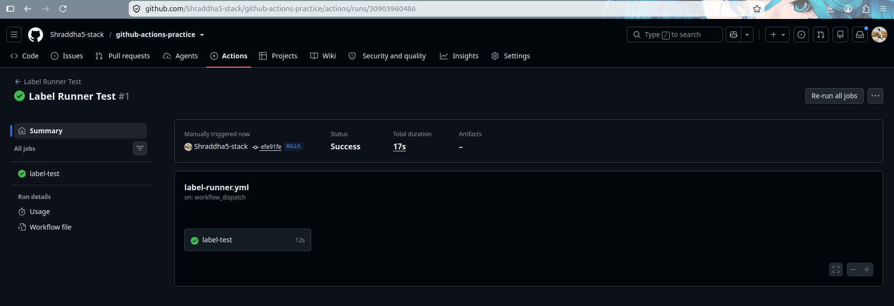

# Day 42 – Runners: GitHub-Hosted & Self-Hosted

## Overview

GitHub Actions workflows need a machine to execute jobs. These machines are called **runners**.

A runner executes workflow steps, runs commands, and completes CI/CD tasks.

---

# Task 1: GitHub-Hosted Runners

## What is a GitHub-hosted runner?

A GitHub-hosted runner is a virtual machine provided and managed by GitHub to run GitHub Actions workflows.

GitHub creates a fresh runner machine for every job and removes it after the job completes.

## Who manages it?

GitHub manages:

- Infrastructure
- Operating system updates
- Security patches
- Pre-installed software

## Practical Implementation

Created a workflow with three jobs:

- Ubuntu (`ubuntu-latest`)
- Windows (`windows-latest`)
- macOS (`macos-latest`)

Each job printed:

- Operating system
- Hostname
- Current user

Screenshot:



---

# Task 2: Explore Pre-installed Software

GitHub-hosted Ubuntu runners come with many tools already installed.

Checked versions of:

- Docker
- Python
- Node.js
- Git

Screenshots:





## Why do pre-installed tools matter?

Pre-installed tools help developers run CI/CD pipelines quickly without manually installing dependencies.

Benefits:

- Faster workflow execution
- Consistent build environment
- Less configuration effort

---

# Task 3: Set Up a Self-Hosted Runner

## What is a Self-Hosted Runner?

A self-hosted runner is a machine managed by the user or organization to execute GitHub Actions jobs.

I configured a self-hosted runner on my local Linux machine.

## Runner Details

```
Machine:
shraddha-HP-Laptop-15s-fr4xxx

Operating System:
Linux

Architecture:
x64

Labels:
self-hosted
Linux
X64
my-linux-runner
```

Screenshot:



---

# Task 4: Use Your Self-Hosted Runner

Created workflow:

```
.github/workflows/self-hosted.yml
```

Configured:

```yaml
runs-on: self-hosted
```

Workflow steps:

- Printed hostname of my machine
- Printed working directory
- Created a file
- Verified the file exists

The workflow successfully executed on my own hardware.

Screenshot:



---

# Task 5: Runner Labels

Added a custom label:

```
my-linux-runner
```

Updated workflow:

```yaml
runs-on: [self-hosted, my-linux-runner]
```

The workflow successfully selected my labeled runner.

Screenshot:



## Why are labels useful?

Labels help select specific self-hosted runners when multiple runners are available.

Examples:

- Linux runner
- Windows runner
- GPU runner
- Production server runner

---

# Task 6: GitHub-Hosted vs Self-Hosted Runners

| Feature | GitHub-Hosted | Self-Hosted |
|---|---|---|
| Who manages it? | GitHub manages the infrastructure | User/organization manages the machine |
| Cost | Uses GitHub Actions minutes (free limits apply) | User manages infrastructure cost |
| Pre-installed tools | Many tools are already available | User installs required tools |
| Good for | General CI/CD builds and testing | Custom environments and private systems |
| Security concern | Less control over the environment | User is responsible for security and maintenance |

---

# Self-Hosted Runner Job Execution

Runner terminal output:

```
Listening for Jobs

Running job: self-hosted-job
Job self-hosted-job completed with result: Succeeded

Running job: label-test
Job label-test completed with result: Succeeded
```

---

# Conclusion

In this task, I learned:

✅ GitHub-hosted runners  
✅ Pre-installed software on runners  
✅ Self-hosted runner setup  
✅ Running workflows on my own machine  
✅ Using custom runner labels  

Self-hosted runners provide more control over the CI/CD environment and are useful for real-world DevOps projects.	
