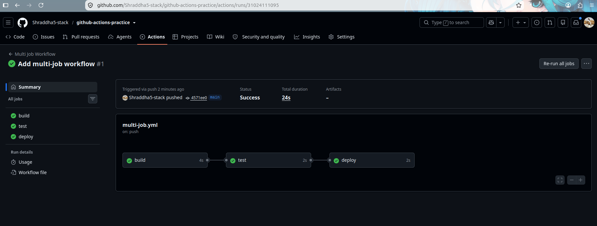
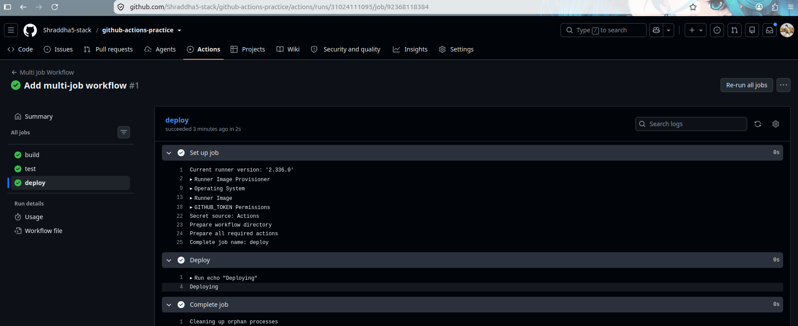
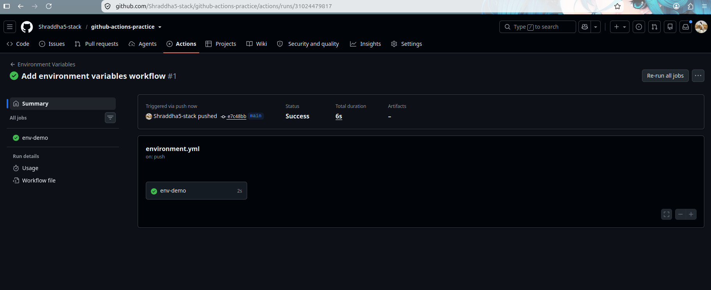
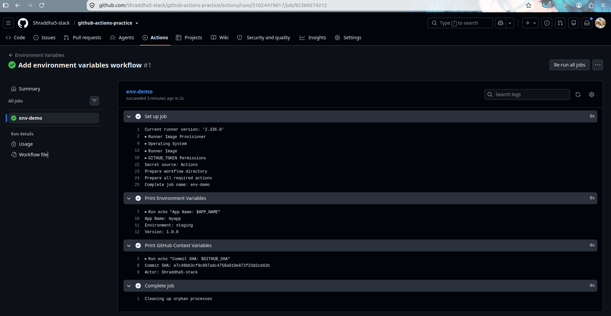
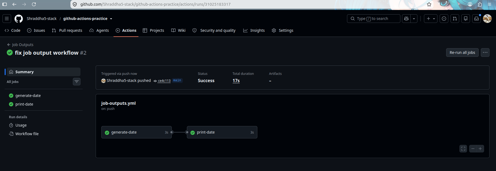
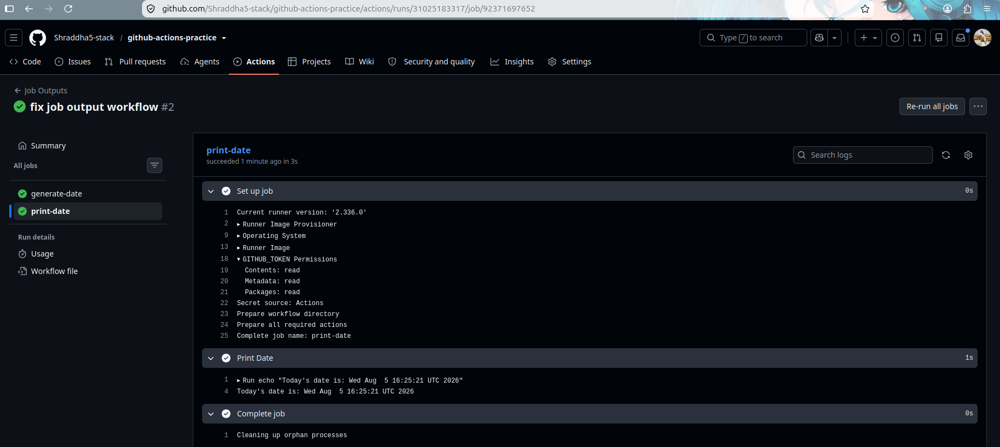
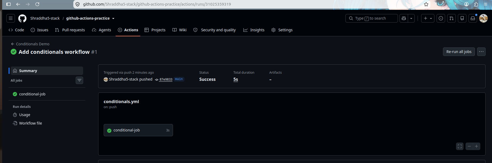
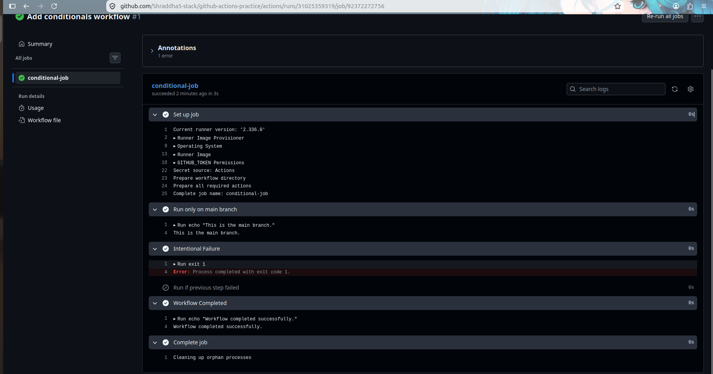

# Day 43 – Jobs, Steps, Environment Variables & Conditionals

## Objective

Learn how to control GitHub Actions workflows using:

- Multi-job workflows
- Job dependencies
- Environment variables
- Job outputs
- Conditional execution
- Smart pipelines

---

# Task 1 – Multi-Job Workflow

## Workflow

Created a workflow with three dependent jobs:

- Build
- Test
- Deploy

The `needs` keyword was used so that:

- Test runs only after Build succeeds.
- Deploy runs only after Test succeeds.

## Screenshots





---

# Task 2 – Environment Variables

Used environment variables at three different levels.

| Level | Variable | Value |
|-------|----------|-------|
| Workflow | APP_NAME | myapp |
| Job | ENVIRONMENT | staging |
| Step | VERSION | 1.0.0 |

Also printed GitHub context variables:

- Commit SHA
- GitHub Actor

## Screenshot



---

# Task 3 – Job Outputs

Created two jobs.

### generate-date

Generated today's date using:

```bash
echo "today=$(date)" >> $GITHUB_OUTPUT
```

### print-date

Received the output using:

```yaml
needs.generate-date.outputs.today
```

## Why use Job Outputs?

Job outputs allow one job to pass data to another job without recalculating the same information.

## Screenshots





---

# Task 4 – Conditionals

Practiced:

- Running steps only on the main branch.
- Using `continue-on-error: true`.
- Running steps based on conditions.

## What does continue-on-error do?

It allows a workflow to continue running even if a step fails.

## Screenshot



---

# Task 5 – Smart Pipeline

Created a smart pipeline containing:

- Lint Job
- Test Job
- Summary Job

The Summary job waits for both previous jobs using:

```yaml
needs: [lint, test]
```

It prints:

- Branch type
- Commit message

## Screenshots





---

# Key Concepts Learned

## needs

Creates dependencies between jobs so they execute in order.

## outputs

Allows one job to share data with another job.

## Environment Variables

Can be defined at:

- Workflow level
- Job level
- Step level

## Conditionals

Useful expressions include:

- `if: github.ref == 'refs/heads/main'`
- `if: failure()`
- `if: github.event_name == 'push'`

---

# Outcome

Successfully implemented:

- Multi-job workflows
- Environment variables
- Job outputs
- Conditional execution
- Smart CI pipeline

These concepts help build efficient, maintainable, and scalable GitHub Actions workflows.
