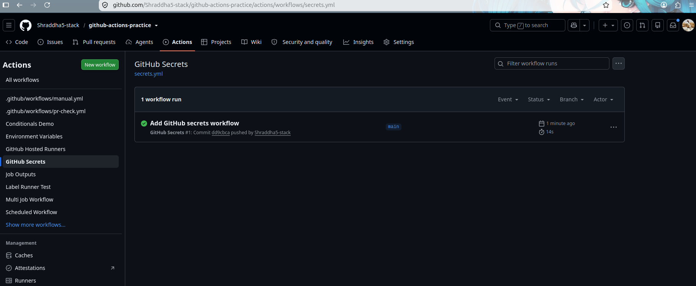
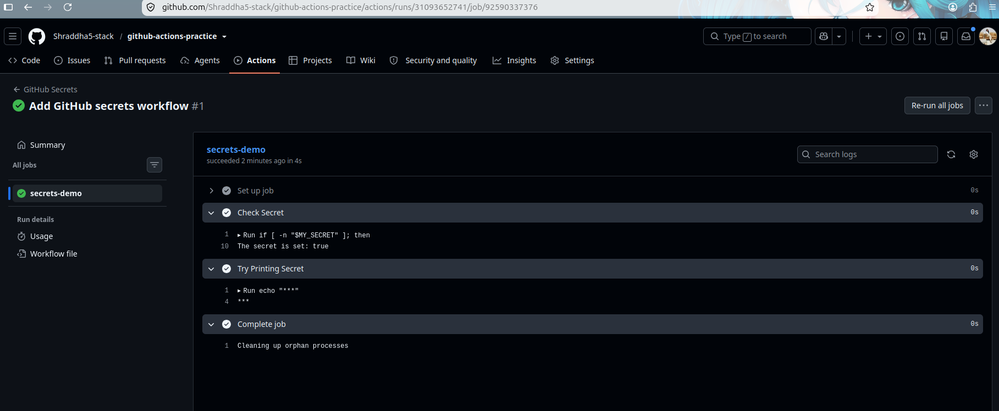
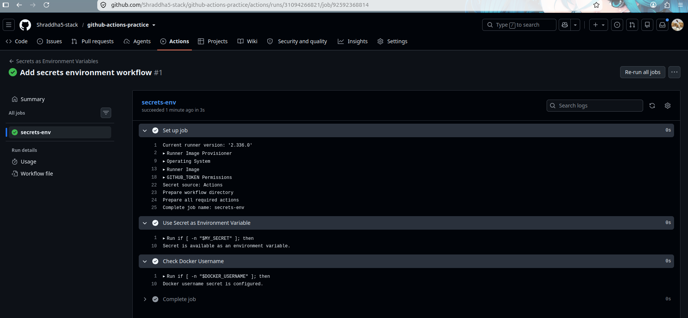
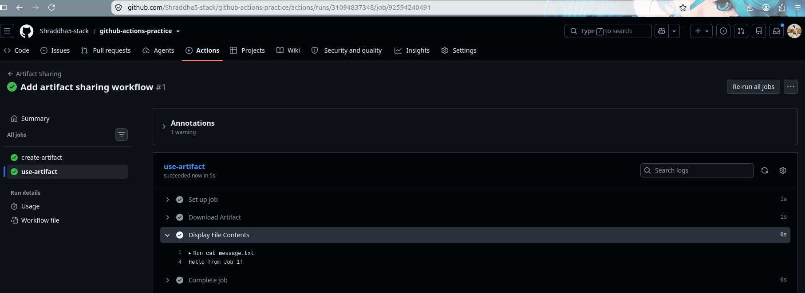
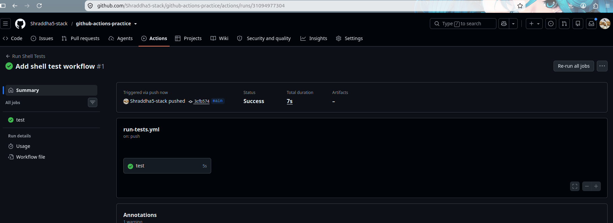
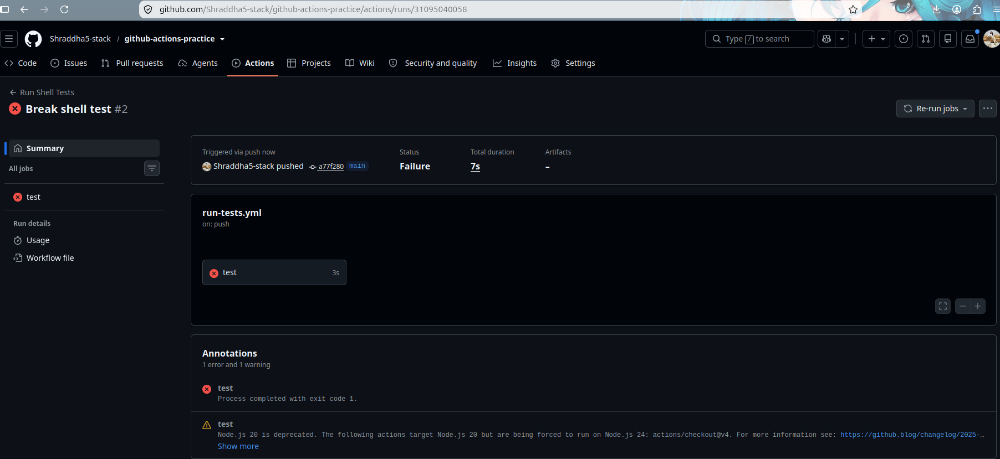
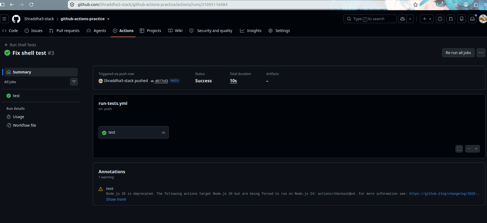

# Day 44 – Secrets, Artifacts & Running Real Tests in CI

## Objective

Today I learned how to securely manage sensitive information in GitHub Actions using Secrets, share files between jobs using Artifacts, execute real tests in CI, and improve workflow performance with Dependency Caching.

---

# Task 1 – GitHub Secrets

Created a repository secret named:

- `MY_SECRET_MESSAGE`

Verified that the workflow could detect the secret without exposing its actual value.

GitHub automatically masks secret values in workflow logs to protect sensitive information.

## Why should you never print secrets in CI logs?

Secrets often contain passwords, API keys, or access tokens. Printing them in workflow logs can expose sensitive information and compromise security. GitHub automatically masks secret values to prevent accidental disclosure.

## Screenshots

---

# Task 2 – Using Secrets as Environment Variables

Used repository secrets as environment variables inside a workflow.

Configured:

- `MY_SECRET_MESSAGE`
- `DOCKER_USERNAME`
- `DOCKER_TOKEN`

This allows workflows to securely access sensitive values without hardcoding them into the workflow file.

## Screenshot

---

# Task 3 – Upload Artifacts

Created a report file during the workflow and uploaded it using:

- `actions/upload-artifact@v4`

Successfully downloaded the artifact from the GitHub Actions page.

## What are Artifacts?

Artifacts are files generated during a workflow that can be stored and downloaded later.

Examples:

- Test reports
- Build outputs
- Log files
- Deployment packages

## Screenshots

---

# Task 4 – Download Artifacts Between Jobs

Created two jobs:

- **create-artifact**
- **use-artifact**

The first job generated and uploaded a file.

The second job downloaded the artifact and displayed its contents.

## When would you use Artifacts in a real pipeline?

Artifacts are used to transfer files such as build outputs, reports, logs, and deployment packages between jobs in the same workflow.

## Screenshot

---

# Task 5 – Run Real Tests in CI

Created a shell script and executed it through GitHub Actions.

Verified three scenarios:

- Successful execution
- Failed execution
- Successful execution after fixing the script

## Why run tests in CI?

Running tests automatically helps detect issues early, improves code quality, and prevents broken code from moving through the CI/CD pipeline.

## Screenshots

---

# Task 6 – Dependency Caching

Implemented dependency caching using:

- `actions/cache@v4`

Cached Python dependencies to speed up future workflow runs.

## What is being cached?

The workflow caches the local pip package cache (`~/.cache/pip`) so dependencies do not need to be downloaded repeatedly.

## Where is the cache stored?

The cache is stored by GitHub Actions and is associated with the repository and cache key.

## Screenshot

---

# Key Learnings

- GitHub Secrets securely store sensitive information.
- Environment variables simplify configuration management.
- Artifacts enable file sharing between workflow jobs.
- CI automatically validates code by running tests.
- Dependency caching reduces workflow execution time by avoiding repeated downloads.

---

# Outcome

Successfully completed Day 44 by implementing:

- GitHub Secrets
- Environment Variables
- Artifact Upload
- Artifact Download
- Running Real Tests in CI
- Dependency Caching

These concepts are fundamental for building secure, efficient, and production-ready CI/CD pipelines using GitHub Actions.
