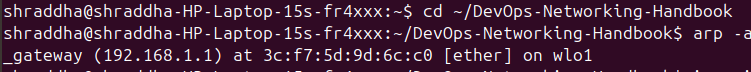
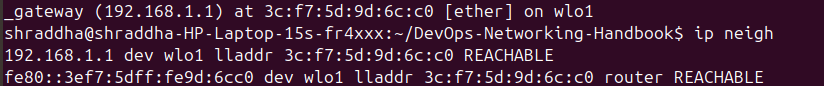
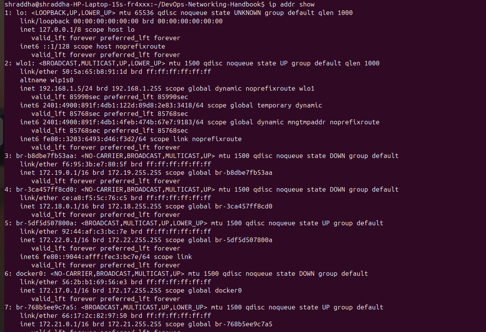
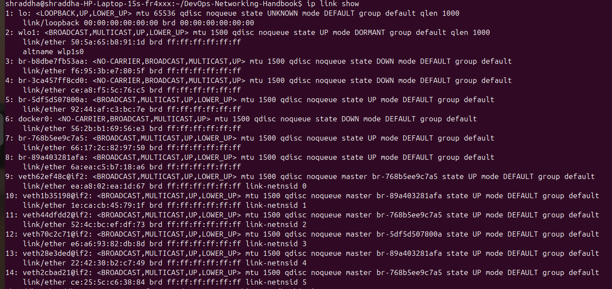
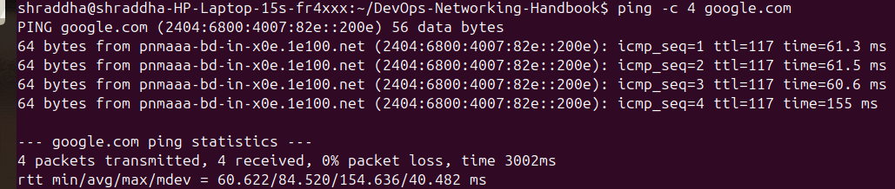
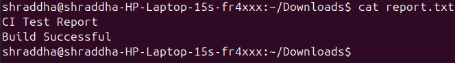
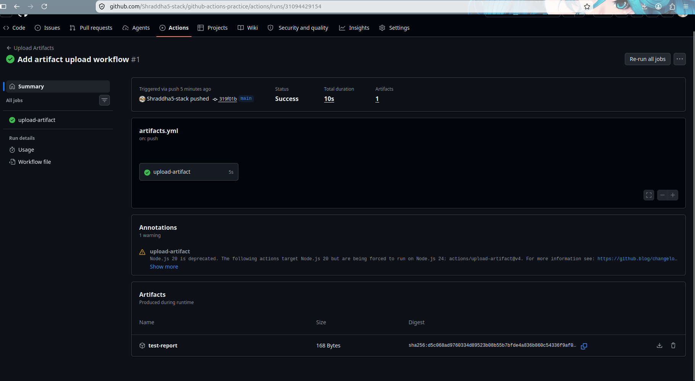
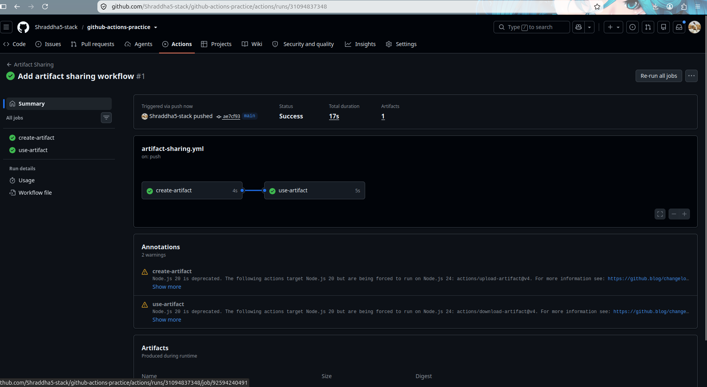
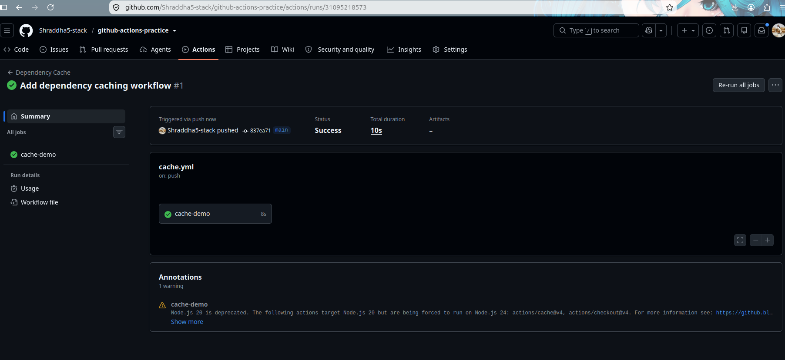

# Day 44 – Secrets, Artifacts & Running Real Tests in CI

## Objective

Learned how to securely manage sensitive information, share files between jobs, run real tests in GitHub Actions, and optimize workflows using dependency caching.

---

# Task 1 – GitHub Secrets

Created a repository secret named:

- `MY_SECRET_MESSAGE`

Verified that the workflow could detect the secret without exposing its value.

Also confirmed that GitHub automatically masks secret values in workflow logs.

## Why should you never print secrets in CI logs?

Secrets may contain passwords, API keys, tokens, or credentials. Printing them in workflow logs can expose sensitive information and create security risks. GitHub automatically masks secrets to help prevent accidental disclosure.

## Screenshots

---

# Task 2 – Using Secrets as Environment Variables

Used repository secrets as environment variables inside a workflow.

Configured:

- `MY_SECRET_MESSAGE`
- `DOCKER_USERNAME`
- `DOCKER_TOKEN`

This approach keeps sensitive information out of the workflow code.

---

# Task 3 – Upload Artifacts

Created a report file during the workflow and uploaded it using:

- `actions/upload-artifact@v4`

Successfully downloaded the artifact from the GitHub Actions page.

## What are artifacts?

Artifacts are files generated during a workflow that can be stored and downloaded later.

Examples include:

- Build outputs
- Test reports
- Log files
- Deployment packages

## Screenshots

---

# Task 4 – Download Artifacts Between Jobs

Created two jobs:

- **create-artifact**
- **use-artifact**

The first job uploaded a file.

The second job downloaded the artifact and displayed its contents.

## When would you use artifacts in a real pipeline?

Artifacts allow different jobs to share files such as build outputs, reports, logs, and deployment packages without recreating them.

## Screenshots

---

# Task 5 – Run Real Tests in CI

Created a shell script and executed it through GitHub Actions.

Verified three scenarios:

- Successful execution
- Failed execution
- Successful execution after fixing the script

This demonstrates how CI automatically validates code changes.

## Why run tests in CI?

Running tests automatically helps detect issues early, improves code quality, and prevents broken code from progressing through the pipeline.

## Screenshots

---

# Task 6 – Dependency Caching

Implemented dependency caching using:

- `actions/cache@v4`

Cached Python packages to reduce installation time in future workflow runs.

## What is being cached?

The workflow caches the local pip package cache (`~/.cache/pip`) to avoid downloading the same dependencies repeatedly.

## Where is the cache stored?

The cache is stored by GitHub Actions and is associated with the repository and cache key.

## Screenshots

---

# Key Learnings

- GitHub Secrets securely store sensitive information.
- Environment variables simplify configuration management.
- Artifacts allow files to be shared between workflow jobs.
- CI automatically validates code by running tests.
- Dependency caching improves workflow performance by reducing repeated downloads.

---

# Outcome

Successfully completed Day 44 by implementing:

- GitHub Secrets
- Environment Variables
- Artifact Upload
- Artifact Download
- Real CI Testing
- Dependency Caching

These concepts are essential for building secure, efficient, and production-ready CI/CD pipelines using GitHub Actions.
