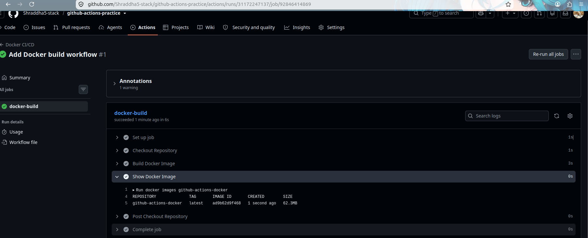
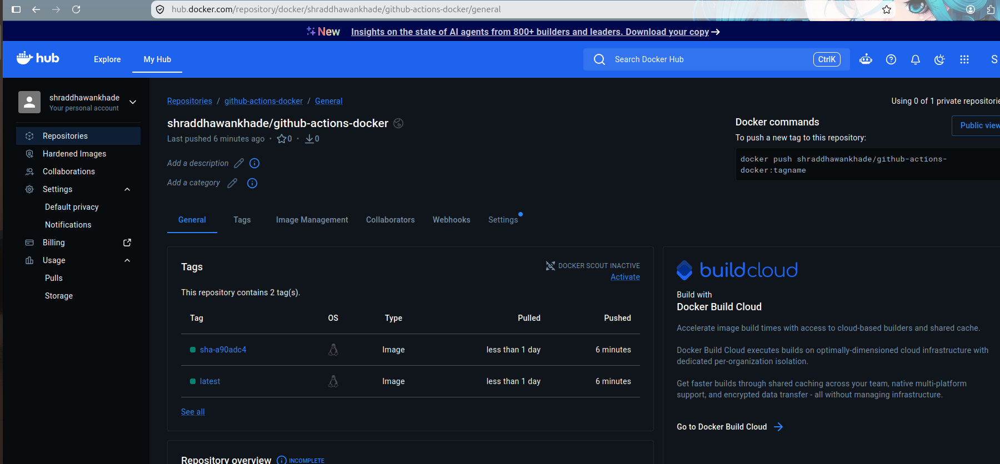
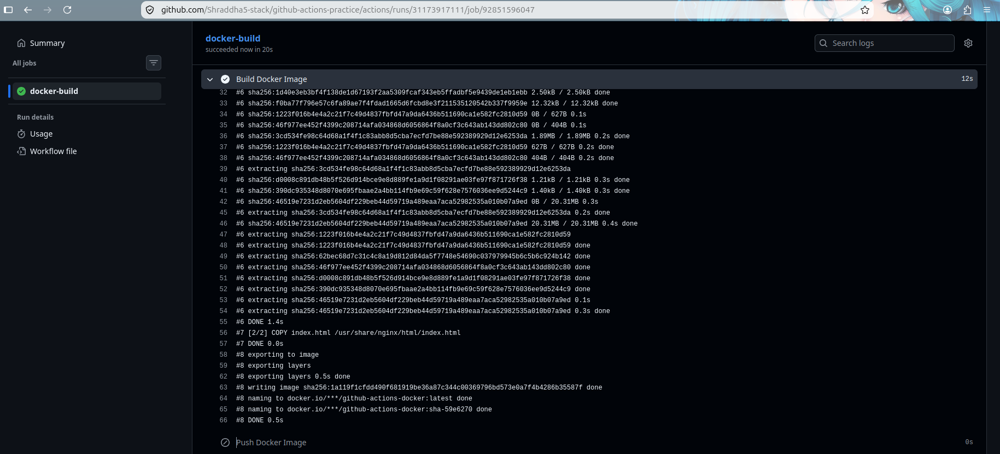

# Day 45 – Docker Build & Push in GitHub Actions    

## Task 1: Prepare
1. Use the app you Dockerized on Day 36 (or any simple Dockerfile)
2. Add the Dockerfile to your `github-actions-practice` repo (or create a minimal one)
3. Make sure `DOCKER_USERNAME` and `DOCKER_TOKEN` secrets are set from Day 44

**DONE**

---

## Task 2: Build the Docker Image in CI
Create `.github/workflows/docker-publish.yml` that:
1. Triggers on push to `main`
2. Checks out the code
3. Builds the Docker image and tags it

**Verify:** Check the build step logs — does the image build successfully?


---
## Task 3: Push to Docker Hub

Add steps to:

1. Log in to Docker Hub using GitHub Secrets.
2. Tag the image as:

```text
shraddhawankhade/github-actions-docker:latest
 Tag the image using the short commit hash:
shraddhawankhade/github-actions-docker:sha-<short-commit-hash>

**Verify:** Go to Docker Hub — the image is available with both tags. **YES** ✅



---

## Task 4: Only Push on Main

Add a condition so the push step only runs on the `main` branch — not on feature branches or PRs.

Tested it by pushing to a feature branch and verified that the image was built but not pushed.

- Main branch: Build **YES**, Push **YES**
- Feature branch: Build **YES**, Push **NO**



---

## Task 5: Add a Status Badge

1. Added the GitHub Actions status badge to the `README.md`.
2. The badge shows the current status of the Docker CI/CD workflow.
3. Pushed the changes to GitHub.

**Verify:** The status badge is showing **green**. **YES** ✅

```markdown
[](https://github.com/Shraddha5-stack/github-actions-practice/actions/workflows/docker-publish.yml)
