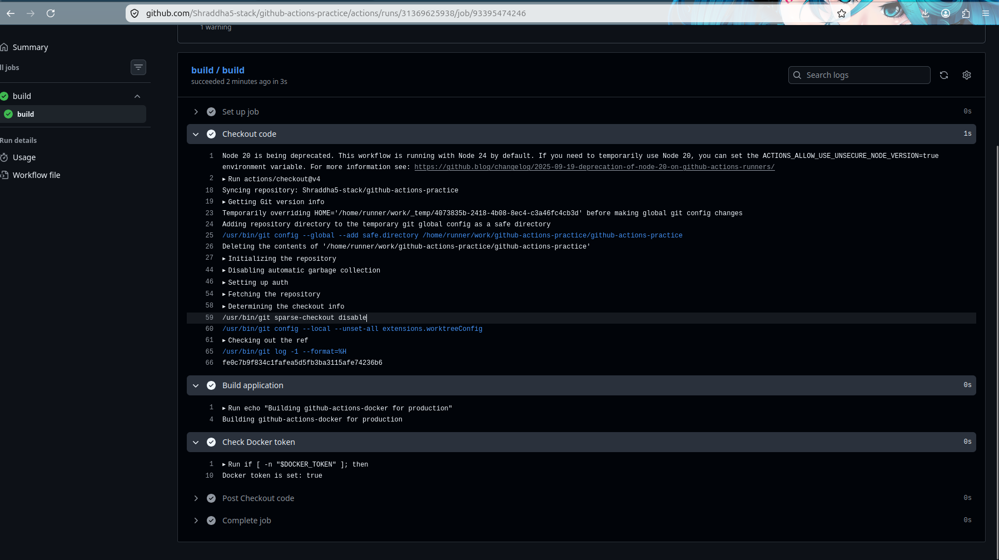
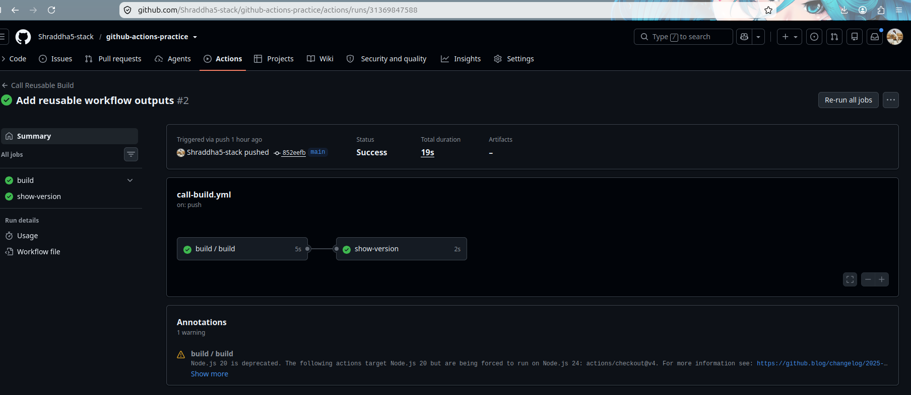
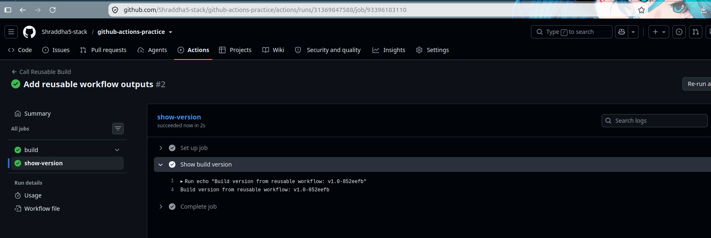
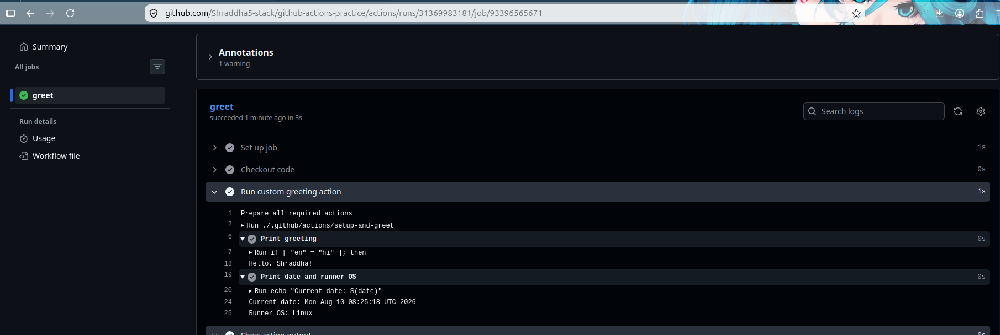

# Day 46 – Reusable Workflows & Composite Actions

---

## Task 1: Understand `workflow_call`

### 1. What is a reusable workflow?

A reusable workflow is a GitHub Actions workflow that we create once and reuse in other workflows.

Instead of writing the same CI/CD steps again and again, we can create one workflow and call it whenever we need it.

**Simple meaning:**

Create once → Reuse many times. ✅

---

### 2. What is the `workflow_call` trigger?

`workflow_call` allows one GitHub Actions workflow to call another workflow.

Example:

```yaml
on:
  workflow_call:
```

The workflow waits for another workflow to call it.

---

### 3. How is calling a reusable workflow different from using a regular action?

A reusable workflow is called at the **job level**:

```yaml
jobs:
  build:
    uses: ./.github/workflows/reusable-build.yml
```

A regular action is used inside a **step**:

```yaml
steps:
  - uses: actions/checkout@v4
```

---

### 4. Where must a reusable workflow file live?

A reusable workflow must be stored inside:

```text
.github/workflows/
```

Example:

```text
.github/workflows/reusable-build.yml
```


---

**Task 1 Completed** ✅

---

## Task 6: Reusable Workflow vs Composite Action

| Feature | Reusable Workflow | Composite Action |
|---|---|---|
| Triggered by | `workflow_call` | `uses:` in a step |
| Can contain jobs? | Yes | No |
| Can contain multiple steps? | Yes | Yes |
| Lives where? | `.github/workflows/` | `.github/actions/<action-name>/action.yml` |
| Can accept secrets directly? | Yes | Not directly |
| Best for | Reusing complete CI/CD workflows | Reusing a group of steps |

### Simple Difference

**Reusable Workflow:**

Used to reuse an entire workflow or multiple jobs.

**Composite Action:**

Used to reuse multiple steps inside a job.

---

**Day 46 Completed** ✅

---

## Reusable Workflow

File:

`.github/workflows/reusable-build.yml`

The reusable workflow accepts:

- `app_name`
- `environment`
- `docker_token`

It also generates a `build_version` output.

---

## Caller Workflow

File:

`.github/workflows/call-build.yml`

The caller workflow:

1. Calls the reusable workflow.
2. Passes the application name.
3. Passes the environment.
4. Passes the Docker token.
5. Reads the build version output.

---

## Composite Action

File:

`.github/actions/setup-and-greet/action.yml`

The custom composite action:

1. Accepts a name.
2. Accepts a language.
3. Prints a greeting.
4. Prints the current date.
5. Prints the runner OS.
6. Returns `greeted=true`.

---
# YAML Examples

## 1. Reusable Workflow

File:

`.github/workflows/reusable-build.yml`

```yaml
name: Reusable Build

on:
  workflow_call:
    inputs:
      app_name:
        description: "Application name"
        required: true
        type: string

      environment:
        description: "Deployment environment"
        required: true
        type: string
        default: staging

    secrets:
      docker_token:
        required: true

    outputs:
      build_version:
        description: "Generated build version"
        value: ${{ jobs.build.outputs.build_version }}

jobs:
  build:
    runs-on: ubuntu-latest

    outputs:
      build_version: ${{ steps.version.outputs.build_version }}

    steps:
      - name: Checkout code
        uses: actions/checkout@v4

      - name: Build application
        run: |
          echo "Building ${{ inputs.app_name }} for ${{ inputs.environment }}"

      - name: Check Docker token
        env:
          DOCKER_TOKEN: ${{ secrets.docker_token }}
        run: |
          if [ -n "$DOCKER_TOKEN" ]; then
            echo "Docker token is set: true"
          else
            echo "Docker token is set: false"
          fi

      - name: Generate build version
        id: version
        run: |
          SHORT_SHA=$(git rev-parse --short HEAD)
          VERSION="v1.0-${SHORT_SHA}"
          echo "build_version=$VERSION" >> "$GITHUB_OUTPUT"
          echo "Build version: $VERSION"


---

## 2. Caller Workflow

File:

`.github/workflows/call-build.yml`

```yaml
name: Call Reusable Build

on:
  push:
    branches:
      - main

jobs:
  build:
    uses: ./.github/workflows/reusable-build.yml
    with:
      app_name: "github-actions-docker"
      environment: "production"
    secrets:
      docker_token: ${{ secrets.DOCKER_TOKEN }}

  show-version:
    needs: build
    runs-on: ubuntu-latest

    steps:
      - name: Show build version
        run: |
          echo "Build version from reusable workflow: ${{ needs.build.outputs.build_version }}"
```


---

## 3. Composite Action

File:

`.github/actions/setup-and-greet/action.yml`

```yaml
name: Setup and Greet
description: "Custom composite action that prints a greeting"

inputs:
  name:
    description: "Name to greet"
    required: true

  language:
    description: "Greeting language"
    required: false
    default: "en"

outputs:
  greeted:
    description: "Whether the greeting was completed"
    value: ${{ steps.greet.outputs.greeted }}

runs:
  using: "composite"

  steps:
    - name: Print greeting
      id: greet
      shell: bash
      run: |
        if [ "${{ inputs.language }}" = "hi" ]; then
          echo "Namaste, ${{ inputs.name }}!"
        elif [ "${{ inputs.language }}" = "mr" ]; then
          echo "Namaskar, ${{ inputs.name }}!"
        else
          echo "Hello, ${{ inputs.name }}!"
        fi

        echo "greeted=true" >> "$GITHUB_OUTPUT"

    - name: Print date and runner OS
      shell: bash
      run: |
        echo "Current date: $(date)"
        echo "Runner OS: $RUNNER_OS"
```


---

# Screenshots

## 1. Reusable Workflow Success



## 2. Caller Workflow Success



## 3. Reusable Workflow Output



## 4. Composite Action Success



---

# Day 46 Completed ✅

