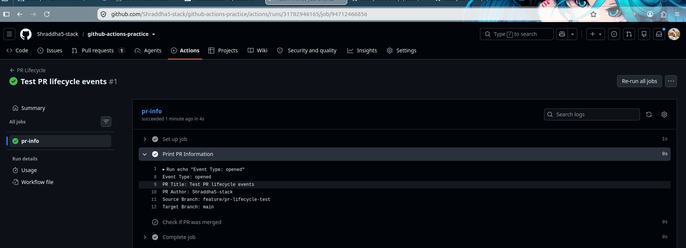
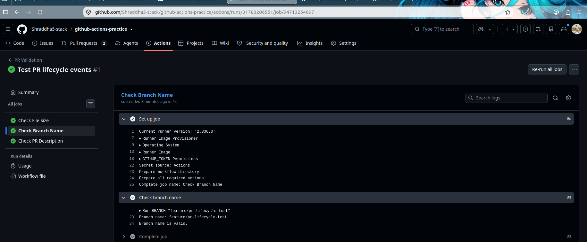
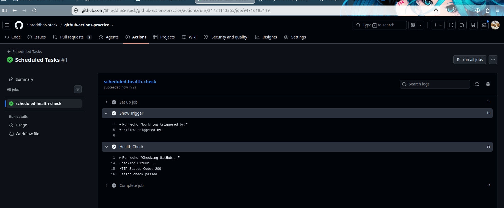
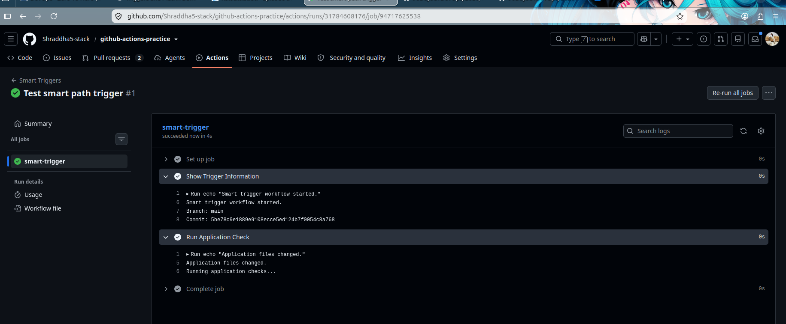
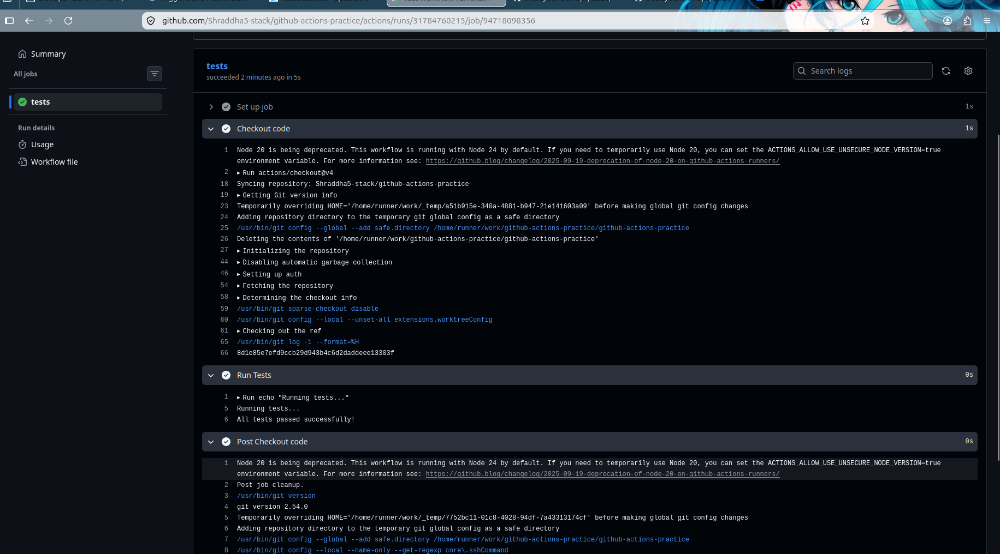
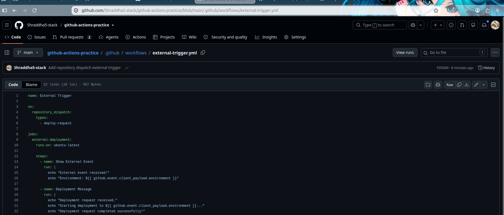

# Day 47 – Advanced Triggers: PR Events, Cron Schedules & Event-Driven Pipelines

Today I explored advanced GitHub Actions triggers including Pull Request events, scheduled workflows, path and branch filters, workflow chaining, and external repository events.

---

# Task 1 – Pull Request Event Types

Created:

```text
.github/workflows/pr-lifecycle.yml
```

The workflow triggers when a Pull Request is:

- Opened
- Updated (`synchronize`)
- Reopened
- Closed

It displays:

- PR event type
- PR title
- PR author
- Source branch
- Target branch

It also checks whether the Pull Request was merged.

### Workflow

```yaml
name: PR Lifecycle

on:
  pull_request:
    types:
      - opened
      - synchronize
      - reopened
      - closed

jobs:
  pr-info:
    runs-on: ubuntu-latest

    steps:
      - name: Show PR Information
        run: |
          echo "Event: ${{ github.event.action }}"
          echo "PR Title: ${{ github.event.pull_request.title }}"
          echo "PR Author: ${{ github.event.pull_request.user.login }}"
          echo "Source Branch: ${{ github.event.pull_request.head.ref }}"
          echo "Target Branch: ${{ github.event.pull_request.base.ref }}"

      - name: Check Merge
        if: github.event.pull_request.merged == true
        run: |
          echo "Pull Request was successfully merged!"
```

### Screenshot



---

# Task 2 – PR Validation Workflow

Created:

```text
.github/workflows/pr-checks.yml
```

This workflow acts as a Pull Request quality gate.

It performs three checks:

1. File size check
2. Branch name check
3. Pull Request body check

The accepted branch naming patterns are:

```text
feature/*
fix/*
docs/*
```

### Workflow

```yaml
name: PR Validation

on:
  pull_request:
    branches:
      - main

jobs:

  file-size-check:
    runs-on: ubuntu-latest

    steps:
      - name: Checkout code
        uses: actions/checkout@v4

      - name: Check file sizes
        run: |
          echo "Checking files larger than 1 MB..."

          if find . -type f -size +1M \
            -not -path './.git/*' | grep -q .; then
            echo "Error: File larger than 1 MB found."
            exit 1
          else
            echo "All files are within the 1 MB limit."
          fi

  branch-name-check:
    runs-on: ubuntu-latest

    steps:
      - name: Check branch name
        run: |
          BRANCH="${{ github.head_ref }}"

          echo "Branch: $BRANCH"

          if [[ "$BRANCH" == feature/* ||
                "$BRANCH" == fix/* ||
                "$BRANCH" == docs/* ]]; then
            echo "Branch name is valid."
          else
            echo "Invalid branch name."
            exit 1
          fi

  pr-body-check:
    runs-on: ubuntu-latest

    steps:
      - name: Check PR description
        env:
          PR_BODY: ${{ github.event.pull_request.body }}
        run: |
          if [ -z "$PR_BODY" ]; then
            echo "::warning::Pull Request description is empty."
          else
            echo "Pull Request description is present."
          fi
```

### Result

The PR validation workflow successfully executed the required checks.

### Screenshot



---

# Task 3 – Scheduled Workflows

Created:

```text
.github/workflows/scheduled-tasks.yml
```

The workflow supports two scheduled jobs and manual execution.

### Cron 1

```text
30 2 * * 1
```

Runs every Monday at **2:30 AM UTC**.

### Cron 2

```text
0 */6 * * *
```

Runs every **6 hours**.

### Manual Trigger

Added:

```yaml
workflow_dispatch:
```

This allows the workflow to be tested manually without waiting for the scheduled time.

### Health Check

The workflow uses `curl` to check the HTTP response from GitHub.

### Workflow

```yaml
name: Scheduled Tasks

on:
  schedule:
    - cron: '30 2 * * 1'
    - cron: '0 */6 * * *'
  workflow_dispatch:

jobs:
  scheduled-health-check:
    runs-on: ubuntu-latest

    steps:
      - name: Show Trigger
        run: |
          echo "Workflow triggered by:"
          echo "${{ github.event.schedule }}"

      - name: Health Check
        run: |
          echo "Checking GitHub..."

          STATUS=$(curl -L -s -o /dev/null -w "%{http_code}" https://github.com)

          echo "HTTP Status Code: $STATUS"

          if [ "$STATUS" -eq 200 ]; then
            echo "Health check passed!"
          else
            echo "Health check failed!"
            exit 1
          fi
```

### Additional Cron Expressions

Every weekday at 9 AM IST:

```text
30 3 * * 1-5
```

First day of every month at midnight:

```text
0 0 1 * *
```

### Why scheduled workflows can be delayed

GitHub scheduled workflows may be delayed during periods of high system load. Scheduled workflows can also be disabled for inactive repositories.

### Screenshot



---

# Task 4 – Path & Branch Filters

Created:

```text
.github/workflows/smart-triggers.yml
```

The workflow runs only when relevant application files change.

### Paths monitored

```text
src/**
app/**
```

### Branch filters

```text
main
release/*
```

### Workflow

```yaml
name: Smart Triggers

on:
  push:
    branches:
      - main
      - 'release/*'
    paths:
      - 'src/**'
      - 'app/**'

jobs:
  smart-trigger:
    runs-on: ubuntu-latest

    steps:
      - name: Show Trigger Information
        run: |
          echo "Smart trigger workflow started."
          echo "Branch: ${{ github.ref_name }}"
          echo "Commit: ${{ github.sha }}"

      - name: Run Application Check
        run: |
          echo "Application files changed."
          echo "Running application checks..."
```

A separate workflow was also created using `paths-ignore` to skip documentation-only changes.

### `paths` vs `paths-ignore`

**`paths`** is used when a workflow should run only when specific files or directories change.

**`paths-ignore`** is used when a workflow should run for most changes but skip changes that only affect specified files or directories.

### Screenshot



---

# Task 5 – `workflow_run` – Chain Workflows

Created two workflows:

```text
.github/workflows/tests.yml
.github/workflows/deploy-after-tests.yml
```

The first workflow runs tests.

The second workflow waits for the first workflow to complete.

### Tests Workflow

```yaml
name: Run Tests

on:
  push:
    branches:
      - main

jobs:
  tests:
    runs-on: ubuntu-latest

    steps:
      - name: Checkout code
        uses: actions/checkout@v4

      - name: Run Tests
        run: |
          echo "Running tests..."
          echo "All tests passed successfully!"
```

### Deploy Workflow

```yaml
name: Deploy After Tests

on:
  workflow_run:
    workflows: ["Run Tests"]
    types:
      - completed

jobs:
  deploy:
    runs-on: ubuntu-latest

    if: ${{ github.event.workflow_run.conclusion == 'success' }}

    steps:
      - name: Deployment
        run: |
          echo "Tests completed successfully."
          echo "Starting deployment..."
          echo "Deployment completed successfully!"
```

### Workflow Flow

```text
git push
    ↓
Run Tests
    ↓
Tests Successful
    ↓
Deploy After Tests
    ↓
Deployment
```

### Screenshot



---

# Task 6 – `repository_dispatch` – External Event Triggers

Created:

```text
.github/workflows/external-trigger.yml
```

The workflow listens for the custom event:

```text
deploy-request
```

An external system can send this event to GitHub and include information such as the target environment.

### Workflow

```yaml
name: External Trigger

on:
  repository_dispatch:
    types:
      - deploy-request

jobs:
  external-deployment:
    runs-on: ubuntu-latest

    steps:
      - name: Show External Event
        run: |
          echo "External event received!"
          echo "Environment: ${{ github.event.client_payload.environment }}"

      - name: Deployment Message
        run: |
          echo "Deployment request received."
          echo "Starting deployment to ${{ github.event.client_payload.environment }}..."
          echo "Deployment request completed successfully!"
```

### Trigger Command

```bash
gh api repos/Shraddha5-stack/github-actions-practice/dispatches \
  -f event_type=deploy-request \
  -f client_payload='{"environment":"production"}'
```

The workflow successfully received the external event and printed:

```text
Environment: production
```

### When would an external system trigger a pipeline?

External systems such as monitoring tools, Slack bots, deployment platforms, or other automation systems can trigger a GitHub Actions pipeline when an external event requires a deployment or operational action.

### Screenshot



---

# `workflow_run` vs `workflow_call`

| Feature | `workflow_run` | `workflow_call` |
|---|---|---|
| Purpose | Chain workflows after another workflow finishes | Reuse a workflow like a function |
| Trigger | Another workflow completes | Another workflow explicitly calls it |
| Can check previous result? | Yes | Not its purpose |
| Common use | Test → Deploy | Reusable CI/CD workflow |
| Trigger syntax | `workflow_run` | `workflow_call` |

### Simple Explanation

`workflow_run` is useful when one workflow should automatically start after another workflow finishes.

`workflow_call` is useful when we want to create one reusable workflow and call it from multiple workflows.

---

# Key Learnings

During Day 47 I learned:

- Pull Request lifecycle events
- Pull Request validation gates
- Scheduled workflows
- Cron expressions
- `workflow_dispatch`
- Path filters
- Branch filters
- `paths-ignore`
- `workflow_run`
- Workflow chaining
- `repository_dispatch`
- External event-driven automation

---

# Complete Event-Driven CI/CD Flow

```text
Developer
    ↓
git push
    ↓
GitHub Actions
    ↓
PR Validation
    ↓
Tests
    ↓
workflow_run
    ↓
Deployment
```

External systems can also trigger workflows:

```text
External System
      ↓
repository_dispatch
      ↓
GitHub Actions
      ↓
Deployment / Automation
```

---

# Day 47 Status

| Task | Status |
|---|---|
| Task 1 – PR Lifecycle | ✅ Completed |
| Task 2 – PR Validation | ✅ Completed |
| Task 3 – Scheduled Workflows | ✅ Completed |
| Task 4 – Path & Branch Filters | ✅ Completed |
| Task 5 – workflow_run | ✅ Completed |
| Task 6 – repository_dispatch | ✅ Completed |

---

## Day 47 Completed 🚀

#90DaysOfDevOps #DevOpsKaJosh #TrainWithShubham
