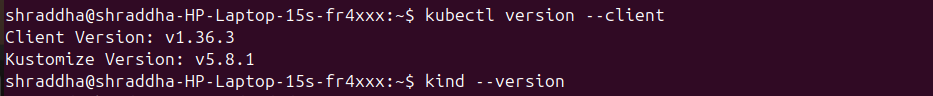
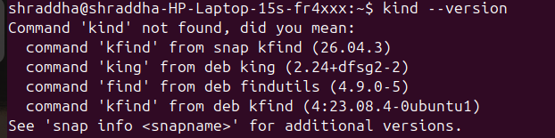
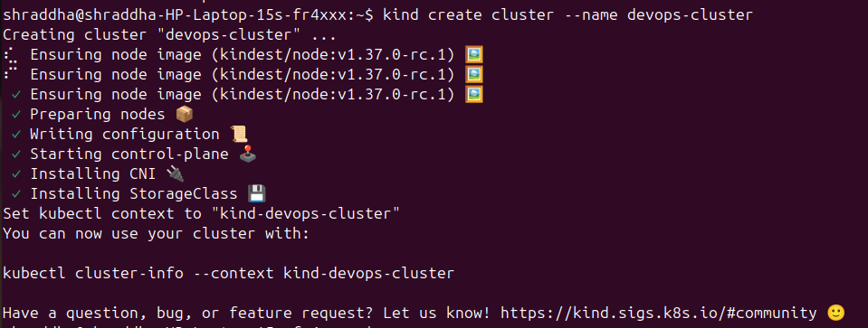
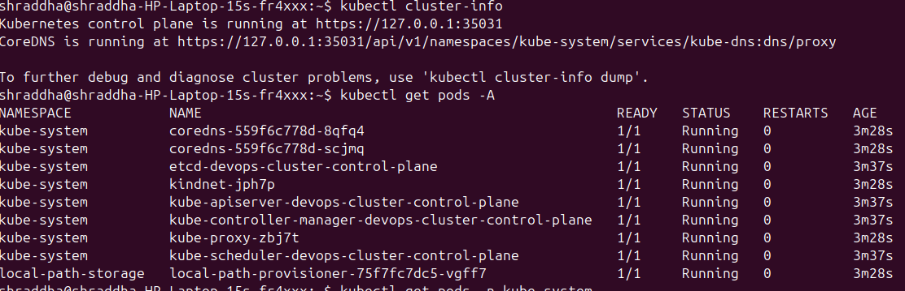
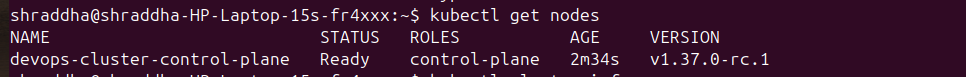
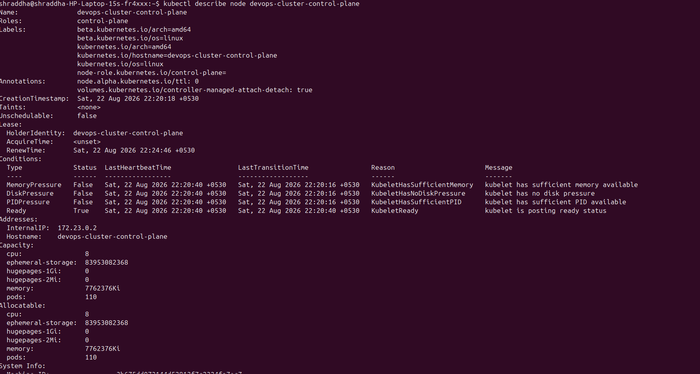
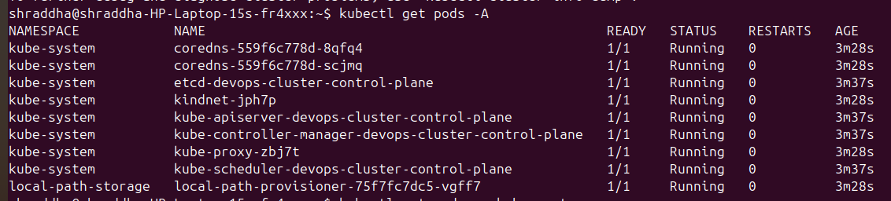
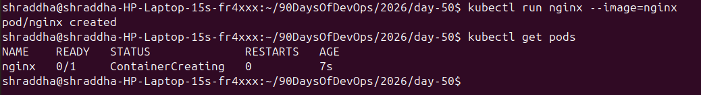
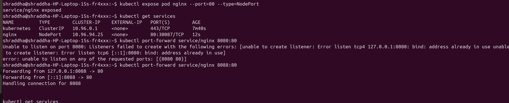
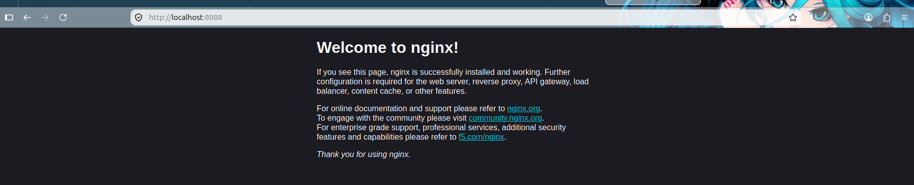

# Day 50 – Kubernetes Architecture and Cluster Setup

## Task 1: Recall the Kubernetes Story

Before touching a terminal, write down from memory:

### 1. Why was Kubernetes created? What problem does it solve that Docker alone cannot?

Docker allows us to build, package, and run containers. However, when we have hundreds or thousands of containers running across multiple servers, manually managing them becomes difficult.

Kubernetes was created to automate container orchestration and manage containers at scale.

Kubernetes provides:

- Auto Scaling
- Self-Healing
- Load Balancing
- Rolling Updates
- Service Discovery
- Container Scheduling
- Cluster Management

In simple words:

> **Docker runs containers, while Kubernetes manages and orchestrates containers at scale.**

For example, if a container crashes, Kubernetes can create a replacement. If application traffic increases, Kubernetes can scale the workload based on the configured scaling mechanism.

---

### 2. Who created Kubernetes and what was it inspired by?

Kubernetes was originally developed by engineers at **Google** and was inspired by Google's internal container orchestration system called **Borg**.

Google had already been running large-scale workloads using Borg. Kubernetes brought many ideas from that experience into an open-source container orchestration platform.

Kubernetes was publicly released as open source by Google in **2014** and later became a project under the **Cloud Native Computing Foundation (CNCF)**.

---

### 3. What does the name "Kubernetes" mean?

The name **Kubernetes** comes from the Greek word for **helmsman or ship pilot** — the person who steers a ship.

The idea represents Kubernetes managing and directing containerized workloads across a cluster.

---

## Task 2: Draw the Kubernetes Architecture

Kubernetes architecture consists mainly of a **Control Plane** and **Worker Nodes**.

## Control Plane

The Control Plane manages the Kubernetes cluster.

It contains:

- **API Server** — the front door of the Kubernetes cluster. Kubernetes clients such as `kubectl` communicate with the API server.
- **etcd** — a distributed key-value store that stores Kubernetes cluster state.
- **Scheduler** — decides which worker node should run a newly created Pod.
- **Controller Manager** — runs controllers that continuously work to make the actual state match the desired state.

## Worker Node

Worker nodes run application workloads.

They contain:

- **kubelet** — the node agent that communicates with the API server and manages Pods.
- **kube-proxy** — maintains networking rules for Kubernetes Services.
- **Container Runtime** — runs containers, such as containerd or CRI-O.

### Architecture Diagram


---

## What happens when you run `kubectl apply -f pod.yaml`?

The flow is:

1. `kubectl` reads the YAML manifest.
2. `kubectl` sends an API request to the Kubernetes API server.
3. The API server authenticates and validates the request.
4. The desired state is stored in `etcd`.
5. The scheduler notices that the Pod has not been assigned to a node.
6. The scheduler selects a suitable worker node.
7. The kubelet on the selected node sees the assigned Pod.
8. The kubelet asks the container runtime to pull the required image.
9. The container runtime creates and starts the container.
10. Kubernetes continuously monitors the workload and works to maintain the desired state.

---

## What happens if the API Server goes down?

If the API server becomes unavailable:

- Existing containers may continue running on worker nodes.
- New Kubernetes API requests cannot be processed.
- `kubectl` commands that require the API server will fail.
- Kubernetes control-plane components cannot coordinate normally through the API server.
- Cluster management and self-healing capabilities can be affected.

Therefore, the API server is a critical component of the Kubernetes control plane.

---

## What happens if a Worker Node goes down?

If a worker node becomes unavailable:

1. The Kubernetes control plane detects that the node is unhealthy.
2. The node is eventually marked as unavailable.
3. Pods running on that node may become unavailable.
4. For workloads managed by controllers such as Deployments, Kubernetes can create replacement Pods on healthy nodes.
5. The exact timing depends on Kubernetes node-monitoring and eviction settings.

This is one of the important self-healing capabilities provided by Kubernetes.

---

# Task 3: Install kubectl

`kubectl` is the command-line tool used to communicate with Kubernetes clusters.

## Linux Installation

```bash
curl -LO "https://dl.k8s.io/release/$(curl -L -s https://dl.k8s.io/release/stable.txt)/bin/linux/amd64/kubectl"
chmod +x kubectl
sudo mv kubectl /usr/local/bin/

## verify 

kubectl version --client



## Task 4: Set Up Your Local Cluster

I chose kind (Kubernetes in Docker) for my local Kubernetes environment.

# Why I chose kind?

I chose kind because:

- It allows me to run Kubernetes locally.
- It uses Docker containers as Kubernetes nodes.
- It is lightweight and useful for Kubernetes learning.
- It allows me to practice Kubernetes commands without using a cloud cluster.
- It is useful for testing Kubernetes configurations locally.

## Linux Installation
``bash
curl -Lo ./kind https://kind.sigs.k8s.io/dl/latest/kind-linux-amd64
chmod +x ./kind
sudo mv ./kind /usr/local/bin/kind

# verify 
kubectl cluster-info
kubectl get nodes

# Task 4: Set Up Your Local Cluster



## Create the Kubernetes Cluster

kind create cluster --name devops-cluster



# Task 5: Explore Your Cluster

After creating the cluster, I explored the Kubernetes environment using different kubectl commands.

## 5.1 See Cluster Information

``bash
kubectl cluster-info

# Task 5: Explore Your Cluster

## Cluster Info




## 5.2 List All Nodes

``bash 
kubectl get nodes

## Get Nodes




## 5.3 Get Detailed Information About Your Node

```bash
kubectl describe node <node-name>

## Node Details



This command provides detailed information about the node, including:

- Node status
- CPU capacity
- Memory capacity
- Allocatable resources
- Conditions
- Pods running on the node
- Labels
- Taints

## 5.4 List All Namespaces

kubectl get namespaces

This command displays all namespaces in the Kubernetes cluster.

## 5.5 See All Pods Running in the Cluster

```bash 
kubectl get pods -A


#The -A option means:
`` bash 
--all-namespaces

It displays Pods from all namespaces.

## 5.6 Look at Pods Running in the kube-system Namespace

```bash 
kubectl get pods -A

## kube-system Pods




# NGINX Practical

## NGINX Pod



## NGINX Service



## NGINX Browser




You should see pods like etcd, kube-apiserver, kube-scheduler, kube-controller-manager, coredns, and kube-proxy. These are the architecture components you drew in Task 2 — running as pods inside the cluster.

# Verify: Can you match each running pod in kube-system to a component in your architecture diagram? YES

##What each kube-system pod does

 -  core dns : Provides DNS services so pods can communicate using service names.
 -  etcd-devops-cluster-control-plane : Distributed key-value store that holds all cluster configuration and state.
 -  kindnet-8mkrr: Networking plugin used by KIND to enable pod networking.
 -  kube-apiserver-devops-cluster-control-plane : Main API server that handles all Kubernetes API requests.
 -  kube-controller-manager-devops-cluster-control-plane : Runs controllers that manage cluster state such as nodes, replicas, and endpoints.
 -  kube-proxy-xk4lf : Manages network rules and enables service networking for pods.
 -  kube-scheduler-devops-cluster-control-plane : Assigns newly created pods to available nodes.


## Task 6: Practice Cluster Lifecycle

I practiced the Kubernetes cluster lifecycle using kind.

# 6.1 Delete the Cluster

```bash 
kind delete cluster --name devops-cluster

# Task 6: Practice Cluster Lifecycle

## 6.1 Delete the Cluster

```bash
kind delete cluster --name devops-cluster
# 6.2 Recreate the Cluster

```bash
kind create cluster --name devops-cluster

## Write down: What is a kubeconfig? Where is it stored on your machine?

    kubeconfig is a configuration file used by Kubernetes clients kubectl to connect to a Kubernetes cluster.
    kind handles kubeconfig automatically.
    It stores cluster details, user credentials, and contexts.
    Location: ~/.kube/config

