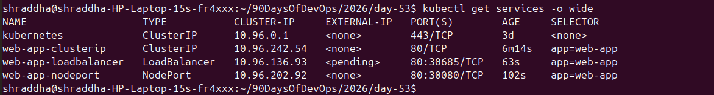
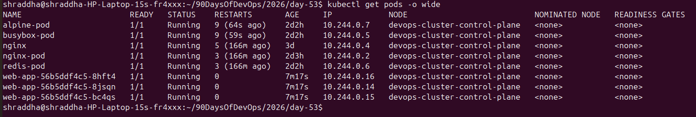
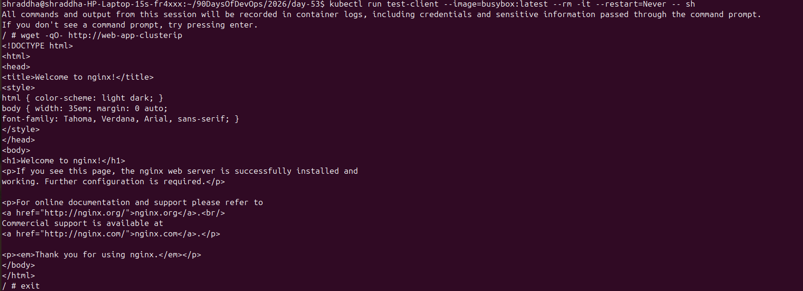

# Day 53 – Kubernetes Services

## Overview

Kubernetes Pods are temporary resources. Their IP addresses can change when Pods are recreated or restarted. A Kubernetes Service provides a stable network endpoint for accessing a group of Pods.

In this practical, I created a Deployment with three Nginx Pods and exposed the application using three Service types:

* ClusterIP
* NodePort
* LoadBalancer

I also tested Pod-to-Service communication, Kubernetes DNS service discovery, and EndpointSlices.

---

## 1. Deployment

The application was deployed using `app-deployment.yaml`.

The Deployment creates three replicas of the Nginx application.

### Deployment configuration

```yaml
apiVersion: apps/v1
kind: Deployment
metadata:
  name: web-app
  labels:
    app: web-app
spec:
  replicas: 3
  selector:
    matchLabels:
      app: web-app
  template:
    metadata:
      labels:
        app: web-app
    spec:
      containers:
      - name: nginx
        image: nginx:1.25
        ports:
        - containerPort: 80
```

### Verify Pods

```bash
kubectl get pods -o wide
```

### Result

Three `web-app` Pods were running:

```text
web-app-56b5ddf4c5-8hft4   10.244.0.16
web-app-56b5ddf4c5-8jsqn   10.244.0.14
web-app-56b5ddf4c5-bc4qs   10.244.0.15
```

All three Pods were in the `Running` state.

---

# 2. Why Kubernetes Services?

Pod IP addresses are not stable.

For example:

```text
Pod 1 → 10.244.0.14
Pod 2 → 10.244.0.15
Pod 3 → 10.244.0.16
```

If a Pod is deleted and recreated, Kubernetes can assign it a different IP address.

A Service provides:

* A stable ClusterIP
* A stable DNS name
* Traffic distribution across matching Pods
* A consistent way for applications to communicate with Pods

The basic architecture is:

```text
Client
   |
   v
Service
   |
   +----------+----------+
   |          |          |
   v          v          v
 Pod 1      Pod 2      Pod 3
```

---

# 3. ClusterIP Service

ClusterIP is the default Kubernetes Service type.

It provides internal access to Pods from within the Kubernetes cluster.

### Manifest

File:

```text
clusterip-service.yaml
```

```yaml
apiVersion: v1
kind: Service
metadata:
  name: web-app-clusterip
spec:
  type: ClusterIP
  selector:
    app: web-app
  ports:
  - port: 80
    targetPort: 80
```

### Important fields

`selector`:

```yaml
selector:
  app: web-app
```

The Service finds Pods with the label:

```text
app=web-app
```

`port`:

```yaml
port: 80
```

The port exposed by the Service.

`targetPort`:

```yaml
targetPort: 80
```

The port on the target Pods.

### Service result

```bash
kubectl get services -o wide
```

Result:

```text
web-app-clusterip   ClusterIP   10.96.242.54   <none>   80/TCP
```

The ClusterIP was:

```text
10.96.242.54
```

---

# 4. Test Pod-to-Service Communication

A temporary BusyBox Pod was used to test the Service.

```bash
kubectl run test-client \
  --image=busybox:latest \
  --rm -it \
  --restart=Never \
  -- sh
```

Inside the test Pod:

```bash
wget -qO- http://web-app-clusterip
```

The command returned the Nginx welcome page.

This confirmed that the Service successfully routed traffic from the test Pod to one of the Nginx Pods.

### Traffic flow

```text
test-client
     |
     v
web-app-clusterip
     |
     v
one of the web-app Pods
     |
     v
Nginx :80
```

---

# 5. Kubernetes DNS

Kubernetes provides built-in DNS-based service discovery.

A Service can be accessed using:

```text
<service-name>.<namespace>.svc.cluster.local
```

For this Service:

```text
web-app-clusterip.default.svc.cluster.local
```

The DNS lookup returned:

```text
Name:    web-app-clusterip.default.svc.cluster.local
Address: 10.96.242.54
```

The returned IP matched the Service ClusterIP:

```text
10.96.242.54
```

This confirmed that Kubernetes DNS correctly resolved the Service name.

### Short name

Inside the same namespace, the Service can be accessed using:

```bash
wget -qO- http://web-app-clusterip
```

### Full DNS name

```bash
wget -qO- http://web-app-clusterip.default.svc.cluster.local
```

---

# 6. NodePort Service

NodePort exposes a Service through a port on the Kubernetes node.

### Manifest

File:

```text
nodeport-service.yaml
```

```yaml
apiVersion: v1
kind: Service
metadata:
  name: web-app-nodeport
spec:
  type: NodePort
  selector:
    app: web-app
  ports:
  - port: 80
    targetPort: 80
    nodePort: 30080
```

### Service result

```text
web-app-nodeport   NodePort   10.96.202.92   <none>   80:30080/TCP
```

The NodePort is:

```text
30080
```

### Traffic flow

```text
Client
   |
   v
NodeIP:30080
   |
   v
NodePort Service
   |
   v
Pod:80
```

NodePort is commonly useful for development, testing, and direct node-level access.

---

# 7. LoadBalancer Service

LoadBalancer exposes the Service externally through a cloud load balancer.

### Manifest

File:

```text
loadbalancer-service.yaml
```

```yaml
apiVersion: v1
kind: Service
metadata:
  name: web-app-loadbalancer
spec:
  type: LoadBalancer
  selector:
    app: web-app
  ports:
  - port: 80
    targetPort: 80
```

### Service result

```text
web-app-loadbalancer   LoadBalancer   10.96.136.93   <pending>   80:30685/TCP
```

The ClusterIP is:

```text
10.96.136.93
```

The automatically assigned NodePort is:

```text
30685
```

The External IP is:

```text
<pending>
```

This is expected because this practical is running on a local Kubernetes cluster rather than a cloud environment with a cloud load balancer provisioner.

In a cloud Kubernetes cluster, a LoadBalancer Service can provision an external load balancer through the cloud provider.

---

# 8. Compare Service Types

| Service Type | Access                       | Main Use                                  |
| ------------ | ---------------------------- | ----------------------------------------- |
| ClusterIP    | Inside cluster               | Internal service-to-service communication |
| NodePort     | Through Node IP and NodePort | Development and testing                   |
| LoadBalancer | External load balancer       | External traffic in cloud environments    |

### Summary

```text
ClusterIP
    ↓
Internal access

NodePort
    ↓
NodeIP:NodePort
    ↓
External node-level access

LoadBalancer
    ↓
External Load Balancer
    ↓
NodePort
    ↓
Pods
```

---

# 9. Endpoints and EndpointSlices

A Service needs to know which Pods should receive traffic.

The Service selector:

```yaml
selector:
  app: web-app
```

matches the Pods with:

```text
app=web-app
```

The EndpointSlices showed:

```text
web-app-clusterip
    10.244.0.14
    10.244.0.15
    10.244.0.16

web-app-nodeport
    10.244.0.14
    10.244.0.15
    10.244.0.16

web-app-loadbalancer
    10.244.0.14
    10.244.0.15
    10.244.0.16
```

Command used:

```bash
kubectl get endpointslices
```

This confirmed that all three Services were connected to the three Nginx Pods.

### EndpointSlice

EndpointSlice is the modern Kubernetes API used to track Service endpoints.

The older command:

```bash
kubectl get endpoints
```

may show a deprecation warning on newer Kubernetes versions.

The modern command is:

```bash
kubectl get endpointslices
```

---

# 10. Final Service Output

Command:

```bash
kubectl get services -o wide
```

Result:

```text
NAME                   TYPE           CLUSTER-IP     EXTERNAL-IP   PORT(S)
kubernetes             ClusterIP      10.96.0.1      <none>        443/TCP
web-app-clusterip      ClusterIP      10.96.242.54   <none>        80/TCP
web-app-loadbalancer   LoadBalancer   10.96.136.93   <pending>     80:30685/TCP
web-app-nodeport       NodePort       10.96.202.92   <none>        80:30080/TCP
```

---

# 11. Key Learnings

* Pods have temporary IP addresses.
* Deployments can create multiple Pods.
* Services provide stable access to Pods.
* Service selectors connect Services to Pods.
* ClusterIP provides internal access.
* NodePort provides access through a node port.
* LoadBalancer provides external access through a cloud load balancer.
* Kubernetes automatically provides DNS names for Services.
* EndpointSlices show the Pods currently backing a Service.
* `port` is the Service port.
* `targetPort` is the Pod port.
* NodePort normally uses ports from `30000-32767`.

---

# 12. Useful Commands

```bash
kubectl get pods -o wide
```

```bash
kubectl get services -o wide
```

```bash
kubectl describe service web-app-clusterip
```

```bash
kubectl get endpointslices
```

```bash
kubectl get endpointslice -l kubernetes.io/service-name=web-app-clusterip
```

```bash
kubectl run test-client --image=busybox:latest --rm -it --restart=Never -- sh
```

```bash
wget -qO- http://web-app-clusterip
```

---

# Conclusion

In Day 53, I learned how Kubernetes Services provide stable networking for temporary Pods.

I practically created and tested ClusterIP, NodePort, and LoadBalancer Services. I verified Service-to-Pod connectivity, Kubernetes DNS resolution, and EndpointSlices.

The most important concept is:

```text
Pods are temporary.
Services provide stable access.
```

This is essential for communication between applications running inside Kubernetes.


## Screenshots

### Kubernetes Services



### Kubernetes Pods



### Pod-to-Service Communication


