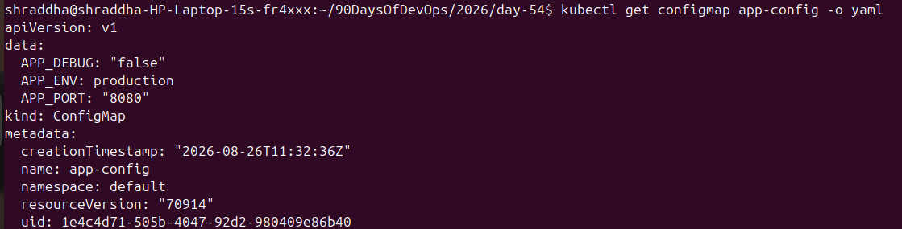
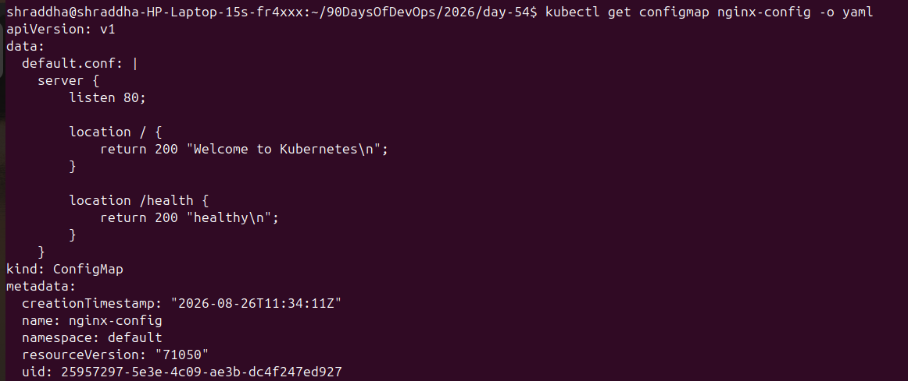
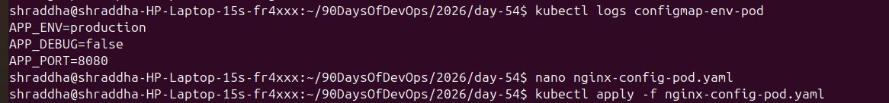
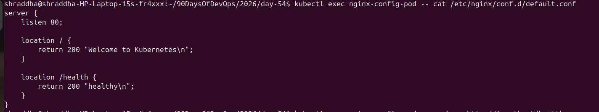
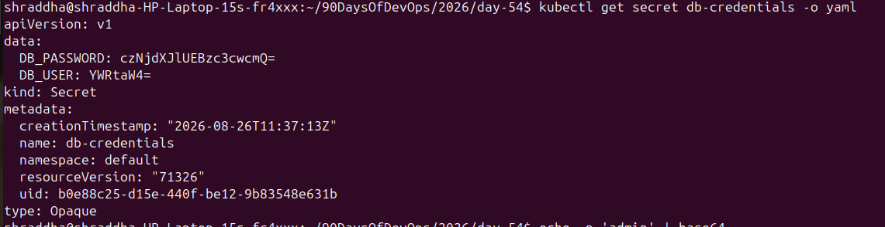
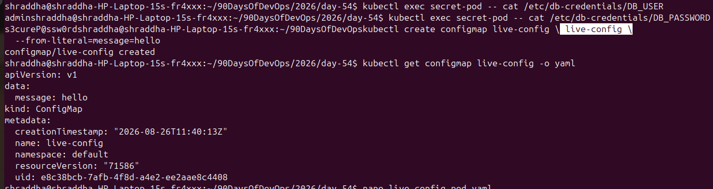

# Day 54 – Kubernetes ConfigMaps and Secrets

## 📌 Overview

In Day 54, I learned how Kubernetes manages application configuration and sensitive data using **ConfigMaps** and **Secrets**.

Instead of hardcoding configuration values inside container images, Kubernetes allows applications to consume configuration dynamically.

### Topics covered

* ConfigMaps from literals
* ConfigMaps from files
* ConfigMaps as environment variables
* ConfigMaps as volume-mounted files
* Kubernetes Secrets
* Base64 encoding and decoding
* Secrets as environment variables
* Secrets as volume-mounted files
* ConfigMap update propagation
* Cleanup and verification

---

# 🎯 Objectives

By completing this practical lab, I learned how to:

* Create ConfigMaps using `--from-literal`
* Create ConfigMaps using `--from-file`
* Inject ConfigMaps into Pods as environment variables
* Mount ConfigMaps as configuration files
* Create Kubernetes Secrets
* Decode Base64-encoded Secret values
* Inject Secrets using `secretKeyRef`
* Mount Secrets as files
* Understand ConfigMap update propagation
* Clean up Kubernetes resources

---

# 1. What is a ConfigMap?

A **ConfigMap** is a Kubernetes object used to store non-sensitive configuration data.

Examples:

```text
APP_ENV=production
APP_DEBUG=false
APP_PORT=8080
LOG_LEVEL=info
FEATURE_FLAG=true
```

ConfigMaps keep configuration separate from application container images.

This means an application configuration can be changed without rebuilding the container image.

### Use ConfigMaps for:

* Application settings
* Environment names
* Port numbers
* Feature flags
* Log levels
* Configuration files
* Non-sensitive URLs

### Do NOT use ConfigMaps for:

* Passwords
* API keys
* Access tokens
* Private keys
* Other sensitive credentials

---

# 2. Create a ConfigMap from Literals

I created a ConfigMap called `app-config`:

```bash
kubectl create configmap app-config \
  --from-literal=APP_ENV=production \
  --from-literal=APP_DEBUG=false \
  --from-literal=APP_PORT=8080
```

### Verify

```bash
kubectl get configmap app-config
```

```bash
kubectl describe configmap app-config
```

```bash
kubectl get configmap app-config -o yaml
```

### Result

The ConfigMap contained:

```text
APP_ENV=production
APP_DEBUG=false
APP_PORT=8080
```

The values were stored as plain text.



---

# 3. Create a ConfigMap from a File

I created a custom Nginx configuration file:

```text
nginx/default.conf
```

The configuration included a `/health` endpoint.

```nginx
server {
    listen 80;

    location / {
        return 200 "Welcome to Kubernetes\n";
    }

    location /health {
        return 200 "healthy\n";
    }
}
```

I created a ConfigMap from the file:

```bash
kubectl create configmap nginx-config \
  --from-file=default.conf=nginx/default.conf
```

### Verify

```bash
kubectl get configmap nginx-config
```

```bash
kubectl describe configmap nginx-config
```

```bash
kubectl get configmap nginx-config -o yaml
```

The file contents were stored under the key:

```text
default.conf
```



---

# 4. Using ConfigMaps as Environment Variables

I created a Pod that consumed all keys from `app-config` using `envFrom`.

```yaml
apiVersion: v1
kind: Pod
metadata:
  name: configmap-env-pod
spec:
  containers:
    - name: busybox
      image: busybox:1.36
      command:
        - sh
        - -c
        - |
          echo "APP_ENV=$APP_ENV"
          echo "APP_DEBUG=$APP_DEBUG"
          echo "APP_PORT=$APP_PORT"
          sleep 3600
      envFrom:
        - configMapRef:
            name: app-config
```

I applied the manifest:

```bash
kubectl apply -f configmap-env-pod.yaml
```

### Verify

```bash
kubectl get pod configmap-env-pod
```

```bash
kubectl logs configmap-env-pod
```

### Output

```text
APP_ENV=production
APP_DEBUG=false
APP_PORT=8080
```



### Important

`envFrom` injects all keys from the ConfigMap as environment variables.

Environment variables are created when the Pod starts.

If the ConfigMap changes later, the existing environment variables inside the Pod do **not** automatically change.

---

# 5. Using ConfigMaps as Volume Mounts

I created an Nginx Pod that mounted the `nginx-config` ConfigMap as a volume.

```yaml
apiVersion: v1
kind: Pod
metadata:
  name: nginx-config-pod
spec:
  containers:
    - name: nginx
      image: nginx:latest
      ports:
        - containerPort: 80
      volumeMounts:
        - name: nginx-config-volume
          mountPath: /etc/nginx/conf.d
          readOnly: true
  volumes:
    - name: nginx-config-volume
      configMap:
        name: nginx-config
```

I applied it:

```bash
kubectl apply -f nginx-config-pod.yaml
```

### Verify the mounted file

```bash
kubectl exec nginx-config-pod -- cat /etc/nginx/conf.d/default.conf
```

The ConfigMap file was available inside the container as:

```text
/etc/nginx/conf.d/default.conf
```



---

# 6. Test the Nginx Health Endpoint

I tested the custom `/health` endpoint:

```bash
kubectl exec nginx-config-pod -- curl -s http://localhost/health
```

### Output

```text
healthy
```

This confirmed that the ConfigMap configuration was successfully mounted and used by Nginx.


---

# 7. What is a Kubernetes Secret?

A **Secret** is a Kubernetes object designed to hold sensitive information.

Examples:

* Database usernames
* Database passwords
* API keys
* Tokens
* TLS certificates

For this practical exercise, I created:

```text
DB_USER=admin
DB_PASSWORD=s3cureP@ssw0rd
```

---

# 8. Create a Secret

I created the Secret using:

```bash
kubectl create secret generic db-credentials \
  --from-literal=DB_USER=admin \
  --from-literal='DB_PASSWORD=s3cureP@ssw0rd'
```

### Verify

```bash
kubectl get secret db-credentials
```

```bash
kubectl get secret db-credentials -o yaml
```

The Secret data appeared Base64 encoded.



---

# 9. Base64 is NOT Encryption

One of the most important lessons from this exercise is:

> **Base64 encoding is not encryption.**

For example:

```bash
echo -n 'admin' | base64
```

Output:

```text
YWRtaW4=
```

The value can easily be decoded:

```bash
echo 'YWRtaW4=' | base64 --decode
```

Output:

```text
admin
```

I also decoded the Kubernetes Secret directly:

```bash
kubectl get secret db-credentials \
  -o jsonpath='{.data.DB_PASSWORD}' | base64 --decode
```

The result was the original password.

### Security lesson

Base64 only changes the representation of the data.

It does not provide confidentiality.

Kubernetes Secret security also depends on controls such as:

* RBAC
* Restricting access to Secrets
* Encryption at rest configuration
* Secure cluster administration
* Avoiding unnecessary exposure of Secret values

---

# 10. Use Secret as an Environment Variable

I used `secretKeyRef` to inject the `DB_USER` value into a Pod.

```yaml
env:
  - name: DB_USER
    valueFrom:
      secretKeyRef:
        name: db-credentials
        key: DB_USER
```

This allowed the container to access:

```text
DB_USER=admin
```

---

# 11. Mount Secret as a Volume

I also mounted the complete Secret as a volume:

```yaml
volumeMounts:
  - name: db-credentials-volume
    mountPath: /etc/db-credentials
    readOnly: true
```

The volume was defined as:

```yaml
volumes:
  - name: db-credentials-volume
    secret:
      secretName: db-credentials
```

Inside the container, Kubernetes created files for each Secret key:

```text
/etc/db-credentials/
├── DB_USER
└── DB_PASSWORD
```

I verified:

```bash
kubectl exec secret-pod -- ls -l /etc/db-credentials
```

Then:

```bash
kubectl exec secret-pod -- cat /etc/db-credentials/DB_USER
```

Output:

```text
admin
```

And:

```bash
kubectl exec secret-pod -- cat /etc/db-credentials/DB_PASSWORD
```

Output:

```text
s3cureP@ssw0rd
```

### Important observation

The Secret values are Base64-encoded in the Kubernetes API representation, but the mounted files contain the **decoded plaintext values**.

---

# 12. Environment Variables vs Volume Mounts

| Method               | ConfigMap | Secret | Automatically updates |
| -------------------- | --------- | ------ | --------------------- |
| Environment variable | ✅         | ✅      | ❌                     |
| Volume mount         | ✅         | ✅      | ✅                     |

### Environment variables

Good for:

```text
APP_ENV
APP_PORT
LOG_LEVEL
```

They are available directly to the application process.

However, changing the ConfigMap or Secret does not automatically change an already-running container's environment variables.

### Volume mounts

Good for:

```text
nginx.conf
application.conf
database credentials files
TLS certificates
```

Kubernetes can update mounted ConfigMap and Secret data when the underlying object changes.

---

# 13. ConfigMap Update Propagation

I created a ConfigMap:

```bash
kubectl create configmap live-config \
  --from-literal=message=hello
```

I mounted it into a Pod:

```text
/etc/config/message
```

Initially the file contained:

```text
hello
```

I then updated the ConfigMap:

```bash
kubectl patch configmap live-config \
  --type merge \
  -p '{"data":{"message":"world"}}'
```

After waiting for the volume projection to refresh, the mounted file changed to:

```text
world
```

The Pod did not need to be restarted.



### Important observation

```text
ConfigMap
    ↓
Volume mount
    ↓
File
    ↓
Automatically refreshed
```

But:

```text
ConfigMap
    ↓
Environment variable
    ↓
Pod startup value
    ↓
Does NOT automatically change
```

---

# 14. Real-World DevOps Use Cases

## ConfigMaps

ConfigMaps are commonly used for:

* Application configuration
* Nginx configuration
* Feature flags
* Environment-specific settings
* Logging configuration
* Service configuration

For example:

```text
Development → APP_ENV=development
Staging     → APP_ENV=staging
Production  → APP_ENV=production
```

The same container image can be used in all environments while configuration changes separately.

## Secrets

Secrets are commonly used for:

* Database credentials
* API tokens
* Cloud credentials
* TLS certificates
* Authentication credentials

Example:

```text
Application
    ↓
Kubernetes Secret
    ↓
Database credentials
```

This avoids hardcoding credentials into the application image.

---

# 15. Important Kubernetes Commands

### ConfigMaps

```bash
kubectl get configmaps
```

```bash
kubectl get configmap <name>
```

```bash
kubectl describe configmap <name>
```

```bash
kubectl get configmap <name> -o yaml
```

### Create from literals

```bash
kubectl create configmap app-config \
  --from-literal=KEY=VALUE
```

### Create from a file

```bash
kubectl create configmap nginx-config \
  --from-file=default.conf=nginx/default.conf
```

### Secrets

```bash
kubectl get secrets
```

```bash
kubectl get secret <name>
```

```bash
kubectl get secret <name> -o yaml
```

### Decode Secret value

```bash
kubectl get secret <name> \
  -o jsonpath='{.data.KEY}' | base64 --decode
```

### Update ConfigMap

```bash
kubectl patch configmap <name> \
  --type merge \
  -p '{"data":{"KEY":"VALUE"}}'
```

---

# 16. Security Best Practices

* Never commit real passwords or API keys to Git.
* Do not store sensitive information in ConfigMaps.
* Use Kubernetes Secrets for sensitive configuration.
* Restrict Secret access using RBAC.
* Avoid exposing Secret values in logs.
* Configure encryption at rest where appropriate.
* Use external secret-management systems for larger production environments when appropriate.
* Rotate credentials regularly.
* Use `readOnly: true` when a mounted configuration does not need to be modified.

---

# 17. Interview Questions

### Q1. What is a ConfigMap?

A ConfigMap stores non-sensitive configuration data separately from application code and container images.

### Q2. What is a Kubernetes Secret?

A Secret is a Kubernetes object designed to store sensitive information such as passwords, tokens, and credentials.

### Q3. What is the difference between ConfigMap and Secret?

ConfigMaps are intended for non-sensitive configuration, while Secrets are intended for sensitive data.

### Q4. Is Base64 encryption?

No. Base64 is an encoding mechanism, not encryption.

### Q5. How can a ConfigMap be consumed by a Pod?

A ConfigMap can be consumed using:

* Environment variables
* Individual environment variables
* Volume mounts

### Q6. Do ConfigMap environment variables update automatically?

No. Environment variables are established when the container starts.

### Q7. Do volume-mounted ConfigMaps update automatically?

Kubernetes can update the projected volume contents after the ConfigMap changes.

### Q8. What does `envFrom` do?

`envFrom` imports all keys from a ConfigMap or Secret as environment variables.

### Q9. What does `secretKeyRef` do?

`secretKeyRef` allows a specific key from a Secret to be injected into a container.

### Q10. What happens when a Secret is mounted as a volume?

Each Secret key becomes a file, and the file contains the decoded value.

---

# 18. Practical Summary

During this lab I created:

```text
ConfigMap
├── app-config
└── nginx-config

Secret
└── db-credentials
```

I consumed configuration using:

```text
Environment variables
        +
Volume mounts
```

I also tested ConfigMap update propagation:

```text
hello → world
```

without restarting the Pod.

---

# 19. Cleanup

After completing the practical exercises, I removed the resources created during Day 54:

```bash
kubectl delete pod configmap-env-pod nginx-config-pod secret-pod live-config-pod
```

```bash
kubectl delete configmap app-config nginx-config live-config
```

```bash
kubectl delete secret db-credentials
```

I verified the cleanup with:

```bash
kubectl get pods
```

```bash
kubectl get configmaps
```

```bash
kubectl get secrets
```

The remaining `kube-root-ca.crt` ConfigMap was a Kubernetes-managed resource and was left untouched.

---

# 🎓 Key Takeaways

1. **ConfigMaps store non-sensitive configuration.**
2. **Secrets are intended for sensitive configuration.**
3. **Base64 is encoding, not encryption.**
4. ConfigMaps and Secrets can be consumed through environment variables or volume mounts.
5. Environment variables do not automatically update after a ConfigMap/Secret changes.
6. Volume-mounted ConfigMaps and Secrets can receive updated data.
7. Kubernetes allows configuration to be separated from container images.
8. RBAC and encryption-at-rest configuration are important for protecting Secrets.
9. Never commit real credentials to GitHub.
10. Configuration management is an important part of Kubernetes and DevOps.

---

# ✅ Day 54 Status

* [x] ConfigMap from literals
* [x] ConfigMap from file
* [x] ConfigMap as environment variables
* [x] ConfigMap as volume mount
* [x] Nginx health endpoint
* [x] Secret creation
* [x] Base64 decoding
* [x] Secret as environment variable
* [x] Secret as volume mount
* [x] ConfigMap live update
* [x] Cleanup
* [x] Screenshots captured

---

# 🚀 Conclusion

Day 54 helped me understand how Kubernetes separates application configuration and sensitive data from container images.

I practically created ConfigMaps and Secrets, consumed them through environment variables and volume mounts, tested an Nginx configuration, decoded Secret values, and observed a ConfigMap update propagate to a mounted volume without restarting the Pod.

This is an important Kubernetes concept for building flexible, reusable, and production-ready applications.
