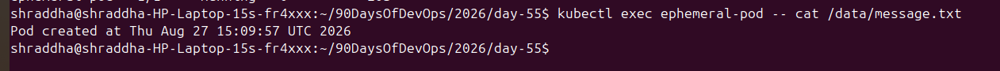
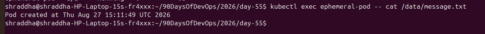
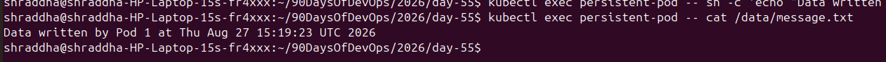
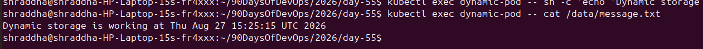

# Day 55 – Persistent Volumes (PV) and Persistent Volume Claims (PVC)

## Objective

The goal of Day 55 was to understand Kubernetes persistent storage and practically demonstrate the difference between ephemeral storage and persistent storage.

I worked with:

* `emptyDir`
* PersistentVolumes (PV)
* PersistentVolumeClaims (PVC)
* Static provisioning
* StorageClasses
* Dynamic provisioning
* Access modes
* Reclaim policies

---

# 1. Why Containers Need Persistent Storage

Containers and Pods are generally considered ephemeral. Data stored only inside a container or in temporary Pod storage can disappear when the Pod is deleted.

This is a problem for applications such as:

* Databases
* Web applications
* File storage systems
* Stateful applications
* Applications that need data to survive Pod recreation

Kubernetes provides persistent storage using **PersistentVolumes (PV)** and **PersistentVolumeClaims (PVCs)**.

---

# 2. Task 1 – Demonstrating Ephemeral Storage

I created a Pod using an `emptyDir` volume.

The Pod wrote a timestamped message to:

```text
/data/message.txt
```

### First Pod

The first Pod produced:

```text
Pod created at Thu Aug 27 15:09:57 UTC 2026
```



### Pod Recreation

After deleting and recreating the Pod, the message became:

```text
Pod created at Thu Aug 27 15:11:49 UTC 2026
```



### Observation

The date was the same, but the timestamp changed from:

```text
15:09:57
```

to:

```text
15:11:49
```

This proved that the original `emptyDir` data was lost when the Pod was deleted.

### Conclusion

`emptyDir` provides temporary storage associated with the Pod.

```text
Pod
 |
emptyDir
 |
Data
 |
Pod deleted
 |
Data lost
```

---

# 3. Task 2 – Creating a PersistentVolume

I created a manually provisioned PersistentVolume named:

```text
manual-pv
```

The PV configuration included:

* Capacity: `1Gi`
* Access Mode: `ReadWriteOnce`
* Reclaim Policy: `Retain`
* Storage type: `hostPath`
* Host path: `/tmp/k8s-pv-data`

The initial PV status was:

```text
Available
```

Command used:

```bash
kubectl get pv
```

The PV was waiting for a PVC to claim it.

---

# 4. Task 3 – Creating a PersistentVolumeClaim

I created a PVC named:

```text
manual-pvc
```

The PVC requested:

```text
500Mi
```

with:

```text
ReadWriteOnce
```

## Initial Problem

The PVC initially remained:

```text
Pending
```

The reason was a StorageClass mismatch.

The PVC automatically selected the cluster's default StorageClass:

```text
standard
```

while the manually created PV did not have a StorageClass.

I fixed the problem by explicitly setting:

```yaml
storageClassName: ""
```

in the PVC.

After recreating the PVC, it successfully became:

```text
Bound
```

The PVC was bound to:

```text
manual-pv
```

The `VOLUME` column showed:

```text
manual-pv
```

This demonstrated how Kubernetes matches a PVC with a suitable PV.

---

# 5. Task 4 – Using the PVC in a Pod

I created a Pod that mounted `manual-pvc` at:

```text
/data
```

The first Pod wrote:

```text
Data written by Pod 1 at Thu Aug 27 15:19:23 UTC 2026
```



I then deleted the Pod and recreated it.

The data from Pod 1 was still present.

I then added data from Pod 2.

The final file contained:

```text
Data written by Pod 1 at Thu Aug 27 15:19:23 UTC 2026
Data written by Pod 2 at Thu Aug 27 15:20:54 UTC 2026
```

This proved that the data survived Pod deletion.

## Persistent Storage Flow

```text
Pod 1
  |
  v
PVC
  |
  v
PV
  |
  v
Persistent data

Pod 1 deleted
  |
  v
PVC and PV remain
  |
  v
Pod 2
  |
  v
Same persistent data
```

---

# 6. Task 5 – StorageClass

I checked the StorageClass in my Kubernetes cluster using:

```bash
kubectl get storageclass
```

My cluster has:

```text
NAME                 PROVISIONER             RECLAIMPOLICY   VOLUMEBINDINGMODE
standard (default)   rancher.io/local-path   Delete          WaitForFirstConsumer
```

## StorageClass Details

| Property               | Value                   |
| ---------------------- | ----------------------- |
| Name                   | `standard`              |
| Default                | Yes                     |
| Provisioner            | `rancher.io/local-path` |
| Reclaim Policy         | `Delete`                |
| Volume Binding Mode    | `WaitForFirstConsumer`  |
| Allow Volume Expansion | `false`                 |

The default StorageClass was important because my first PVC automatically received:

```text
standard
```

This caused the initial mismatch with the manually created PV.

---

# 7. Task 6 – Dynamic Provisioning

I created a PVC using:

```yaml
storageClassName: standard
```

The PVC requested:

```text
500Mi
```

Because the StorageClass uses:

```text
WaitForFirstConsumer
```

the PV was provisioned when the Pod consumed the PVC.

Kubernetes automatically created the PV:

```text
pvc-7c02bdfc-d0e2-45e6-ad16-5b1b2b6d3cba
```

The dynamically created PV had:

```text
Capacity: 500Mi
Access Mode: RWO
Reclaim Policy: Delete
StorageClass: standard
```

The dynamic PVC became:

```text
Bound
```

I then mounted it into `dynamic-pod`.

The Pod successfully wrote:

```text
Dynamic storage is working at Thu Aug 27 15:25:15 UTC 2026
```



## Static vs Dynamic Provisioning

### Static Provisioning

In static provisioning, the administrator creates the PV first.

```text
Administrator
      |
      v
     PV
      |
      v
     PVC
      |
      v
     Pod
```

### Dynamic Provisioning

In dynamic provisioning, the developer creates a PVC and the StorageClass automatically provisions a PV.

```text
Developer
    |
    v
   PVC
    |
    v
StorageClass
    |
    v
Automatically created PV
    |
    v
   Pod
```

---

# 8. Access Modes

Kubernetes supports different access modes.

## ReadWriteOnce (RWO)

The volume can be mounted as read-write by a single node.

```text
RWO = ReadWriteOnce
```

This was the access mode used in my practical lab.

## ReadOnlyMany (ROX)

The volume can be mounted as read-only by many nodes.

```text
ROX = ReadOnlyMany
```

## ReadWriteMany (RWX)

The volume can be mounted as read-write by many nodes.

```text
RWX = ReadWriteMany
```

The actual support for these modes depends on the storage backend.

---

# 9. Reclaim Policies

Reclaim policies determine what happens to a PV after its PVC is deleted.

## Retain

My manually created PV used:

```text
persistentVolumeReclaimPolicy: Retain
```

After deleting `manual-pvc`, the PV remained and changed to:

```text
Released
```

I then manually deleted the PV.

Flow:

```text
PVC deleted
    |
    v
PV remains
    |
    v
Released
    |
    v
Manual cleanup required
```

## Delete

The dynamically created PV used:

```text
Delete
```

After deleting `dynamic-pvc`, Kubernetes automatically deleted the dynamically provisioned PV.

Flow:

```text
PVC deleted
    |
    v
Dynamic PV
    |
    v
Delete policy
    |
    v
PV automatically deleted
```

---

# 10. Final Practical Comparison

| Feature                        | `emptyDir` | Static PV/PVC | Dynamic PV/PVC     |
| ------------------------------ | ---------- | ------------- | ------------------ |
| Persistent across Pod deletion | No         | Yes           | Yes                |
| PV manually created            | No         | Yes           | No                 |
| PVC required                   | No         | Yes           | Yes                |
| StorageClass                   | No         | Optional      | Yes                |
| Provisioning                   | Temporary  | Static        | Dynamic            |
| Example                        | Task 1     | `manual-pv`   | `pvc-7c02bdfc-...` |

---

# 11. Important Commands Learned

Check PersistentVolumes:

```bash
kubectl get pv
```

Check PersistentVolumeClaims:

```bash
kubectl get pvc
```

Check StorageClasses:

```bash
kubectl get storageclass
```

Describe a StorageClass:

```bash
kubectl describe storageclass standard
```

Apply a manifest:

```bash
kubectl apply -f <file>.yaml
```

Delete a PVC:

```bash
kubectl delete pvc <pvc-name>
```

Delete a PV:

```bash
kubectl delete pv <pv-name>
```

---

# 12. Key Troubleshooting Lesson

When a PVC is stuck in:

```text
Pending
```

I should check:

1. PV capacity
2. Access modes
3. StorageClass
4. Available PVs
5. Reclaim policy
6. Volume binding mode

In my practical lab, the PVC was initially `Pending` because the PVC selected:

```text
standard
```

while the manual PV had no StorageClass.

Setting:

```yaml
storageClassName: ""
```

allowed the PVC to bind to the manual PV.

---

# 13. Final Conclusion

Today I learned how Kubernetes handles persistent storage.

I first demonstrated that `emptyDir` data disappears when a Pod is deleted.

Then I created a PersistentVolume and PersistentVolumeClaim and proved that data survives Pod deletion.

I also experienced a real PVC `Pending` troubleshooting scenario caused by a StorageClass mismatch.

Finally, I explored StorageClasses and dynamic provisioning. My cluster automatically created a PV when I created and consumed a PVC using the default `standard` StorageClass.

The most important concept I learned is:

```text
Pod
 |
PVC
 |
PV
 |
Storage
```

PVs provide storage, PVCs request storage, and StorageClasses can automate PV creation through dynamic provisioning.

**Day 55 completed successfully. 🚀**
