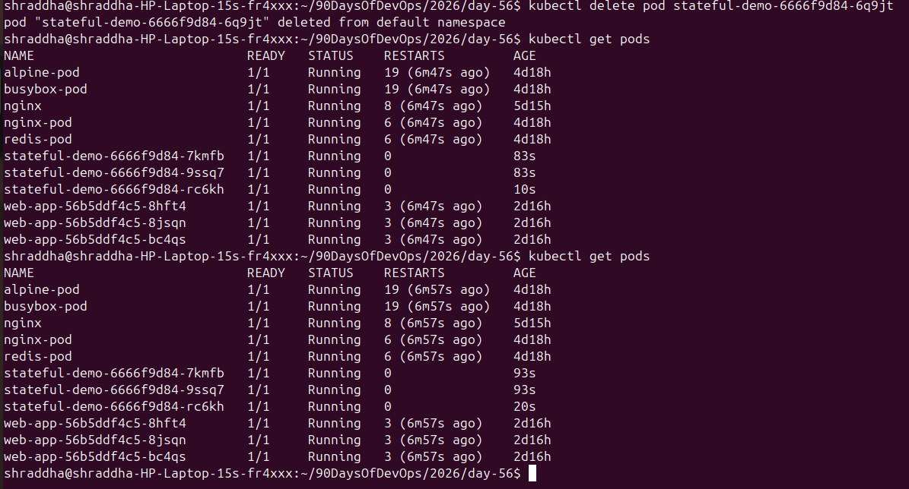
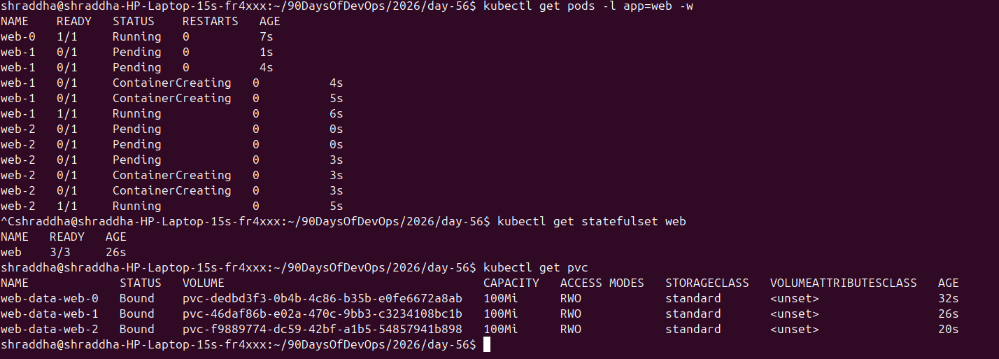
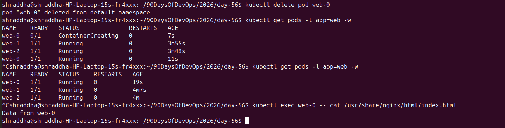
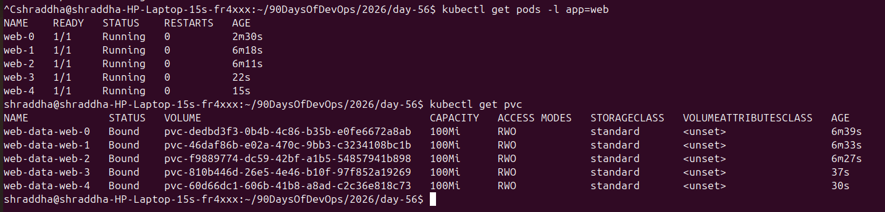
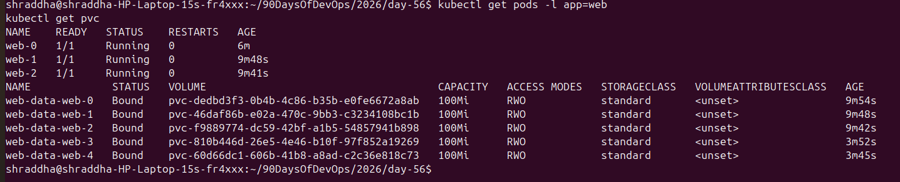

# Day 56 – Kubernetes StatefulSets

## Overview

A Kubernetes StatefulSet is a workload resource designed for applications that need:

- Stable Pod names
- Stable network identities
- Ordered Pod creation and termination
- Persistent storage for each Pod

StatefulSets are commonly used for stateful applications such as:

- MySQL
- PostgreSQL
- MongoDB
- Kafka
- ZooKeeper

Unlike a Deployment, StatefulSet Pods have predictable identities such as:

```text
web-0
web-1
web-2
````

---

# Task 1 – Deployment vs StatefulSet

First, I created a Deployment with 3 nginx replicas.

```bash
kubectl create deployment stateful-demo \
  --image=nginx \
  --replicas=3
```

The Deployment created Pods with random names:

```text
stateful-demo-6666f9d84-6q9jt
stateful-demo-6666f9d84-7kmfb
stateful-demo-6666f9d84-9ssq7
```

After deleting one Pod:

```bash
kubectl delete pod stateful-demo-6666f9d84-6q9jt
```

Kubernetes created a replacement:

```text
stateful-demo-6666f9d84-rc6kh
```

The replacement had a different name.

This demonstrates that Deployments provide interchangeable Pods rather than stable Pod identities.

### Why can random Pod names be a problem?

For stateless applications such as web servers, random Pod names are usually fine.

For stateful applications such as databases, individual instances may need to be identified consistently.

For example:

```text
web-0
web-1
web-2
```

allows an application to refer to a specific instance.

### Cleanup

The temporary Deployment was deleted:

```bash
kubectl delete deployment stateful-demo
```

---

# Task 2 – Headless Service

I created a Headless Service for the StatefulSet.

```yaml
apiVersion: v1
kind: Service
metadata:
  name: web-headless
spec:
  clusterIP: None
  selector:
    app: web
  ports:
    - port: 80
      targetPort: 80
```

Applied with:

```bash
kubectl apply -f headless-service.yaml
```

Verification:

```bash
kubectl get service web-headless
```

Output showed:

```text
NAME           TYPE        CLUSTER-IP   EXTERNAL-IP   PORT(S)
web-headless   ClusterIP   None         <none>        80/TCP
```

The important value is:

```text
CLUSTER-IP: None
```

This means the Service is Headless.

A Headless Service does not provide a single virtual IP for load balancing. Instead, Kubernetes DNS can provide records for individual StatefulSet Pods.

---

# Task 3 – Create a StatefulSet

I created a StatefulSet named `web` with 3 replicas.

Important configuration:

* StatefulSet name: `web`
* Replicas: `3`
* Headless Service: `web-headless`
* Container image: `nginx`
* Storage per Pod: `100Mi`
* Access mode: `ReadWriteOnce`

The StatefulSet created stable Pod names:

```text
web-0
web-1
web-2
```

### Ordered creation

I watched the Pods using:

```bash
kubectl get pods -l app=web -w
```

The Pods were created in order:

```text
web-0
web-1
web-2
```

`web-1` was created after `web-0` became Ready, and `web-2` was created after `web-1` became Ready.

### StatefulSet verification

```bash
kubectl get statefulset web
```

Result:

```text
NAME   READY
web    3/3
```

### PersistentVolumeClaims

```bash
kubectl get pvc
```

The StatefulSet created a separate PVC for each Pod:

```text
web-data-web-0
web-data-web-1
web-data-web-2
```

Each PVC had:

```text
STATUS: Bound
CAPACITY: 100Mi
ACCESS MODE: RWO
```

---

# Task 4 – Stable Network Identity

I created a temporary BusyBox Pod for DNS testing:

```bash
kubectl run dns-test \
  --image=busybox:1.36 \
  --restart=Never \
  --command -- sleep 3600
```

The StatefulSet Pod DNS format is:

```text
<pod-name>.<service-name>.<namespace>.svc.cluster.local
```

### web-0

```bash
kubectl exec dns-test -- nslookup web-0.web-headless.default.svc.cluster.local
```

Resolved to:

```text
10.244.0.22
```

### web-1

```bash
kubectl exec dns-test -- nslookup web-1.web-headless.default.svc.cluster.local
```

Resolved to:

```text
10.244.0.24
```

### web-2

```bash
kubectl exec dns-test -- nslookup web-2.web-headless.default.svc.cluster.local
```

Resolved to:

```text
10.244.0.26
```

Pod IP verification:

```bash
kubectl get pods -l app=web -o wide
```

The Pod IPs matched the DNS results:

```text
web-0   10.244.0.22
web-1   10.244.0.24
web-2   10.244.0.26
```

Therefore, DNS successfully resolved each individual StatefulSet Pod.

---

# Task 5 – Persistent Storage

I tested whether data survives Pod deletion.

First, I wrote data to `web-0`:

```bash
kubectl exec web-0 -- sh -c "echo 'Data from web-0' > /usr/share/nginx/html/index.html"
```

Verified:

```bash
kubectl exec web-0 -- cat /usr/share/nginx/html/index.html
```

Output:

```text
Data from web-0
```

Then I deleted the Pod:

```bash
kubectl delete pod web-0
```

Kubernetes recreated:

```text
web-0
```

After the new Pod became Ready, I checked the file again:

```bash
kubectl exec web-0 -- cat /usr/share/nginx/html/index.html
```

Output:

```text
Data from web-0
```

The data survived Pod deletion because the recreated `web-0` reattached to its persistent storage:

```text
web-0
   ↓
web-data-web-0
   ↓
Data
   ↓
Pod deleted
   ↓
web-0 recreated
   ↓
same PVC
   ↓
Data still exists
```

---

# Task 6 – Ordered Scaling

Initially, the StatefulSet had:

```text
web-0
web-1
web-2
```

I scaled it from 3 to 5 replicas:

```bash
kubectl scale statefulset web --replicas=5
```

The new Pods were created in order:

```text
web-3
web-4
```

After scaling up, the Pods were:

```text
web-0
web-1
web-2
web-3
web-4
```

### PVCs after scaling up

Five PVCs existed:

```text
web-data-web-0
web-data-web-1
web-data-web-2
web-data-web-3
web-data-web-4
```

Each PVC was:

```text
Bound
100Mi
RWO
```

---

## Scale Down

I then scaled the StatefulSet from 5 back to 3 replicas.

```bash
kubectl scale statefulset web --replicas=3
```

The StatefulSet retained:

```text
web-0
web-1
web-2
```

The higher ordinal Pods were removed:

```text
web-4
web-3
```

However, all five PVCs remained:

```text
web-data-web-0
web-data-web-1
web-data-web-2
web-data-web-3
web-data-web-4
```

This demonstrates that scaling down a StatefulSet removes Pods but does not automatically delete their PVCs.

This helps protect persistent data.

---

# Task 7 – Cleanup

The StatefulSet was deleted:

```bash
kubectl delete statefulset web
```

The Headless Service was deleted:

```bash
kubectl delete service web-headless
```

The temporary DNS Pod was deleted:

```bash
kubectl delete pod dns-test
```

The PVCs were then manually deleted:

```bash
kubectl delete pvc \
  web-data-web-0 \
  web-data-web-1 \
  web-data-web-2 \
  web-data-web-3 \
  web-data-web-4
```

StatefulSet deletion does not automatically remove PVCs. They must be cleaned up separately when the persistent data is no longer required.

---

# Deployment vs StatefulSet

| Feature           | Deployment                 | StatefulSet            |
| ----------------- | -------------------------- | ---------------------- |
| Pod names         | Random                     | Stable and ordered     |
| Pod identity      | Interchangeable            | Unique identity        |
| Startup order     | Generally simultaneous     | Ordered                |
| Termination order | No ordinal guarantee       | Reverse ordinal order  |
| Storage           | Usually shared or external | Individual PVC per Pod |
| Network identity  | No individual stable DNS   | Stable Pod DNS         |
| Best suited for   | Stateless applications     | Stateful applications  |

---

# Headless Service

A Headless Service is created using:

```yaml
clusterIP: None
```

Example:

```yaml
apiVersion: v1
kind: Service
metadata:
  name: web-headless
spec:
  clusterIP: None
  selector:
    app: web
```

The Headless Service works with StatefulSets to provide stable DNS records for individual Pods.

Example:

```text
web-0.web-headless.default.svc.cluster.local
web-1.web-headless.default.svc.cluster.local
web-2.web-headless.default.svc.cluster.local
```

---

# volumeClaimTemplates

StatefulSets can automatically create a PVC for each Pod using `volumeClaimTemplates`.

Example:

```yaml
volumeClaimTemplates:
  - metadata:
      name: web-data
    spec:
      accessModes:
        - ReadWriteOnce
      resources:
        requests:
          storage: 100Mi
```

This produces PVCs following the pattern:

```text
<template-name>-<statefulset-name>-<ordinal>
```

For this lab:

```text
web-data-web-0
web-data-web-1
web-data-web-2
```

Each StatefulSet Pod receives its own persistent storage.

---

# Important StatefulSet Concepts

## Stable Identity

StatefulSet Pods have predictable names:

```text
web-0
web-1
web-2
```

If `web-0` is deleted, Kubernetes recreates `web-0` instead of creating a completely different ordinal identity.

## Stable Network Identity

Each Pod gets a predictable DNS name:

```text
web-0.web-headless.default.svc.cluster.local
```

This allows applications to communicate with specific StatefulSet instances.

## Persistent Storage

Each Pod has its own PVC.

For example:

```text
web-0 → web-data-web-0
web-1 → web-data-web-1
web-2 → web-data-web-2
```

This allows data to remain available when a Pod is recreated.

## Ordered Operations

StatefulSets provide ordered Pod management.

Creation:

```text
web-0 → web-1 → web-2
```

Termination/scaling down:

```text
web-2 → web-1 → web-0
```

---

# Commands Practiced

### Deployment

```bash
kubectl create deployment stateful-demo --image=nginx --replicas=3
kubectl get deployment
kubectl get pods
kubectl delete pod <pod-name>
kubectl delete deployment stateful-demo
```

### Headless Service

```bash
kubectl apply -f headless-service.yaml
kubectl get service web-headless
```

### StatefulSet

```bash
kubectl apply -f statefulset.yaml
kubectl get statefulset
kubectl get pods -l app=web
kubectl get pvc
kubectl scale statefulset web --replicas=5
kubectl scale statefulset web --replicas=3
```

### DNS

```bash
kubectl run dns-test \
  --image=busybox:1.36 \
  --restart=Never \
  --command -- sleep 3600

kubectl exec dns-test -- nslookup web-0.web-headless.default.svc.cluster.local
kubectl exec dns-test -- nslookup web-1.web-headless.default.svc.cluster.local
kubectl exec dns-test -- nslookup web-2.web-headless.default.svc.cluster.local
```

### Storage

```bash
kubectl exec web-0 -- sh -c "echo 'Data from web-0' > /usr/share/nginx/html/index.html"

kubectl exec web-0 -- cat /usr/share/nginx/html/index.html

kubectl delete pod web-0

kubectl exec web-0 -- cat /usr/share/nginx/html/index.html
```

---

# Key Learnings

1. Deployments are primarily designed for stateless applications.
2. StatefulSets provide stable Pod identities.
3. StatefulSet Pods use predictable ordinal names such as `web-0`, `web-1`, and `web-2`.
4. StatefulSets provide ordered Pod creation and termination.
5. Headless Services enable stable DNS records for individual StatefulSet Pods.
6. `volumeClaimTemplates` creates individual PVCs for StatefulSet Pods.
7. Data stored on a PVC can survive Pod deletion.
8. Scaling down a StatefulSet does not automatically delete its PVCs.
9. StatefulSet deletion also does not automatically delete PVCs.
10. Persistent storage should be cleaned up separately when it is no longer needed.

---

# Screenshots

## 1. Deployment Random Pod Names



## 2. Headless Service


## 3. StatefulSet Pods and PVCs



## 4. StatefulSet DNS Resolution


## 5. Data Persistence



## 6. Scaling to Five Pods



## 7. PVC Retention After Scale Down



---

# Conclusion

Day 56 demonstrated why StatefulSets are important for stateful applications.

The key difference I learned is:

```text
Deployment
→ interchangeable Pods
→ random names
→ mainly stateless workloads

StatefulSet
→ stable Pod identity
→ ordered Pods
→ stable DNS
→ individual persistent storage
→ stateful workloads
```

StatefulSets provide the identity and storage guarantees required by many distributed and database systems.

````

