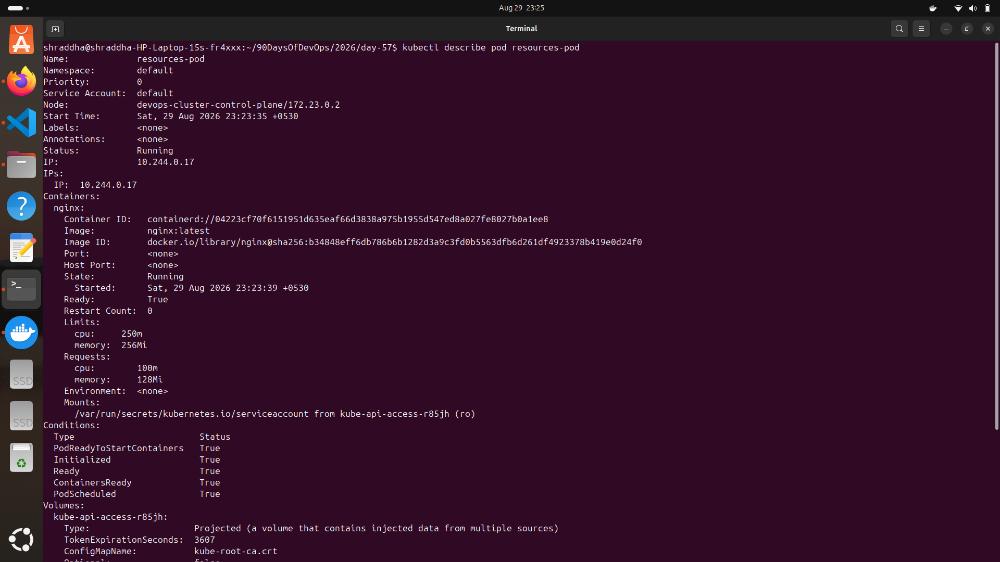
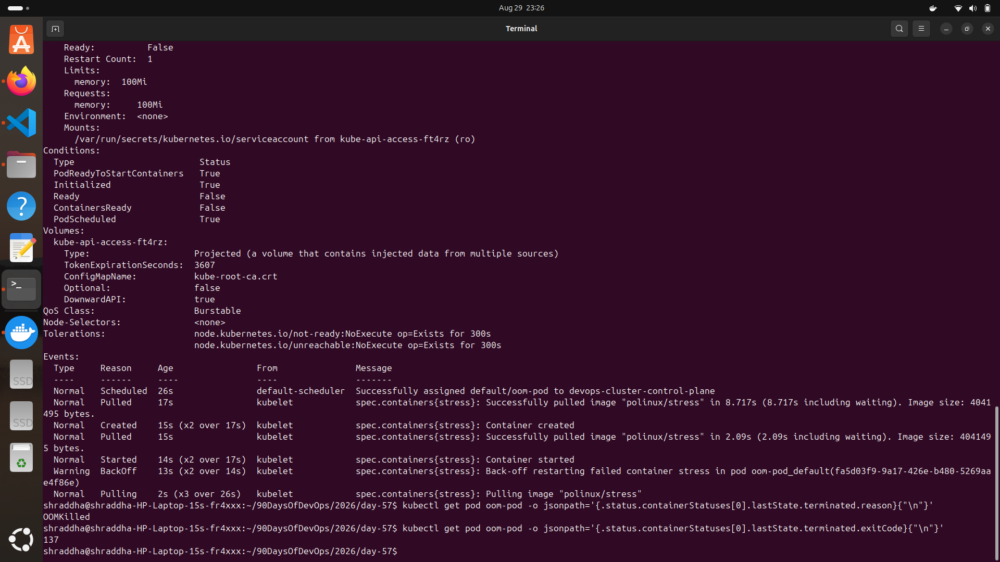
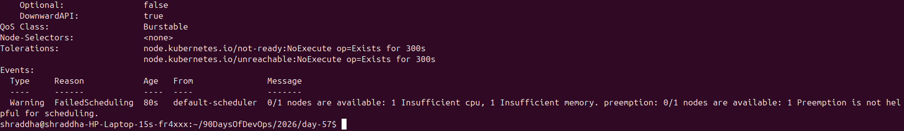
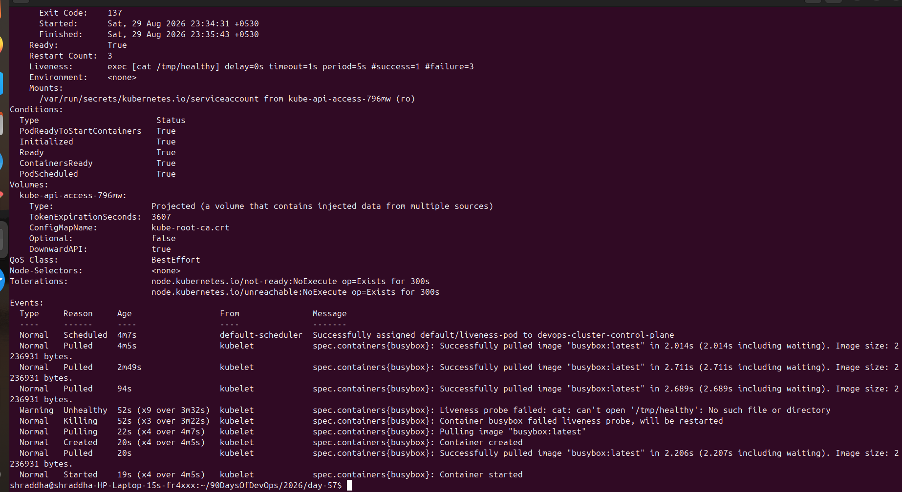
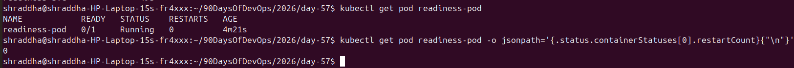

# Day 57 – Resource Requests, Limits, and Probes

## 📌 Overview

Today I learned how Kubernetes manages container resources using **CPU and memory requests and limits**, and how Kubernetes monitors application health using **liveness, readiness, and startup probes**.

I also tested real Kubernetes failure scenarios including:

* Resource requests and limits
* Burstable QoS
* `OOMKilled`
* Pending Pods caused by insufficient resources
* Liveness probe failures
* Readiness probe failures
* Startup probes

---

# 🎯 Objectives

* Understand CPU and memory requests.
* Understand CPU and memory limits.
* Verify Kubernetes QoS classes.
* Observe an `OOMKilled` container.
* Understand why a Pod can remain `Pending`.
* Configure and test liveness probes.
* Configure and test readiness probes.
* Configure and test startup probes.
* Understand how Kubernetes automatically handles unhealthy containers.

---

# 🧪 Task 1 – Resource Requests and Limits

## Manifest

I created `resources-pod.yaml` with the following configuration:

```yaml
resources:
  requests:
    cpu: "100m"
    memory: "128Mi"
  limits:
    cpu: "250m"
    memory: "256Mi"
```

### Requests

Requests represent the minimum amount of CPU and memory required by the container.

Kubernetes uses requests during **Pod scheduling** to determine whether a node has enough available resources.

### Limits

Limits define the maximum amount of CPU and memory the container is allowed to use.

The kubelet and container runtime enforce these limits.

### Verification

Command used:

```bash
kubectl describe pod resources-pod
```

The Pod had:

```text
CPU Request:    100m
Memory Request: 128Mi
CPU Limit:      250m
Memory Limit:   256Mi
```

### QoS Class

Because the resource requests and limits were configured but were different, Kubernetes assigned:

```text
QoS Class: Burstable
```

### Screenshot



---

# 💥 Task 2 – OOMKilled

For this task, I created a Pod using the `polinux/stress` image.

The container had a memory limit of:

```text
100Mi
```

while the stress command attempted to allocate:

```text
200M
```

Command configuration:

```yaml
command: ["stress"]
args: ["--vm", "1", "--vm-bytes", "200M", "--vm-hang", "1"]
```

Because the container attempted to use more memory than its configured limit, Kubernetes terminated the container.

### Verification

Commands used:

```bash
kubectl describe pod oom-pod
```

and:

```bash
kubectl get pod oom-pod -o jsonpath='{.status.containerStatuses[0].lastState.terminated.reason}{"\n"}'
```

Expected result:

```text
OOMKilled
```

The container termination exit code was:

```text
137
```

### Why 137?

Exit code `137` means the process was terminated by `SIGKILL`.

```text
128 + 9 = 137
```

where signal `9` is `SIGKILL`.

### Key Learning

* CPU is compressible and can be throttled.
* Memory is not compressible.
* When a container exceeds its memory limit, it can be terminated with `OOMKilled`.

### Screenshot



---

# ⏳ Task 3 – Pending Pod

I created a Pod with extremely large resource requests:

```yaml
requests:
  cpu: "100"
  memory: "128Gi"
```

The Pod remained in:

```text
Pending
```

state.

Verification:

```bash
kubectl get pod pending-pod
```

Result:

```text
NAME          READY   STATUS    RESTARTS
pending-pod   0/1     Pending   0
```

### Why did this happen?

The Kubernetes scheduler could not find a node with enough available CPU and memory to satisfy the Pod's resource requests.

I checked the scheduler events using:

```bash
kubectl describe pod pending-pod
```

The scheduler reported a:

```text
FailedScheduling
```

event with insufficient cluster resources.

### Screenshot



---

# ❤️ Task 4 – Liveness Probe

A **liveness probe** determines whether a container is still functioning correctly.

If the liveness probe repeatedly fails, Kubernetes restarts the container.

For this task, I used a BusyBox container that:

1. Created `/tmp/healthy`
2. Waited for 30 seconds
3. Deleted `/tmp/healthy`
4. Continued running

The liveness probe checked:

```bash
cat /tmp/healthy
```

Configuration:

```yaml
livenessProbe:
  exec:
    command:
      - cat
      - /tmp/healthy
  periodSeconds: 5
  failureThreshold: 3
```

After `/tmp/healthy` was removed, the probe failed repeatedly and Kubernetes restarted the container.

### Important

```text
Liveness failure → Container restart
```

### Screenshot



---

# 🚦 Task 5 – Readiness Probe

A **readiness probe** determines whether a Pod is ready to receive traffic.

For this task, I used an Nginx container with an HTTP readiness probe:

```yaml
readinessProbe:
  httpGet:
    path: /
    port: 80
  periodSeconds: 5
```

I exposed the Pod using:

```bash
kubectl expose pod readiness-pod --port=80 --name=readiness-svc
```

Initially, the Pod was ready and its IP appeared in the Service endpoints.

Then I removed the Nginx index page:

```bash
kubectl exec readiness-pod -- rm /usr/share/nginx/html/index.html
```

The readiness probe began failing.

The Pod became:

```text
0/1
```

and was removed from the Service endpoints.

However, the container itself was **not restarted**.

### Important

```text
Readiness failure → Remove Pod from Service endpoints
```

It does **not** restart the container.

### Screenshot



---

# 🚀 Task 6 – Startup Probe

A **startup probe** is useful for applications that require extra time to initialize.

For this task, the container waited 20 seconds before creating:

```text
/tmp/started
```

The startup probe checked for this file.

Configuration:

```yaml
startupProbe:
  exec:
    command:
      - cat
      - /tmp/started
  periodSeconds: 5
  failureThreshold: 12
```

This provided a maximum startup budget of approximately:

```text
5 × 12 = 60 seconds
```

While the startup probe was running, the liveness probe did not interfere with the container startup.

After the startup probe succeeded, the liveness probe became active.

### What if `failureThreshold` were 2?

With:

```text
periodSeconds: 5
failureThreshold: 2
```

the container would have only about a 10-second failure budget before the startup probe could cause the container to be restarted.

Since the application requires 20 seconds to create `/tmp/started`, the container could be killed before completing startup.

### Important

```text
Startup probe → Protects slow-starting applications
```

---

# 📊 Liveness vs Readiness vs Startup

| Probe     | Purpose                                   | Failure Result                              |
| --------- | ----------------------------------------- | ------------------------------------------- |
| Liveness  | Detect unhealthy/stuck container          | Container restarted                         |
| Readiness | Determine whether Pod can receive traffic | Removed from Service endpoints              |
| Startup   | Give slow applications time to start      | Container can be restarted if startup fails |

---

# 🧠 Resource Requests vs Limits

| Feature           | Requests                     | Limits                    |
| ----------------- | ---------------------------- | ------------------------- |
| Purpose           | Minimum required resources   | Maximum allowed resources |
| Used by scheduler | ✅ Yes                        | ❌ No                      |
| CPU               | Guaranteed scheduling amount | Maximum CPU usage         |
| Memory            | Guaranteed scheduling amount | Maximum memory usage      |
| Example           | `100m` CPU                   | `250m` CPU                |
| Example           | `128Mi` memory               | `256Mi` memory            |

---

# 📚 QoS Classes

Kubernetes has three main QoS classes:

### Guaranteed

Requests and limits are configured and equal for containers.

```yaml
requests:
  cpu: "100m"
  memory: "128Mi"

limits:
  cpu: "100m"
  memory: "128Mi"
```

### Burstable

Requests and limits are configured but differ.

```yaml
requests:
  cpu: "100m"
  memory: "128Mi"

limits:
  cpu: "250m"
  memory: "256Mi"
```

### BestEffort

No CPU or memory requests/limits are configured.

---

# 🛠️ Commands Practiced

```bash
kubectl apply -f resources-pod.yaml
kubectl get pod resources-pod
kubectl describe pod resources-pod

kubectl apply -f oom-pod.yaml
kubectl get pod oom-pod
kubectl describe pod oom-pod

kubectl apply -f pending-pod.yaml
kubectl get pod pending-pod
kubectl describe pod pending-pod

kubectl apply -f liveness-pod.yaml
kubectl get pod liveness-pod
kubectl describe pod liveness-pod

kubectl apply -f readiness-pod.yaml
kubectl expose pod readiness-pod --port=80 --name=readiness-svc
kubectl get endpoints readiness-svc

kubectl exec readiness-pod -- rm /usr/share/nginx/html/index.html

kubectl apply -f startup-pod.yaml
kubectl get pod startup-pod
kubectl describe pod startup-pod
```

---

# 🔍 Key Observations

### Observation 1

Resource requests influence Kubernetes scheduling.

### Observation 2

Resource limits restrict container resource usage.

### Observation 3

Exceeding a memory limit can result in:

```text
OOMKilled
Exit Code: 137
```

### Observation 4

A Pod requesting more resources than the cluster can provide remains:

```text
Pending
```

### Observation 5

Liveness probe failure causes a container restart.

### Observation 6

Readiness probe failure removes the Pod from Service endpoints without restarting the container.

### Observation 7

Startup probes protect slow-starting applications from premature liveness failures.

---

# 📸 Screenshots

## Resource Requests and Limits


## OOMKilled


## Pending Pod


## Liveness Probe


## Readiness Probe


---

# 🎯 Interview Questions

### 1. What is a resource request?

A resource request specifies the minimum CPU or memory a container needs. Kubernetes uses it during scheduling.

### 2. What is a resource limit?

A resource limit specifies the maximum CPU or memory a container can use.

### 3. What happens when a container exceeds its CPU limit?

CPU usage is throttled.

### 4. What happens when a container exceeds its memory limit?

The container can be terminated with `OOMKilled`.

### 5. What is exit code 137?

Exit code `137` generally indicates that the process was killed using `SIGKILL`.

### 6. What is a liveness probe?

A liveness probe checks whether a container is still healthy. Failure can cause Kubernetes to restart the container.

### 7. What is a readiness probe?

A readiness probe determines whether a Pod is ready to receive traffic.

### 8. Does a readiness probe failure restart the container?

No. The Pod is removed from Service endpoints but the container continues running.

### 9. What is a startup probe?

A startup probe gives slow-starting applications additional time to initialize before liveness checking begins.

### 10. What is the difference between liveness and readiness?

```text
Liveness  → Should Kubernetes restart the container?
Readiness → Should the Pod receive traffic?
```

---

# 💡 Key Takeaways

Today I learned how Kubernetes can:

* Schedule workloads intelligently using resource requests.
* Control resource consumption using limits.
* Detect memory exhaustion with `OOMKilled`.
* Keep unschedulable Pods in `Pending` state.
* Automatically restart unhealthy containers using liveness probes.
* Control traffic using readiness probes.
* Protect slow-starting applications using startup probes.

These features are essential for building **reliable, self-healing Kubernetes workloads**.

---

# ✅ Day 57 Completed

**Topics:** Resource Management + Kubernetes Health Probes

**Status:** Completed ✅

**Next:** Continue with the next Kubernetes topic in the 90 Days of DevOps challenge.
