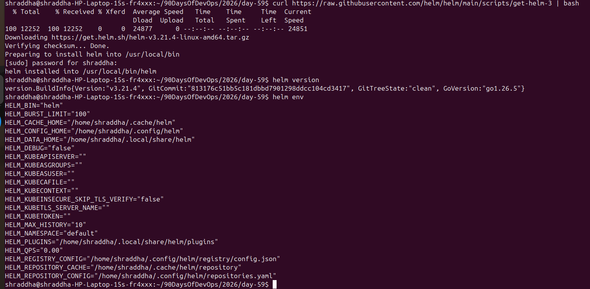
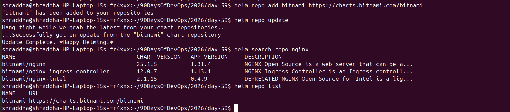
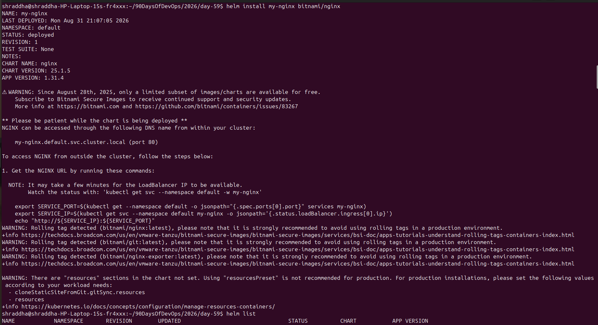
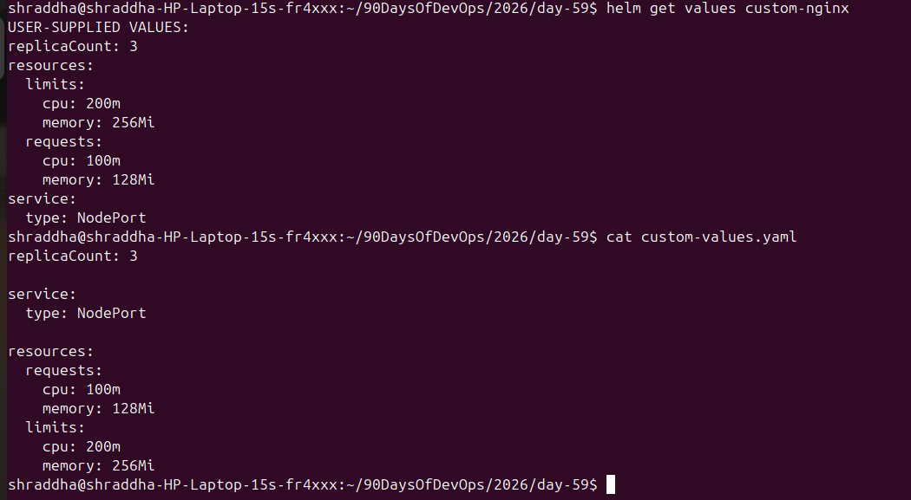
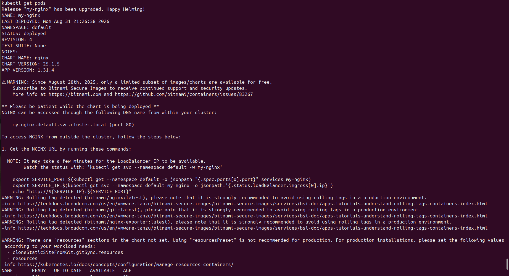
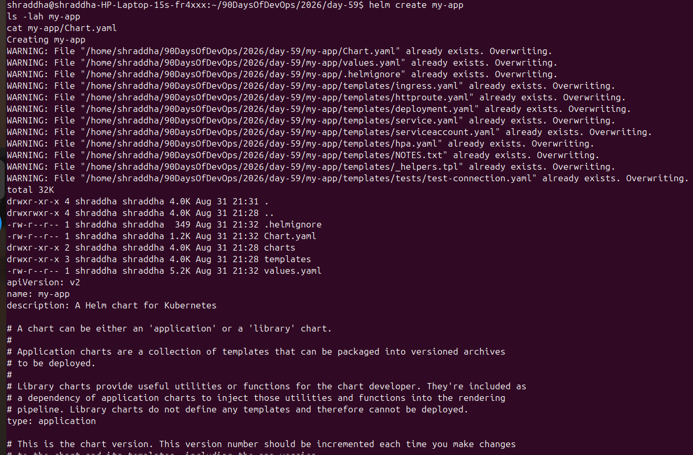
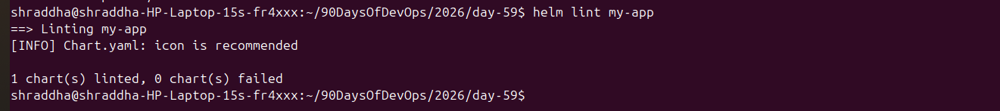
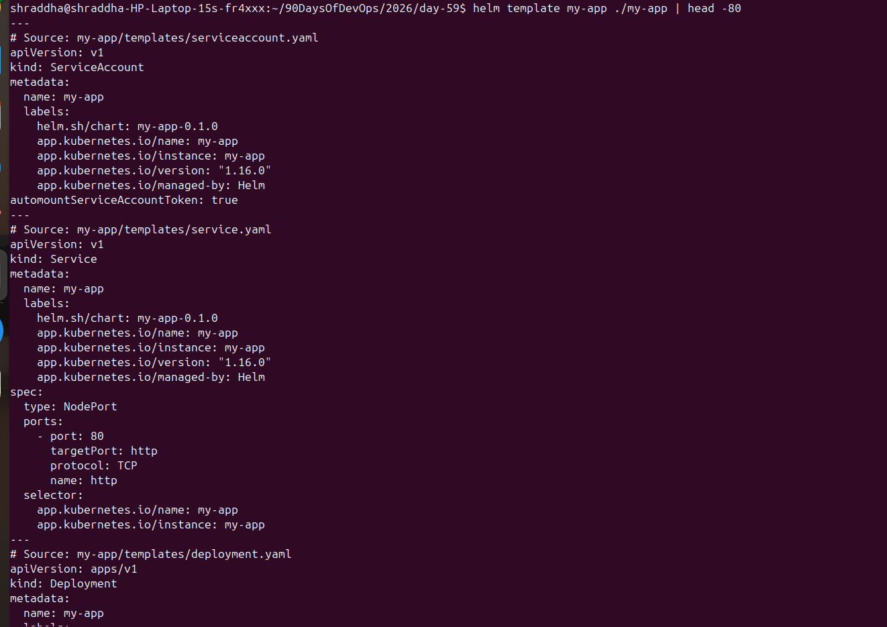
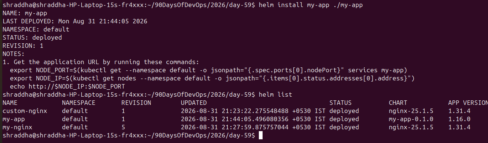
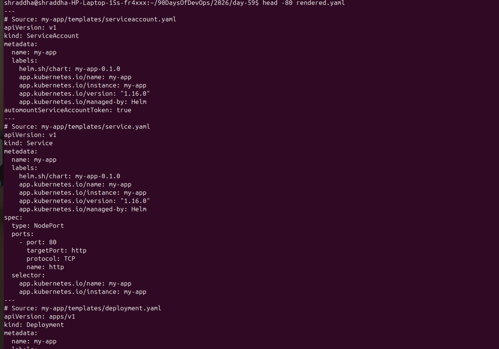

# Day 59 – Helm: Kubernetes Package Manager

## 📌 Overview

Today I learned and practiced **Helm**, the package manager for Kubernetes.

I worked with Helm charts, custom values, releases, upgrades, rollbacks, chart creation, resource configuration, and Helm troubleshooting.

---

## 🎯 Objectives

* Understand what Helm is
* Understand Helm charts and releases
* Install an application using a Helm chart
* Customize a deployment using `values.yaml`
* Configure replicas and resource limits
* Perform Helm upgrades
* Perform Helm rollbacks
* Check Helm release history
* Create a custom Helm chart
* Validate a chart using `helm lint`
* Understand common Helm installation/network issues

---

# 1. What is Helm?

**Helm** is a package manager for Kubernetes.

Instead of manually creating multiple Kubernetes YAML files, Helm allows us to package Kubernetes resources into a reusable **Chart**.

### Important Helm concepts

| Concept     | Meaning                                      |
| ----------- | -------------------------------------------- |
| Helm        | Kubernetes package manager                   |
| Chart       | Package containing Kubernetes templates      |
| Release     | Installed instance of a Helm chart           |
| values.yaml | Configuration values for a chart             |
| templates/  | Kubernetes resource templates                |
| Chart.yaml  | Chart metadata                               |
| Repository  | Location from where charts can be downloaded |

---

# 2. Check Helm Version

```bash
helm version
```

This verifies that Helm is installed and available.

---

# 3. Install NGINX Using Helm

I installed the Bitnami NGINX chart:

```bash
helm install my-nginx bitnami/nginx
```

The first attempt failed because the system could resolve Docker Registry DNS but the connection timed out:

```text
dial tcp: lookup registry-1.docker.io: i/o timeout
```

I verified internet connectivity:

```bash
ping -c 4 google.com
```

DNS resolution was also tested:

```bash
getent hosts registry-1.docker.io
```

Docker image connectivity was confirmed with:

```bash
docker pull bitnami/nginx:latest
```

After connectivity was available, the Helm installation succeeded.

---

# 4. Check Helm Release

```bash
helm list
```

This shows installed Helm releases.

Example release:

```text
my-nginx
```

---

# 5. Check Kubernetes Resources

### Pods

```bash
kubectl get pods
```

### Deployment

```bash
kubectl get deployment my-nginx
```

### Services

```bash
kubectl get svc
```

The NGINX application was successfully deployed into Kubernetes.

---

# 6. Custom Helm Values

I created a custom values file:

```bash
nano custom-values.yaml
```

Configuration used:

```yaml
replicaCount: 3

service:
  type: NodePort

resources:
  requests:
    cpu: 100m
    memory: 128Mi
  limits:
    cpu: 200m
    memory: 256Mi
```

### Explanation

* `replicaCount: 3` → runs 3 NGINX replicas
* `service.type: NodePort` → exposes the service through a node port
* CPU request → `100m`
* Memory request → `128Mi`
* CPU limit → `200m`
* Memory limit → `256Mi`

---

# 7. Install Using Custom Values

```bash
helm install custom-nginx bitnami/nginx -f custom-values.yaml
```

The release was successfully deployed.

Verify:

```bash
kubectl get pods
```

Three NGINX pods were created:

```text
custom-nginx-...
custom-nginx-...
custom-nginx-...
```

Check the service:

```bash
kubectl get svc
```

The service type was:

```text
NodePort
```

---

# 8. Verify User-Supplied Values

```bash
helm get values custom-nginx
```

Output showed:

```yaml
replicaCount: 3

resources:
  limits:
    cpu: 200m
    memory: 256Mi
  requests:
    cpu: 100m
    memory: 128Mi

service:
  type: NodePort
```

This confirms that my custom values were applied to the Helm release.

---

# 9. Helm Upgrade

I upgraded the `my-nginx` release and changed the replica count:

```bash
helm upgrade my-nginx bitnami/nginx --set replicaCount=5
```

Verify the deployment:

```bash
kubectl get deployment my-nginx
```

Verify the pods:

```bash
kubectl get pods
```

The deployment was updated to:

```text
5 replicas
```

---

# 10. Helm History

Helm maintains revision history for releases.

I checked the history using:

```bash
helm history my-nginx
```

Example:

```text
REVISION   STATUS
1          superseded
2          superseded
3          superseded
4          superseded
5          deployed
```

Each upgrade or rollback creates a new revision.

---

# 11. Helm Rollback

I rolled the release back to revision 1:

```bash
helm rollback my-nginx 1
```

Output:

```text
Rollback was a success! Happy Helming!
```

Then I verified:

```bash
kubectl get deployment my-nginx
kubectl get pods
```

The deployment returned to the configuration from revision 1.

Check history again:

```bash
helm history my-nginx
```

The rollback created a new revision rather than deleting the previous history.

---

# 12. Create a New Helm Chart

I created my own Helm chart:

```bash
helm create my-app
```

Then checked the files:

```bash
ls -lah my-app
```

Chart structure:

```text
my-app/
├── Chart.yaml
├── charts/
├── templates/
│   ├── NOTES.txt
│   ├── _helpers.tpl
│   ├── deployment.yaml
│   ├── hpa.yaml
│   ├── httproute.yaml
│   ├── ingress.yaml
│   ├── service.yaml
│   ├── serviceaccount.yaml
│   └── tests/
│       └── test-connection.yaml
└── values.yaml
```

---

# 13. Chart.yaml

I inspected the chart metadata:

```bash
cat my-app/Chart.yaml
```

`Chart.yaml` contains information about the Helm chart such as:

* Chart name
* Chart type
* Chart version
* Application version
* Description

---

# 14. values.yaml

I inspected the default configuration:

```bash
cat my-app/values.yaml
```

The default chart contains configuration for:

* Replica count
* Container image
* Image pull policy
* Service
* Ingress
* Resources
* Liveness probe
* Readiness probe
* Autoscaling
* Volumes
* Node selector
* Tolerations
* Affinity

---

# 15. Configure Container Resources

I modified `my-app/values.yaml` and configured:

```yaml
resources:
  requests:
    cpu: 100m
    memory: 128Mi
  limits:
    cpu: 200m
    memory: 256Mi
```

### Resource Requests

Requests represent the minimum resources Kubernetes should reserve for the container.

```text
CPU:    100m
Memory: 128Mi
```

### Resource Limits

Limits define the maximum resources the container can consume.

```text
CPU:    200m
Memory: 256Mi
```

---

# 16. YAML Troubleshooting

While editing `values.yaml`, I accidentally created an indentation/structure problem.

I used:

```bash
nl -ba my-app/values.yaml | sed -n '110,130p'
```

This helped identify the problematic lines.

I also used:

```bash
sed -n '110,130p' my-app/values.yaml | cat -A
```

This made whitespace and indentation easier to inspect.

The incorrect structure was:

```yaml
resources: {}
  resources:
  requests:
```

I corrected it to:

```yaml
resources:
  requests:
    cpu: 100m
    memory: 128Mi
  limits:
    cpu: 200m
    memory: 256Mi
```

This fixed the YAML structure.

---

# 17. Helm Lint

I validated the chart with:

```bash
helm lint my-app
```

`helm lint` checks a Helm chart for possible errors and validates the chart structure and templates.

During practice, YAML indentation errors caused linting to fail. After correcting `values.yaml`, the chart became valid.

---

# 18. Useful Helm Commands

### List releases

```bash
helm list
```

### Install a chart

```bash
helm install RELEASE CHART
```

### Install with custom values

```bash
helm install RELEASE CHART -f values.yaml
```

### Upgrade a release

```bash
helm upgrade RELEASE CHART
```

### Upgrade with `--set`

```bash
helm upgrade RELEASE CHART --set replicaCount=5
```

### Check release values

```bash
helm get values RELEASE
```

### Check release history

```bash
helm history RELEASE
```

### Rollback

```bash
helm rollback RELEASE REVISION
```

### Create a chart

```bash
helm create CHART_NAME
```

### Validate a chart

```bash
helm lint CHART_NAME
```

### Show installed releases

```bash
helm list
```

---

# 19. Helm Workflow

The basic Helm workflow I practiced:

```text
Create / Find Chart
       ↓
Configure values.yaml
       ↓
helm lint
       ↓
helm install
       ↓
kubectl get pods
       ↓
helm upgrade
       ↓
helm history
       ↓
helm rollback
       ↓
Verify Kubernetes resources
```

---

# 20. Troubleshooting Learned

### Problem 1: Docker Registry Timeout

Error:

```text
dial tcp: lookup registry-1.docker.io: i/o timeout
```

Checks performed:

```bash
ping -c 4 google.com
getent hosts registry-1.docker.io
docker pull bitnami/nginx:latest
```

The issue was related to connectivity to the Docker registry rather than the Helm chart configuration.

---

### Problem 2: YAML Parsing Error

Error:

```text
unable to parse YAML
did not find expected key
```

Debugging commands:

```bash
nl -ba my-app/values.yaml | sed -n '110,130p'
```

```bash
sed -n '110,130p' my-app/values.yaml | cat -A
```

The problem was incorrect YAML indentation/structure.

---

# 21. Screenshots

## Helm Installation



## Custom Values



## Helm Deployment



## Helm Upgrade



## Helm Rollback



## Helm History



## Create Helm Chart



## Chart Structure



## values.yaml



## Final Values



---

# 22. Interview Questions

### 1. What is Helm?

Helm is a package manager for Kubernetes that helps deploy and manage applications using reusable charts.

### 2. What is a Helm Chart?

A Helm Chart is a package containing Kubernetes resource templates and configuration required to deploy an application.

### 3. What is a Helm Release?

A release is a running instance of a Helm chart in a Kubernetes cluster.

### 4. What is values.yaml?

`values.yaml` contains configurable values that are passed to Helm templates.

### 5. What is Chart.yaml?

`Chart.yaml` contains metadata about a Helm chart.

### 6. What does `helm upgrade` do?

It updates an existing Helm release with a new chart version or configuration.

### 7. What does `helm rollback` do?

It restores a Helm release to a previous revision.

### 8. How do you check Helm release history?

```bash
helm history RELEASE_NAME
```

### 9. How do you validate a Helm chart?

```bash
helm lint CHART_NAME
```

### 10. What is the difference between `-f` and `--set`?

`-f` loads configuration from a values file:

```bash
helm install my-nginx bitnami/nginx -f custom-values.yaml
```

`--set` directly overrides individual values:

```bash
helm upgrade my-nginx bitnami/nginx --set replicaCount=5
```

---

# 23. Key Takeaways

Today I learned that Helm simplifies Kubernetes application deployment by packaging Kubernetes manifests into reusable charts.

I practiced:

* Helm installation
* Helm charts
* Helm releases
* `values.yaml`
* Custom configurations
* Resource requests and limits
* NodePort services
* Helm upgrades
* Helm rollback
* Helm history
* Creating custom charts
* YAML troubleshooting
* Chart validation with `helm lint`

### ✅ Day 59 Completed

**Topic:** Helm – Kubernetes Package Manager

**Status:** Completed ✅
