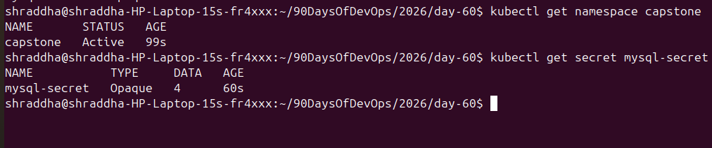
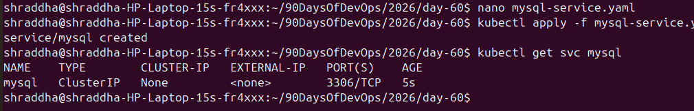
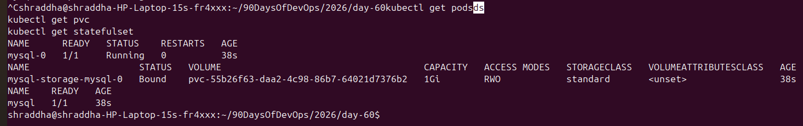
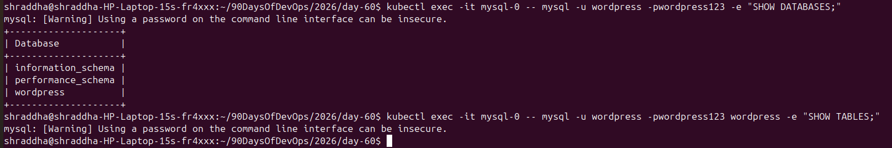
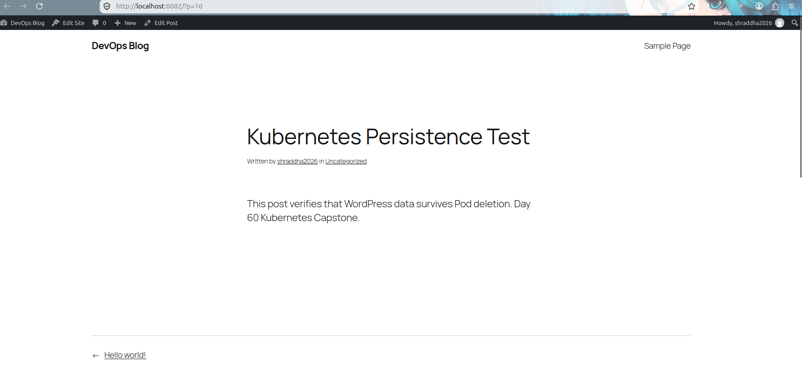
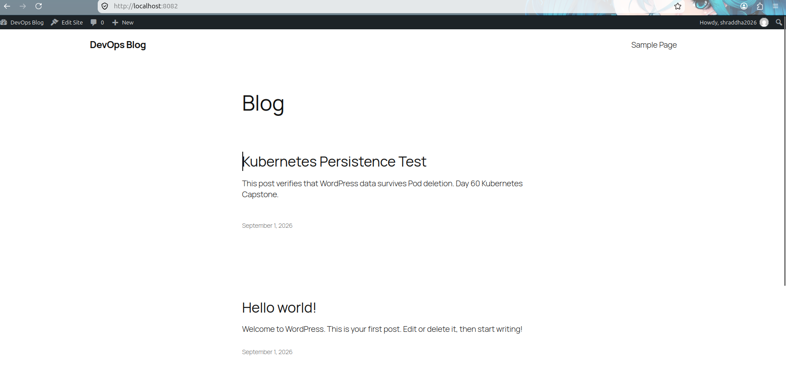

# Day 60 - Kubernetes Capstone: WordPress + MySQL

## Overview

On Day 60, I built a complete WordPress application on Kubernetes using:

- Kubernetes Deployment
- Kubernetes StatefulSet
- MySQL 8.0
- WordPress
- PersistentVolumeClaim (PVC)
- Kubernetes Secret
- ConfigMap
- ClusterIP Service
- NodePort Service
- Liveness Probe
- Readiness Probe

The main objective was to deploy WordPress with MySQL and verify that WordPress data survives Pod deletion using persistent storage.

---

## Architecture

```text
                    User
                     |
                     v
              WordPress Service
                     |
                     v
          +----------------------+
          | WordPress Deployment |
          |      2 Replicas      |
          +----------------------+
                 |        |
                 |        |
                 v        v
             WordPress Pods
                 |
                 | MySQL connection
                 v
          +----------------------+
          |   MySQL StatefulSet  |
          |       mysql-0        |
          +----------------------+
                     |
                     v
          +----------------------+
          |        PVC           |
          | mysql-storage-mysql-0|
          |        1Gi           |
          +----------------------+
                     |
                     v
              Persistent Storage
````

---

# 1. Create the Capstone Namespace

Created a dedicated namespace for the application:

```bash
kubectl create namespace capstone
```

Configured the current Kubernetes context to use the `capstone` namespace:

```bash
kubectl config set-context --current --namespace=capstone
```

Verification:

```bash
kubectl get namespace capstone
```



---

# 2. Create MySQL Secret

Created a Kubernetes Secret containing MySQL credentials.

The Secret stores:

* MySQL root password
* MySQL database name
* MySQL user
* MySQL user password

Applied the Secret:

```bash
kubectl apply -f mysql-secret.yaml
```

Verification:

```bash
kubectl get secret mysql-secret
```


> Note: Secret values should not be exposed directly in screenshots or documentation.

---

# 3. MySQL Service

Created a MySQL headless Service for stable DNS-based communication with the StatefulSet.

Applied:

```bash
kubectl apply -f mysql-service.yaml
```

Verification:

```bash
kubectl get svc mysql
```



---

# 4. MySQL StatefulSet

Created a MySQL StatefulSet using the `mysql:8.0` image.

The StatefulSet provides:

* Stable Pod identity
* Stable network identity
* Persistent storage
* Ordered Pod management

Verification:

```bash
kubectl get pods
kubectl get svc
kubectl get statefulset
```



Expected resources:

```text
mysql-0
mysql Service
mysql StatefulSet
```

---

# 5. PersistentVolumeClaim

MySQL uses a PersistentVolumeClaim:

```text
mysql-storage-mysql-0
```

The PVC has:

```text
Capacity:      1Gi
Access Mode:   RWO
Status:        Bound
```

Verification:

```bash
kubectl get pvc
```

The PVC ensures that MySQL data is stored independently from the MySQL Pod lifecycle.

---

# 6. Verify MySQL Database

Connected to MySQL using the Kubernetes Pod:

```bash
kubectl exec -it mysql-0 -- mysql -u wordpress -pwordpress123 wordpress
```

Verified available databases:

```sql
SHOW DATABASES;
```

The WordPress database is:

```text
wordpress
```



---

# 7. Verify WordPress Tables

After WordPress installation, verified the WordPress database tables:

```bash
kubectl exec -it mysql-0 -- mysql -u wordpress -pwordpress123 wordpress -e "SHOW TABLES;"
```

Important WordPress tables include:

```text
wp_posts
wp_users
wp_options
wp_postmeta
wp_comments
wp_terms
wp_termmeta
wp_usermeta
```

The `wp_posts` table stores WordPress posts.


---

# 8. WordPress ConfigMap

Created the WordPress ConfigMap:

```bash
kubectl apply -f wordpress-config.yaml
```

Verification:

```bash
kubectl get configmap wordpress-config
```

The ConfigMap provides non-sensitive WordPress configuration.


---

# 9. WordPress Deployment

Created a WordPress Deployment with two replicas.

Verification:

```bash
kubectl get pods
kubectl get deployment wordpress
```

Expected:

```text
wordpress-xxxxx-xxxxx   1/1   Running
wordpress-xxxxx-xxxxx   1/1   Running
```


---

# 10. WordPress Database Configuration

WordPress connects to MySQL using:

```text
WORDPRESS_DB_NAME=wordpress
WORDPRESS_DB_HOST=mysql-0.mysql.capstone.svc.cluster.local:3306
WORDPRESS_DB_USER=wordpress
```

The database password is supplied through the Kubernetes Secret.

This separates application configuration from sensitive credentials.

---

# 11. Liveness and Readiness Probes

Configured WordPress health checks using:

```text
Liveness:
GET /wp-login.php

Readiness:
GET /wp-login.php
```

The probes allow Kubernetes to determine:

* Whether the container is alive
* Whether the container is ready to receive traffic

Verification:

```bash
kubectl describe pod <wordpress-pod-name>
```

---

# 12. WordPress Service

Created the WordPress Service:

```bash
kubectl apply -f wordpress-service.yaml
```

Verification:

```bash
kubectl get svc wordpress
```

The Service provides stable access to the WordPress Pods.


---

# 13. Access WordPress

Used port forwarding to access WordPress locally:

```bash
kubectl port-forward svc/wordpress 8082:80
```

Opened:

```text
http://localhost:8082
```

---

# 14. Persistence Test

Created a unique WordPress post:

## Kubernetes Persistence Test

Content:

```text
This post verifies that WordPress data survives Pod deletion.
Day 60 Kubernetes Capstone.
```

The post was successfully published and visible on the WordPress website.



---

# 15. Delete WordPress Pod

Deleted one WordPress Pod:

```bash
kubectl delete pod <wordpress-pod-name>
```

Kubernetes automatically created a replacement Pod because the Deployment maintains two replicas.

Verified:

```bash
kubectl get pods
```

The replacement Pod reached:

```text
1/1 Running
```

---

# 16. Verify Persistence

After the WordPress Pod was recreated, accessed the WordPress website again.

The following post was still available:

```text
Kubernetes Persistence Test
```

This proves that the WordPress post data was stored in MySQL and was not lost when the WordPress Pod was deleted.



---

# 17. Final Verification

Verified the complete Kubernetes environment:

```bash
kubectl get pods
kubectl get pvc
kubectl get statefulset
```

Final state:

```text
MySQL Pod              Running
WordPress Pod 1        Running
WordPress Pod 2        Running
MySQL StatefulSet      1/1 Ready
MySQL PVC              Bound
```

---

# 18. Key Learning

### StatefulSet

A StatefulSet is useful for stateful applications because it provides stable Pod identity and persistent storage.

### PersistentVolumeClaim

A PVC requests persistent storage for an application.

### Secret

Secrets are used to store sensitive information such as passwords.

### ConfigMap

ConfigMaps store non-sensitive configuration.

### Deployment

A Deployment manages WordPress replicas and automatically recreates failed or deleted Pods.

### Service

A Service provides stable networking and load balancing to application Pods.

### Liveness Probe

Checks whether the application is still alive.

### Readiness Probe

Checks whether the application is ready to receive traffic.

---

# 19. Persistence Flow

```text
WordPress Post
      |
      v
WordPress Application
      |
      v
MySQL Database
      |
      v
wp_posts table
      |
      v
Persistent Volume
      |
      v
PVC
```

When the WordPress Pod was deleted:

```text
Old WordPress Pod
       X
       |
       v
Deleted

New WordPress Pod
       |
       v
Connects to same MySQL
       |
       v
Reads existing database
       |
       v
Kubernetes Persistence Test
still exists
```

---

# 20. Useful Commands

### Check Pods

```bash
kubectl get pods
```

### Check Services

```bash
kubectl get svc
```

### Check StatefulSet

```bash
kubectl get statefulset
```

### Check PVC

```bash
kubectl get pvc
```

### Check Secrets

```bash
kubectl get secret
```

### Check ConfigMaps

```bash
kubectl get configmap
```

### Describe a Pod

```bash
kubectl describe pod <pod-name>
```

### View Logs

```bash
kubectl logs <pod-name>
```

### Port Forward

```bash
kubectl port-forward svc/wordpress 8082:80
```

### Delete WordPress Pod

```bash
kubectl delete pod <wordpress-pod-name>
```

### Verify MySQL Tables

```bash
kubectl exec -it mysql-0 -- mysql -u wordpress -pwordpress123 wordpress -e "SHOW TABLES;"
```

---

# 21. Troubleshooting

## Docker image pull failure

Initially, MySQL image pulling failed because of DNS/network resolution problems.

After restarting `systemd-resolved`:

```bash
sudo systemctl restart systemd-resolved
```

the image was successfully pulled:

```bash
docker pull mysql:8.0
```

---

## Kind cluster issue

The original Kind cluster was not available:

```text
No kind clusters found.
```

A new `devops-cluster` was created and used for the capstone.

---

## Port already in use

Ports such as `8080` and `8081` were already occupied.

Used another local port:

```bash
kubectl port-forward svc/wordpress 8082:80
```

---

## WordPress Service NodePort conflict

The original NodePort `30080` was already allocated.

The Service configuration was corrected so that the WordPress Service could be created successfully.

---

# 22. Final Result

Successfully deployed a WordPress application on Kubernetes with:

```text
✓ Kubernetes Deployment
✓ 2 WordPress replicas
✓ MySQL 8.0 StatefulSet
✓ PersistentVolumeClaim
✓ Kubernetes Secret
✓ ConfigMap
✓ MySQL Service
✓ WordPress Service
✓ Liveness Probe
✓ Readiness Probe
✓ WordPress installation
✓ Persistence testing
```

The most important result was successfully deleting a WordPress Pod and verifying that the published WordPress post remained available.

This demonstrates persistent data storage using MySQL StatefulSet and PersistentVolumeClaim in Kubernetes.

---

# 23. Interview Questions

## 1. Why use StatefulSet for MySQL?

StatefulSet provides stable Pod identity and persistent storage, which are important for stateful applications such as databases.

## 2. Why use a PVC?

A PVC provides persistent storage to the application so that data can survive Pod deletion.

## 3. What happens when a WordPress Pod is deleted?

The Deployment creates a replacement WordPress Pod.

## 4. Why did the WordPress post survive?

The post was stored in the MySQL database, which uses persistent storage through the PVC.

## 5. What is the difference between Deployment and StatefulSet?

Deployment is commonly used for stateless applications, while StatefulSet is designed for applications requiring stable identity and persistent storage.

## 6. Why use a Secret?

Secrets are used to store sensitive data such as passwords and credentials.

## 7. What is a ConfigMap?

A ConfigMap stores non-sensitive configuration data.

## 8. What is a readiness probe?

A readiness probe tells Kubernetes whether a Pod is ready to receive traffic.

## 9. What is a liveness probe?

A liveness probe tells Kubernetes whether a container is still healthy.

## 10. How did you prove persistence?

I created a WordPress post, deleted a WordPress Pod, waited for Kubernetes to recreate it, and verified that the post was still available.

---

# 24. Conclusion

Day 60 demonstrated how to deploy a stateful WordPress + MySQL application on Kubernetes.

The persistence test confirmed that application data can survive Pod deletion when the database uses persistent storage.

This capstone helped me understand the practical relationship between:

```text
Deployment
StatefulSet
Service
Secret
ConfigMap
PVC
Persistent Storage
Health Probes
```

