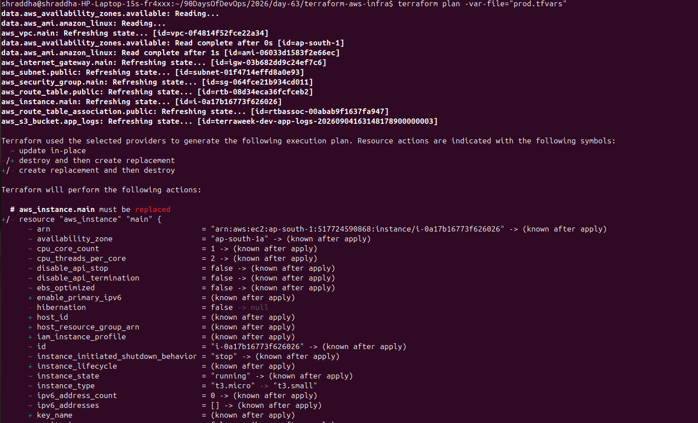
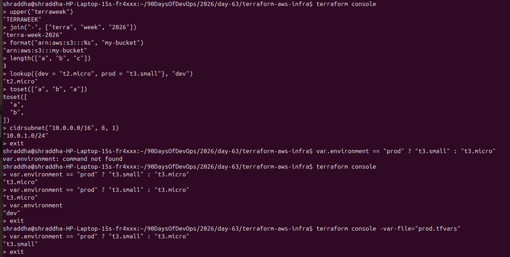
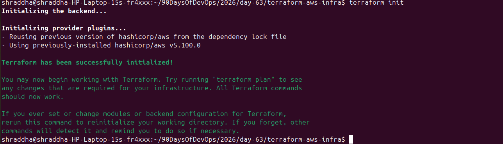
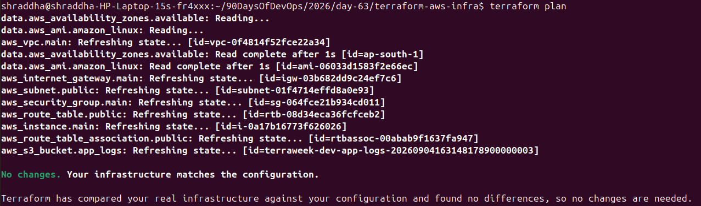
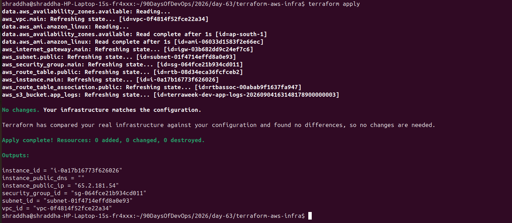

# Day 63 — Variables, Outputs, Data Sources and Expressions

## 📌 Overview

Day 63 focuses on making Terraform configurations reusable, dynamic, and environment-friendly.

In this practical, I worked with:

* Terraform Variables
* Variable Types
* `terraform.tfvars`
* Environment-specific `.tfvars`
* Variable Precedence
* Terraform Outputs
* Data Sources
* Local Values
* Terraform Functions
* Expressions
* Conditional Expressions
* AWS Infrastructure Deployment
* Terraform Validation and Planning

---

# 🎯 Objectives

* Understand Terraform variables.
* Use different Terraform variable types.
* Create environment-specific `.tfvars` files.
* Understand variable precedence.
* Use Terraform outputs.
* Retrieve AWS information using data sources.
* Use locals to reduce repetition.
* Practice Terraform functions.
* Practice conditional expressions.
* Deploy AWS infrastructure using Terraform.
* Verify the deployed infrastructure using Terraform outputs.

---

# 📁 Project Structure

```text
2026/day-63/
├── day-63-variables-outputs.md
├── screenshots/
│   ├── 01-terraform-init.png
│   ├── 02-terraform-validate.png
│   ├── 03-terraform-plan-prod.png
│   ├── 04-terraform-functions.png
│   ├── 05-terraform-conditional-expression.png
│   ├── 06-terraform-cidrsubnet.png
│   └── 07-terraform-apply.png
└── terraform-aws-infra/
    ├── providers.tf
    ├── variables.tf
    ├── terraform.tfvars
    ├── prod.tfvars
    ├── data.tf
    ├── locals.tf
    ├── main.tf
    └── outputs.tf
```

---

# 1. Terraform Provider

## `providers.tf`

```hcl
terraform {
  required_providers {
    aws = {
      source  = "hashicorp/aws"
      version = "~> 5.0"
    }
  }

  required_version = ">= 1.6.0"
}

provider "aws" {
  region = "ap-south-1"
}
```

The AWS provider allows Terraform to communicate with AWS.

The region used in this project is:

```text
ap-south-1
```

---

# 2. Terraform Variables

Variables allow Terraform configurations to be reused without hard-coding values.

## `variables.tf`

```hcl
variable "region" {
  description = "AWS region where resources will be created"
  type        = string
  default     = "ap-south-1"
}

variable "vpc_cidr" {
  description = "CIDR block for the VPC"
  type        = string
  default     = "10.0.0.0/16"
}

variable "subnet_cidr" {
  description = "CIDR block for the public subnet"
  type        = string
  default     = "10.0.1.0/24"
}

variable "instance_type" {
  description = "EC2 instance type"
  type        = string
  default     = "t3.micro"
}

variable "project_name" {
  description = "Name of the project"
  type        = string
}

variable "environment" {
  description = "Deployment environment"
  type        = string
  default     = "dev"
}

variable "allowed_ports" {
  description = "TCP ports allowed through the security group"
  type        = list(number)
  default     = [22, 80, 443]
}

variable "extra_tags" {
  description = "Additional tags to apply to resources"
  type        = map(string)
  default     = {}
}

variable "associate_public_ip" {
  description = "Whether to assign a public IP address to the EC2 instance"
  type        = bool
  default     = true
}
```

---

# 3. Terraform Variable Types

## String

```hcl
variable "project_name" {
  type = string
}
```

Example:

```hcl
project_name = "terraweek"
```

## Number

```hcl
variable "port" {
  type    = number
  default = 80
}
```

## Boolean

```hcl
variable "associate_public_ip" {
  type    = bool
  default = true
}
```

## List

```hcl
variable "allowed_ports" {
  type    = list(number)
  default = [22, 80, 443]
}
```

## Map

```hcl
variable "extra_tags" {
  type    = map(string)
  default = {}
}
```

---

# 4. `terraform.tfvars`

The `terraform.tfvars` file contains the default development values.

```hcl
project_name  = "terraweek"
environment   = "dev"
instance_type = "t3.micro"
```

Terraform automatically loads `terraform.tfvars`.

---

# 5. Production Variable File

## `prod.tfvars`

```hcl
project_name  = "terraweek"
environment   = "prod"
instance_type = "t3.small"
vpc_cidr      = "10.1.0.0/16"
subnet_cidr   = "10.1.1.0/24"
```

The production variable file can be used with:

```bash
terraform plan -var-file="prod.tfvars"
```

---

# 6. Variable Precedence

Terraform can receive variables from different sources.

Examples used:

```bash
terraform plan
```

```bash
terraform plan -var-file="prod.tfvars"
```

```bash
terraform plan -var="instance_type=t3.nano"
```

The CLI `-var` option successfully overrides the normal variable value.

An environment variable can also be supplied using:

```bash
export TF_VAR_environment="staging"
```

In the practical test with Terraform 1.16.0, the existing `terraform.tfvars` value remained `dev` when the environment variable was tested. The result was recorded from the actual environment rather than assuming a different precedence result.

Remove the temporary variable with:

```bash
unset TF_VAR_environment
```

---

# 7. Terraform Data Sources

Data sources allow Terraform to retrieve information from AWS dynamically.

## Amazon Linux AMI

```hcl
data "aws_ami" "amazon_linux" {
  most_recent = true

  owners = ["amazon"]

  filter {
    name   = "name"
    values = ["al2023-ami-*-x86_64"]
  }

  filter {
    name   = "architecture"
    values = ["x86_64"]
  }

  filter {
    name   = "root-device-type"
    values = ["ebs"]
  }

  filter {
    name   = "virtualization-type"
    values = ["hvm"]
  }
}
```

The EC2 instance uses:

```hcl
ami = data.aws_ami.amazon_linux.id
```

This avoids hard-coding an AMI ID.

---

# 8. Availability Zone Data Source

```hcl
data "aws_availability_zones" "available" {
  state = "available"
}
```

The subnet uses:

```hcl
availability_zone = data.aws_availability_zones.available.names[0]
```

The practical configuration selected:

```text
ap-south-1a
```

---

# 9. Local Values

Local values allow reusable expressions to be defined once.

## `locals.tf`

```hcl
locals {
  name_prefix = "${var.project_name}-${var.environment}"

  common_tags = {
    Project     = var.project_name
    Environment = var.environment
    ManagedBy   = "Terraform"
  }
}
```

For the development environment:

```text
terraweek-dev
```

is generated.

---

# 10. Using `merge()` for Tags

Resources use:

```hcl
tags = merge(local.common_tags, var.extra_tags, {
  Name = "${local.name_prefix}-vpc"
})
```

Examples of generated resource names:

```text
terraweek-dev-vpc
terraweek-dev-subnet
terraweek-dev-igw
terraweek-dev-route-table
terraweek-dev-sg
terraweek-dev-server
terraweek-dev-app-logs
```

`merge()` combines multiple maps.

---

# 11. Terraform Functions

Terraform functions were tested using:

```bash
terraform console
```

## `upper()`

```hcl
upper("terraweek")
```

Output:

```text
"TERRAWEEK"
```

Converts text to uppercase.

## `join()`

```hcl
join("-", ["terra", "week", "2026"])
```

Output:

```text
"terra-week-2026"
```

Joins list elements using a separator.

## `format()`

```hcl
format("arn:aws:s3:::%s", "my-bucket")
```

Output:

```text
"arn:aws:s3:::my-bucket"
```

Creates formatted strings.

## `length()`

```hcl
length(["a", "b", "c"])
```

Output:

```text
3
```

Returns the number of elements.

## `lookup()`

```hcl
lookup({dev = "t2.micro", prod = "t3.small"}, "dev")
```

Output:

```text
"t2.micro"
```

Retrieves a value from a map.

## `toset()`

```hcl
toset(["a", "b", "a"])
```

Output:

```text
toset([
  "a",
  "b",
])
```

Converts a list to a set and removes duplicates.

## `cidrsubnet()`

```hcl
cidrsubnet("10.0.0.0/16", 8, 1)
```

Output:

```text
"10.0.1.0/24"
```

Calculates a subnet from a larger CIDR block.

---

## 📸 Terraform Functions Screenshot



---

# 12. Conditional Expressions

Terraform supports conditional expressions:

```text
condition ? true_value : false_value
```

Example:

```hcl
var.environment == "prod" ? "t3.small" : "t3.micro"
```

Meaning:

```text
IF environment == prod
    → t3.small

ELSE
    → t3.micro
```

---

## Development Test

With:

```text
environment = "dev"
```

the result was:

```text
"t3.micro"
```

---

## Production Test

The production variable file was loaded using:

```bash
terraform console -var-file="prod.tfvars"
```

Then:

```hcl
var.environment == "prod" ? "t3.small" : "t3.micro"
```

returned:

```text
"t3.small"
```

---

## 📸 Conditional Expression Screenshot



---

# 13. Terraform Initialization

Terraform was initialized with:

```bash
terraform init
```

This downloaded and initialized the required AWS provider.

## 📸 Screenshot



---

# 14. Terraform Formatting and Validation

The configuration was formatted using:

```bash
terraform fmt
```

The configuration was validated using:

```bash
terraform validate
```

Expected result:

```text
Success! The configuration is valid.
```

## 📸 Screenshot


---

# 15. Terraform Plan

The production configuration was tested with:

```bash
terraform plan -var-file="prod.tfvars"
```

This verifies how Terraform would configure the infrastructure using production values.

## 📸 Production Plan



---

# 16. Terraform Apply

The infrastructure was deployed using:

```bash
terraform apply
```

Terraform successfully created:

```text
Apply complete! Resources: 8 added, 0 changed, 0 destroyed.
```

## 📸 Terraform Apply



---

# 17. Terraform Outputs

After the deployment, the outputs were checked with:

```bash
terraform output
```

The infrastructure returned values including:

```text
instance_id = "i-0a17b16773f626026"
instance_public_ip = "65.2.181.54"
security_group_id = "sg-064fce21b934cd011"
subnet_id = "subnet-01f4714effd8a0e93"
vpc_id = "vpc-0f4814f52fce22a34"
```

The public DNS output was empty in this deployment:

```text
instance_public_dns = ""
```

The EC2 instance did receive a public IPv4 address:

```text
65.2.181.54
```

---

# 18. Resources Created

The Terraform configuration created 8 resources:

```text
1. VPC
2. Public Subnet
3. Internet Gateway
4. Route Table
5. Route Table Association
6. Security Group
7. EC2 Instance
8. S3 Bucket
```

---

# 19. Important Terraform Commands

Initialize:

```bash
terraform init
```

Format:

```bash
terraform fmt
```

Validate:

```bash
terraform validate
```

Create plan:

```bash
terraform plan
```

Use production variables:

```bash
terraform plan -var-file="prod.tfvars"
```

Apply:

```bash
terraform apply
```

Show outputs:

```bash
terraform output
```

Open console:

```bash
terraform console
```

Use production variables in console:

```bash
terraform console -var-file="prod.tfvars"
```

Destroy resources:

```bash
terraform destroy
```

---

# 20. Variable vs Local vs Data Source vs Output

| Concept     | Purpose                      |
| ----------- | ---------------------------- |
| Variable    | Input value                  |
| Local       | Reusable internal value      |
| Data Source | Reads existing information   |
| Output      | Displays or exposes a result |

### Variable

```hcl
var.instance_type
```

Provides input to Terraform.

### Local

```hcl
local.name_prefix
```

Provides a reusable internal value.

### Data Source

```hcl
data.aws_ami.amazon_linux.id
```

Reads information from AWS.

### Output

```hcl
aws_instance.main.public_ip
```

Exposes useful infrastructure information.

---

# 21. Terraform Functions Practiced

```text
upper()
join()
format()
length()
lookup()
toset()
cidrsubnet()
```

These functions are useful for transforming strings, collections, maps, and network CIDR blocks.

---

# 22. Key Learnings

* Variables make Terraform configurations reusable.
* `.tfvars` files are useful for environment-specific values.
* Data sources dynamically retrieve AWS information.
* Locals reduce repeated expressions.
* `merge()` is useful for combining tag maps.
* Outputs expose useful infrastructure information.
* Terraform functions help transform and calculate values.
* Conditional expressions allow dynamic configuration.
* `terraform console` is useful for testing expressions.
* `terraform validate` checks configuration validity.
* `terraform plan` previews infrastructure changes.
* `terraform apply` creates or modifies infrastructure.
* Terraform can manage multiple environments using variable files.

---

# 23. Interview Questions

## Q1. What are Terraform variables?

Terraform variables are input values that make Terraform configurations reusable and configurable.

## Q2. Why use `.tfvars` files?

They allow variable values to be separated from the Terraform configuration and make environment-specific configuration easier.

## Q3. What is the difference between a variable and a local?

A variable is an input to Terraform, while a local is an internally calculated reusable value.

## Q4. What is a Terraform output?

An output exposes useful information from Terraform resources, such as an EC2 instance ID or public IP.

## Q5. What is a data source?

A data source reads information from an existing provider environment without creating that object.

## Q6. What is `terraform console`?

`terraform console` is an interactive Terraform environment used to evaluate expressions and test functions.

## Q7. What is a conditional expression?

A conditional expression selects one of two values based on a condition.

Example:

```hcl
var.environment == "prod" ? "t3.small" : "t3.micro"
```

## Q8. What does `merge()` do?

`merge()` combines multiple maps into one map.

## Q9. What does `toset()` do?

`toset()` converts a collection into a set and removes duplicate values.

## Q10. Why use a data source for an AMI?

AMI IDs can vary by region and change over time. A data source allows Terraform to dynamically find a suitable AMI instead of hard-coding an ID.

---

# 24. Final Verification

The configuration was verified using:

```bash
terraform fmt
terraform validate
terraform plan
terraform apply
terraform output
```

Terraform successfully created:

```text
8 resources
```

The AWS infrastructure was deployed in:

```text
ap-south-1
```

---

# 🎯 Day 63 Completion

Day 63 is complete.

The practical covered:

```text
Variables
    ↓
.tfvars
    ↓
Data Sources
    ↓
Locals
    ↓
Functions
    ↓
Expressions
    ↓
Conditional Expressions
    ↓
Resources
    ↓
Outputs
```

This provides a strong foundation for creating reusable Terraform configurations for development, staging, and production environments.
