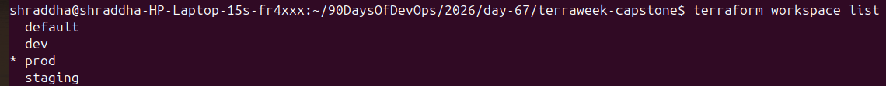
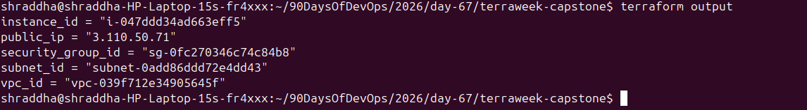
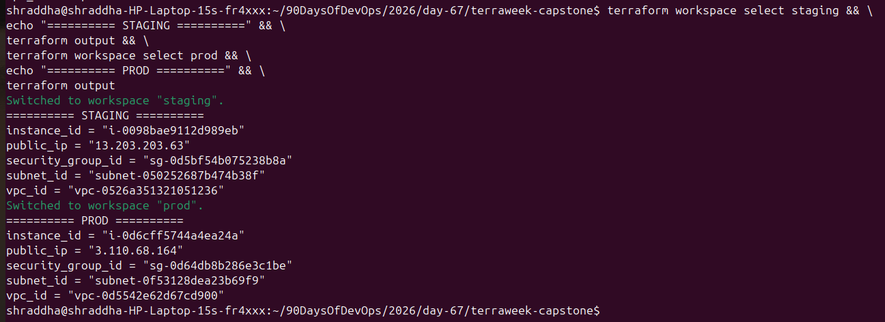
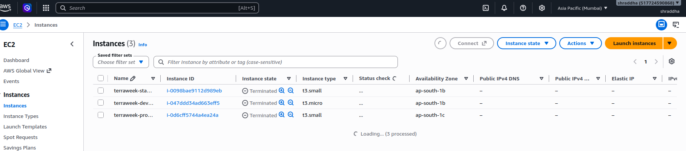
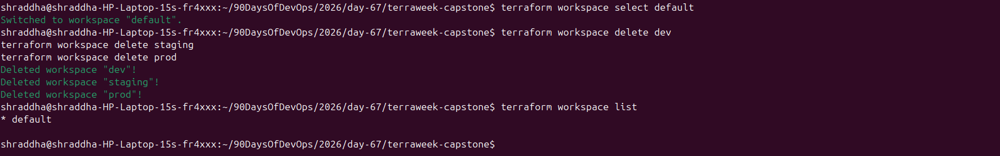

# Day 67 — TerraWeek Terraform Capstone

## 📌 Project Overview

This capstone project demonstrates how to use **Terraform**, **AWS**, **custom Terraform modules**, and **Terraform workspaces** to provision separate infrastructure environments.

The project creates three environments:

* Development (`dev`)
* Staging (`staging`)
* Production (`prod`)

Each environment receives its own:

* VPC
* Public Subnet
* Internet Gateway
* Route Table
* Security Group
* EC2 Instance

Terraform workspaces are used to maintain separate state for each environment while reusing the same Terraform configuration.

---

# 🎯 Objectives

The main objectives of this capstone are:

1. Understand Terraform workspaces.
2. Create reusable Terraform modules.
3. Provision AWS infrastructure using Terraform.
4. Create separate Dev, Staging, and Production environments.
5. Use variables and `.tfvars` files for environment-specific configuration.
6. Use Terraform outputs to retrieve infrastructure information.
7. Apply Terraform best practices.
8. Verify infrastructure in AWS.
9. Destroy all resources after verification.

---

# 🏗️ Project Architecture

```text
                         Terraform
                             │
                             ▼
                  ┌─────────────────────┐
                  │   Root Configuration │
                  │      main.tf         │
                  │    variables.tf      │
                  │      locals.tf       │
                  └──────────┬──────────┘
                             │
             ┌───────────────┼────────────────┐
             │               │                │
             ▼               ▼                ▼
        VPC Module      Security Group     EC2 Module
             │               │                │
             ▼               ▼                ▼
          AWS VPC             SG           EC2 Instance
             │                                │
             ▼                                ▼
       Public Subnet                       Public IP
             │
             ▼
      Internet Gateway
             │
             ▼
        Route Table


Terraform Workspaces
        │
        ├── dev
        │
        ├── staging
        │
        └── prod
```

---

# 📁 Project Structure

```text
day-67/
├── day-67-terraweek-capstone.md
├── screenshots/
│   ├── 01-workspace-list.png
│   ├── 02-dev-output.png
│   ├── 03-staging-prod-output.png
│   ├── 04-aws-console-verification.png
│   └── 05-final-cleanup.png
│
└── terraweek-capstone/
    ├── main.tf
    ├── variables.tf
    ├── outputs.tf
    ├── providers.tf
    ├── locals.tf
    ├── dev.tfvars
    ├── staging.tfvars
    ├── prod.tfvars
    ├── .gitignore
    │
    └── modules/
        ├── vpc/
        │   ├── main.tf
        │   ├── variables.tf
        │   └── outputs.tf
        │
        ├── security-group/
        │   ├── main.tf
        │   ├── variables.tf
        │   └── outputs.tf
        │
        └── ec2-instance/
            ├── main.tf
            ├── variables.tf
            └── outputs.tf
```

---

# 🔧 Terraform Initialization

Terraform was initialized using:

```bash
terraform init
```

The AWS provider was configured for the Mumbai region:

```hcl
provider "aws" {
  region = "ap-south-1"
}
```

The configuration was formatted and validated using:

```bash
terraform fmt -recursive
terraform validate
```

Validation returned:

```text
Success! The configuration is valid.
```

---

# 🌳 Terraform Workspaces

Three Terraform workspaces were created:

```bash
terraform workspace new dev
terraform workspace new staging
terraform workspace new prod
```

They were verified using:

```bash
terraform workspace list
```

The workspaces allow the same Terraform configuration to manage separate infrastructure states.

## What does `terraform.workspace` return?

The expression:

```hcl
terraform.workspace
```

returns the name of the currently selected Terraform workspace.

For example:

```text
dev
staging
prod
```

This was used to automatically identify the environment.

---

# 📦 Workspace State

For local Terraform state, workspace-specific state is stored separately.

Conceptually:

```text
terraform.tfstate.d/
├── dev/
│   └── terraform.tfstate
├── staging/
│   └── terraform.tfstate
└── prod/
    └── terraform.tfstate
```

The benefit is that each workspace maintains its own infrastructure state.

---

# 🧩 Terraform Modules

Three reusable modules were created.

## 1. VPC Module

Location:

```text
modules/vpc/
```

The VPC module creates:

* VPC
* Public subnet
* Internet Gateway
* Route table
* Route table association

Inputs:

```text
cidr
public_subnet_cidr
environment
project_name
```

Outputs:

```text
vpc_id
subnet_id
```

---

## 2. Security Group Module

Location:

```text
modules/security-group/
```

The Security Group module creates environment-specific security groups.

Inbound ports are passed through a variable:

```hcl
ingress_ports = var.ingress_ports
```

A dynamic block is used to create the ingress rules.

Example:

```hcl
dynamic "ingress" {
  for_each = var.ingress_ports

  content {
    description = "Allow inbound traffic on port ${ingress.value}"
    from_port   = ingress.value
    to_port     = ingress.value
    protocol    = "tcp"
    cidr_blocks = ["0.0.0.0/0"]
  }
}
```

Output:

```text
sg_id
```

---

## 3. EC2 Instance Module

Location:

```text
modules/ec2-instance/
```

The EC2 module creates an EC2 instance using:

* AMI ID
* Instance type
* Subnet ID
* Security Group ID
* Environment
* Project name

Outputs:

```text
instance_id
public_ip
```

---

# 🌎 Environment Management

Terraform workspaces are used to automatically identify the environment.

The following local values were created:

```hcl
locals {
  environment = terraform.workspace

  name_prefix = "${var.project_name}-${local.environment}"

  common_tags = {
    Project     = var.project_name
    Environment = local.environment
    ManagedBy   = "Terraform"
    Workspace   = terraform.workspace
  }
}
```

This allows resource names and tags to be environment-specific.

For example:

```text
terraweek-dev-vpc
terraweek-staging-vpc
terraweek-prod-vpc
```

and:

```text
terraweek-dev-server
terraweek-staging-server
terraweek-prod-server
```

---

# ⚙️ Environment Variables

## Development

File:

```text
dev.tfvars
```

Configuration:

```hcl
vpc_cidr="10.0.0.0/16"
subnet_cidr="10.0.1.0/24"
instance_type="t3.micro"
ingress_ports=[22,80]
```

---

## Staging

File:

```text
staging.tfvars
```

Configuration:

```hcl
vpc_cidr="10.1.0.0/16"
subnet_cidr="10.1.1.0/24"
instance_type="t3.small"
ingress_ports=[22,80,443]
```

---

## Production

File:

```text
prod.tfvars
```

Configuration:

```hcl
vpc_cidr="10.2.0.0/16"
subnet_cidr="10.2.1.0/24"
instance_type="t3.small"
ingress_ports=[80,443]
```

### Instance-Type Note

The original exercise specified `t2` instance types. However, the AWS account's current Free Tier eligible instance list did not include the required `t2` types.

Therefore:

```text
Dev     → t3.micro
Staging → t3.small
Prod    → t3.small
```

The configuration was adapted to use currently eligible instance types while keeping the environments isolated.

---

# 🚀 Development Deployment

The Dev workspace was selected:

```bash
terraform workspace select dev
```

The infrastructure was planned:

```bash
terraform plan -var-file="dev.tfvars"
```

Then applied:

```bash
terraform apply -var-file="dev.tfvars"
```

The final Dev deployment successfully created:

```text
7 resources
```

Dev outputs included:

```text
instance_id = "i-047ddd34ad663eff5"
public_ip = "3.110.50.71"
security_group_id = "sg-0fc270346c74c84b8"
subnet_id = "subnet-0add86ddd72e4dd43"
vpc_id = "vpc-039f712e34905645f"
```

---

# 🚀 Staging Deployment

The Staging workspace was selected:

```bash
terraform workspace select staging
```

The infrastructure was planned:

```bash
terraform plan -var-file="staging.tfvars"
```

Then applied:

```bash
terraform apply -var-file="staging.tfvars"
```

Terraform successfully created:

```text
7 resources
```

Staging outputs:

```text
instance_id = "i-0098bae9112d989eb"
public_ip = "13.203.203.63"
security_group_id = "sg-0d5bf54b075238b8a"
subnet_id = "subnet-050252687b474b38f"
vpc_id = "vpc-0526a351321051236"
```

---

# 🚀 Production Deployment

The Production workspace was selected:

```bash
terraform workspace select prod
```

The infrastructure was planned:

```bash
terraform plan -var-file="prod.tfvars"
```

Terraform reported:

```text
Plan: 7 to add, 0 to change, 0 to destroy.
```

The infrastructure was then created:

```bash
terraform apply -var-file="prod.tfvars"
```

Terraform successfully created:

```text
7 resources
```

Production outputs:

```text
instance_id = "i-0d6cff5744a4ea24a"
public_ip = "3.110.68.164"
security_group_id = "sg-0d64db8b286e3c1be"
subnet_id = "subnet-0f53128dea23b69f9"
vpc_id = "vpc-0d5542e62d67cd900"
```

---

# 🔍 Environment Verification

Staging and Production outputs were displayed together:

```bash
terraform workspace select staging && \
echo "========== STAGING ==========" && \
terraform output && \
terraform workspace select prod && \
echo "========== PROD ==========" && \
terraform output
```

This verified that each workspace maintained its own infrastructure state and outputs.

---

# ☁️ AWS Verification

The infrastructure was also verified in the AWS Console.

The expected resources were:

```text
3 VPCs
3 Public Subnets
3 Security Groups
3 Internet Gateways
3 Route Tables
3 EC2 Instances
```

Resource names followed the environment naming convention:

```text
terraweek-dev-*
terraweek-staging-*
terraweek-prod-*
```

---

# 📸 Screenshots

## Screenshot 1 — Terraform Workspaces



Shows the Terraform workspace configuration.

---

## Screenshot 2 — Dev Output



Shows the successful Dev infrastructure outputs.

---

## Screenshot 3 — Staging and Production Outputs



Shows the separate outputs for the Staging and Production workspaces.

---

## Screenshot 4 — AWS Console Verification



Shows the infrastructure created in AWS.

---

## Screenshot 5 — Final Cleanup



Shows the final Terraform cleanup and workspace state.

---

# 🧹 Infrastructure Cleanup

After verification, all infrastructure was destroyed.

Production:

```bash
terraform workspace select prod
terraform destroy -var-file="prod.tfvars"
```

Staging:

```bash
terraform workspace select staging
terraform destroy -var-file="staging.tfvars"
```

Development:

```bash
terraform workspace select dev
terraform destroy -var-file="dev.tfvars"
```

After destroying all resources, the default workspace was selected:

```bash
terraform workspace select default
```

The environment workspaces were then deleted:

```bash
terraform workspace delete dev
terraform workspace delete staging
terraform workspace delete prod
```

Finally:

```bash
terraform workspace list
```

Only the default workspace remained.

---

# 🔐 .gitignore

Terraform-generated files and sensitive variable files were excluded from Git:

```gitignore
.terraform/
*.tfstate
*.tfstate.backup
*.tfvars
.terraform.lock.hcl
```

This prevents Terraform state and environment variable files from being accidentally committed.

---

# ✅ Terraform Best Practices Used

## 1. Reusable Modules

Infrastructure was divided into reusable modules:

```text
vpc
security-group
ec2-instance
```

This avoids duplicating infrastructure code.

## 2. Environment Separation

Terraform workspaces were used to separate:

```text
dev
staging
prod
```

## 3. Variables

Environment-specific values were managed using variables and `.tfvars` files.

## 4. Consistent Naming

Resources use a consistent naming convention:

```text
<project>-<environment>-<resource>
```

Example:

```text
terraweek-prod-server
```

## 5. Resource Tagging

Resources include tags such as:

```text
Project
Environment
ManagedBy
```

## 6. Validation

Terraform configuration was checked using:

```bash
terraform fmt -recursive
terraform validate
```

## 7. Plan Before Apply

Changes were reviewed using:

```bash
terraform plan
```

before applying infrastructure.

## 8. Cleanup

All AWS resources were destroyed after completing the practical exercise.

---

# 🧠 Key Concepts Learned

During this capstone, I practiced:

* Terraform initialization
* Terraform providers
* Terraform variables
* Terraform locals
* Terraform outputs
* Terraform modules
* Terraform workspaces
* Workspace-specific state
* Dynamic blocks
* AWS VPC
* AWS Subnets
* Internet Gateway
* Route Tables
* Security Groups
* EC2
* Environment-specific `.tfvars`
* Resource tagging
* Infrastructure verification
* Terraform destroy
* Infrastructure cleanup

---

# 💡 Important Terraform Commands

```bash
terraform init
terraform fmt -recursive
terraform validate
terraform workspace list
terraform workspace show
terraform workspace new dev
terraform workspace select dev
terraform plan -var-file="dev.tfvars"
terraform apply -var-file="dev.tfvars"
terraform output
terraform state list
terraform destroy -var-file="dev.tfvars"
terraform workspace delete dev
```

---

# 🎓 Conclusion

This TerraWeek capstone provided practical experience in building reusable and environment-aware AWS infrastructure with Terraform.

Instead of creating separate Terraform configurations for every environment, the same modular configuration was reused with:

* Terraform workspaces
* Variables
* `.tfvars` files
* Terraform modules
* Workspace-aware locals
* Consistent resource naming and tagging

The Dev, Staging, and Production environments were successfully provisioned, verified in AWS, and destroyed after completion.

This project strengthened my understanding of **Infrastructure as Code (IaC)** and demonstrated how Terraform can be used to manage multi-environment cloud infrastructure in a structured and reusable way.
