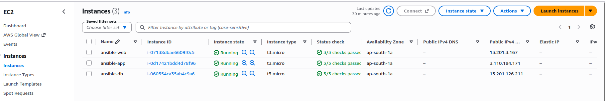
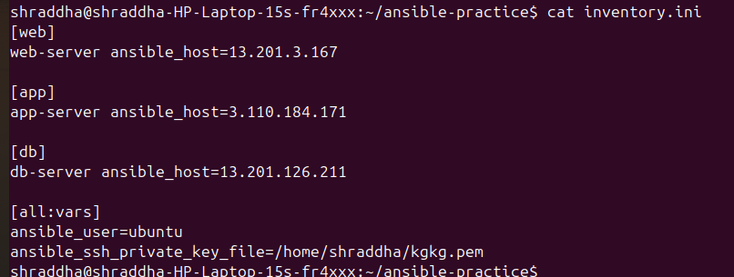
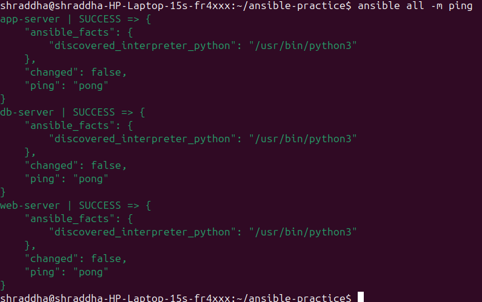
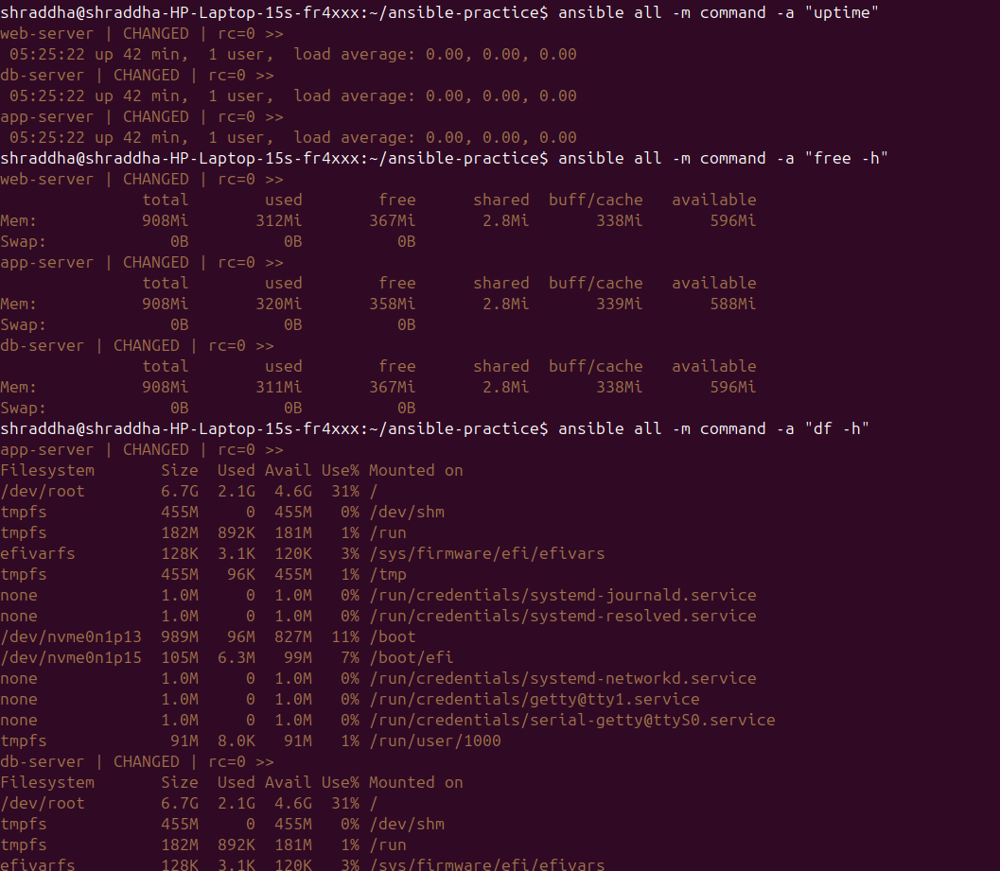
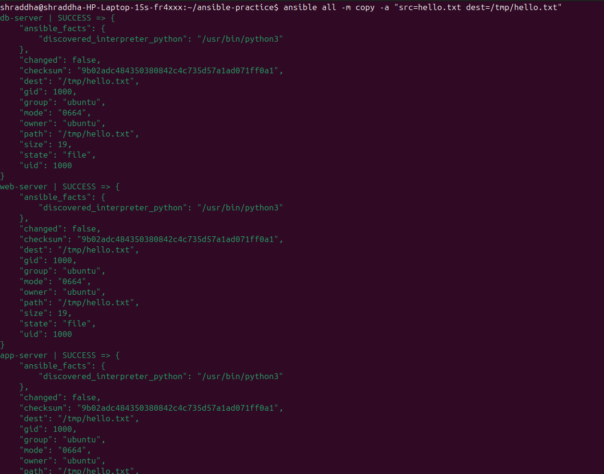
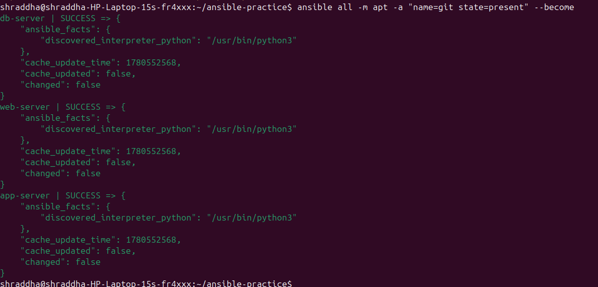
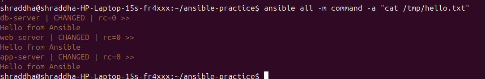

# Day 68 — Introduction to Ansible and Inventory Setup

## What is Ansible?

Ansible is an open-source automation and configuration management tool.

It is used to automate tasks such as:

* Server configuration
* Package installation
* Application deployment
* User management
* File management
* Infrastructure automation

Ansible is **agentless**, which means managed servers do not need an Ansible agent installed.

---

## Ansible Architecture

My lab contains:

* **Control Node:** Ubuntu laptop
* **Managed Node 1:** ansible-web
* **Managed Node 2:** ansible-app
* **Managed Node 3:** ansible-db
* **Inventory:** inventory.ini
* **Configuration:** ansible.cfg

### Architecture

```text
                    Ubuntu Laptop
                    Control Node
                         |
                         | Ansible over SSH
                         |
             +-----------+-----------+
             |           |           |
             v           v           v
        ansible-web  ansible-app  ansible-db
        Managed Node Managed Node Managed Node
```

---

## AWS Lab

### VPC

```text
VPC: ansible-lab
CIDR: 10.0.0.0/16
```

### Subnet

```text
Subnet: 10.0.1.0/24
Availability Zone: ap-south-1a
```

### EC2 Instances

| Name        | Purpose            | OS     |
| ----------- | ------------------ | ------ |
| ansible-web | Web Server         | Ubuntu |
| ansible-app | Application Server | Ubuntu |
| ansible-db  | Database Server    | Ubuntu |

### AWS EC2 Instances



---

## Inventory

The Ansible inventory defines the managed servers and groups them according to their purpose.

```ini
[web]
web-server ansible_host=<WEB_PUBLIC_IP>

[app]
app-server ansible_host=<APP_PUBLIC_IP>

[db]
db-server ansible_host=<DB_PUBLIC_IP>

[all:vars]
ansible_user=ubuntu
ansible_ssh_private_key_file=/home/shraddha/kgkg.pem
```

### Inventory Screenshot



> **Security:** The public GitHub documentation uses placeholder IP addresses. The actual `inventory.ini` containing live IP addresses should not be committed to a public repository.

---

## Ansible Configuration

The `ansible.cfg` file contains the default Ansible configuration.

```ini
[defaults]
inventory = inventory.ini
remote_user = ubuntu
private_key_file = /home/shraddha/kgkg.pem
host_key_checking = False
```

---

## Ansible Ping

I tested connectivity between the Ansible control node and all three EC2 managed nodes.

### Command

```bash
ansible all -m ping
```

### Result

```text
web-server | SUCCESS
app-server | SUCCESS
db-server | SUCCESS
```

All three managed nodes returned:

```text
"ping": "pong"
```

### Screenshot



---

## Ad-Hoc Commands

Ansible ad-hoc commands allow us to execute quick tasks on managed nodes without creating a playbook.

### Check Uptime

```bash
ansible all -m command -a "uptime"
```

### Check Memory

```bash
ansible all -m command -a "free -h"
```

### Check Disk Space

```bash
ansible all -m command -a "df -h"
```

### Check Individual Groups

```bash
ansible web -m command -a "hostname"
ansible app -m command -a "hostname"
ansible db -m command -a "hostname"
```

### Screenshot



---

## Package Management

I practiced package management using the Ansible `apt` module.

### Install Git

```bash
ansible all -m apt -a "name=git state=present" --become
```

The command ensures that Git is installed on all three managed nodes.

### Verify Git

```bash
ansible all -m command -a "git --version"
```

### Screenshot



---

## File Copy

First, I created a local file:

```bash
echo "Hello from Ansible" > hello.txt
```

Then I copied the file to all managed nodes:

```bash
ansible all -m copy -a "src=hello.txt dest=/tmp/hello.txt"
```

### Screenshot



---

## File Verification

I verified that the file was successfully copied to all three servers.

### Command

```bash
ansible all -m command -a "cat /tmp/hello.txt"
```

### Output

```text
Hello from Ansible
```

### Screenshot



---

## Important Ansible Concepts Learned

During Day 68, I learned:

* Control Node
* Managed Nodes
* Inventory
* Inventory Groups
* Ad-hoc Commands
* Modules
* SSH
* Agentless Architecture
* Privilege Escalation with `--become`
* `command` module
* `apt` module
* `copy` module
* `ping` module
* `ansible.cfg`

---

## Key Learning

Ansible allows us to manage multiple servers from one control node without manually logging into every server.

Instead of manually running the same command on three servers, Ansible allows us to execute the task across all servers from a single control node.

This makes server management:

* Faster
* Consistent
* Repeatable
* Easier to automate
* Easier to scale

---

## Security Note

The private SSH key:

```text
kgkg.pem
```

is stored outside the Git repository.

The private key must **never** be committed or uploaded to GitHub.

The actual `inventory.ini` containing live server IP addresses should also be kept local or replaced with an example file before publishing the repository.

---

# Screenshots Summary

## 1. AWS EC2 Instances


## 2. Ansible Inventory


## 3. Ansible Ping


## 4. Ad-Hoc Commands


## 5. File Copy


## 6. Package Management


## 7. File Verification


---

# Day 68 Status

**Completed successfully.**

* [x] AWS lab created
* [x] 3 EC2 instances created
* [x] SSH connectivity verified
* [x] Ansible inventory created
* [x] Ansible configuration created
* [x] Ansible ping successful
* [x] Ad-hoc commands practiced
* [x] Package management practiced
* [x] File copy practiced
* [x] File verification completed
* [x] Screenshots captured
* [x] Documentation created

---

## Day 68 Outcome

By completing this practical lab, I learned how to use Ansible from an Ubuntu control node to manage multiple AWS EC2 instances over SSH.

I successfully performed connectivity testing, system information gathering, package management, file distribution, and verification across multiple managed nodes.


