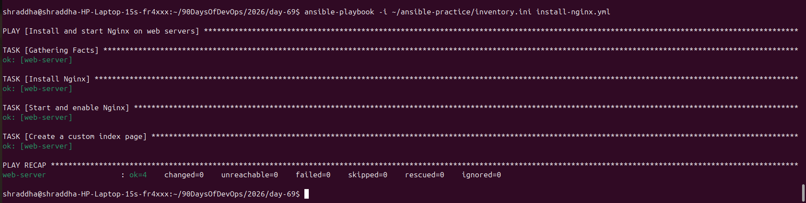
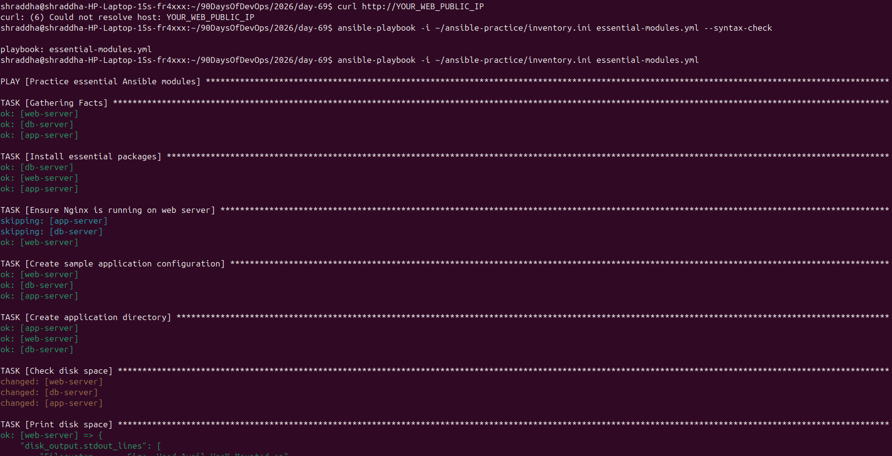
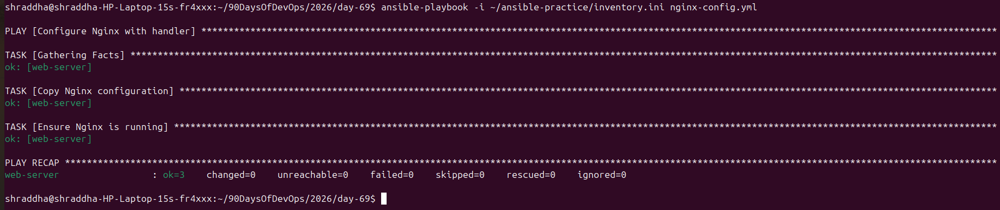
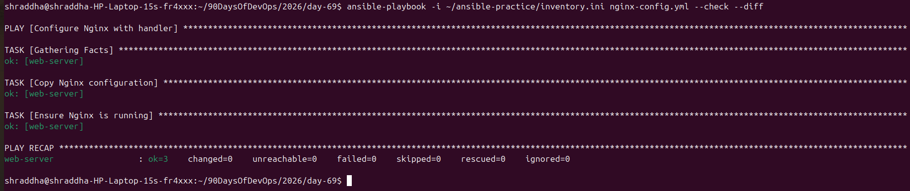
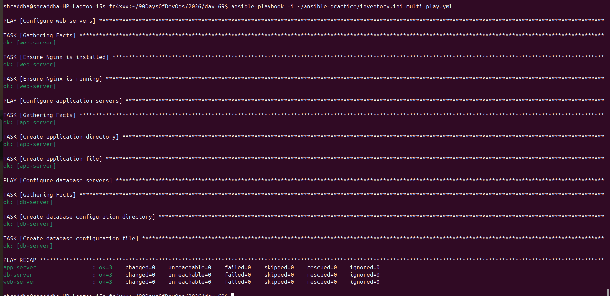

# Day 69 — Ansible Playbooks and Modules

## Objective

Today I learned how to create and execute Ansible playbooks and practiced important Ansible modules.

### Topics Covered

- Ansible Playbooks
- Plays
- Tasks
- Modules
- Handlers
- Idempotency
- Essential Ansible modules
- `--check`
- `--diff`
- Verbosity
- `--limit`
- `--list-hosts`
- `--list-tasks`
- Multi-playbooks

---

# 1. Install Nginx Using Ansible

Created:

```text
install-nginx.yml
````

The playbook:

* Installs Nginx
* Starts Nginx
* Enables Nginx at boot
* Creates a custom web page

## Playbook

```yaml
---
- name: Install and start Nginx on web servers
  hosts: web
  become: true

  tasks:
    - name: Install Nginx
      apt:
        name: nginx
        state: present
        update_cache: true

    - name: Start and enable Nginx
      service:
        name: nginx
        state: started
        enabled: true

    - name: Create a custom index page
      copy:
        content: "<h1>Deployed by Ansible - TerraWeek Server</h1>"
        dest: /var/www/html/index.html
        owner: root
        group: root
        mode: '0644'
```

## First Run

The first execution produced changes because Nginx and the custom configuration had to be created.



## Idempotency

The playbook was executed again.

The second execution produced no changes, demonstrating Ansible idempotency.


## Nginx Web Page

The deployed web page displayed:

```text
Deployed by Ansible - TerraWeek Server
```


---

# 2. Understanding Ansible Play Structure

A basic Ansible playbook contains:

```text
Playbook
   |
   └── Play
        |
        └── Tasks
             |
             └── Modules
```

### Play

Defines which hosts Ansible should manage.

Example:

```yaml
- name: Configure web servers
  hosts: web
```

### Task

A task defines one specific operation.

Example:

```yaml
- name: Install Nginx
```

### Module

A module performs the actual operation.

Example:

```yaml
apt:
  name: nginx
  state: present
```

### Become

Used when administrative privileges are required.

```yaml
become: true
```

---

# 3. Essential Ansible Modules

Created:

```text
essential-modules.yml
```

The following modules were practiced:

| Module       | Purpose                      |
| ------------ | ---------------------------- |
| `apt`        | Install packages             |
| `service`    | Manage services              |
| `copy`       | Copy/create files            |
| `file`       | Manage files and directories |
| `command`    | Execute commands             |
| `shell`      | Execute shell commands       |
| `register`   | Store command output         |
| `debug`      | Display information          |
| `lineinfile` | Add or modify lines in files |
| `when`       | Conditional execution        |

The playbook was successfully executed on:

* Web server
* Application server
* Database server



---

# 4. Ansible Handlers

Created:

```text
nginx-config.yml
```

A handler is a special task that runs only when notified by another task.

Example:

```yaml
notify: Restart Nginx
```

Handler:

```yaml
handlers:
  - name: Restart Nginx
    service:
      name: nginx
      state: restarted
```

## Handler First Run

When the Nginx configuration changed, the handler restarted Nginx.



## Handler Idempotency

The playbook was executed again without changing the configuration.

The configuration task returned:

```text
ok
```

and the handler did not run.

```text
changed=0
```


---

# 5. Ansible Check Mode

Check mode allows us to simulate a playbook without making changes.

Command:

```bash
ansible-playbook -i ~/ansible-practice/inventory.ini nginx-config.yml --check
```

---

# 6. Diff Mode

The `--diff` option shows differences between the current and desired file contents.

Command:

```bash
ansible-playbook -i ~/ansible-practice/inventory.ini nginx-config.yml --check --diff
```



---

# 7. Verbosity

Ansible supports different verbosity levels.

### Level 1

```bash
ansible-playbook -i ~/ansible-practice/inventory.ini nginx-config.yml -v
```

### Level 2

```bash
ansible-playbook -i ~/ansible-practice/inventory.ini nginx-config.yml -vv
```

### Level 3

```bash
ansible-playbook -i ~/ansible-practice/inventory.ini nginx-config.yml -vvv
```

Higher verbosity provides more debugging information.

---

# 8. List Hosts

To see which hosts will be targeted:

```bash
ansible-playbook -i ~/ansible-practice/inventory.ini nginx-config.yml --list-hosts
```

---

# 9. List Tasks

To see the tasks without executing the playbook:

```bash
ansible-playbook -i ~/ansible-practice/inventory.ini nginx-config.yml --list-tasks
```

---

# 10. Limit Execution to One Host

The `--limit` option allows us to execute a playbook only on a specific host.

Example:

```bash
ansible-playbook -i ~/ansible-practice/inventory.ini nginx-config.yml --limit web-server
```

This executed the playbook only on:

```text
web-server
```

---

# 11. Multi-Playbook

Created:

```text
multi-play.yml
```

The playbook contains three plays.

### Web Servers

Responsible for:

* Installing Nginx
* Starting Nginx

### Application Servers

Responsible for:

* Creating `/opt/myapp`
* Creating application configuration files

### Database Servers

Responsible for:

* Creating `/opt/db-config`
* Creating database configuration files

The playbook was successfully executed against all three server groups.



---

# 12. Important Commands Learned

### Syntax Check

```bash
ansible-playbook -i ~/ansible-practice/inventory.ini playbook.yml --syntax-check
```

### Run Playbook

```bash
ansible-playbook -i ~/ansible-practice/inventory.ini playbook.yml
```

### Check Mode

```bash
ansible-playbook -i ~/ansible-practice/inventory.ini playbook.yml --check
```

### Diff

```bash
ansible-playbook -i ~/ansible-practice/inventory.ini playbook.yml --check --diff
```

### Verbose

```bash
ansible-playbook -i ~/ansible-practice/inventory.ini playbook.yml -v
```

### Limit

```bash
ansible-playbook -i ~/ansible-practice/inventory.ini playbook.yml --limit web-server
```

### List Hosts

```bash
ansible-playbook -i ~/ansible-practice/inventory.ini playbook.yml --list-hosts
```

### List Tasks

```bash
ansible-playbook -i ~/ansible-practice/inventory.ini playbook.yml --list-tasks
```

---

# 13. Key Learnings

1. Playbooks allow infrastructure tasks to be automated and repeated.
2. Tasks use Ansible modules to perform operations.
3. Ansible is designed to be idempotent.
4. Handlers are useful for restarting services only when configuration changes.
5. `register` stores command output for later use.
6. `debug` helps display variables and command results.
7. `when` allows conditional task execution.
8. `--check` provides a safe way to preview changes.
9. `--diff` helps understand file changes.
10. `--limit` allows targeted execution.
11. Multi-playbooks can manage different server groups from one file.

---

# Day 69 Summary

Successfully completed practical Ansible playbook automation using AWS EC2 Ubuntu servers.

### Infrastructure

```text
AWS VPC
   |
   ├── Web Server
   |     └── Nginx
   |
   ├── App Server
   |     └── Application directory
   |
   └── DB Server
         └── Database configuration directory
```

### Result

```text
Ansible Playbooks
       |
       ├── Packages
       ├── Services
       ├── Files
       ├── Configuration
       ├── Handlers
       └── Multiple Server Groups
```

**Day 69 completed successfully.**

````


