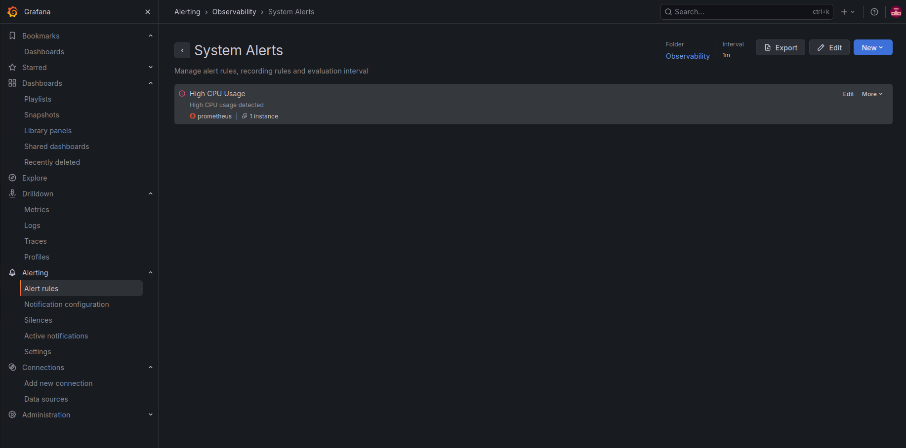
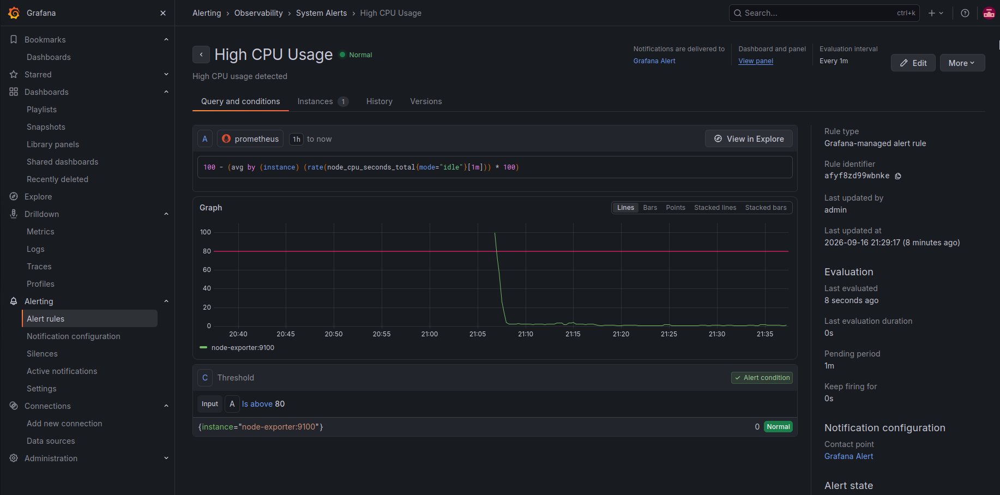
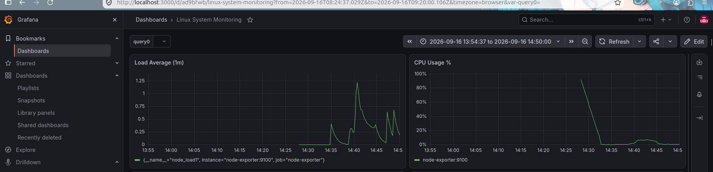
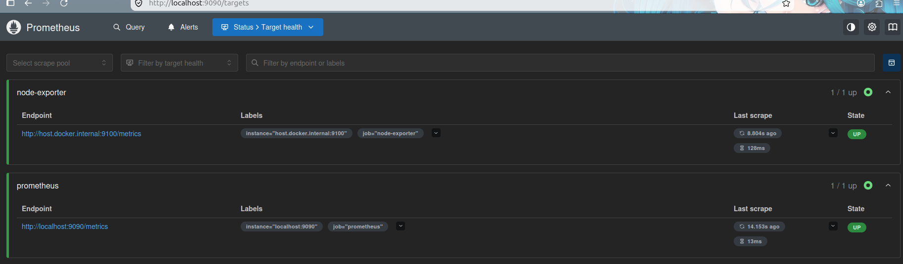
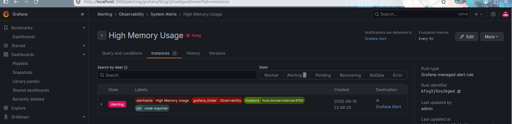
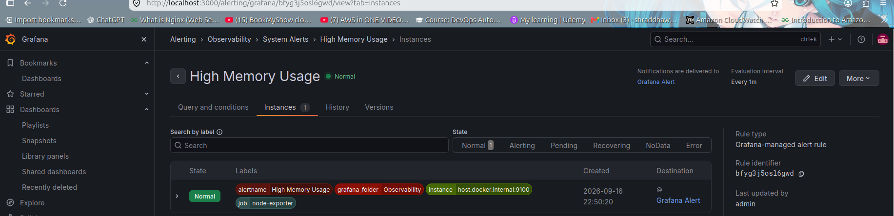
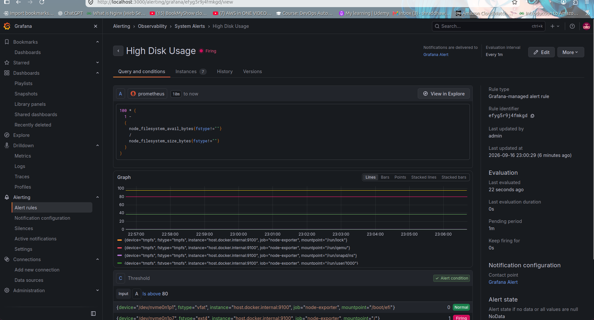
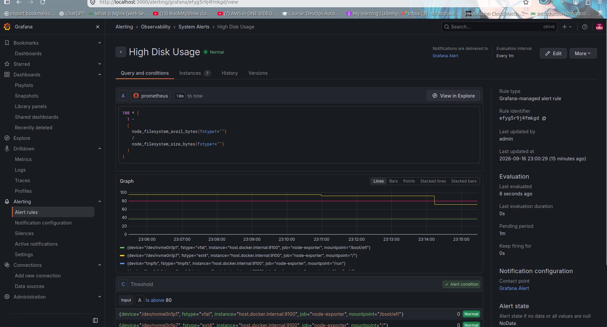

# Day 73 — Introduction to Observability and Prometheus

## Overview

Today I learned the fundamentals of **observability** and started building an observability stack using **Prometheus, Node Exporter, Docker, and Grafana**.

The goal was to understand how to monitor infrastructure, collect metrics, query those metrics using PromQL, visualize them in Grafana, and create alerts for important system conditions.

---

# 1. What is Observability?

**Observability** is the ability to understand the internal state and behavior of a system by analyzing the data it produces.

Traditional monitoring mainly helps answer:

> **"Is something wrong?"**

Observability helps answer:

> **"What is wrong, why is it happening, and where is the problem?"**

For example:

* Monitoring can tell me that CPU usage is above 80%.
* Observability allows me to investigate the CPU metrics and understand what is happening on the system.

---

# 2. Three Pillars of Observability

Observability is commonly explained using three main pillars:

## 2.1 Metrics

Metrics are numerical measurements collected over time.

Examples:

* CPU usage
* Memory usage
* Disk usage
* Network traffic
* Request count
* Error rate
* System uptime

In this project, **Prometheus** collects metrics and **Grafana** visualizes them.

---

## 2.2 Logs

Logs are timestamped records of events generated by applications and systems.

Examples:

* Application errors
* Authentication failures
* Database errors
* System events
* Service startup/shutdown messages

Common tools include:

* Loki
* ELK Stack
* Fluentd

---

## 2.3 Traces

Traces show the journey of a request through different components or services.

For example:

```text
User Request
     |
     v
API Gateway
     |
     v
Application
     |
     v
Payment Service
     |
     v
Database
```

Tracing helps identify where latency or failures occur in distributed applications.

Common tools include:

* OpenTelemetry
* Jaeger
* Zipkin

---

# 3. Why Do We Need All Three?

The three pillars provide different information.

| Pillar  | Helps answer         |
| ------- | -------------------- |
| Metrics | What is happening?   |
| Logs    | Why did it happen?   |
| Traces  | Where did it happen? |

Example:

```text
Metrics
   ↓
High error rate detected

Logs
   ↓
Database connection timeout

Traces
   ↓
Database request took 12 seconds
```

Together, they provide a better understanding of system behavior.

---

# 4. Monitoring vs Observability

| Monitoring                 | Observability                      |
| -------------------------- | ---------------------------------- |
| Detects known problems     | Helps investigate unknown problems |
| Uses dashboards and alerts | Uses metrics, logs and traces      |
| Often threshold based      | Supports deeper investigation      |
| Answers "Is it broken?"    | Helps answer "Why is it broken?"   |

Monitoring and observability complement each other. Monitoring is an important part of an observable system.

---

# 5. Architecture

The observability architecture I started building is:

```text
                         ┌─────────────────────┐
                         │     Ubuntu Host     │
                         │                     │
                         │    Node Exporter    │
                         │       :9100         │
                         └──────────┬──────────┘
                                    │
                                    │ Metrics
                                    ▼
                         ┌─────────────────────┐
                         │     Prometheus      │
                         │       :9090         │
                         └──────────┬──────────┘
                                    │
                                    │ PromQL
                                    ▼
                         ┌─────────────────────┐
                         │       Grafana       │
                         │       :3000         │
                         └─────────────────────┘
```

Prometheus also monitors itself:

```text
Prometheus
    │
    └──────> localhost:9090/metrics
```

The current project focuses on **metrics-based observability**. Logs and distributed tracing will be explored in later observability tasks.

---

# 6. Technologies Used

* Linux / Ubuntu
* Docker
* Docker Compose
* Prometheus
* Node Exporter
* Grafana
* PromQL
* systemd

---

# 7. Project Structure

My working project is:

```text
observability-stack/
├── docker-compose.yml
├── prometheus.yml
└── screenshots/
    ├── 01-prometheus-targets.png
    ├── 02-grafana-dashboard.png
    ├── 03-high-cpu-alert-firing.png
    ├── 04-high-cpu-alert-recovered.png
    ├── 05-high-memory-alert-firing.png
    ├── 06-high-memory-alert-recovered.png
    ├── 07-high-disk-alert-firing.png
    └── 08-high-disk-alert-recovered.png
```

---

# 8. Prometheus Setup

Prometheus was deployed using Docker Compose.

The Prometheus container exposes port `9090`.

## docker-compose.yml

```yaml
services:
  prometheus:
    image: prom/prometheus:latest
    container_name: prometheus
    ports:
      - "9090:9090"
    volumes:
      - ./prometheus.yml:/etc/prometheus/prometheus.yml
      - prometheus_data:/prometheus
    command:
      - '--config.file=/etc/prometheus/prometheus.yml'
    restart: unless-stopped

  grafana:
    image: grafana/grafana:latest
    container_name: grafana
    ports:
      - "3000:3000"
    volumes:
      - grafana_data:/var/lib/grafana
    restart: unless-stopped

volumes:
  prometheus_data:
  grafana_data:
```

---

# 9. Prometheus Configuration

My `prometheus.yml` contains two scrape targets.

```yaml
global:
  scrape_interval: 15s
  evaluation_interval: 15s

scrape_configs:
  - job_name: "prometheus"
    static_configs:
      - targets: ["localhost:9090"]

  - job_name: "node-exporter"
    static_configs:
      - targets: ["host.docker.internal:9100"]
```

## Explanation

### Scrape interval

```yaml
scrape_interval: 15s
```

Prometheus collects metrics every 15 seconds.

### Prometheus target

```yaml
targets: ["localhost:9090"]
```

Prometheus monitors its own metrics.

### Node Exporter target

```yaml
targets: ["host.docker.internal:9100"]
```

Node Exporter runs directly on the Ubuntu host and exposes system metrics on port `9100`.

Prometheus running inside Docker accesses the host exporter through `host.docker.internal`.

---

# 10. Node Exporter

I installed Node Exporter directly on the Ubuntu host using `systemd`.

The service is managed using:

```bash
systemctl status node_exporter
```

The service was verified using:

```bash
systemctl is-active node_exporter
```

Result:

```text
active
```

Node Exporter exposes Linux system metrics such as:

* CPU
* Memory
* Disk
* Network
* Filesystem
* Load average
* System uptime

---

# 11. Prometheus Targets

Prometheus Targets page was verified successfully.

The following targets were UP:

```text
prometheus
    localhost:9090

node-exporter
    host.docker.internal:9100
```

Both targets showed:

```text
UP
```

### Screenshot



---

# 12. Prometheus Concepts

## Scrape Target

A scrape target is an endpoint from which Prometheus collects metrics.

Prometheus uses a **pull-based model**.

```text
Prometheus
     |
     | HTTP GET /metrics
     ▼
Target
```

---

# 13. Metric Types

## Counter

A Counter is a metric that generally only increases.

Example:

```text
prometheus_http_requests_total
```

Real-world example:

```text
Total number of HTTP requests
```

---

## Gauge

A Gauge can increase or decrease.

Examples:

```text
CPU usage
Memory usage
Disk usage
Active connections
```

Real-world example:

```text
Current memory usage
```

For example:

```text
60% → 70% → 55%
```

A Gauge can move in both directions.

---

## Histogram

A Histogram measures observations and groups them into buckets.

It is useful for measuring distributions such as:

```text
Request duration
Response size
```

---

## Summary

A Summary also measures observations and can calculate quantiles/percentiles on the client side.

---

# 14. Labels

Labels add additional dimensions to metrics.

Example:

```text
http_requests_total{method="GET",status="200"}
```

Here:

```text
method="GET"
status="200"
```

are labels.

Labels allow Prometheus to filter and aggregate metrics.

---

# 15. Time Series

A time series is a sequence of metric values identified by a metric name and its label set.

For example:

```text
node_cpu_seconds_total{instance="host.docker.internal:9100",mode="idle"}
```

---

# 16. PromQL

**PromQL** stands for **Prometheus Query Language**.

It is used to query and analyze metrics stored in Prometheus.

---

## Query 1 — Check Target Health

```promql
up
```

### Result

The `up` metric reports the status of each scrape target.

```text
1 = target is UP
0 = target is DOWN
```

My Prometheus and Node Exporter targets returned `1`.

---

## Query 2 — Prometheus Memory Usage

```promql
process_resident_memory_bytes
```

This returns the amount of physical memory currently used by the Prometheus process.

---

## Query 3 — HTTP Requests

```promql
prometheus_http_requests_total
```

This metric represents the total HTTP requests handled by the Prometheus server.

It is a Counter.

---

## Query 4 — Filter HTTP Requests

```promql
prometheus_http_requests_total{code="200"}
```

This filters the HTTP request counter to responses with HTTP status code `200`.

---

## Query 5 — Rate of HTTP Requests

```promql
rate(prometheus_http_requests_total[5m])
```

This calculates the per-second rate of HTTP requests over the previous five minutes.

---

## Additional Query — Memory in MB

```promql
process_resident_memory_bytes / 1024 / 1024
```

This converts memory from bytes into megabytes.

---

# 17. Important PromQL Concept — rate()

`rate()` is commonly used with Counters.

Example:

```promql
rate(prometheus_http_requests_total[5m])
```

The Counter continuously increases:

```text
100
110
125
140
```

`rate()` calculates how quickly the counter is increasing.

For aggregation, a common pattern is:

```promql
sum(rate(metric[5m]))
```

---

# 18. Grafana Dashboard

I connected Grafana to Prometheus using:

```text
http://prometheus:9090
```

I created a dashboard named:

```text
Linux System Monitoring
```

The dashboard contains panels for:

1. CPU Usage
2. Memory Usage
3. Disk Usage
4. Network Receive Traffic
5. Network Transmit Traffic
6. System Uptime
7. Load Average

### Screenshot



---

# 19. CPU Monitoring

CPU usage query:

```promql
100 - (avg by (instance) (rate(node_cpu_seconds_total{mode="idle"}[5m])) * 100)
```

This calculates CPU utilization by measuring the percentage of time the CPU is not idle.

---

# 20. Memory Monitoring

Memory usage query:

```promql
(
  1 -
  (
    node_memory_MemAvailable_bytes
    /
    node_memory_MemTotal_bytes
  )
) * 100
```

This calculates the percentage of memory currently unavailable.

---

# 21. Disk Monitoring

For the root filesystem, I used:

```promql
100 * (
  1 -
  (
    node_filesystem_avail_bytes{
      mountpoint="/",
      fstype="ext4"
    }
    /
    node_filesystem_size_bytes{
      mountpoint="/",
      fstype="ext4"
    }
  )
)
```

This monitors the usage of the root filesystem.

---

# 22. Network Monitoring

Network receive traffic:

```promql
rate(node_network_receive_bytes_total{device="eth0"}[5m])
```

Network transmit traffic:

```promql
rate(node_network_transmit_bytes_total{device="eth0"}[5m])
```

---

# 23. System Uptime

```promql
time() - node_boot_time_seconds
```

This calculates the system uptime in seconds.

---

# 24. Load Average

```promql
node_load1
```

This shows the system's one-minute load average.

---

# 25. Alerting

I created three Grafana alerts:

```text
High CPU Usage
High Memory Usage
High Disk Usage
```

The alert evaluation interval was:

```text
1 minute
```

The pending period was:

```text
1 minute
```

---

# 26. CPU Alert Testing

CPU alert condition:

```text
CPU usage > 80%
```

To test the alert, I generated CPU load using:

```bash
for i in {1..16}; do yes > /dev/null & done
```

The alert transitioned through:

```text
Normal
   ↓
Pending
   ↓
Firing
```

After stopping the CPU load:

```bash
pkill yes
```

the alert recovered:

```text
Firing
   ↓
Normal
```

### CPU Alert Firing



### CPU Alert Recovered



---

# 27. Memory Alert Testing

Memory alert condition:

```text
Memory usage > 80%
```

I generated memory pressure using a Python process that allocated approximately 2 GB of memory.

The alert transitioned to:

```text
Pending
   ↓
Firing
```

After releasing the allocated memory, the alert returned to:

```text
Normal
```

### Memory Alert Firing



### Memory Alert Recovered



---

# 28. Disk Alert Testing

The disk alert condition was:

```text
Disk usage > 80%
```

The root filesystem initially reached approximately:

```text
95%
```

I verified the actual filesystem usage using:

```bash
df -h /
```

The alert entered the firing state.

### Disk Alert Firing



---

## Disk Cleanup and Recovery

I safely removed old local backup archives from:

```text
~/backups
```

The directory contained approximately 16 GB of old `.tar.gz` backup files.

After cleanup, disk usage became:

```text
71%
```

The High Disk Usage alert recovered to Normal.

### Disk Alert Recovered



---

# 29. Final Verification

Docker Compose configuration was validated using:

```bash
docker compose config
```

Running containers:

```bash
docker compose ps
```

Result:

```text
grafana       Up
prometheus    Up
```

Node Exporter:

```bash
systemctl is-active node_exporter
```

Result:

```text
active
```

Prometheus target verification showed:

```text
node-exporter
host.docker.internal:9100
health: up
```

and:

```text
prometheus
localhost:9090
health: up
```

Therefore, the complete metrics monitoring stack was successfully verified.

---

# 30. What I Learned

Through this task I learned:

* What observability means
* Difference between monitoring and observability
* Three pillars: metrics, logs and traces
* Prometheus architecture
* Pull-based metric collection
* Scrape targets
* Prometheus metric types
* Labels and time series
* PromQL fundamentals
* Counters vs Gauges
* Using `rate()`
* Node Exporter
* Linux system metrics
* Grafana dashboards
* Grafana alerting
* Testing alerts using real system load
* Verifying alert recovery
* Docker Compose configuration
* Monitoring a Linux host from a Prometheus container

---

# 31. Final Architecture

```text
                         Ubuntu Linux Host
                              │
                    ┌─────────┴─────────┐
                    │                   │
                    │             Node Exporter
                    │                  :9100
                    │                   │
                    └───────────────────┘
                                        │
                                     Metrics
                                        │
                                        ▼
                              ┌──────────────────┐
                              │    Prometheus    │
                              │      :9090       │
                              │                  │
                              │    PromQL        │
                              │    Alert Rules   │
                              └────────┬─────────┘
                                       │
                                       │
                                       ▼
                              ┌──────────────────┐
                              │      Grafana     │
                              │      :3000       │
                              │                  │
                              │    Dashboards    │
                              │     Alerts       │
                              └──────────────────┘
```

---

# Conclusion

Day 73 introduced me to observability and Prometheus.

I started with the concepts of metrics, logs and traces and then built a practical metrics monitoring stack.

The final implementation monitors my Ubuntu system using Node Exporter, collects metrics with Prometheus, visualizes them with Grafana, and generates alerts for high CPU, memory and disk usage.

The alerts were manually tested and successfully recovered to the Normal state.

This gives me a practical foundation for continuing with the remaining observability tools and concepts in the upcoming days of the 90DaysOfDevOps journey.
