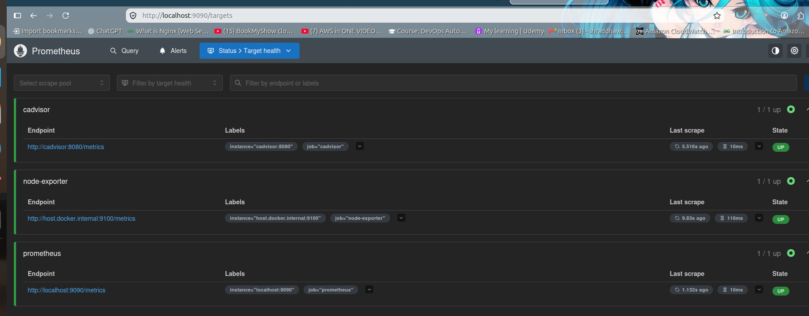
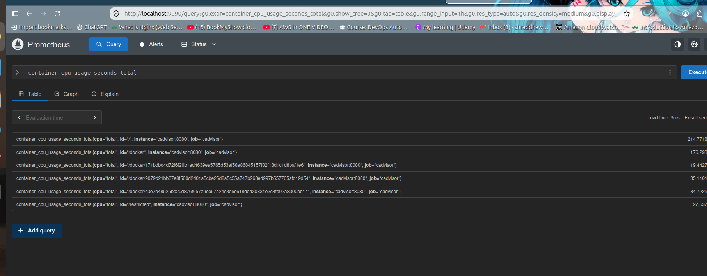
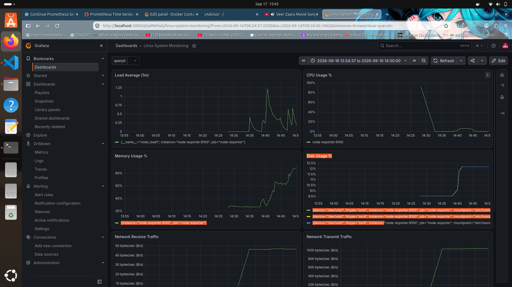
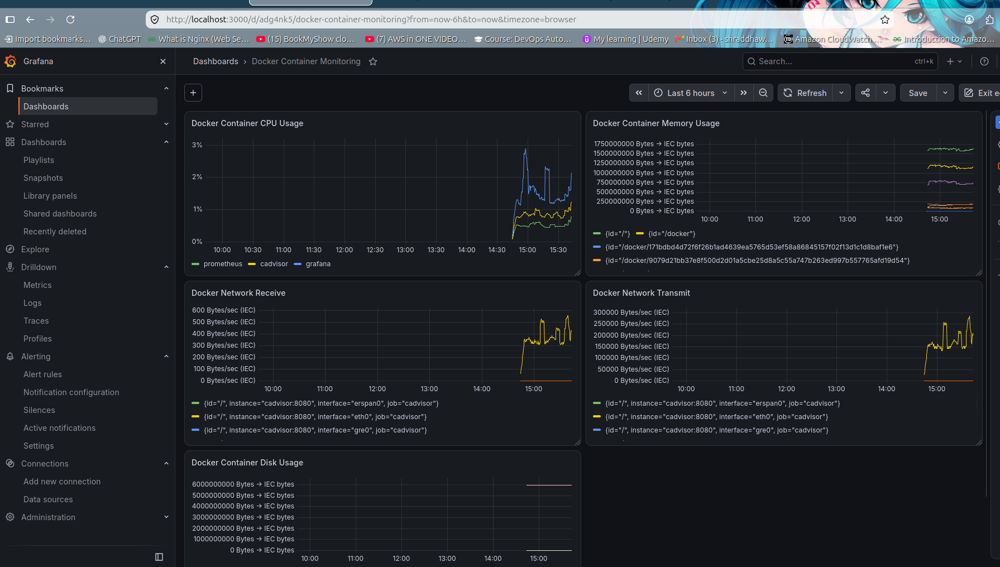
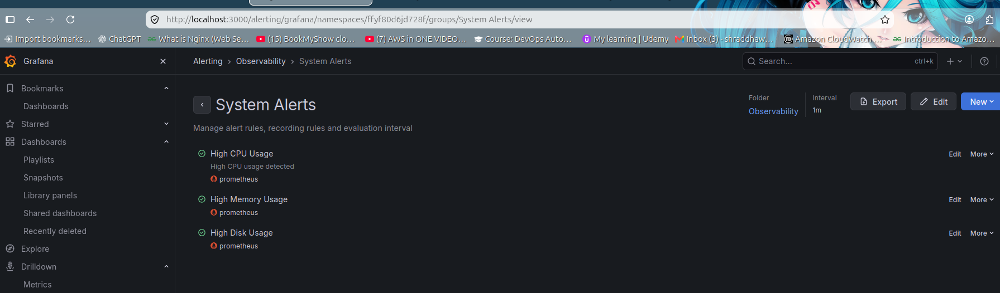

# Day 74 -- Node Exporter, cAdvisor, and Grafana Dashboards

## Overview

On Day 74, I extended my Prometheus observability stack by adding Node Exporter and cAdvisor and connecting them with Grafana.

The goal was to monitor:

- Linux host/system metrics
- Docker container metrics
- CPU usage
- Memory usage
- Disk usage
- Network traffic
- System uptime
- Load average
- Prometheus target health
- Grafana dashboards
- Alerting and recovery

My final monitoring stack contains:

```text
Ubuntu Host
   |
   |-- Node Exporter :9100
   |       |
   |       v
   |    Prometheus :9090
   |       |
   |       v
   |    Grafana :3000
   |
   |-- Docker
          |
          |-- Prometheus
          |-- Grafana
          |-- cAdvisor :8082
````

---

# 1. Environment

Operating system:

```text
Ubuntu Linux
```

Docker was already available on my system.

The monitoring components were configured as follows:

| Component     | Purpose                         | Port |
| ------------- | ------------------------------- | ---: |
| Prometheus    | Metrics collection and querying | 9090 |
| Node Exporter | Linux host metrics              | 9100 |
| cAdvisor      | Docker container metrics        | 8082 |
| Grafana       | Visualization and dashboards    | 3000 |

---

# 2. Node Exporter

## What is Node Exporter?

Node Exporter is a Prometheus exporter that exposes hardware and operating-system-level metrics from a Linux system.

It provides metrics such as:

* CPU usage
* Memory usage
* Disk usage
* Filesystem usage
* Network traffic
* System load
* System uptime
* Boot time

Node Exporter exposes these metrics through:

```text
http://localhost:9100/metrics
```

---

## Why I installed Node Exporter directly on Ubuntu

My environment uses Docker Desktop.

Docker Desktop runs containers inside its own Linux environment. Because of this, running Node Exporter only inside a normal container could monitor the Docker environment rather than the Ubuntu host I wanted to monitor.

Therefore, I installed Node Exporter directly on the Ubuntu host using systemd.

---

## Node Exporter service

The Node Exporter binary was installed at:

```text
/usr/local/bin/node_exporter
```

A dedicated system user was created:

```text
node_exporter
```

The systemd service was configured at:

```text
/etc/systemd/system/node_exporter.service
```

The service configuration:

```ini
[Unit]
Description=Prometheus Node Exporter
Wants=network-online.target
After=network-online.target

[Service]
User=node_exporter
Group=node_exporter
Type=simple
ExecStart=/usr/local/bin/node_exporter

[Install]
WantedBy=multi-user.target
```

Node Exporter listens on:

```text
:9100
```

---

# 3. Prometheus Configuration

Prometheus was configured to scrape three targets:

1. Prometheus itself
2. Node Exporter
3. cAdvisor

The final Prometheus configuration is:

```yaml
global:
  scrape_interval: 15s
  evaluation_interval: 15s

scrape_configs:
  - job_name: "prometheus"
    static_configs:
      - targets: ["localhost:9090"]

  - job_name: "node-exporter"
    static_configs:
      - targets: ["host.docker.internal:9100"]

  - job_name: "cadvisor"
    static_configs:
      - targets: ["cadvisor:8080"]
```

The Prometheus configuration was validated using:

```bash
docker compose exec prometheus promtool check config /etc/prometheus/prometheus.yml
```

Result:

```text
SUCCESS: /etc/prometheus/prometheus.yml is valid prometheus config file syntax
```

---

# 4. cAdvisor

## What is cAdvisor?

cAdvisor, or Container Advisor, collects resource usage and performance information about running containers.

It provides container-level metrics such as:

* Container CPU usage
* Container memory usage
* Container network traffic
* Container filesystem usage
* Container resource consumption

---

## cAdvisor Docker configuration

cAdvisor was added to the Docker Compose stack.

The service uses:

```yaml
cadvisor:
  image: gcr.io/cadvisor/cadvisor:latest
  container_name: cadvisor
  ports:
    - "8082:8080"
  volumes:
    - /var/run/docker.sock:/var/run/docker.sock:ro
    - /sys:/sys:ro
    - /var/lib/docker/:/var/lib/docker:ro
  restart: unless-stopped
```

The container listens internally on:

```text
8080
```

The host exposes it on:

```text
8082
```

Therefore cAdvisor can be accessed from the host through:

```text
http://localhost:8082
```

---

# 5. Why port 8082 was used

Port 8080 was already being used on my Ubuntu system.

Therefore, instead of changing cAdvisor's internal port, I mapped:

```text
8082:8080
```

This means:

```text
Ubuntu host port 8082
        |
        v
cAdvisor container port 8080
```

Prometheus communicates with cAdvisor using the Docker service name:

```text
cadvisor:8080
```

---

# 6. cAdvisor Metrics Test

I verified that cAdvisor was exposing metrics using:

```bash
curl -s http://localhost:8082/metrics | head
```

cAdvisor returned Prometheus-compatible metrics successfully.

I also verified that Prometheus could reach cAdvisor from inside the Prometheus container:

```bash
docker compose exec prometheus wget -qO- http://cadvisor:8080/metrics | head
```

This confirmed that the Prometheus-to-cAdvisor connection was working.

---

# 7. Prometheus Targets

Prometheus was configured with three scrape targets.

The final target health was:

| Job           | Target                    | Status |
| ------------- | ------------------------- | ------ |
| prometheus    | localhost:9090            | UP     |
| node-exporter | host.docker.internal:9100 | UP     |
| cadvisor      | cadvisor:8080             | UP     |

All three targets were successfully scraped by Prometheus.

The target API was checked using:

```bash
curl -s http://localhost:9090/api/v1/targets
```

The important result was:

```text
"job": "cadvisor"
"instance": "cadvisor:8080"
"health": "up"

"job": "node-exporter"
"instance": "host.docker.internal:9100"
"health": "up"

"job": "prometheus"
"instance": "localhost:9090"
"health": "up"
```

---

# 8. Node Exporter vs cAdvisor

| Node Exporter           | cAdvisor                     |
| ----------------------- | ---------------------------- |
| Monitors the Linux host | Monitors containers          |
| CPU metrics of the host | CPU metrics of containers    |
| Host memory metrics     | Container memory metrics     |
| Host filesystem metrics | Container filesystem metrics |
| Host network metrics    | Container network metrics    |
| System load             | Container resource usage     |
| System uptime           | Container performance        |

Simple explanation:

```text
Node Exporter
      |
      v
Linux Host Monitoring

cAdvisor
      |
      v
Docker Container Monitoring
```

Both exporters complement each other.

---

# 9. Grafana

Grafana was configured as the visualization layer.

Grafana runs on:

```text
http://localhost:3000
```

Prometheus was added as a Grafana datasource.

The datasource URL used inside the Docker Compose network was:

```text
http://prometheus:9090
```

---

# 10. Linux System Monitoring Dashboard

I created a custom Grafana dashboard named:

```text
Linux System Monitoring
```

The dashboard contains panels for important Linux host metrics.

---

## CPU Usage

PromQL:

```promql
100 - (avg by (instance) (rate(node_cpu_seconds_total{mode="idle"}[5m])) * 100)
```

This calculates the percentage of CPU time that is not idle.

---

## Memory Usage

PromQL:

```promql
(
  1 -
  (
    node_memory_MemAvailable_bytes
    /
    node_memory_MemTotal_bytes
  )
) * 100
```

This calculates the percentage of memory currently being used.

---

## Disk Usage

PromQL:

```promql
100 * (
  1 -
  (
    node_filesystem_avail_bytes{
      mountpoint="/",
      fstype="ext4"
    }
    /
    node_filesystem_size_bytes{
      mountpoint="/",
      fstype="ext4"
    }
  )
)
```

This calculates root filesystem usage.

---

## Network Receive

PromQL:

```promql
rate(node_network_receive_bytes_total{device="eth0"}[5m])
```

This shows the rate of network traffic received by the interface.

---

## Network Transmit

PromQL:

```promql
rate(node_network_transmit_bytes_total{device="eth0"}[5m])
```

This shows the rate of network traffic transmitted by the interface.

---

## System Uptime

PromQL:

```promql
time() - node_boot_time_seconds
```

This calculates how long the system has been running.

---

## Load Average

PromQL:

```promql
node_load1
```

This shows the one-minute system load average.

---

# 11. Docker Container Monitoring Dashboard

I also created a second Grafana dashboard named:

```text
Docker Container Monitoring
```

The dashboard monitors Docker containers through cAdvisor.

It contains five panels:

1. Docker Container CPU Usage
2. Docker Container Memory Usage
3. Docker Network Receive
4. Docker Network Transmit
5. Docker Container Disk Usage

---

# 12. Docker Container CPU Usage

PromQL:

```promql
sum by (id) (
  rate(container_cpu_usage_seconds_total{id=~"/docker/.*"}[5m])
) * 100
```

This query calculates CPU usage for the Docker containers.

The filter:

```promql
{id=~"/docker/.*"}
```

limits the results to Docker container IDs instead of showing system-level cgroup entries.

The Grafana panel was configured as a time series.

The container IDs were renamed in Grafana using the Rename fields by regex transformation.

The containers were mapped as:

```text
171bdbd4... -> prometheus
9079d21b... -> cadvisor
c3e7b485... -> grafana
```

This makes the Grafana legend easier to understand.

---

# 13. Docker Container Memory Usage

PromQL:

```promql
container_memory_usage_bytes
```

This shows memory consumption for containers.

Grafana was configured to display the values using IEC byte units.

---

# 14. Docker Network Receive

PromQL:

```promql
rate(container_network_receive_bytes_total[5m])
```

This shows the rate at which containers receive network traffic.

---

# 15. Docker Network Transmit

PromQL:

```promql
rate(container_network_transmit_bytes_total[5m])
```

This shows the rate at which containers transmit network traffic.

---

# 16. Docker Container Disk Usage

PromQL:

```promql
container_fs_usage_bytes
```

This shows filesystem usage associated with containers.

The Grafana panel was configured as a time series using IEC byte units.

---

# 17. Grafana Alerts

I also practiced Grafana alerting using the Linux host metrics.

Alerts were created for:

* High CPU Usage
* High Memory Usage
* High Disk Usage

The threshold used was:

```text
80%
```

---

## CPU Alert Test

The CPU alert was tested by generating CPU load.

The alert went through the expected states:

```text
Normal
   |
   v
Pending
   |
   v
Firing
   |
   v
Normal
```

This confirmed that the alert condition and recovery behavior were working.

---

# 18. Memory Alert Test

The memory alert was tested by temporarily allocating approximately 2 GB of memory using Python.

The alert transitioned through:

```text
Normal
   |
   v
Pending
   |
   v
Firing
   |
   v
Normal
```

After the test process ended, memory usage returned to normal and the alert recovered.

---

# 19. Disk Alert Test

The disk alert was also tested.

Initially, the root filesystem reached approximately:

```text
95%
```

Old backup archives were removed after confirming they were no longer required.

Disk usage subsequently dropped to approximately:

```text
71%
```

The disk alert recovered successfully.

This also demonstrated the importance of monitoring filesystem capacity on production systems.

---

# 20. Docker Compose Stack

The main Docker Compose stack contains:

```text
Prometheus
Grafana
cAdvisor
```

Node Exporter runs directly on the Ubuntu host because the environment uses Docker Desktop and the objective was to monitor the actual Ubuntu host.

The main Compose services are:

```yaml
services:
  prometheus:
    image: prom/prometheus:latest
    container_name: prometheus
    ports:
      - "9090:9090"
    volumes:
      - ./prometheus.yml:/etc/prometheus/prometheus.yml
      - prometheus_data:/prometheus
    command:
      - '--config.file=/etc/prometheus/prometheus.yml'
    restart: unless-stopped

  grafana:
    image: grafana/grafana:latest
    container_name: grafana
    ports:
      - "3000:3000"
    volumes:
      - grafana_data:/var/lib/grafana
    restart: unless-stopped

  cadvisor:
    image: gcr.io/cadvisor/cadvisor:latest
    container_name: cadvisor
    ports:
      - "8082:8080"
    volumes:
      - /var/run/docker.sock:/var/run/docker.sock:ro
      - /sys:/sys:ro
      - /var/lib/docker/:/var/lib/docker:ro
    restart: unless-stopped

volumes:
  prometheus_data:
  grafana_data:
```

---

# 21. Useful Verification Commands

Check running services:

```bash
docker compose ps
```

Validate Prometheus configuration:

```bash
docker compose exec prometheus promtool check config /etc/prometheus/prometheus.yml
```

Check cAdvisor metrics:

```bash
curl -s http://localhost:8082/metrics | head
```

Check Prometheus targets:

```bash
curl -s http://localhost:9090/api/v1/targets
```

Check Node Exporter metrics:

```bash
curl -s http://localhost:9100/metrics | head
```

---

# 22. Key Concepts Learned

During this task I learned:

### Prometheus

Prometheus is responsible for collecting and storing time-series metrics.

### Node Exporter

Node Exporter exposes Linux host-level metrics in Prometheus format.

### cAdvisor

cAdvisor exposes Docker container resource and performance metrics.

### Grafana

Grafana visualizes Prometheus metrics using dashboards and panels.

### PromQL

PromQL is the query language used to select, calculate, and analyze Prometheus metrics.

### Scrape Targets

Prometheus periodically collects metrics from configured targets.

### Exporters

Exporters expose metrics from systems that Prometheus cannot monitor directly.

---

# 23. Monitoring Architecture

The final architecture can be summarized as:

```text
                    +----------------------+
                    |      Ubuntu Host     |
                    |                      |
                    |   Node Exporter     |
                    |       :9100          |
                    +----------+-----------+
                               |
                               |
                               v
                    +----------------------+
                    |     Prometheus       |
                    |       :9090          |
                    +----------+-----------+
                               |
                    +----------+-----------+
                    |                      |
                    v                      v
           +----------------+     +----------------+
           |    Grafana     |     |    cAdvisor    |
           |     :3000      |     |     :8082      |
           +----------------+     +-------+--------+
                                          |
                                          v
                                  Docker Containers
```

---

# 24. Final Result

By completing this task, I extended my Prometheus monitoring environment to monitor both the Linux host and Docker containers.

The final setup provides:

```text
Linux Host Metrics
        +
Docker Container Metrics
        +
Prometheus
        +
Grafana Dashboards
        +
PromQL
        +
Alerting
```

All three Prometheus scrape targets were successfully working:

```text
Prometheus       UP
Node Exporter    UP
cAdvisor         UP
```

This gives me practical experience with an observability stack commonly used in DevOps and cloud environments.

---

# 25. What I Learned from Day 74

The main lesson from this task is that monitoring should happen at different layers.

```text
Infrastructure Layer
        |
        v
Node Exporter
        |
        v
Linux Host Metrics

Container Layer
        |
        v
cAdvisor
        |
        v
Docker Container Metrics

Monitoring Layer
        |
        v
Prometheus
        |
        v
Metrics Storage + PromQL

Visualization Layer
        |
        v
Grafana
        |
        v
Dashboards + Alerts
```

This helped me understand how exporters, Prometheus, PromQL, and Grafana work together as one observability system.

````
# 26. Screenshots

## Prometheus Targets

All three Prometheus targets were successfully configured and showed an `UP` status.



---

## Prometheus cAdvisor Metrics

cAdvisor metrics were successfully exposed and queried through Prometheus.



---

## Linux System Monitoring Dashboard

The custom Grafana dashboard displays Linux host metrics collected by Node Exporter.



---

## Docker Container Monitoring Dashboard

The custom Grafana dashboard displays Docker container metrics collected by cAdvisor.



---

## Grafana Alerts

Grafana alerting was configured for CPU, memory, and disk usage.


