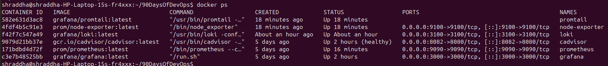
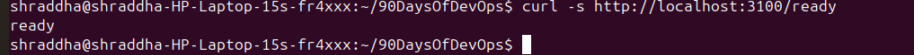
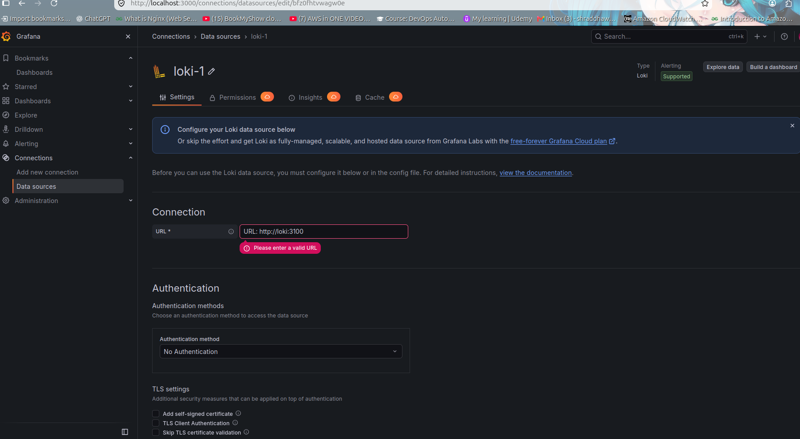
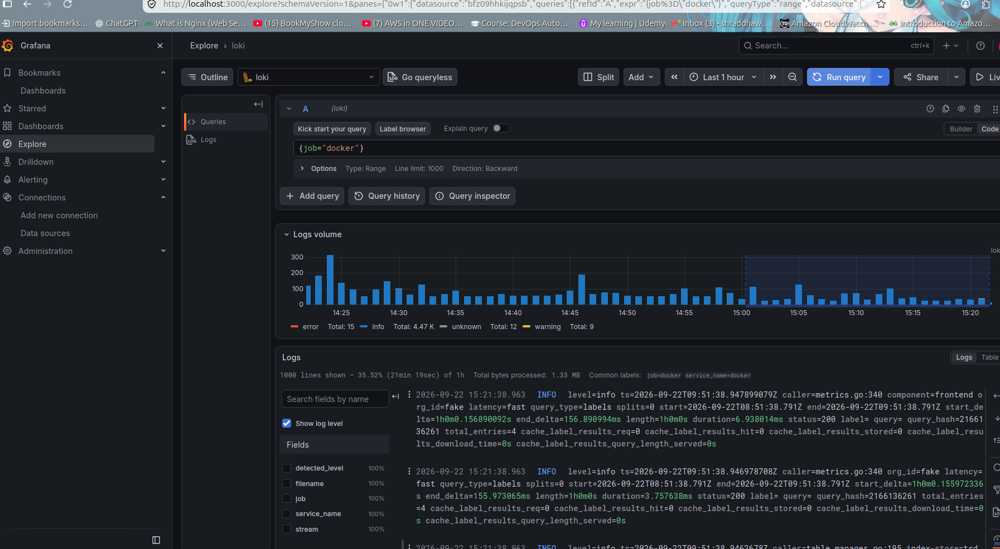
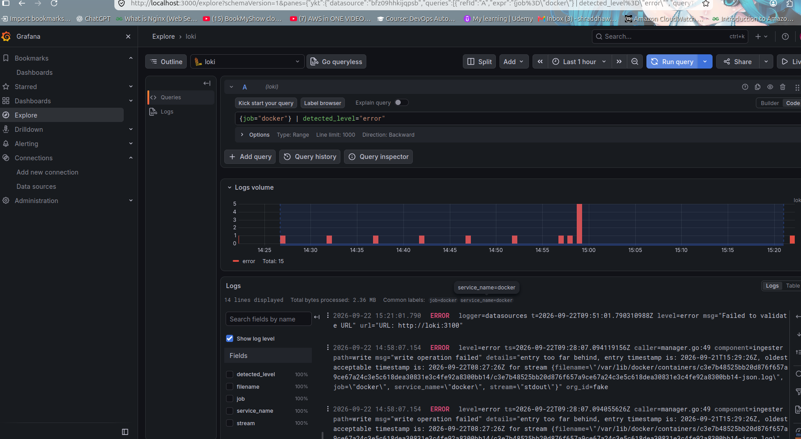
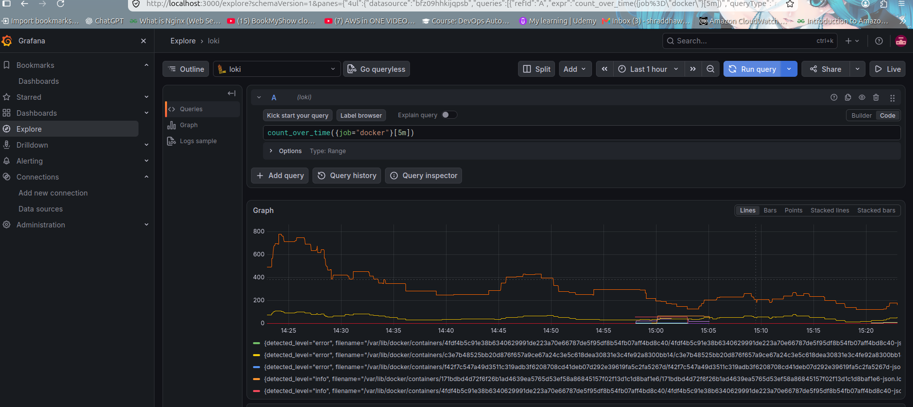
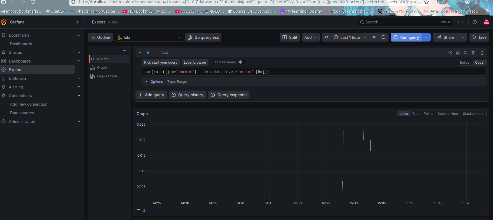
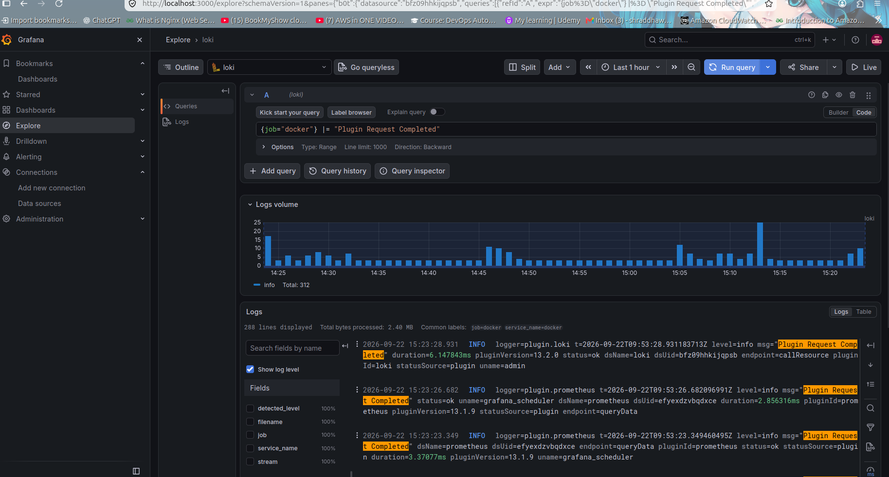

# Day 75 — Loki & Promtail

## Objective

The goal of Day 75 was to implement centralized container logging using:

* Loki
* Promtail
* Grafana
* Docker

The objective was to collect Docker container logs with Promtail, store and query them using Loki, and visualize/search them through Grafana.

---

## Architecture

```text
                    Docker Containers
                           |
                           | Docker JSON Logs
                           v
                      Promtail
                           |
                           | Push logs
                           v
                         Loki
                           |
                           | LogQL queries
                           v
                        Grafana
                           |
                           v
                          User
```

---

## Components

### 1. Promtail

Promtail is the log collection agent.

It reads Docker container JSON log files and sends them to Loki.

In this project, Promtail reads:

```text
/var/lib/docker/containers/*/*-json.log
```

and sends logs to:

```text
http://loki:3100/loki/api/v1/push
```

---

### 2. Loki

Loki is the log aggregation and storage system.

It receives logs from Promtail and allows them to be queried using LogQL.

Loki is exposed on:

```text
localhost:3100
```

---

### 3. Grafana

Grafana provides the user interface for querying and visualizing Loki logs.

The Grafana Loki datasource uses:

```text
http://loki:3100
```

The hostname `loki` works because Grafana and Loki are running on the same Docker Compose network.

---

# Docker Compose

The observability stack contains:

* Prometheus
* Grafana
* cAdvisor
* Node Exporter
* Loki
* Promtail

Important services for Day 75:

```yaml
loki:
  image: grafana/loki:latest
  container_name: loki
  ports:
    - "3100:3100"
  volumes:
    - ./loki/loki-config.yml:/etc/loki/loki-config.yml
    - loki_data:/loki
  command: -config.file=/etc/loki/loki-config.yml
  restart: unless-stopped

promtail:
  image: grafana/promtail:latest
  container_name: promtail
  volumes:
    - ./promtail/promtail-config.yml:/etc/promtail/promtail-config.yml
    - /var/lib/docker/containers:/var/lib/docker/containers:ro
    - /var/run/docker.sock:/var/run/docker.sock
  command: -config.file=/etc/promtail/promtail-config.yml
  restart: unless-stopped
```

---

# Loki Configuration

File:

```text
loki/loki-config.yml
```

Configuration:

```yaml
auth_enabled: false

server:
  http_listen_port: 3100

common:
  ring:
    instance_addr: 127.0.0.1
    kvstore:
      store: inmemory
  replication_factor: 1
  path_prefix: /loki

schema_config:
  configs:
    - from: 2020-10-24
      store: tsdb
      object_store: filesystem
      schema: v13
      index:
        prefix: index_
        period: 24h

storage_config:
  filesystem:
    directory: /loki/chunks
```

---

# Promtail Configuration

File:

```text
promtail/promtail-config.yml
```

Configuration:

```yaml
server:
  http_listen_port: 9080
  grpc_listen_port: 0

positions:
  filename: /tmp/positions.yaml

clients:
  - url: http://loki:3100/loki/api/v1/push

scrape_configs:
  - job_name: docker
    static_configs:
      - targets:
          - localhost
        labels:
          job: docker
          __path__: /var/lib/docker/containers/*/*-json.log
    pipeline_stages:
      - docker: {}
```

---

# Starting the Stack

The complete stack was started with:

```bash
cd ~/observability-stack
docker compose up -d
```

Containers were verified using:

```bash
docker ps
```

Running services:

```text
prometheus
grafana
cadvisor
node-exporter
loki
promtail
```

---

# Verify Loki

Loki was tested using:

```bash
curl -s http://localhost:3100/ready
```

The response eventually became:

```text
ready
```

This confirmed that Loki was ready to receive and query logs.

---

# Verify Loki Labels

The available labels were checked using:

```bash
curl -s http://localhost:3100/loki/api/v1/labels
```

The response included:

```text
__stream_shard__
filename
job
service_name
stream
```

The `job` label was verified using:

```bash
curl -s http://localhost:3100/loki/api/v1/label/job/values
```

Result:

```text
docker
```

This confirmed that Promtail was sending Docker logs to Loki.

---

# Grafana Loki Datasource

A Loki datasource was added in Grafana.

Grafana URL:

```text
http://localhost:3000
```

Loki datasource URL:

```text
http://loki:3100
```

Grafana successfully connected to Loki.

---

# LogQL Queries

## 1. View Docker Logs

Query:

```logql
{job="docker"}
```

This returned Docker container logs successfully.

---

## 2. Search for Errors

Query:

```logql
{job="docker"} |= "error"
```

This filters logs containing the word `error`.

---

## 3. Exclude Health Logs

Query:

```logql
{job="docker"} != "health"
```

This removes log lines containing the word `health`.

---

## 4. Regex HTTP Error Search

Query:

```logql
{job="docker"} |~ "status=[45]\\d{2}"
```

This searches for HTTP status codes in the 400–599 range.

Examples observed included:

* HTTP 404
* HTTP 401

---

## 5. Count Logs Over Time

Query:

```logql
count_over_time({job="docker"}[5m])
```

This counts log entries over a five-minute range.

---

## 6. Count Error Logs

Query:

```logql
count_over_time({job="docker"} | detected_level="error" [5m])
```

This counts error-level logs over five minutes.

---

## 7. Calculate Error Rate

Query:

```logql
rate({job="docker"} | detected_level="error" [5m])
```

This calculates the rate of error log entries.

---

## 8. Total Error Rate

Query:

```logql
sum(rate({job="docker"} | detected_level="error" [5m]))
```

This calculates the total error rate across the matching streams.

---

## 9. Top Error Streams

Query:

```logql
topk(
  5,
  sum by (filename) (
    rate({job="docker"} | detected_level="error" [5m])
  )
)
```

This identifies the streams producing the highest error rate.

---

## 10. Search Specific Errors

Query:

```logql
{job="docker"} |= "SMTP not configured"
```

This identified repeated Grafana alert notification errors caused by SMTP not being configured.

---

# Troubleshooting

## 1. `entry too far behind`

While querying error logs, Loki showed messages similar to:

```text
entry too far behind
```

The reason was that Promtail was reading existing Docker JSON log files, including historical entries.

Some old log timestamps were outside Loki's accepted ingestion window.

This did not indicate that current log ingestion was broken.

Fresh logs were successfully received afterward.

---

## 2. SMTP Not Configured

Grafana logs contained:

```text
SMTP not configured
```

This was related to Grafana alert notification configuration.

It did not prevent Loki from collecting and querying logs.

---

## 3. Node Exporter udev Warning

Node Exporter produced a warning related to:

```text
/run/udev/data
```

Node Exporter itself remained healthy and Prometheus successfully scraped it.

Therefore, this warning was unrelated to the Loki/Promtail pipeline.

---

# Final Validation

Fresh Grafana logs were successfully queried using:

```logql
{job="docker"} |= "Plugin Request Completed"
```

Hundreds of fresh log lines were returned.

Examples included:

```text
Plugin Request Completed
Response received from loki
status=ok
statusCode=200
```

Grafana also successfully queried Loki with HTTP:

```text
statusCode=200
status=ok
```

This confirmed the complete logging pipeline.

---

# What I Learned

### Loki

Loki is a log aggregation system designed to work well with Grafana.

It primarily indexes log labels instead of indexing the complete contents of every log line.

---

### Promtail

Promtail is responsible for collecting logs and pushing them to Loki.

In this project, Promtail collected Docker JSON logs.

---

### LogQL

LogQL is Loki's query language.

Important operations practiced:

```text
{job="docker"}
|= "error"
!= "health"
|~ "regex"
count_over_time()
rate()
sum()
topk()
```

---

# Monitoring vs Logging

Prometheus is mainly used for metrics.

Example:

```text
CPU usage
Memory usage
Request rate
Container metrics
```

Loki is used for logs.

Example:

```text
Application errors
HTTP errors
Authentication failures
Application events
```

Grafana can bring both metrics and logs together.

```text
Prometheus → Metrics
Loki       → Logs
Grafana    → Visualization
```

---

# Interview Explanation

If asked:

**"What is Loki and how does it work with Promtail?"**

Answer:

> Loki is a log aggregation system from Grafana. Promtail acts as the log collection agent. Promtail reads logs from sources such as Docker containers and pushes them to Loki. Loki stores and indexes the log metadata and provides LogQL for querying. Grafana connects to Loki as a datasource and allows us to search, filter, and visualize the logs.

---

# Day 75 Outcome

Successfully implemented:

* Docker log collection
* Promtail
* Loki
* Grafana Loki datasource
* LogQL
* Error filtering
* Regex searches
* Log counting
* Log rate calculations
* Error-rate analysis
* Log troubleshooting
* Metrics and logs correlation

Day 75 completed successfully.

# Screenshots

## 1. Docker Observability Stack

All six observability services are running successfully.



## 2. Loki Ready

Loki was verified and confirmed to be ready.



## 3. Grafana Loki Datasource

Grafana was successfully connected to the Loki datasource.



## 4. Docker Logs in Grafana

Docker container logs were successfully collected by Promtail and displayed through Grafana.



## 5. Error Log Filtering

LogQL was used to filter error-level logs.



## 6. Count Over Time

The `count_over_time()` function was used to analyze log entries over time.



## 7. Error Rate

The `rate()` function was used to calculate the error rate.



## 8. Fresh Logs

Fresh Docker logs were successfully received and queried through Loki.


