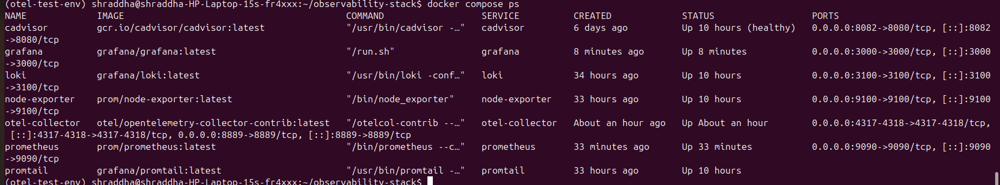
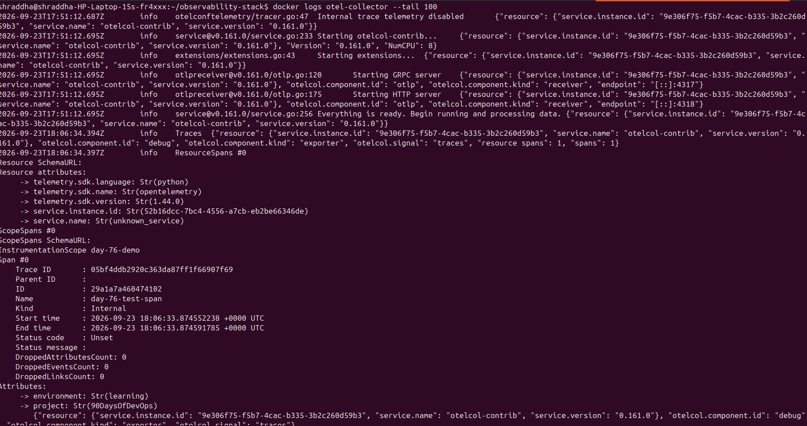
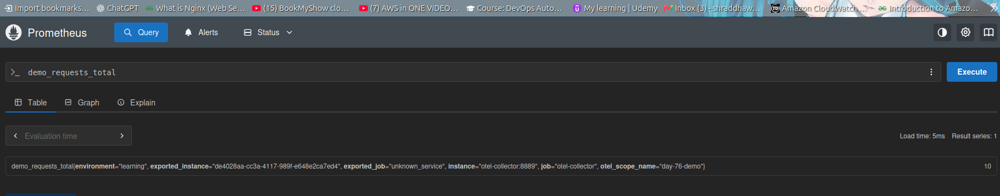
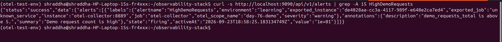
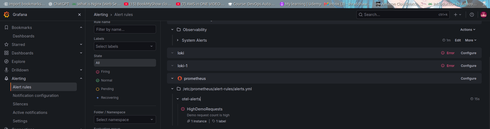
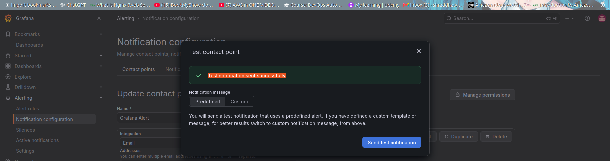
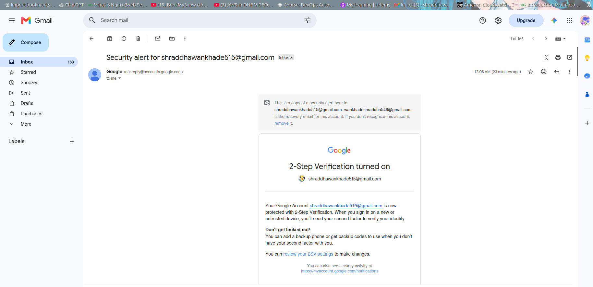

# Day 76 – OpenTelemetry & Alerting

## 📌 Overview

Today I worked on **OpenTelemetry and Alerting** as part of my `90DaysOfDevOps` journey.

The goal was to understand how application telemetry can be collected using OpenTelemetry, exported to Prometheus, evaluated using alert rules, visualized in Grafana, and finally delivered through email notifications.

---

## 🏗️ Architecture

```text
Python Application
       │
       │ OTLP
       ▼
OpenTelemetry Collector
       │
       │ Prometheus Metrics
       ▼
   Prometheus
       │
       │ Alert Rule
       ▼
HighDemoRequests
       │
       ▼
     Grafana
       │
       │ SMTP
       ▼
     Gmail
```

---

## 🛠️ Technologies Used

* OpenTelemetry
* OpenTelemetry Collector
* Python
* Prometheus
* Grafana
* Gmail SMTP
* Docker
* Docker Compose
* PromQL
* OTLP gRPC

---

# 1. OpenTelemetry Collector

I configured the OpenTelemetry Collector to receive telemetry through OTLP.

### OTLP endpoints

```text
gRPC: localhost:4317
HTTP: localhost:4318
```

The Collector also exposes Prometheus-compatible metrics:

```text
localhost:8889
```

The Collector was deployed using Docker Compose.

### Screenshot



---

# 2. OpenTelemetry Trace

I created a Python test application that generated an OpenTelemetry span.

The test span was:

```text
day-76-test-span
```

The span contained attributes such as:

```text
environment = learning
project = 90DaysOfDevOps
```

The trace was successfully received by the OpenTelemetry Collector through OTLP gRPC.

### Screenshot



---

# 3. OpenTelemetry Metrics

I created a custom OpenTelemetry counter:

```text
demo_requests_total
```

The Python application generated 10 requests.

The metric was exported to the OpenTelemetry Collector and exposed through the Prometheus exporter.

Prometheus successfully scraped the metric.

Example:

```text
demo_requests_total = 10
```

Important labels included:

```text
environment="learning"
job="otel-collector"
otel_scope_name="day-76-demo"
```

### Prometheus Query

```promql
demo_requests_total
```

### Screenshot



---

# 4. Prometheus Alerting

I created a Prometheus alert rule called:

```text
HighDemoRequests
```

The rule checks whether:

```promql
demo_requests_total > 5
```

for 30 seconds.

```yaml
- alert: HighDemoRequests
  expr: demo_requests_total > 5
  for: 30s
  labels:
    severity: warning
  annotations:
    summary: "Demo request count is high"
    description: "demo_requests_total is above 5."
```

Because the metric reached:

```text
10
```

the alert changed to:

```text
FIRING
```

### Verification

```bash
curl -s http://localhost:9090/api/v1/alerts
```

The alert returned:

```text
state: firing
value: 1e+01
```

`1e+01` represents a value of `10`.

### Screenshot



---

# 5. Grafana Alerting

I configured Grafana to display the Prometheus alert.

The `HighDemoRequests` alert appeared in Grafana and entered the **Firing** state after the Prometheus condition was satisfied.

### Screenshot



---

# 6. Grafana Email Notifications

I configured Gmail SMTP for Grafana using a Gmail App Password.

A Grafana email contact point was configured for notifications.

The notification test was successful.

```text
Test notification sent successfully
```

### Screenshot



---

# 7. Actual Alert Email

After `HighDemoRequests` entered the firing state, Grafana sent an actual email notification.

This verified that the alerting pipeline worked from Prometheus through Grafana to Gmail.

### Screenshot



---

# 🔄 End-to-End Flow

The complete pipeline was successfully tested:

```text
Python Application
        ↓
OpenTelemetry
        ↓
OpenTelemetry Collector
        ↓
Prometheus
        ↓
Prometheus Alert Rule
        ↓
Grafana
        ↓
Gmail SMTP
        ↓
Email Notification
```

---

# 🧪 Verification

| Component                 | Status       |
| ------------------------- | ------------ |
| OpenTelemetry Collector   | ✅ Working    |
| OTLP gRPC                 | ✅ Working    |
| OTLP HTTP                 | ✅ Configured |
| Trace ingestion           | ✅ Verified   |
| Metric ingestion          | ✅ Verified   |
| Prometheus scraping       | ✅ Verified   |
| Prometheus alert rule     | ✅ Verified   |
| Alert state: Firing       | ✅ Verified   |
| Grafana alert             | ✅ Verified   |
| Grafana email test        | ✅ Successful |
| Actual email notification | ✅ Received   |

---

# 📚 What I Learned

### OpenTelemetry

* OpenTelemetry fundamentals
* OTLP
* OpenTelemetry Collector
* Receivers
* Processors
* Exporters
* Metrics
* Traces
* Logs

### Prometheus

* Prometheus scraping
* Prometheus exporters
* PromQL
* Custom metrics
* Alert rules
* Alert states

### Grafana

* Grafana alert rules
* Contact points
* Email notifications
* SMTP configuration
* Alert testing

### DevOps / SRE

* Observability
* Metrics collection
* Telemetry pipelines
* Monitoring
* Alerting
* Incident notifications

---

# 🎯 Key Takeaway

This project gave me practical experience building an end-to-end observability and alerting pipeline.

I successfully generated telemetry from a Python application, collected it with OpenTelemetry, exposed metrics to Prometheus, triggered an alert, visualized the alert in Grafana, and received the final notification through Gmail.

**Day 76 – OpenTelemetry & Alerting completed. 🚀**
