# Day 79 — Creating a Custom Helm Chart for AI-BankApp

## 📌 Overview

Today I converted the Kubernetes manifests of **AI-BankApp** into a reusable Helm chart.

Helm allows Kubernetes applications to be packaged, configured, installed, upgraded, and managed using templates and values.

### What I Practiced

* Helm chart structure
* `Chart.yaml`
* `values.yaml`
* Helm templates
* Go template syntax
* Conditional resources
* Configurable replicas
* Configurable Docker image tags
* Conditional Ollama deployment
* Optional MySQL deployment
* Kubernetes Secrets
* ConfigMap
* PersistentVolumeClaims
* HorizontalPodAutoscaler
* `helm lint`
* `helm template`
* `helm install`
* `helm upgrade`
* `helm status`
* `helm history`
* Deploying Helm applications on Kind

---

# 1. Original Kubernetes Manifests

The original AI-BankApp repository contains Kubernetes YAML manifests.

Repository:

```text
https://github.com/TrainWithShubham/AI-BankApp-DevOps
```

The `k8s/` directory contains:

```text
k8s/
├── bankapp-deployment.yml
├── cert-manager.yml
├── configmap.yml
├── gateway.yml
├── hpa.yml
├── mysql-deployment.yml
├── namespace.yml
├── ollama-deployment.yml
├── pv.yml
├── pvc.yml
├── secrets.yml
└── service.yml
```

---

# 2. Helm Chart Structure

I created a custom Helm chart named `bankapp`.

```text
bankapp/
├── Chart.yaml
├── charts/
├── templates/
│   ├── NOTES.txt
│   ├── _helpers.tpl
│   ├── bankapp-deployment.yaml
│   ├── configmap.yaml
│   ├── hpa.yaml
│   ├── mysql-deployment.yaml
│   ├── ollama-deployment.yaml
│   ├── secrets.yaml
│   ├── services.yaml
│   └── storage.yaml
└── values.yaml
```

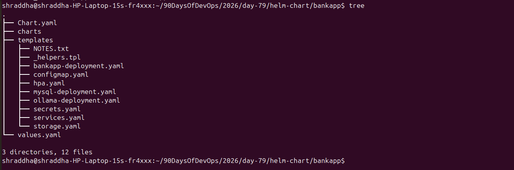

---

# 3. Chart.yaml

The chart metadata is defined in `Chart.yaml`.

```yaml
apiVersion: v2
name: bankapp
description: AI-BankApp -- Spring Boot banking application with MySQL and Ollama AI chatbot
type: application
version: 0.1.0
appVersion: "1.0.0"

maintainers:
  - name: TrainWithShubham
    url: https://github.com/TrainWithShubham

keywords:
  - bankapp
  - spring-boot
  - mysql
  - ollama
  - ai
```

### Important fields

| Field         | Purpose                        |
| ------------- | ------------------------------ |
| `apiVersion`  | Helm chart API version         |
| `name`        | Chart name                     |
| `description` | Description of the application |
| `type`        | Application chart              |
| `version`     | Helm chart version             |
| `appVersion`  | Application version            |
| `maintainers` | Chart maintainer information   |
| `keywords`    | Searchable chart keywords      |

---

# 4. values.yaml

`values.yaml` contains configurable values used by the Helm templates.

```yaml
bankapp:
  replicaCount: 4

  image:
    repository: trainwithshubham/ai-bankapp-eks
    tag: "latest"
    pullPolicy: Always

  resources:
    requests:
      memory: "256Mi"
      cpu: "250m"
    limits:
      memory: "512Mi"
      cpu: "500m"

  service:
    type: ClusterIP
    port: 8080

  autoscaling:
    enabled: true
    minReplicas: 2
    maxReplicas: 4
    targetCPUUtilization: 70

mysql:
  enabled: true

  image:
    repository: mysql
    tag: "8.0"

  resources:
    requests:
      memory: "256Mi"
      cpu: "250m"
    limits:
      memory: "512Mi"
      cpu: "500m"

  persistence:
    size: 5Gi
    storageClass: gp3

ollama:
  enabled: true

  image:
    repository: ollama/ollama
    tag: "latest"

  model: tinyllama

  resources:
    requests:
      memory: "2Gi"
      cpu: "900m"
    limits:
      memory: "2.5Gi"
      cpu: "1500m"

  persistence:
    size: 10Gi
    storageClass: gp3

config:
  mysqlDatabase: bankappdb
  ollamaUrl: ""

secrets:
  mysqlRootPassword: Test@123
  mysqlUser: root
  mysqlPassword: Test@123

storageClass:
  create: true
  name: gp3
  provisioner: ebs.csi.aws.com

gateway:
  enabled: false
  hostname: ""
  tls:
    enabled: false
```

> The passwords above are test values used for the learning environment. Real production credentials should not be committed to Git.

### Main configuration sections

| Section        | Purpose                   |
| -------------- | ------------------------- |
| `bankapp`      | BankApp configuration     |
| `mysql`        | MySQL configuration       |
| `ollama`       | Ollama AI configuration   |
| `config`       | Application configuration |
| `secrets`      | Database credentials      |
| `storageClass` | Storage configuration     |
| `gateway`      | Gateway configuration     |

---

# 5. Raw Kubernetes YAML vs Helm

## Raw Kubernetes

A traditional Kubernetes Deployment can contain hard-coded values:

```yaml
spec:
  replicas: 4

containers:
  - name: bankapp
    image: trainwithshubham/ai-bankapp-eks:latest
```

Changing the replica count or image requires modifying the YAML.

## Helm Template

With Helm, the same values become configurable:

```yaml
spec:
  {{- if not .Values.bankapp.autoscaling.enabled }}
  replicas: {{ .Values.bankapp.replicaCount }}
  {{- end }}
```

Image:

```yaml
image: "{{ .Values.bankapp.image.repository }}:{{ .Values.bankapp.image.tag }}"
```

This allows configuration without modifying the template itself.

---

# 6. Configurable Replicas

The replica count is defined in `values.yaml`:

```yaml
bankapp:
  replicaCount: 4
```

The Deployment template uses:

```yaml
{{- if not .Values.bankapp.autoscaling.enabled }}
replicas: {{ .Values.bankapp.replicaCount }}
{{- end }}
```

When HPA is enabled, the Deployment does not explicitly set the replica count.

### Test

```bash
helm template test-release . \
  --set bankapp.autoscaling.enabled=false \
  --set bankapp.replicaCount=3 | grep -n "replicas:"
```

Expected:

```text
replicas: 3
```

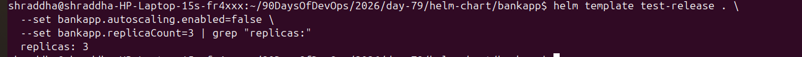

---

# 7. Configurable Docker Image Tag

The image is configured using:

```yaml
bankapp:
  image:
    repository: trainwithshubham/ai-bankapp-eks
    tag: "latest"
```

The template uses:

```yaml
image: "{{ .Values.bankapp.image.repository }}:{{ .Values.bankapp.image.tag }}"
```

Test:

```bash
helm template test-release . \
  --set bankapp.image.tag=abc1234 | grep "image:"
```

Expected:

```text
image: "trainwithshubham/ai-bankapp-eks:abc1234"
```

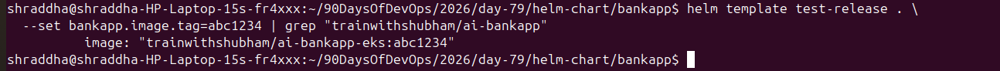

---

# 8. Conditional Ollama URL

The ConfigMap contains conditional logic:

```yaml
{{- if .Values.ollama.enabled }}
OLLAMA_URL: {{ default (printf "http://%s-ollama:11434" (include "bankapp.fullname" .)) .Values.config.ollamaUrl | quote }}
{{- else }}
OLLAMA_URL: ""
{{- end }}
```

When Ollama is enabled:

```bash
helm template test-release . \
  --set ollama.enabled=true | grep "OLLAMA_URL"
```

Output:

```text
OLLAMA_URL: "http://test-release-bankapp-ollama:11434"
```

When Ollama is disabled:

```bash
helm template test-release . \
  --set ollama.enabled=false | grep "OLLAMA_URL"
```

Output:

```text
OLLAMA_URL: ""
```

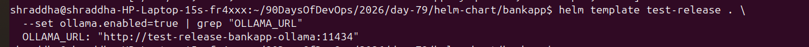

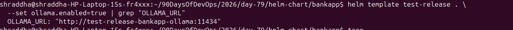

---

# 9. Optional MySQL

MySQL was made optional using Helm conditional logic.

At the beginning of `mysql-deployment.yaml`:

```yaml
{{- if .Values.mysql.enabled }}
```

At the end:

```yaml
{{- end }}
```

The MySQL Service and PVC are also conditionally rendered.

To disable MySQL:

```bash
helm template test-release . \
  --set mysql.enabled=false
```

Verification:

```bash
helm template test-release . \
  --set mysql.enabled=false | grep "bankapp-mysql-pvc"
```

No output confirms that the MySQL PVC is not rendered.

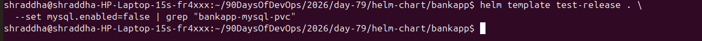

---

# 10. Optional Ollama Deployment

Ollama is controlled using:

```yaml
ollama:
  enabled: true
```

The Ollama resources are wrapped with:

```yaml
{{- if .Values.ollama.enabled }}
```

Therefore:

```bash
helm template test-release . \
  --set ollama.enabled=false
```

removes the Ollama resources from the rendered manifests.

### Why was Ollama disabled?

During the Kind deployment, the `ollama/ollama:latest` image was taking too long to pull in the local environment.

Therefore, the final local deployment used:

```bash
--set ollama.enabled=false
```

This demonstrates an important Helm feature: **optional components can be enabled or disabled through values without changing the templates.**

---

# 11. Kubernetes Secrets

The Secret template uses values from `values.yaml`:

```yaml
apiVersion: v1
kind: Secret

metadata:
  name: {{ include "bankapp.fullname" . }}-secret
  namespace: {{ .Release.Namespace }}

type: Opaque

data:
  MYSQL_ROOT_PASSWORD: {{ .Values.secrets.mysqlRootPassword | b64enc | quote }}
  MYSQL_USER: {{ .Values.secrets.mysqlUser | b64enc | quote }}
  MYSQL_PASSWORD: {{ .Values.secrets.mysqlPassword | b64enc | quote }}
```

The important Helm function is:

```text
b64enc
```

which Base64-encodes the value.

Test:

```bash
helm template test-release . \
  --namespace bankapp \
  --set secrets.mysqlRootPassword=MySecurePass123 \
  --set secrets.mysqlPassword=MySecurePass123
```

The Secret is rendered into the `bankapp` namespace because the template uses:

```yaml
namespace: {{ .Release.Namespace }}
```

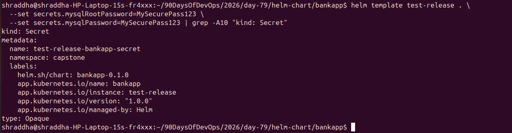

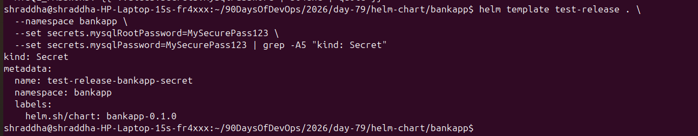

> For production deployments, secrets should be managed using secure secret-management solutions rather than storing plaintext credentials in `values.yaml`.

---

# 12. Go Template Syntax Cheat Sheet

## Values

```yaml
{{ .Values.bankapp.replicaCount }}
```

Reads a value from `values.yaml`.

## Conditional

```yaml
{{- if .Values.ollama.enabled }}
...
{{- end }}
```

Renders content only when the condition is true.

## If / Else

```yaml
{{- if .Values.ollama.enabled }}
...
{{- else }}
...
{{- end }}
```

## Default

```yaml
{{ default "value" .Values.config.ollamaUrl }}
```

Provides a default value when the configured value is empty.

## Quote

```yaml
{{ .Values.config.mysqlDatabase | quote }}
```

Quotes the rendered value.

## Base64 Encoding

```yaml
{{ .Values.secrets.mysqlPassword | b64enc | quote }}
```

Encodes a value using Base64.

## Include

```yaml
{{ include "bankapp.fullname" . }}
```

Uses a helper defined in `_helpers.tpl`.

## nindent

```yaml
{{- include "bankapp.labels" . | nindent 4 }}
```

Adds indentation to generated YAML.

---

# 13. Helm Lint

The chart was validated using:

```bash
helm lint .
```

Expected result:

```text
1 chart(s) linted, 0 chart(s) failed
```

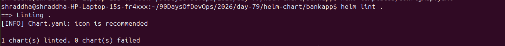

`helm lint` checks the chart for common formatting and template problems.

---

# 14. Helm Template

The chart was rendered without installing it:

```bash
helm template test-release . \
  --namespace bankapp > /tmp/bankapp-rendered.yaml
```

The generated Kubernetes resources were inspected using:

```bash
grep "^kind:" /tmp/bankapp-rendered.yaml
```

The rendered output contains Kubernetes resources such as:

```text
kind: ConfigMap
kind: Secret
kind: Deployment
kind: Deployment
kind: Service
kind: Service
kind: PersistentVolumeClaim
kind: HorizontalPodAutoscaler
```

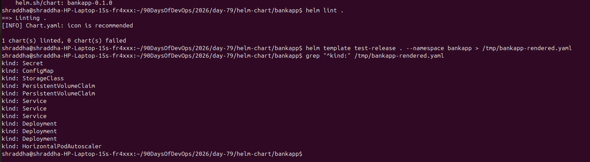

`helm template` is useful for verifying the manifests before they are deployed to Kubernetes.

---

# 15. Helm Dry Run

Before the actual installation, I tested the chart using:

```bash
helm install my-bankapp bankapp/ \
  --dry-run \
  --debug \
  -n bankapp \
  --create-namespace
```

A dry run allows the generated manifests and Helm release information to be inspected without creating the actual Kubernetes resources.

---

# 16. Deploying on Kind

The application was deployed to the local Kind cluster:

```text
devops-cluster
```

The local Kind cluster uses the `standard` StorageClass, so the AWS-specific `gp3` StorageClass creation was disabled.

The installation used:

```bash
--set storageClass.create=false
```

MySQL persistence used:

```bash
--set mysql.persistence.storageClass=standard
```

Ollama persistence was configured with:

```bash
--set ollama.persistence.storageClass=standard
```

Ollama was disabled:

```bash
--set ollama.enabled=false
```

---

# 17. Loading the BankApp Image into Kind

The BankApp Docker image was pulled locally:

```bash
docker pull trainwithshubham/ai-bankapp-eks:latest
```

Then it was loaded into the Kind cluster:

```bash
kind load docker-image \
  trainwithshubham/ai-bankapp-eks:latest \
  --name devops-cluster
```

The image pull policy was changed to:

```bash
--set bankapp.image.pullPolicy=IfNotPresent
```

This allowed Kubernetes to use the image already available inside the Kind nodes.

---

# 18. Helm Installation

The release was installed using:

```bash
helm install my-bankapp bankapp/ \
  -n bankapp \
  --create-namespace \
  --set storageClass.create=false \
  --set mysql.persistence.storageClass=standard \
  --set ollama.persistence.storageClass=standard \
  --set ollama.enabled=false
```

After loading the Docker image into Kind, the Helm release was upgraded:

```bash
helm upgrade my-bankapp bankapp/ \
  -n bankapp \
  --set storageClass.create=false \
  --set mysql.persistence.storageClass=standard \
  --set ollama.persistence.storageClass=standard \
  --set ollama.enabled=false \
  --set bankapp.image.pullPolicy=IfNotPresent
```

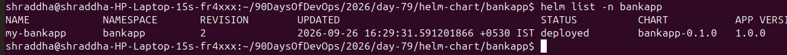

---

# 19. Kubernetes Resources

The final deployment was verified using:

```bash
helm list -n bankapp
```

```bash
kubectl get pods -n bankapp
```

```bash
kubectl get svc -n bankapp
```

The final environment included:

* BankApp Deployment
* MySQL Deployment
* BankApp Service
* MySQL Service
* MySQL PVC
* ConfigMap
* Secret
* HorizontalPodAutoscaler

Ollama was disabled in the final Kind deployment.

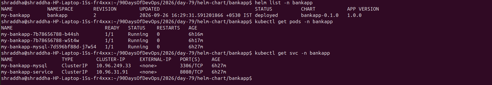

---

# 20. HorizontalPodAutoscaler

The chart contains a HorizontalPodAutoscaler using:

```yaml
apiVersion: autoscaling/v2
```

Configuration:

```yaml
autoscaling:
  enabled: true
  minReplicas: 2
  maxReplicas: 4
  targetCPUUtilization: 70
```

The HPA was verified using:

```bash
kubectl get hpa -n bankapp
```

The running environment showed CPU utilization of approximately:

```text
1% / 70%
```

This means the current CPU usage was approximately 1% against the configured 70% target.

---

# 21. Running AI-BankApp

The BankApp service was exposed locally using:

```bash
kubectl port-forward svc/my-bankapp-service -n bankapp 8082:8080
```

The application was accessed at:

```text
http://localhost:8082
```

The application successfully started and connected to MySQL.

The application logs showed:

* Spring Boot 3.4.13
* Java 21
* MySQL 8.0.46
* Hikari connection pool
* Tomcat running on port 8080
* Application started successfully

The application dashboard was accessed successfully after registration.

This verified the Helm deployment end-to-end.

---

# 22. Helm Release Management

The installed Helm release was inspected using:

```bash
helm list -n bankapp
```

Release status:

```bash
helm status my-bankapp -n bankapp
```

Release history:

```bash
helm history my-bankapp -n bankapp
```

The release was successfully installed and upgraded during the project.

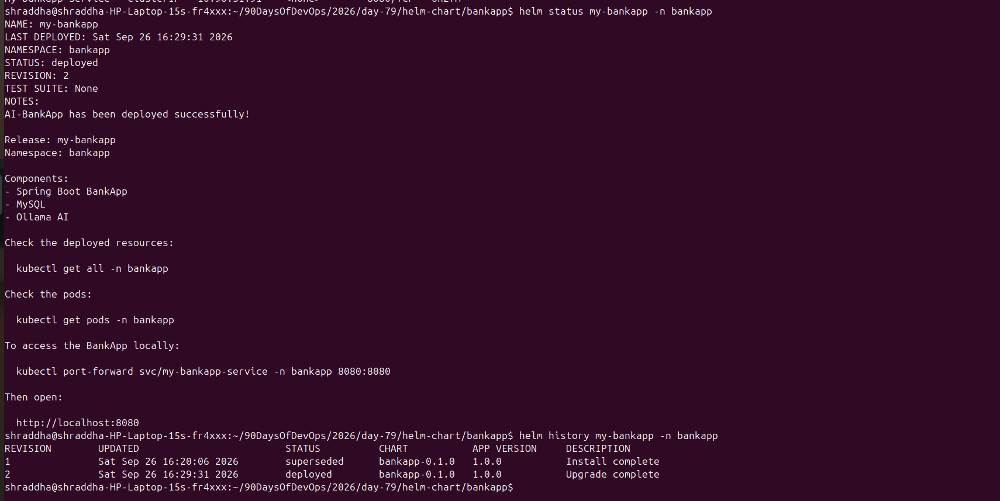

---

# 23. Screenshot Summary

All Day 79 screenshots are stored in:

```text
2026/day-79/screenshots/
```

| Screenshot                    | Description                  |
| ----------------------------- | ---------------------------- |
| `01-helm-chart-structure.png` | Helm chart structure         |
| `02-helm-lint.png`            | Helm lint validation         |
| `03-mysql-disabled.png`       | MySQL conditional resource   |
| `04-ollama-disabled.png`      | Ollama disabled              |
| `05-ollama-enabled.png`       | Ollama enabled               |
| `06-replica-config.png`       | Configurable replicas        |
| `07-image-tag.png`            | Configurable image tag       |
| `08-helm-release.png`         | Helm installation/release    |
| `09-secret-override.png`      | Secret value override        |
| `10-secret-namespace.png`     | Secret namespace             |
| `11-final-helm-render.png`    | Rendered Helm manifests      |
| `12-running-helm-release.png` | Running Kubernetes resources |
| `13-helm-status-history.png`  | Helm status and history      |

---

# 24. Raw YAML vs Helm Summary

| Feature                   | Raw Kubernetes YAML | Helm                    |
| ------------------------- | ------------------- | ----------------------- |
| Configuration             | Often hard-coded    | Values-based            |
| Reusability               | Limited             | High                    |
| Replica changes           | Edit YAML           | Change values           |
| Image version             | Edit YAML           | `--set image.tag=...`   |
| Optional components       | Manual changes      | `enabled` conditions    |
| Environment configuration | Separate YAML edits | Values overrides        |
| Release management        | Kubernetes only     | Helm release management |
| Upgrade tracking          | Manual              | Helm revisions          |
| Template reuse            | Limited             | Built-in templating     |

---

# 25. What I Learned

### Helm Basics

I learned how Helm packages Kubernetes applications into reusable charts.

### Chart Structure

I learned the purpose of:

```text
Chart.yaml
values.yaml
templates/
charts/
```

### Helm Templates

I practiced:

```text
.Values
if / else
include
default
quote
b64enc
nindent
```

### Conditional Resources

I learned how to make Kubernetes resources optional using:

```yaml
{{- if .Values.component.enabled }}
...
{{- end }}
```

### Configuration Management

I learned how to move hard-coded Kubernetes configuration into `values.yaml`.

### Release Management

I practiced:

```bash
helm install
helm upgrade
helm list
helm status
helm history
helm template
helm lint
```

### Kubernetes Integration

I learned how Helm templates are converted into Kubernetes manifests before being applied to the cluster.

---

# 26. Final Result

The AI-BankApp Kubernetes manifests were successfully converted into a reusable Helm chart.

The final architecture was:

```text
                 Helm
                   │
                   ▼
             bankapp Chart
                   │
        ┌──────────┼──────────┐
        ▼          ▼          ▼
     BankApp     MySQL      HPA
        │          │
        │          ▼
        │         PVC
        │
        ▼
    ClusterIP
        │
        ▼
   localhost:8082
```

Ollama was implemented as an optional component and disabled during the final local Kind deployment.

The application successfully started, connected to MySQL, and was accessed through a local port-forward.

## Final Status

```text
✅ Custom Helm Chart
✅ Chart.yaml
✅ Complete values.yaml
✅ Helm Templates
✅ ConfigMap
✅ Kubernetes Secret
✅ MySQL
✅ Optional Ollama
✅ Persistent Storage
✅ HPA
✅ Conditional Resources
✅ Helm Lint
✅ Helm Template
✅ Helm Dry Run
✅ Helm Install
✅ Helm Upgrade
✅ Helm Status
✅ Helm History
✅ AI-BankApp running on Kind
```

## Conclusion

Day 79 provided practical experience in converting traditional Kubernetes manifests into a reusable Helm chart.

The project demonstrated how Helm can simplify Kubernetes application deployment by separating application configuration from Kubernetes templates and by providing reusable conditional resources and release management.
