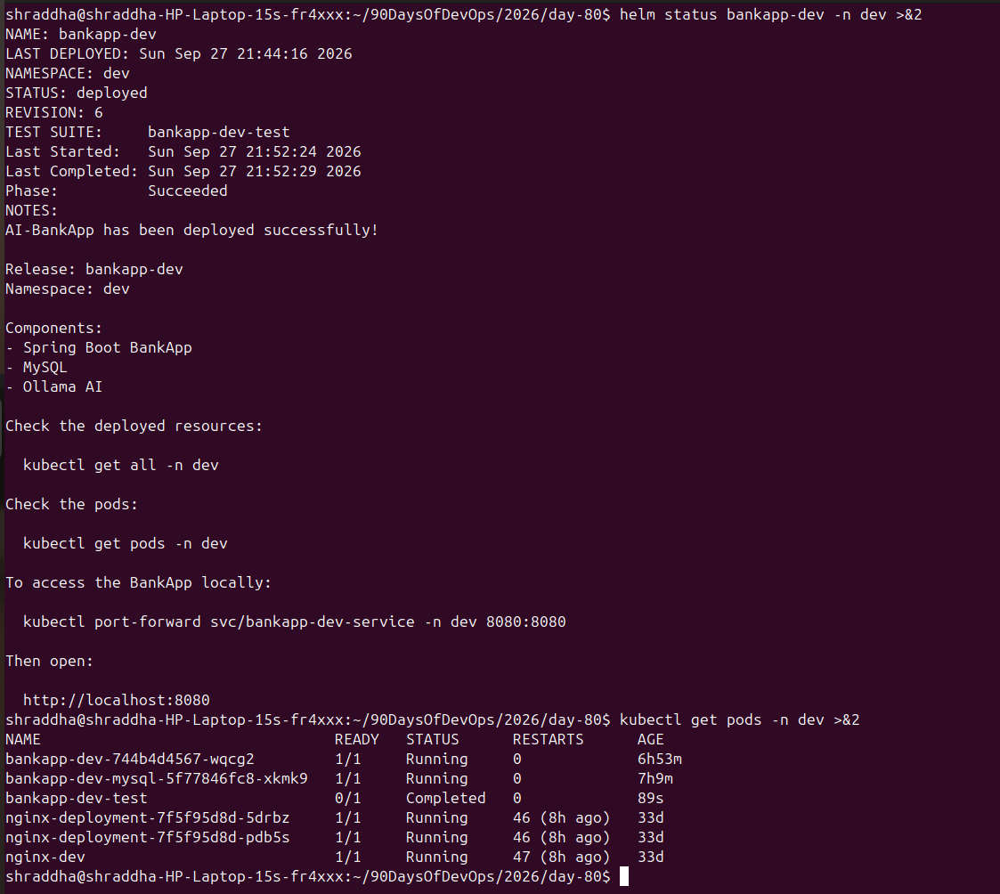
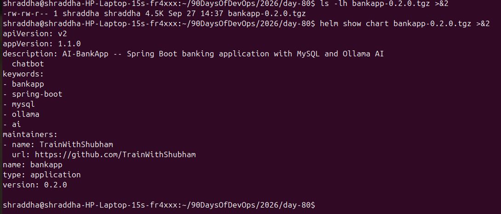
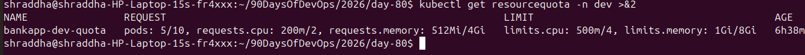
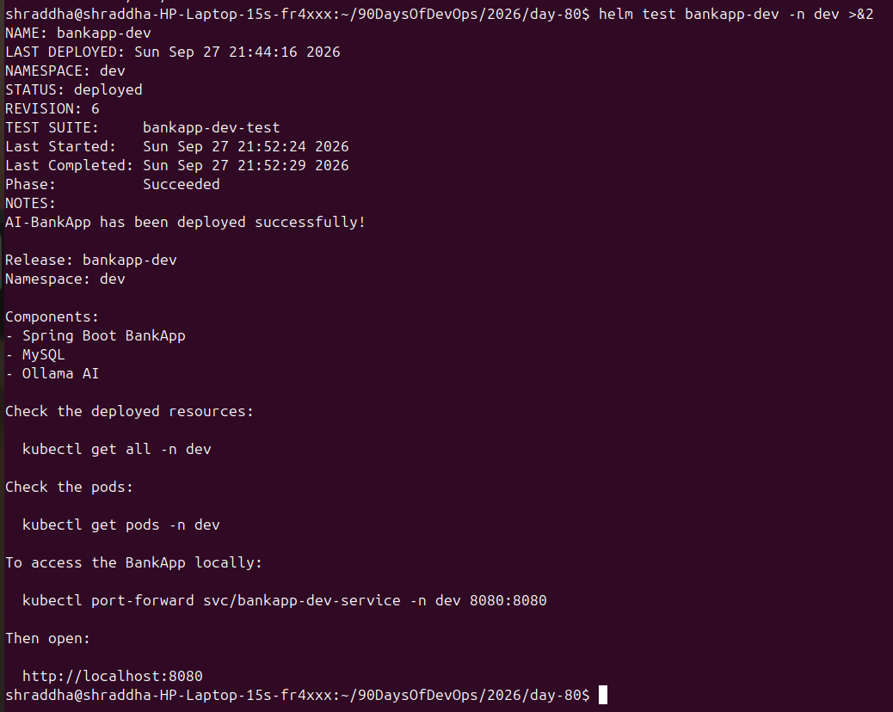
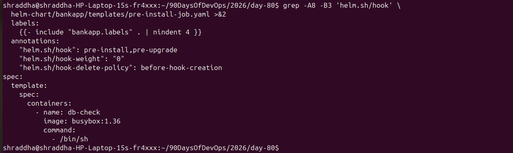
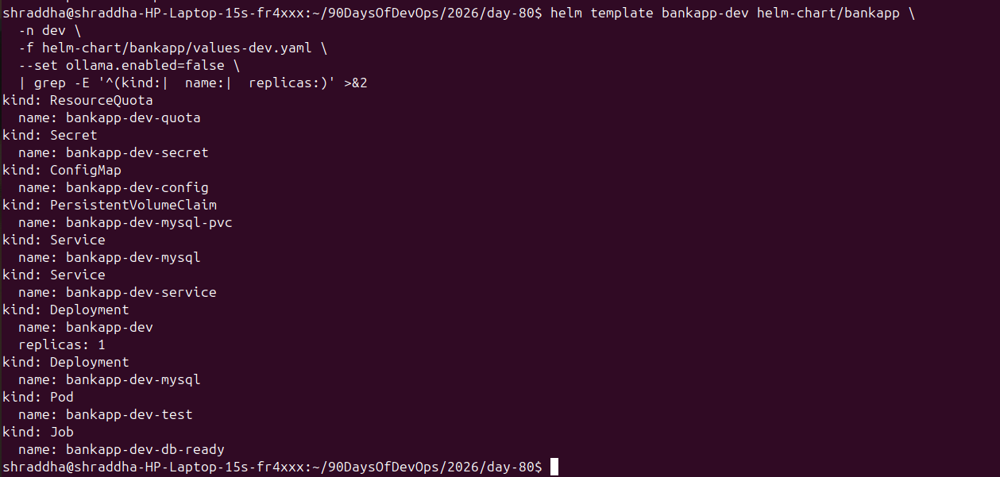
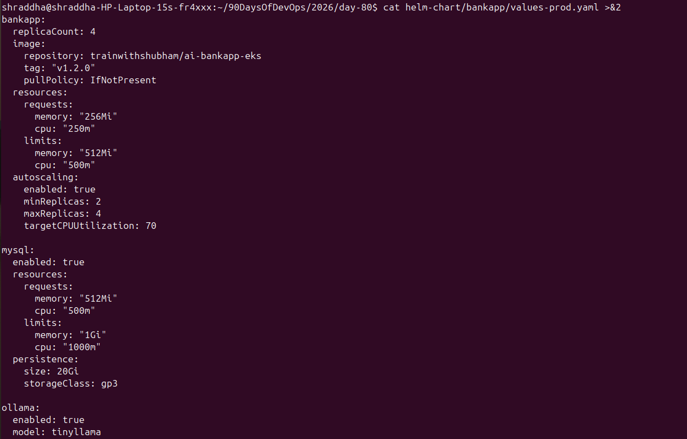
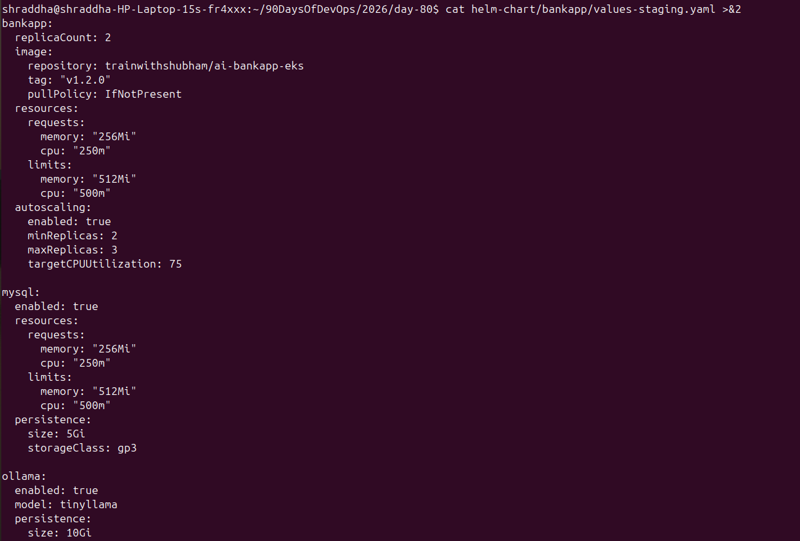
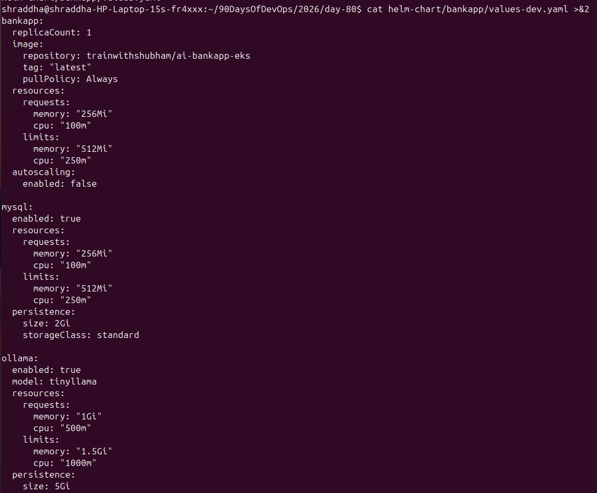

# Day 80 — Helm Project: Multi-Environment Deployment and CI/CD

## 1. Project Overview

This project extends the custom AI-BankApp Helm chart created during Day 79.

The objective was to use Helm for:

* Multi-environment deployments
* Environment-specific configuration
* Helm hooks
* Helm tests
* Resource management with ResourceQuota
* Chart packaging and versioning
* Deployment validation
* CI/CD and GitOps understanding

### Application Stack

* Kubernetes
* Helm
* Spring Boot
* MySQL
* Ollama
* Docker
* GitHub Actions
* Argo CD / GitOps concepts

---

## 2. Project Structure

The Day 80 Helm chart contains:

```text
helm-chart/
└── bankapp/
    ├── Chart.yaml
    ├── values.yaml
    ├── values-dev.yaml
    ├── values-staging.yaml
    ├── values-prod.yaml
    ├── .helmignore
    └── templates/
        ├── NOTES.txt
        ├── _helpers.tpl
        ├── bankapp-deployment.yaml
        ├── configmap.yaml
        ├── hpa.yaml
        ├── mysql-deployment.yaml
        ├── ollama-deployment.yaml
        ├── pre-install-job.yaml
        ├── resourcequota.yaml
        ├── secrets.yaml
        ├── services.yaml
        ├── storage.yaml
        └── tests/
            └── test-connection.yaml
```

---

## 3. Multi-Environment Configuration

Instead of maintaining separate Kubernetes manifests for every environment, Helm uses environment-specific values files.

### Development

File:

```text
values-dev.yaml
```

Configuration:

* BankApp replicas: 1
* HPA: disabled
* MySQL: enabled
* Ollama: enabled in configuration
* MySQL storage: 2Gi
* Ollama storage: 5Gi
* Lower CPU and memory resources
* StorageClass creation disabled

For the local Kind deployment, Ollama was disabled using:

```bash
--set ollama.enabled=false
```

This was done because the local cluster did not have sufficient resources for the Ollama workload.

### Staging

File:

```text
values-staging.yaml
```

Configuration:

* BankApp replicas: 2
* HPA: enabled
* Minimum replicas: 2
* Maximum replicas: 3
* CPU target: 75%
* MySQL storage: 5Gi
* Ollama storage: 10Gi
* `gp3` StorageClass configuration
* Higher resource allocation than development

### Production

File:

```text
values-prod.yaml
```

Configuration:

* BankApp replicas: 4
* HPA: enabled
* Minimum replicas: 2
* Maximum replicas: 4
* CPU target: 70%
* MySQL storage: 20Gi
* Ollama storage: 10Gi
* Higher MySQL resources
* `gp3` StorageClass configuration

The production values file also contains:

```yaml
gateway:
  enabled: true
```

However, the current chart does not contain a Gateway template, so this value does not create a Kubernetes Gateway resource.

---

## 4. Environment Comparison

| Configuration         |      Dev | Staging |    Prod |
| --------------------- | -------: | ------: | ------: |
| BankApp replicas      |        1 |       2 |       4 |
| HPA                   | Disabled | Enabled | Enabled |
| HPA min               |        — |       2 |       2 |
| HPA max               |        — |       3 |       4 |
| CPU target            |        — |     75% |     70% |
| MySQL storage         |      2Gi |     5Gi |    20Gi |
| Ollama storage        |      5Gi |    10Gi |    10Gi |
| MySQL                 |  Enabled | Enabled | Enabled |
| Ollama                | Enabled* | Enabled | Enabled |
| StorageClass creation |       No |     Yes |     Yes |

`*` Ollama was disabled during the local Kind deployment with `--set ollama.enabled=false`.

---

## 5. Helm Lint

The chart was validated using:

```bash
helm lint helm-chart/bankapp
```

Result:

```text
1 chart(s) linted, 0 chart(s) failed
```

The chart produced only an informational recommendation that an icon could be added to `Chart.yaml`.

---

## 6. Environment-Specific Rendering

Development rendering:

```bash
helm template bankapp-dev helm-chart/bankapp \
  -n dev \
  -f helm-chart/bankapp/values-dev.yaml \
  --set ollama.enabled=false
```

The rendered resources included:

* Secret
* ConfigMap
* MySQL PVC
* Ollama PVC
* BankApp Service
* MySQL Service
* Ollama Service
* BankApp Deployment
* MySQL Deployment

Staging rendering additionally included:

* StorageClass
* HPA

Production rendering additionally included:

* StorageClass
* HPA

This confirmed that environment-specific values were changing the generated Kubernetes manifests.

---

## 7. Helm Hook — Database Readiness

A Helm hook was added:

```text
templates/pre-install-job.yaml
```

The Job uses the annotation:

```yaml
"helm.sh/hook": pre-install,pre-upgrade
```

The Job checks whether MySQL is accepting connections on port `3306`.

The check uses:

```bash
nc -z <mysql-service> 3306
```

and retries every three seconds until MySQL becomes reachable.

### Important Helm Hook Observation

A `pre-install` hook runs before the normal release resources are created.

Therefore, on a completely fresh installation, the MySQL Service may not exist yet when the hook starts.

For the local Kind deployment, the release was therefore installed/upgraded using:

```bash
--no-hooks
```

This was an important practical lesson about Helm hook ordering.

A production-ready implementation could instead use:

* an init container
* a correctly ordered post-install workflow
* a separate database readiness mechanism

---

## 8. Helm Test

A Helm test was added:

```text
templates/tests/test-connection.yaml
```

The test uses:

```yaml
"helm.sh/hook": test
```

and checks:

```text
http://bankapp-dev-service:8080/actuator/health
```

The test container was given resource requests and limits because the namespace contains a ResourceQuota.

```yaml
resources:
  requests:
    memory: "16Mi"
    cpu: "25m"
  limits:
    memory: "32Mi"
    cpu: "50m"
```

The test Pod uses:

```yaml
restartPolicy: Never
```

### Final Test Result

```text
TEST SUITE:     bankapp-dev-test
Phase:          Succeeded
```

This confirmed that the deployed BankApp service was reachable through Kubernetes service discovery.

---

## 9. ResourceQuota

A ResourceQuota was added:

```text
templates/resourcequota.yaml
```

The quota limits the namespace to:

```text
requests.cpu:    2
requests.memory: 4Gi
limits.cpu:      4
limits.memory:   8Gi
pods:            10
```

Current status:

```text
pods:             5/10
requests.cpu:     200m/2
requests.memory:  512Mi/4Gi
limits.cpu:       500m/4
limits.memory:    1Gi/8Gi
```

This demonstrated how namespace-level resource governance can be implemented with Kubernetes ResourceQuota.

An important lesson was that every Pod created in a quota-controlled namespace must specify the required resource requests and limits.

---

## 10. Helm Chart Packaging

The chart version was updated from:

```yaml
version: 0.1.0
appVersion: "1.0.0"
```

to:

```yaml
version: 0.2.0
appVersion: "1.1.0"
```

The chart was packaged using:

```bash
helm package helm-chart/bankapp
```

Generated package:

```text
bankapp-0.2.0.tgz
```

Package size:

```text
4.5K
```

The package was inspected using:

```bash
helm show chart bankapp-0.2.0.tgz
```

Result:

```text
apiVersion: v2
appVersion: 1.1.0
name: bankapp
type: application
version: 0.2.0
```

---

## 11. Installing the Packaged Chart

The development environment was installed using:

```bash
helm install bankapp-dev bankapp-0.2.0.tgz \
  -n dev \
  -f helm-chart/bankapp/values-dev.yaml \
  --set ollama.enabled=false \
  --no-hooks \
  --wait \
  --timeout 5m
```

The initial deployment exposed a MySQL memory problem.

MySQL entered:

```text
CrashLoopBackOff
```

with exit code:

```text
137
```

The MySQL resource configuration was increased to:

```yaml
requests:
  memory: "256Mi"
  cpu: "100m"

limits:
  memory: "512Mi"
  cpu: "250m"
```

After the resource correction, MySQL became healthy.

---

## 12. Application Database Troubleshooting

After MySQL became healthy, the BankApp initially reported:

```text
Host '10.244.0.35' is not allowed to connect to this MySQL server
```

The MySQL user permissions were corrected for the Kubernetes network.

The application then reported:

```text
Unknown database 'bankappdb'
```

The required database was created and the BankApp deployment was restarted.

The final rollout succeeded:

```text
deployment "bankapp-dev" successfully rolled out
```

This demonstrated that Helm deployment success does not automatically mean application-level readiness. Kubernetes resources, database configuration, networking, authentication, and application startup all need to be validated.

---

## 13. Final Helm Release

Final release:

```text
NAME          bankapp-dev
NAMESPACE     dev
REVISION      6
STATUS        deployed
CHART         bankapp-0.2.0
APP VERSION   1.1.0
```

Final BankApp Pod:

```text
bankapp-dev-744b4d4567-wqcg2
1/1 Running
```

Final MySQL Pod:

```text
bankapp-dev-mysql-5f77846fc8-xkmk9
1/1 Running
```

Helm test:

```text
Phase: Succeeded
```

---

## 14. Final Verification

Command:

```bash
helm list -A
```

The final development release was:

```text
bankapp-dev   dev   6   deployed   bankapp-0.2.0   1.1.0
```

Pods:

```text
bankapp-dev                         1/1 Running
bankapp-dev-mysql                   1/1 Running
bankapp-dev-test                    0/1 Completed
```

ResourceQuota:

```text
bankapp-dev-quota
```

was active and within its configured limits.

---

## 15. Helm + CI/CD

A Helm-based CI/CD workflow can replace direct Kubernetes manifest modification.

### Traditional Manifest Flow

```text
Developer
    |
    v
Git Push
    |
    v
GitHub Actions
    |
    v
Build Docker Image
    |
    v
Tag Image
    |
    v
Update Kubernetes Manifest
    |
    v
Git Commit
    |
    v
Argo CD
    |
    v
Kubernetes
```

### Helm + GitOps Flow

```text
Developer
    |
    v
Git Push
    |
    v
GitHub Actions
    |
    v
Build Docker Image
    |
    v
Generate Image Tag
    |
    v
Update values-prod.yaml
    |
    v
Git Commit
    |
    v
Argo CD
    |
    v
Helm Template Rendering
    |
    v
Kubernetes
```

Example CI step:

```yaml
- name: Update Helm values with new image tag
  run: |
    TAG=${{ steps.tag.outputs.sha_short }}
    yq -i '.bankapp.image.tag = "'$TAG'"' helm-chart/bankapp/values-prod.yaml

- name: Commit updated Helm values
  run: |
    git config user.name "github-actions[bot]"
    git config user.email "github-actions[bot]@users.noreply.github.com"
    git add helm-chart/bankapp/values-prod.yaml
    git diff --staged --quiet || git commit -m "ci: update bankapp image [skip ci]"
    git push
```

Argo CD can use:

```yaml
source:
  path: helm-chart/bankapp
  helm:
    valueFiles:
      - values-prod.yaml
```

Argo CD uses Helm to render the chart and then manages the resulting Kubernetes resources.

---

## 16. Helm vs Kubernetes YAML vs Kustomize

### Raw Kubernetes YAML

Advantages:

* Simple to understand
* Direct Kubernetes resources
* Easy for small applications

Disadvantages:

* Repetition between environments
* More files to maintain
* Environment-specific changes can become difficult

### Helm

Advantages:

* Reusable templates
* Environment-specific values
* Packaging and versioning
* Built-in testing
* Hooks
* Easy parameter overrides

Example:

```bash
helm upgrade bankapp-dev helm-chart/bankapp \
  -f helm-chart/bankapp/values-dev.yaml
```

### Kustomize

Advantages:

* Native Kubernetes tooling
* Overlay-based configuration
* No templating language required
* Useful for environment overlays

Conceptually:

```text
base/
├── deployment.yaml
├── service.yaml
└── kustomization.yaml

overlays/
├── dev/
├── staging/
└── prod/
```

Helm is particularly useful when an application needs reusable packaging, parameterized configuration, chart versioning, and distribution.

Kustomize is useful when maintaining Kubernetes manifests through base and environment overlays.

---

## 17. Secrets Best Practice

Environment values should not contain real production credentials in a public Git repository.

For production environments, suitable approaches include:

* AWS Secrets Manager
* External Secrets Operator
* Sealed Secrets
* HashiCorp Vault
* Kubernetes Secrets integrated with a secure secret-management workflow

The Day 80 staging and production values use placeholder credentials rather than real passwords.

---

## 18. Helm Best Practices Learned

Recommended deployment pattern:

```bash
helm upgrade --install \
  bankapp-dev \
  helm-chart/bankapp \
  -n dev \
  -f helm-chart/bankapp/values-dev.yaml \
  --wait \
  --timeout 300s
```

Useful practices:

* Use separate values files for environments.
* Keep application configuration in `values.yaml`.
* Use `helm lint` before deployment.
* Use `helm template` to inspect generated manifests.
* Use `helm test` for application-level validation.
* Package charts with semantic versions.
* Use ResourceQuota where namespace governance is required.
* Always define resource requests and limits in quota-controlled namespaces.
* Avoid storing real credentials in Git.
* Use GitOps for controlled production deployments.
* Use `--atomic` where appropriate for safer upgrades.
* Use chart-diff tooling before important production changes.

---

## 19. Troubleshooting Lessons

### MySQL OOM

Problem:

```text
CrashLoopBackOff
Exit Code: 137
```

Solution:

Increase MySQL memory resources.

---

### MySQL Authentication

Problem:

```text
Host is not allowed to connect
```

Solution:

Correct MySQL user permissions for the Kubernetes network.

---

### Missing Database

Problem:

```text
Unknown database 'bankappdb'
```

Solution:

Create the required database and restart the application.

---

### Helm Test Quota Failure

Problem:

```text
must specify limits.cpu
must specify limits.memory
must specify requests.cpu
must specify requests.memory
```

Solution:

Add resource requests and limits to the Helm test Pod.

---

### Helm Test Restart Loop

Problem:

The test Pod repeatedly restarted.

Investigation showed:

```text
restartPolicy: Always
```

Solution:

Set:

```yaml
restartPolicy: Never
```

After updating the chart and upgrading the release, the Helm test completed successfully.

---

## 20. Key Learning Outcomes

By completing Day 80, I practiced:

* Multi-environment Helm configuration
* Helm values overrides
* Conditional resources
* Helm hooks
* Helm tests
* ResourceQuota
* Helm chart packaging
* Chart versioning
* Application troubleshooting
* Kubernetes service discovery
* CI/CD image updates
* GitOps deployment concepts
* Helm and Argo CD integration concepts
* Helm vs raw YAML vs Kustomize
* Kubernetes resource management
* Production secret-management concepts

---

## 21. Final Status

```text
Day 80: COMPLETED

Helm Chart:
bankapp-0.2.0

Application Version:
1.1.0

Environment:
dev

Helm Release:
bankapp-dev

Revision:
6

Release Status:
deployed

BankApp:
1/1 Running

MySQL:
1/1 Running

Helm Test:
Succeeded

ResourceQuota:
Active

Chart Lint:
Passed

Chart Package:
bankapp-0.2.0.tgz
```

## Conclusion

Day 80 extended the Day 79 custom Helm chart into a multi-environment deployment model.

The project demonstrated how Helm can provide reusable templates, environment-specific configuration, packaging, versioning, testing, resource governance, and integration with GitOps-based CI/CD workflows.

The practical troubleshooting was also an important part of the project because successful Helm rendering and Kubernetes deployment do not automatically guarantee application readiness. Database connectivity, authentication, resource limits, service discovery, and application health must also be validated.

## 23. Screenshots

### Screenshot 01 — Helm Chart Structure



This screenshot shows the complete Helm chart structure created for the AI-BankApp.

### Screenshot 02 — Development Values



Development-specific Helm configuration including replicas, resources, MySQL, Ollama, and persistence settings.

### Screenshot 03 — Staging Values



Staging-specific configuration including replicas, HPA, resources, storage, and application version.

### Screenshot 04 — Production Values



Production-specific configuration including replicas, HPA, resources, storage, and production settings.

### Screenshot 05 — Helm Validation and Rendering



Helm linting and environment-specific template rendering verification.

### Screenshot 06 — Helm Database Readiness Hook



Helm lifecycle hook configuration used for MySQL readiness checking.

### Screenshot 07 — Helm Test Succeeded



Successful Helm test validating that the BankApp health endpoint is reachable.

### Screenshot 08 — Kubernetes ResourceQuota



ResourceQuota configuration and usage for the development namespace.

### Screenshot 09 — Helm Package and Version



Packaged Helm chart `bankapp-0.2.0.tgz` and chart version information.
